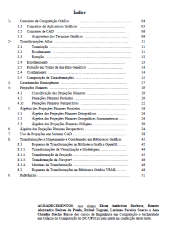

# Computação Gráfica
*Professor:* Flávio Coutinho

---
# Objetivos

1. Conhecer os **fundamentos teóricos e práticos** da computação gráfica.
1. Conhecer as **técnicas de modelagem, representação e visualização** de objetos Bi
e Tridimensionais.
1. Conhecer técnicas de **geração de imagens fotorrealísticas**
1. Conhecer e utilizar a biblioteca gráfica **OpenGL**

---
## Interdisciplinariedades

- Pré-requisitos
  - Cálculo I
  - Geometria Analítica e Álgebra Vetorial
  - PC I
- Co-requisito
  - Cálculo II

---
# Bibliografia Básica

---
## _Computer Graphics with OpenGL_ 

  
  

- Este é o nosso **livro texto**
- **Título**	Computer Graphics with OpenGL, Fourth Edition
- **Autores**	Donald D. Hearn, M. Pauline Baker, Warren Carithers
- **Editora**	Prentice Hall, 2010

---
## _Real-Time Rendering_

  
  

- **Título**	Real-Time Rendering, Third Edition
- **Autores**	Tomas Akenine-Möller, Eric Haines, Naty Hoffman
- **Editora**	Taylor &amp; Francis, 2008

---
# Bibliografia Complementar

---
## Notas de aula do Prof. David Mount

  
  

- Material complementar
- [Download](attachments/DavidMountsLectureNotes.pdf)

---
## Apostila da UFSCAR

  
  

- Material complementar
- [Download](https://drive.google.com/file/d/0B6-KCjtlxaKIY21UOWxBTEp4VTA/edit?usp=sharing)

---
# Aulas

- [Introdução à Computação Gráfica](classes/intro/) (12/03/2015)
- [Sistemas de Janelas](classes/opengl/) (17/03/2015)

---
# Atividades Avaliativas

---
## Prova e Listas (40 pontos)

- Listas de exercício (10 pontos)
- Lista de revisão da prova (10 pontos)
- Prova (20 pontos, 14/05/2015 a priori)

---
## Trabalhos (60 pontos)

- [TP1: Breakout][tp1] (15 pontos, 26/03/2015 + 21 dias)
- TP2: Boids (15 pontos, 16/04/2015 + 21 dias)
- TP3 - duplas: Ray-tracer (15 pontos, data a definir)
- TP4 - duplas: Animação (15 pontos, data a definir)

[tp1]: https://github.com/fegemo/cefet-cg/tree/master/src/assignments/tp1-breakout
[tp2]: https://github.com/fegemo/cefet-cg/tree/master/src/assignments/tp2
[tp3]: https://github.com/fegemo/cefet-cg/tree/master/src/assignments/tp3
[tp4]: https://github.com/fegemo/cefet-cg/blob/master/src/assignments/tp4
