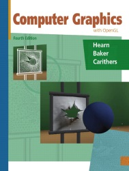
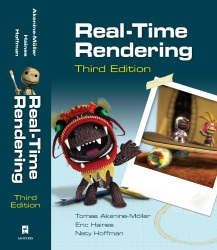
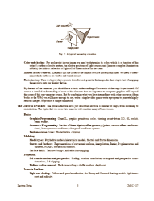

<!--
  bespokeEvent: bullets.disable
-->

# Computação Gráfica

*Professor:* Flávio Coutinho

---
# Aulas

- [Introdução à Computação Gráfica](classes/intro/) (25/02/2016)
- [OpenGL, Sistemas de Janelas](classes/opengl/) (01/03/2016)
- [OpenGL Hands-on - Parte 1](classes/opengl-handson/) (03/03/2016)
- [OpenGL Hands-on - Parte 2](classes/opengl-handson2/) (08/03/2016)
- [OpenGL Hands-on - Parte 3](classes/opengl-handson3/) (10/03/2016)
- [Cê](classes/c) (15/03/2016)
- [_Feedback_ do TP1 - turma anterior](classes/breakout-feedback) (15/03/2016)

---
# Objetivos

1. Conhecer os **fundamentos teóricos e práticos** da computação gráfica.
1. Conhecer as **técnicas de modelagem, representação e visualização** de
  objetos Bi e Tridimensionais.
1. Conhecer técnicas de **geração de imagens fotorrealísticas**
1. Conhecer e utilizar a biblioteca gráfica **OpenGL**

---
## Interdisciplinaridades

- Pré-requisitos
  - Cálculo I
  - Geometria Analítica e Álgebra Vetorial
  - PC I
- Co-requisito
  - Cálculo II

---
# Bibliografia Básica

---
## _Computer Graphics with OpenGL_

<figure class="book">
  <ul class="hardcover_front" class="no-bullet">
    <li class="no-bullet"></li>
    <li class="no-bullet"></li>
  </ul>
  <ul class="page no-bullet">
    <li class="no-bullet"></li>
    <li class="no-bullet"><a class="book-btn" href="http://www.pearsonhighered.com/educator/product/Computer-Graphics-with-Open-GL/9780136053583.page" target="blank">Sobre</a></li>
    <li class="no-bullet"></li>
    <li class="no-bullet"></li>
    <li class="no-bullet"></li>
  </ul>
  <ul class="hardcover_back no-bullet">
    <li class="no-bullet"></li>
    <li class="no-bullet"></li>
  </ul>
  <ul class="book_spine no-bullet">
    <li class="no-bullet"></li>
    <li class="no-bullet"></li>
  </ul>
</figure>  

- **Título**	Computer Graphics with OpenGL, Fourth Edition
- **Autores**	Donald D. Hearn, M. Pauline Baker, Warren Carithers
- **Editora**	Prentice Hall, 2010

---
## _Real-Time Rendering_

<figure class="book">
  <ul class="hardcover_front" class="no-bullet">
    <li class="no-bullet"></li>
    <li class="no-bullet"></li>
  </ul>
  <ul class="page no-bullet">
    <li class="no-bullet"></li>
    <li class="no-bullet"><a class="book-btn" href="http://www.realtimerendering.com/book.html" target="blank">Sobre</a></li>
    <li class="no-bullet"></li>
    <li class="no-bullet"></li>
    <li class="no-bullet"></li>
  </ul>
  <ul class="hardcover_back no-bullet">
    <li class="no-bullet"></li>
    <li class="no-bullet"></li>
  </ul>
  <ul class="book_spine no-bullet">
    <li class="no-bullet"></li>
    <li class="no-bullet"></li>
  </ul>
</figure>

- **Título**	Real-Time Rendering, Third Edition
- **Autores**	Tomas Akenine-Möller, Eric Haines, Naty Hoffman
- **Editora**	Taylor &amp; Francis, 2008

---
# Bibliografia Complementar

---
## Notas de aula do Prof. David Mount

  
  

- Material complementar
- [Download](attachments/DavidMountsLectureNotes.pdf)

---
# Atividades Avaliativas

---
## Prova e Listas (40 pontos)

- Listas de exercício (10 pontos)
- Questionários marotos (5 pontos)
- Lista de revisão da prova (10 pontos)
- Prova (15 pontos)

---
## Trabalhos (60 pontos)

- [TP0: Ambiente de Desenvolvimento][tp0] (1 ponto, +1 extra, para 03/Mar/2016)
- [TP1: ~~_Shooter_~~][tp1] (20 pontos, data TBD)
- [TP2: ~~_Townsville_~~][tp2], grupos \leq 3 (20 pontos, data TBD)
- TP3: Ray-tracer, duplas (20 pontos, em duas entregas)
  - Primeira parte: no laboratório TBD
  - Segunda parte: no laboratório TBD

[tp0]: https://github.com/fegemo/cefet-cg/tree/master/assignments/tp0/README.md
[tp1]: https://github.com/fegemo/cefet-cg/tree/master/assignments/tp1-shooter/README.md#trabalho-prático-1---shooting-game
[tp2]: https://github.com/fegemo/cefet-cg/tree/master/assignments/tp2-townsville/README.md
[tp3]: https://github.com/fegemo/cefet-cg/tree/master/assignments/tp3
