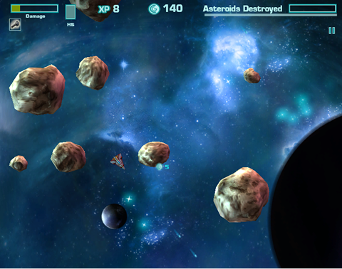

# Trabalho Prático 1 - {Parad}oroids

Agora que você conhece um pouco mais sobre OpenGL, vamos implementar um jogo
digital simples usando seus conhecimentos sobre ele e uma linguagem de
programação à sua escolha¹ (**C/C++**, Java, etc.).

O jogo _asteroids_ foi criado pela Atari em 1979 e foi um terrível sucesso,
vendendo mais de 70.000 cópias. Originalmente escrito em hardware e
usando um monitor vetorial, o sucesso foi tão gigante que os
fliperamas precisavam instalar caixas maiores que o normal para conseguir
guardar todas as ricas moedinhas.

No jogo, o jogador controla uma ~~nave~~ coisa (ou coiso) ~~no espaço~~
em algum lugar usando as setas direcionais. Ao pressionar as setas
<kbd>&lArr;</kbd> e <kbd>&rArr;</kbd>, a ~~nave~~ coisa gira em torno do
próprio eixo e, ao pressionar a tecla <kbd>&uArr;</kbd>, ela acelera
na direção onde está apontando. Um vez que a ~~nave~~ coisa começa a se
mover em uma direção, ela vai continuar se movendo _por um tempo_
mesmo sem a interação do jogador, ou até que o jogador aplique um
impulso em outra direção.

O objetivo do jogador é atingir a maior pontuação possível, obtida ao se
atirar e destruir ~~maliciosos asteróides~~ paradas marotas colocado(a)s
~~no espaço~~ nas proximidades pelo programador. Ao mesmo tempo em que se
destrói ~~os asteróides~~ as paradas, deve-se também evitar encostar
nele(a)s, visto que quando isso acontece, a ~~nave~~ coisa é destruída.

Neste trabalho, vamos criar um jogo com a mesma mecânica do Asteroids,
mas com uma temática diferente e à sua escolha - portanto,
seja ~~fanfarrão~~ criativo!

¹Se optar por outra linguagem diferente de C ou C++, converse como professor
sobre isso **antes de começar** ;)

## Instruções sobre o jogo

O jogo consiste em uma **câmera fixa** em um ambiente 2D, um objeto
controlado pelo jogador, tiros e as paradas em movimento retilínio uniforme.

O controle do jogo deve ser feito pelas setinhas do teclado, mas há a
opção de se fazer controles alternativos também (veja nos itens extras).

Quando a <kbd>barra de espaço</kbd> é pressionada, um projétil é lançado
na mesma direção ~~da nave~~ do jogador com velocidade linear constante.
Se o tiro se choca com ~~um asteróide~~ uma parada, ambos se destroem,
mas 2-3 novo(a)s ~~miniasteróides~~ miniparadas surgem com velocidades
em direções aleatórias. Os tiros possuem um "tempo de vida" pré-determinado
de forma que eles somem depois de um tempo que foram lançados. Cada
~~asteróide~~ parada dá uma quantidade de pontos para o jogador.

Tudo que sai da tela deve reaparecer "do outro lado" e, se qualquer
coisa toca o jogador - inclusive o próprio tiro -, ele morre e o jogo
mostra uma mensagem de derrota. Quando todos os ~~asteróides~~ inimigos
são destruídos, o jogo termina mostrando uma mensagem de vitória e a
pontuação do jogador.

O uso de texturas nesse trabalho é altamente recomendado. Utilize-as
tanto para dar vida ao ambiente 2D do campo de visão do jogador
quanto estilizar o personagens e o cenário. Veja um _remake_ do Asteroids
chamado Retro Blaster, que usa texturas:

Se optar por não usar texturas, não vale usar simplesmente quadradões,
retângulos e círculos - precisa ficar bonitão (procure uma imagem do
jogo [Geometry Wars][geometry-wars])!

Além do controle da ~~nave~~ coisa via teclado, os seguintes comandos devem
ser implementados:

- Ao clicar na tecla <kbd>p</kbd>, o jogo deve **pausar/continuar**;
- Clicando em <kbd>r</kbd>, o jogo deve ser **reiniciado**;
- E clicando em <kbd>ESC</kbd>, o jogo deve ser **encerrado**.

**Atenção:** Uma mensagem de confirmação deve ser exibida para as ações
de reiniciar e encerrar o jogo.

Deve ser implementada um <abbr title="Head-up Display">HUD</abbr> que
mostre a pontuação do jogador.

Para fim de detecção de colisão, os projéteis e os personagens podem ser
considerados todos retangulares ou todos circulares.

A lógica do jogo implementada,  o uso de textura, a interação do
teclado, a movimentação dos ~~asteróides~~ paradas, os tiros, a colisão e a
HUD equivalem a um total de **70%** da nota do trabalho. Para
conseguir mais pontos, você pode implementar algumas das funcionalidades
adicionais no seu jogo. Essas funcionalidades serão avaliadas de acordo
com a **dificuldade de implementação**, o **efeito obtido** dentro do
jogo e a **qualidade da implementação**. Implementando-as, você pode
obter até **125%** da pontuação do trabalho!

Exemplos de funcionalidades com suas respectivas pontuações **máximas** são
mostrados a seguir:

- Relativas a **texturas e gráficos**:
  1. **Texturas animadas (até 16%)**: você pode criar animações para as
    texturas tanto para o cenário quanto para a ~~nave~~ coisa e
    ~~os asteróides~~ as paradas.
    **#diquentinha**: busque por _sprite sequence_ ou _spritesheet_ no
    Google Imagens. Exemplos:
    - ~~Nave~~ coisa se movendo (**3%**)
    - ~~Nave~~ coisa atirando (**3%**)
    - ~~Asteróide~~ parada explodindo/morrendo (**6%**)
    - Tiro movendo (**2%**)
    - Tiro sumindo - atingiu sua distância máxima (**2%**)
  1. **Fundo lindão e com movimento/animação (até 6%)**: tipo o jogo
     Retro Blaster, mas com as estrelas se movimentando
- Relativas à **~~nave~~ coisa**:
  1. **Seta para baixo (2%)**: a tecla <kbd>&dArr;</kbd> reduz o impulso
     da ~~nave~~ coisa, até que ela pare (ela não chega a "andar de ré")
  1. **Controle via mouse (4%)**: além do controle via teclado, torne
     possível jogar com o mouse. Há pelo menos 2 formas de fazer isso:
     - Rodinha faz girar no sentido horário/anti-horário, botão
       esquerdo vai pra frente, direito atira
     - Clique na tela com botão direito faz a ~~nave~~ coisa ir até o
       local, ~~nave~~ coisa sempre aponta pra posição do mouse,
       botão esquerdo atira
  1. **Controle de tecla única (até 16%)**: pesquise sobre _one-switch
     games_. Você deve transformar o jogo em um. Uma possibilidade
     simples, mas não ótima, seria automatizar os tiros e a mudança de
     direção e possibilitar ao jogador acionar o impulso
  1. **Vidas (4%)**: em vez de morrer na primeira colisão, o jogador pode
     ter vidas
     - A HUD deve mostrar quantas vidas o jogador ainda tem
     - após voltar à vida, a nave fica imune (e piscando) por um tempo
  1. **Teletransporte (até 4%)**: com o pressionar de uma tecla (e.g.,
     <kbd>TAB</kbd>), o jogador deve ser teletransportado para um ponto aleatório
     - Pode ser também o clique do mouse e o jogador aparecer na posição clicada
- Relativas aos **projéteis**:
  1. **Projétil orientado (4%)**: faça o projétil estar orientado na
     direção da sua velocidade
  1. **Forma aleatória (até 6%)**: em vez de fazer ~~os asteróides~~ as
     paradas todas retangulares ou circulares, faça-as como se
     fossem asteróides, mas de forma aleatória
     - Para fins de colisão, você pode considerá-las como circulares
     ou retangulares
- Relativas ao **jogo**:
  1. **Buraco negro (até 5%)**: crie um ou mais buracos negros que possuem
     uma gravidade e puxam o jogador para dentro deles. Para sair deles,
     o jogador precisa fazer muita força
  1. **Fases infinitas (até 5%)**: ao destruir todos ~~os asteróides~~
     as paradas, em vez de ganhar o jogo, uma nova fase, com nível
     ligeiramente mais difícil é colocada ao jogador
  1. **Múltiplas fases curadas (até 7%)**: em vez de fazer o jogo ter
     apenas 1 fase ou fases "genéricas" infinitas, crie um número razoável
     (3-5) de fases com ambientações (cenário, texturas) e mecânicas
     (comportamento dos inimigos) diferentes
  1. **Itens (até 15%)**: quando ~~um asteróide~~ uma parada é destruíd(o)a,
     em vez de/além de ser subdividido, há uma chance de surgir um item que,
     se pego pelo jogador terá algum efeito positivo. Por exemplo:
    - **cogumelo verde** (uns 3%): +1 vida ao jogador
    - **tiro duplo** (uns 4%): em vez de 1, saem 2 tiros por vez
    - **iceberg espacial** (uns 5%): faz tod(a)os ~~os asteróides~~ as
      paradas ficarem bem lentas por um tempo
    - **escudo do [Eric][eric]** (uns 6%): cria um escudo protetor que
      faz todo(a)s ~~os asteróides~~ paradas explodirem se encostarem.
      Deve ser possível ver o escudo enquanto ele ainda durar
    - outros itens...
  1. **Cenário maior que câmera - rolagem (até 12%)**: em vez de fazer
     uma câmera fixa, faça com que o espaço "navegável" seja maior do
     que o espaço visível e que o jogador possa explorar o cenário e
     a câmera acompanhe. Exemplo:

     
  1. **_Highscore_ salvo em arquivo (6%)**: faça a pontuação dos `n`
     melhores jogadores ser salva em um arquivo (e.g., `pontuacao.txt`) e
     coloque uma tela no jogo para mostrar isso
    - **_Highscore_ salvo em servidor web (+7%)**: crie um servidor web que
      funcione como um servidor de _highscores_ e use-o para baixar as
      maiores pontuações e para salvar também
- Outras funcionalidades:
  1. **Sons (até 12%)**. Colocar efeitos sonoros e música de fundo no seu jogo
  1. **Manter razão de aspecto (4%)**: faça com que a razão de aspecto do jogo
     seja sempre mantida, independente das dimensões da janela, mas que o
     jogo ocupe a maior área possível da janela e ficando centralizado
  1. **Telas (até 10%)**: faça um jogo completo, ou seja, implemente telas de
     _splash screen_, menu inicial, instruções, créditos, opções,
     _game over_, etc
  1. **Implementação criativa (?%)**: qualquer implementação que não fuja
     muito do pedido, mas que traga elementos novos e interessantes para o
     seu jogo é bem-vinda!

### Um lembrete importante

Preocupe-se **primeiro em implementar as funcionalidades básicas do trabalho!**
Deixe o embelezamento do trabalho e a implementação das funcionalidades extras
para somente quando você já possuir a base lógica do trabalho construída
e funcionando.

## Instruções gerais

O seu código deve estar comentado e, principalmente, **organizado**: ao
construí-lo, pense que outra pessoa irá ler o código e você não estará lá
para explicar seu raciocínio, portanto, organize-o! Também não é necessário
comentar o código inteiro, mas o faça quando sentir necessidade de uma
explicação adicional à sua lógica.

Seu trabalho pode ser feito **individual ou em duplas** e produzido
integralmente por você/dupla. Se recursos de terceiros forem usados
(e.g., imagens, músicas, efeitos sonoros), coloque _links_ para elas na
documentação. A discussão e troca de ideias com os colegas é bem-vinda
e estimulada, mas cada aluno/dupla deve ter seu próprio trabalho.

**Trabalhos muito semelhantes receberão nota 0**, independente de quem
copiou quem. E claro, trabalhos semelhantes aos de outras pessoas ou
retirados da Internet, também receberão nota 0. Além da nota redonda,
eles serão encaminhados ao colegiado para apreciação.

Outros descuidos também o farão **perder pontos no trabalho**, como:

- Seu trabalho não executa: nota 0;
- Seu trabalho é uma cópia (como já mencionado): nota 0;
- Você não implementou os itens obrigatórios;
- Ausência de algum item obrigatório no que deve ser entregue (descritos
  a seguir);
- Baixa legibilidade/organização do código;
- Baixa qualidade da implementação;
- Entregar fora do prazo. Cada dia de atraso reduz o valor máximo de nota
  de acordo com a equação abaixo, de modo que `x` representa o número de
  dias de atraso e `f(x)` equivale à penalidade percentual da nota:

  
  - Isso implica que 1 ou 2 dias de atraso são pouco penalizados
  - E após 5 dias de atraso, o trabalho vale 0
  - _Seeing is believing_:
    https://www.google.com.br/search?q=y%3D(2%5E(x-2)%2F0.16)%2Cy%3D100

## O que deve ser entregue

Você deve entregar um **arquivo .tar.gz, .7z ou .zip** via **Moodle** contendo
os seguintes itens:

1. Pelo menos três _screenshots_ de diferentes cenas de seu jogo;
1. Todo o programa fonte, com _makefiles_ e bibliotecas necessárias para a
   compilação e execução do programa;
1. O arquivo executável do jogo;
1. Um arquivo **README** contendo (a) instruções para a compilação e
   execução, e (b) a lista de itens adicionais implementados em seu jogo.
1. (Opcional bônus, **6%**) Um _link_ para um **vídeo curto** (30 a 60s) no
   YouTube mostrando seu jogo implementado!
   - Faça um **vídeo <u>curto</u>**!

Qualquer dúvida, entre em contato com o professor ou com o monitor. Ou então
acrescente a sua interpretação no arquivo README e mãos à obra!

[geometry-wars]: https://www.youtube.com/watch?v=A90_YqbdriE
[eric]: https://100grana.files.wordpress.com/2009/10/cavern1.jpg
