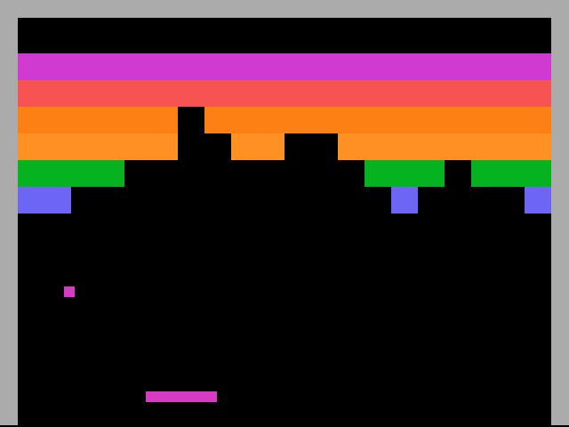
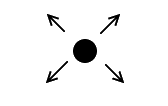
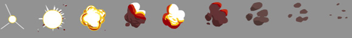

# Trabalho Prático 1 - Galaxian

Neste primeiro trabalho prático vamos experimentar programação orientada a
eventos usando OpenGL. Para isso, vamos implementar um jogo digital simples.

Inspirado no jogo Pong, Nolan Bushnell, fundador da Atari, contrata a dupla mais
famosa de Steves (Jobs e Wozniak) para criar o jogo Breakout, que seria seu
próximo sucesso. Wozniak era um talentoso engenheiro e desenvolveu o projeto
do jogo em 4 dias, além de conseguir reduzir o número de circuitos de 100 para 42.
Feliz com o resultado, Nolan Bushnell gratificou Steve Jobs com um bônus de $5,000,
dos quais Steve Wozniak ficou sabendo apenas 10 anos depois.

## Instruções sobre o jogo

O jogo consiste em uma parede de tijolos que são destruídos quando uma bola,
que se movimenta sozinha, colide com eles. A bola se movimenta em duas direções,
quatro sentidos diferentes, conforme mostra a imagem abaixo (de 90 em 90º, começando de 45º).
Quando a bola atinge um obstáculo (i.e., paredes laterais, parede superior,
tijolos ou a barra do jogador), ela altera seu ângulo de movimentação, sendo
refletida pela superfície.

Se a bola ultrapassa o canto inferior da tela, o jogador
perde. Se a bola destói todos os tijolos, o jogador ganha. Para mais detalhes, veja
um [exemplo do breakout](https://www.google.com.br/search?q=atari+breakout&tbm=isch)
feito pelo Google ou um [vídeo do jogo original](https://youtu.be/hW7Sg5pXAok?t=50s).

O jogador controla uma plataforma que fica na parte de baixo da tela. Ela se
movimenta apenas no eixo X e vai do canto esquerdo da tela ao canto direito. O controle
da barra deve ser feito pelo _mouse_. A barra tem uma velocidade de deslocamento que
varia de –V a V, em que V é a velocidade máxima permitida da barra. O _mouse_ bem
no meio da tela indica velocidade zero, ou seja, a barra parado. O mouse posicionado
na lateral esquerda indica velocidade –V, ou seja, máximo velocidade de deslocamento
para a esquerda. Similarmente, a barra na lateral direita indica velocidade V, a
máxima para a direita.

Um placar deve manter o número de tijolos destruídos com a bola na interface do jogo
(ou <abbr title="Head-up Display">HUD</abbr>). Você deve mostrar mensagens na tela
em situações de derrota e vitória, pelo menos. Outros requisitos:

1. O jogo deve encerrar quando a tecla Esc for pressionada
1. O jogo deve reiniciar quando a tecla 'r' for pressionada

Esse conjunto de funcionalidades descritas até aqui vale 70% da nota do trabalho.
Para se obter o restante dos pontos do trabalho (ou até mesmo mais pontos
extras, até o limite de 150% da pontuação do trabalho) funcionalidades adicionais
podem/devem ser implementadas no jogo. Essas funcionalidades serão avaliadas
conforme a **dificuldade da implementação**, o **efeito obtido** com ela no jogo
e a **qualidade da implementação**. Exemplos de funcionalidades extras com suas
respectivas pontuações **máximas**:

1. Vários **tipos de tijolo**. Por exemplo: tijolo inquebrável, tijolo patolão
   (2 porradas da bola), tijolo _shy_ (chance de o tijolo ficar oculto por um
   tempo), tijolo maroto (chance do tijolo diminuir de tamanho quando a bola
   se aproxima) etc. **(até 12%)**
1. Implementação de **múltiplas fases** no jogo, com aumento progressivo na
dificuldade **(até 10%)**
   - Cada fase deve ter uma configuração diferente (e.g., posições, quantidades e
     tipos diferentes dos tijolos). Fuja da simples "paredona de tijolos".

     
   - Você pode especificar a configuração de cada fase em um arquivo externo, em
     vez de fazê-lo no próprio código. Por exemplo: level1.txt. Esse extra do extra
     vale **(até 5%)** a mais
1. Fazer um jogo completo implica em ter **outras telas** além da de jogo: _splash_,
   menu inicial, cena de jogo, opções, cena de vitória, _game over_ **(até 8%)**
1. **Múltiplas chances** (ou vidas) para o jogador, em vez de dar _game over_ no
   primeiro erro. A HUD deve conter um indicativo de quantas vidas restam **(5%)**
1. O gráficos podem ser feitos com texturas para ficar mais apelativo visualmente
   **(até 5%)**
1. Os **objetos podem ser animados**, ou seja, a apresentação deles varia
com o tempo - por exemplo, os tijolos podem explodir ao morrer **(até 7%)**
   - Uma forma possível é fazer animação das texturas

     
1. **Velocidade tangencial** da bola. A posição que a bola acerta na barra pode ser
   usada para modificar a velocidade da bola. Se acertar nas extremidades da barra,
   a bola é refletida com um incremento na velocidade (até um limite máximo).
   Acertando o meio da barra, a velocidade pode ser reduzida (até um limite mínimo)
   **(7%)**
1. **Efeito na bola**. Em vez do ângulo de movimentação da bola ser uma opção
   dentre 4, a velocidade da barra no momento da colisão pode ser usada para
   calcular uma variação no ângulo refletido **(7%)**
1. **Itens especiais**. Ao destruir um tijolo, um item pode ser liberado de dentro dele
   e vai caindo na tela. Se o jogador consegue pegá-lo com a barra, o item entra em
   efeito e causa alterações no jogo como **(até 15%)**:
   - Jogador ganha uma vida
   - Aumento temporário do tamanho da barra
   - Bola temporariamente fica destruidora mortal, não sendo refletida ao destruir
     um tijolo, continuando na mesma direção/sentido atropelando o que vier
   - Outra bola entra em jogo (omg!!)
1. **Sons**. Colocar efeitos sonoros e música de fundo no seu jogo **(até 8%)**
1. Qualquer outra idéia que torne o jogo melhor ou mais bonito. Essas idéias
   precisam ser documentadas e explicadas no documento de entrega do trabalho
   e a pontuação será dada de acordo com a complexidade e a qualidade
   da implementação

## Instruções gerais

O trabalho é individual e deve ser produzido integralmente pelo aluno. Podem discutir
idéias entre os colegas, mas cada aluno deve ter a sua implementação independente dos
demais. **Trabalhos muito semelhantes receberão nota 0**, independente de quem copiou
de quem. Trabalhos semelhantes aos de outras pessoas (ex-alunos, pessoas na Internet)
também receberão nota 0.

## O que faz perder nota

Alguns descuidos podem fazer com que sua nota fique muito abaixo do esperado:
- Seu trabalho não executa: nota 0
- Cópia de trabalho de outrem: nota 0
- Ausência de qualquer item obrigatório da entrega (descrito na próxima seção)
- Ausência de itens da especificação obrigatória
- Baixa legibilidade do código
- Baixa qualidade da implementação
- Atraso na entrega. Cada dia de atraso reduz o valor máximo de nota da
  maneira abaixo. Considere `x` como dias de atraso e `y` a penalidade
  percentual na nota:

  
  - Isso implica que 1 ou 2 dias de atraso são pouco penalizados
  - E após 5 dias de atraso, o trabalho vale 0
  - _Seeing is believing_: https://www.google.com.br/search?q=y%3D(2%5E(x-2)%2F0.16-1.5625)%2Cy%3D100

## O que deve ser **entregue**

Deve ser entregue **um arquivo .tar.gz ou .zip** via **Moodle** contendo:
  1. 3+ _screenshots_ de diferentes cenas do seu jogo
  1. Todo o programa fonte, com os _Makefiles_ e bibliotecas necessárias
     para a compilação e execução do programa
  1. O arquivo executável
  1. Um arquivo **README** contendo:
     - Instruções para **compilação e execução**
     - **Lista de itens adicionais** que seu jogo está pleiteando
  1. (opcional, +3%) O link para um vídeo (youtube, vimeo, dailymotion etc.) do
     seu jogo mostrando as opções implementadas

Qualquer dúvida, entre em contato comigo. Ou acrescente a sua interpretação no
arquivo README e mãos à obra.
