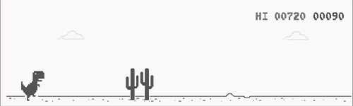
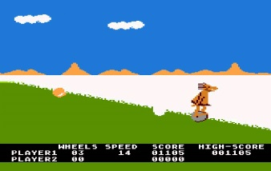
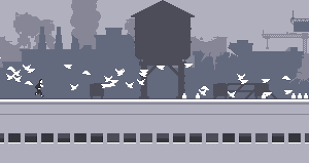

# Trabalho Prático 1 - Dino Run

Acredito que todos já passaram por esse belo momento: a conexão de internet caiu e você ficou indagando 
o que fazer da vida enquanto ela não volta. Pensando nisso, o Chrome disponibilizou esse amigável jogo 
para passar essas horas de desespero e tédio.

~~(Por que logo um dinossauro? Tá me chamando de jurássico?)~~

Agora que você conhece um pouco mais sobre OpenGL, vamos implementar um jogo
digital simples usando seus conhecimentos sobre ele e uma linguagem de
programação a sua escolha¹ (**C/C++**, Java, etc.).

Neste trabalho, vamos criar um jogo em que o jogador controla um personagem
que precisa se desviar de objetos vindo em sua direção pulando. 

O gênero Endless Runner é definido basicamente por um personagem correndo eternamente em um caminho com obstáculos.
Bem simples não?  As origens do gênero remetem à jogos como  Scramble (1981), Moon Patrol (1982) e B.C.'s Quest for Tires (1983), 
considerado o primeiro jogo do gênero, com uma menção honrosa às fases especiais do Sonic 2 (1992). Exemplares mais atuais incluem Canabalt (2009), 
Temple Run (2011) e Subway Surfers (2012).

B.C.'s Quest for Tires (1983)

Canabalt (2009)

¹ Se optar por outra linguagem diferente de C ou C++, converse com o professor
sobre isso **antes de começar** ;)

## Instruções sobre o jogo

O jogo consiste em uma **câmera fixa** em um **ambiente 2D** e um **personagem controlado pelo 
jogador por meio do teclado**. O personagem fica posicionado em algum lugar fixo na tela.
 Vários objetos do cenário vão se aproximando pelo chão, a uma certa velocidade,  e o personagem 
 deve se esquivar deles pulando.  
  
 A cada objeto ultrapassado o jogador vai acumulando uma pontuação. Quando um **objeto acertar o personagem**
  (colisão), o jogador perde uma vida e duas coisas podem acontecer:

1. O personagem fica invencível (e piscando) por alguns segundos, enquanto o jogo continua; 

    ou
    
1. O personagem volta para o inicío do jogo (ou da fase), que reinicia;

Quando o personagem perde todas as vidas, o jogo mostra ao jogador uma **tela de _"game over"_** 
com a pontuação do jogador.

À medida em que o tempo passa, o jogo se torna mais difícil, com uma maior concentração de objetos se 
aproximando e/ou com um aumento da velocidade de aproximação. 

O uso de **texturas** nesse trabalho é obrigatório. Utilize-as tanto para dar vida ao ambiente 2D do
 campo de visão do jogador quanto estilizar o personagem e os objetos. Para fins de colisão, 
 os objetos e o personagem podem ser considerados todos retangulares ou circulares.

O **ambiente do jogo deve ser caracterizado** graficamente. Por exemplo, se
o jogo se passa numa floresta, coloque um desenho de árvores no funso e objetos que componham o cenário.

Além do controle do personagem via teclado, os seguintes comandos devem ser implementados:

- Clicando na tecla *p*, o jogo deve **pausar/continuar**;
- Clicando em *r*, o jogo deve ser **reiniciado**;
- Clicando em *esc*, o jogo deve ser **encerrado**.

**Atenção:** Uma mensagem de confirmação deve ser exibida para as ações de reiniciar e encerrar o jogo.

A lógica do jogo implementada, o uso de textura, cálculo de colisões, a interação do teclado e
a criatividade na implementação dos itens mencionados equivalem a um total de **80%** da nota do trabalho. 
Para conseguir mais pontos, você pode implementar algumas das funcionalidades adicionais no seu jogo. Essas
funcionalidades serão avaliadas de acordo com a **dificuldade de implementação**, o **efeito obtido** dentro 
do jogo e a **qualidade da implementação**. Implementando-as, você pode obter até **125%** da pontuação
do trabalho!

Exemplos de funcionalidades com suas respectivas pontuações **máximas** são
mostrados a seguir:

- :star: **Texturas animadas**: você pode criar animações para as texturas tanto
  para o cenário quanto para os objetos e o personagem. **#dicaquentinha**: busque
  por _sprite sequence_ na Internet (**até 14%**)
  - Personagem andando (**até 6%**)
  - Personagem pulando (**até 2%**)
  - Personagem morrendo (**até 2%**) 
  - Objetos ou cenário animados (**até 4%**)
  
- **Tipos de objetos**: pode haver a distinção entre objetos que são ruins
  para o personagem (ele deve evitar) ou que são bons (deve capturar). Imagine
  que em meio aos cactus, aparecam moedinhas que aumentem a pontuação ou
  corações com vidas extras para o dinossaurinho! (**até 8%**)
 
 - **_Power-ups_**: implemente alguns meios do jogador aumentar suas
   chances de sobrevivência. Pode ser um escudo de proteção que dure alguns segundos,
    ou um pequeno relógio que faça o tempo ficar mais devagar, diminuindo momentaneamente a
     velocidade dos objetos. São várias possibilidades, use a criatividade! (**até 12%**)
     
- **Pulo com gravidade**: faça o dinossaurinho pular considerando a gravidade
  (e também um ponto de saturação da velocidade). (**até 5%**)
  
- :star: **Esquivar se abaixando**: o dinossaurinho poderá, além de pular, ter também a opção de se abaixar para se 
desviar dos pterodátilos que venham em sua direção voando. (**até 8%**) 

- :bomb: **Efeito Parallax**: você pode fazer um cenário composto, em que as partes se movimentam com velocidades diferentes,
criando a sensação de profundidade. (mais sobre esse efeito [aqui](https://en.wikipedia.org/wiki/Parallax_scrolling) e 
[aqui](http://forum.jogos.uol.com.br/curiosidade-efeito-parallax_t_1921012)) (**até 10%**) 
  
- :star: **Manter razão de aspecto**: faça com que a razão de aspecto do jogo
  seja sempre mantida, independente das dimensões da janela. (**4%**)
  
- **Fases**: como o jogo é um endless running, a dificuldade aumenta gradativamente e o 
jogo não tem fim. Porém a ideia de fases pode ser implementada, à medida em que o jogador avança, com mudanças 
acontecendo aos poucos no cenário e nos tipos de objetos. (**até 10%**)
 
- :star: **Telas**: faça um jogo completo, ou seja, implemente telas de  _splash screen_, menu inicial,
 créditos, opções, _game over_, etc.   (**até 8%**);
 
- :star: **Sons**: Colocar efeitos sonoros e música de fundo no seu jogo **(até 8%)**

- **Highscore salvo em arquivo**: faça a pontuação dos n melhores jogadores ser salva em um arquivo 
(e.g., pontuacao.txt) e coloque uma tela no jogo para mostrar isso. **(até 10%)**

- **Implementação criativa**: qualquer implementação que não fuja muito do pedido,
  mas que traga elementos novos e interessantes para o seu jogo é
  bem-vinda! (**?%**)

### Um lembrete importante

Preocupe-se **primeiro em implementar as funcionalidades básicas do trabalho!**
Deixe o embelezamento do trabalho e a implementação das funcionalidades extras
para somente quando você já possuir a base lógica do trabalho construída
e funcionando.

## Instruções gerais

O seu código deve estar comentado e, principalmente, organizado: ao construí-lo, pense que outra pessoa 
irá ler o código e você não estará lá para explicar seu raciocínio, portanto, organize-o! Também não é 
necessário comentar o código inteiro, mas o faça quando sentir necessidade de uma explicação adicional à sua lógica.

Seu trabalho pode ser feito individual ou em duplas e produzido integralmente por você/dupla. Se recursos de 
terceiros forem usados (e.g., imagens, músicas, efeitos sonoros), coloque links para elas na documentação. 
A discussão e troca de ideias com os colegas é bem-vinda e estimulada, mas cada aluno/dupla deve ter seu próprio trabalho.

Trabalhos muito semelhantes receberão nota 0, independente de quem copiou quem. E claro, trabalhos semelhantes 
aos de outras pessoas ou retirados da Internet, também receberão nota 0. Além da nota redonda, eles serão encaminhados 
ao colegiado para apreciação.

Outros descuidos também o farão **perder pontos no trabalho**, como:

- Seu trabalho não executa: nota 0;
- Seu trabalho é uma cópia (como já mencionado): nota 0;
- Você não implementou os itens obrigatórios;
- Ausência de algum item obrigatório no que deve ser entregue (descritos
  a seguir);
- Baixa legibilidade/organização do código;
- Baixa qualidade da implementação;
- Entregar fora do prazo. Cada dia de atraso reduz o valor máximo de nota
  de acordo com a equação abaixo, de modo que `x` representa o número de
  dias de atraso e `f(x)` equivale à penalidade percentual da nota:

  
  - Isso implica que 1 ou 2 dias de atraso são pouco penalizados
  - E após 5 dias de atraso, o trabalho vale 0
  - _Seeing is believing_:
    https://www.google.com.br/search?q=y%3D(2%5E(x-2)%2F0.16)%2Cy%3D100

## O que deve ser entregue

Você deve entregar um arquivo .tar.gz, .7z ou .zip via Moodle contendo os seguintes itens:

1. Pelo menos três screenshots de diferentes cenas de seu jogo;
2. Todo o programa fonte, com makefiles e bibliotecas necessárias para a compilação e execução do programa;
3. O arquivo executável do jogo;
4. Um arquivo README contendo (a) instruções para a compilação e execução, e (b) a lista de itens adicionais implementados em seu jogo.
5. Um link para um vídeo curto (30 a 60s) no YouTube mostrando seu jogo implementado!
Faça um vídeo curto!

Qualquer dúvida, entre em contato com o professor ou com o monitor. Ou então acrescente a sua interpretação no arquivo README e mãos à obra!