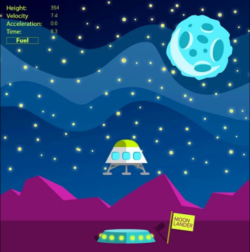

# Trabalho Prático 1 - Lander

Agora que você conhece um pouco mais sobre OpenGL, vamos implementar um jogo
digital simples usando seus conhecimentos sobre ele e uma linguagem de
programação à sua escolha¹ (**C/C++**, Java, etc.).

O jogo _Lunar Lander_ foi criado pela Atari em 1979 e foi um terrível sucesso,
sendo jogado em fliperamas de todo o mundo. Ele foi baseado no Moonlander
(1973), que foi o primeiro jogo gráfico do gênero, e utilizou um monitor
vetorial dentro do gabinete de madeira do arcade.

O jogo mostra uma nave que está tentando aterrisar com sucesso na superfície
lunar. Assim que uma partida começa, a nave está a uma certa altura do chão,
e logo começa a cair, sendo atraída pela gravidade. Ao pressionar as setas
<kbd>&lArr;</kbd> e <kbd>&rArr;</kbd>, a nave gira em torno do
próprio eixo e, ao pressionar a tecla <kbd>&uArr;</kbd>, ela ativa seu
motor principal e acelera na direção para onde está apontando.

Existe um local pré-determinado e visualmente marcado no chão onde a
nave deve aterrisar. O jogador deve conseguir chegar nesse ponto com (a) uma
velocidade e (b) uma orientação bem próxima de zero, senão ele se
espatifa e explode.

Neste trabalho, vamos criar um jogo com a mesma mecânica do Lunar Lander,
e você pode escolher uma temática diferente - portanto, libere sua
criatividade. Por exemplo, por que não fazer um jogo sobre dentes alados
tentando aterrisar dentro de uma boca?

¹Se optar por outra linguagem diferente de C ou C++, converse como professor
sobre isso **antes de começar** ;)

## Instruções sobre o jogo

O jogo consiste em uma **câmera fixa** (sem rolagem lateral) em um
ambiente 2D, um objeto controlado pelo jogador e o cenário representando
a superfície de aterrisagem, com demarcações para a região de pouso desejada.
A superfície pode ser totalmente plana, mas há possibilidade de deixar mais
interessante (veja adicionais). A região de pouso deve ser um intervalo
da superfície definido de maneira aleatória.

O controle do jogo deve ser feito pelas setinhas do teclado, mas há a
opção de se fazer controles alternativos também (veja nos itens extras).
Quando o motor principal (<kbd>&Arr;</kbd>) é ativado, deve sair um foguinho
indicativo.

Assim que o jogador espatifa seu objeto, ou consegue aterrisar com sucesso,
o jogo deve "reiniciar a partida" - reposicionar o objeto em uma posição
inicial aleatória, acima da superfície.

O uso de texturas nesse trabalho é altamente recomendado. Utilize-as
tanto para dar vida ao ambiente 2D do campo de visão do jogador
quanto estilizar o personagens e o cenário. Veja um exemplo de jogo _lander_
que usa texturas:

Se optar por não usar texturas, não vale usar simplesmente quadradões,
retângulos e círculos - precisa ficar bonitão (procure uma imagem do
jogo [Geometry Wars][geometry-wars])!

Além do controle da nave via teclado, os seguintes comandos devem
ser implementados:

- Ao pressionar a tecla <kbd>p</kbd>, o jogo deve **pausar/continuar**;
- Pressionando <kbd>r</kbd>, o jogo deve ser **reiniciado**;
- Pressionando <kbd>ESC</kbd>, o jogo deve ser **encerrado**.

**Atenção:** Uma mensagem de confirmação deve ser exibida para as ações
de reiniciar e encerrar o jogo.

Deve ser implementada uma <abbr title="Head-up Display">HUD</abbr> que
mostre a altura, a velocidade e a aceleração do jogador.

A lógica do jogo implementada,  o uso de textura, a interação do
teclado, a movimentação da nave com aceleração/velocidade, a colisão com
a superfície, a HUD (e os itens da entrega, como o código fonte, o vídeo etc.)
equivalem a um total de **70%** da nota do trabalho. Para
conseguir mais pontos, você pode implementar algumas das funcionalidades
adicionais no seu jogo. Essas funcionalidades serão avaliadas de acordo
com a **dificuldade de implementação**, o **efeito obtido** dentro do
jogo e a **qualidade da implementação**. Implementando-as, você pode
obter até **125%** da pontuação do trabalho!

Exemplos de funcionalidades com suas respectivas pontuações **máximas** são
mostrados a seguir:

- Relativas à superfície:
  1. **Superfície não plana (até 5%)**: em vez de representar a superfície por
     uma linha, represente-a como uma curva (_e.g._, uma função do cálculo). É
     necessário, no entanto, que a região objetivo da aterrisagem seja plana.
  1. :bomb: **Geração aleatória da superfície (até 8%)**: além de ter superfícies
     não-monótonas, você pode escrever uma função que vá gerar uma superfície
     aleatoriamente. Cuidado deve ser tomado para que a região de pouso seja
     plana.
     - **Fases infinitas (+4%)**: gere uma nova fase toda vez que o jogador
       morrer ou que ele tenha êxito em aterrisar
- Relativas a **texturas e gráficos**:
  1. :star: **Texturas animadas (até 10%)**: você pode criar animações para as
     texturas do cenário e para a nave.
     **#diquentinha**: busque por _sprite sequence_ ou _spritesheet_ no
     Google Imagens. Exemplos:
     - Motores laterais e principal da nave (**4%**)
     - Nave espatifando (**3%**)
     - Bandeirinhas demarcando a região objetivo (**2%**)
     - Regiões do cenário com animação (**2%**)
  1. **Fundo lindão e com movimento/animação (até 4%)**: em vez de um fundo
     com uma simples cor, colocar imagens ou até umas estrelinhas
     piscando aleatoriamente
  1. :bomb: **Efeito de partículas (até 12%)** para simular o fogo/explosão etc.
- Relativas à **nave**:
  1. **Controle via mouse (4% ou 6%)**: além do controle via teclado, torne
     possível jogar com o mouse. Há pelo menos 2 formas de fazer isso:
     - Rodinha faz girar no sentido horário/anti-horário, botão
       esquerdo vai pra frente (4%)
     - A nave muda sua orientação (rotaciona) de acordo com a posição
       dela vs posição do mouse. Ao pressionar um botão, ela acelera na direção
       que está apontando (6%)
  1. :bomb: **Controle de tecla única (até 16%)**: pesquise sobre _one-switch
     games_. Você deve transformar o jogo em um
  1. :star: **Vidas (4%)**: em vez de morrer na primeira colisão, o jogador pode
     ter vidas
     - A HUD deve mostrar quantas vidas o jogador ainda tem
- Relativas ao **jogo**:
  1. **Buraco negro (até 5%)**: crie um ou mais buracos negros que possuem
     uma gravidade e puxam o jogador para dentro deles. Para sair deles,
     o jogador precisa fazer muita força
  1. **Múltiplas fases curadas (até 5%)**: em vez de fazer o jogo ter
     apenas 1 fase, crie um número razoável
     (3-5) de fases com ambientações (cenário, texturas) diferentes
  1. **Cenário maior que câmera - rolagem (até 12%)**: em vez de fazer
     uma câmera fixa, faça com que o espaço "navegável" seja maior do
     que o espaço visível e que o jogador possa explorar o cenário e
     a câmera acompanhe. Exemplo:

     
  1. **Pontuação (4%)**: determine uma forma de pontuar o jogador, por exemplo,
     usando o "combustível total" que foi usado para o pouso
  1. **_Highscore_ salvo em arquivo (10%)**: faça a pontuação dos `n`
     melhores jogadores ser salva em um arquivo (e.g., `pontuacao.txt`) e
     coloque uma tela no jogo para mostrar isso
    - **_Highscore_ salvo em servidor web (+6%)**: crie um servidor web que
      funcione como um servidor de _highscores_ e use-o para baixar as
      maiores pontuações e para salvar também
- Outras funcionalidades:
  1. :star: **Sons (até 12%)**. Colocar efeitos sonoros e música de fundo no seu jogo
  1. :star: **Manter razão de aspecto (4%)**: faça com que a razão de aspecto do jogo
     seja sempre mantida, independente das dimensões da janela, mas que o
     jogo ocupe a maior área possível da janela e ficando centralizado
  1. :star: **Telas (até 10%)**: faça um jogo completo, ou seja, implemente telas de
     _splash screen_, menu inicial, instruções, créditos, opções,
     _game over_, etc
  1. **Implementação criativa (?%)**: qualquer implementação que não fuja
     muito do pedido, mas que traga elementos novos e interessantes para o
     seu jogo é bem-vinda!

### Um lembrete importante

Preocupe-se **primeiro em implementar as funcionalidades básicas do trabalho!**
Deixe o embelezamento do trabalho e a implementação das funcionalidades extras
para somente quando você já possuir a base lógica do trabalho construída
e funcionando.

## Instruções gerais

O seu código deve estar comentado e, principalmente, **organizado**: ao
construí-lo, pense que outra pessoa irá ler o código e você não estará lá
para explicar seu raciocínio, portanto, organize-o! Também não é necessário
comentar o código inteiro, mas o faça quando sentir necessidade de uma
explicação adicional à sua lógica.

Seu trabalho pode ser feito **individual ou em duplas** e produzido
integralmente por você/dupla. Se recursos de terceiros forem usados
(e.g., imagens, músicas, efeitos sonoros), coloque _links_ para elas na
documentação. A discussão e troca de ideias com os colegas é bem-vinda
e estimulada, mas cada aluno/dupla deve ter seu próprio trabalho.

**Trabalhos muito semelhantes receberão nota 0**, independente de quem
copiou quem. E claro, trabalhos semelhantes aos de outras pessoas ou
retirados da Internet, também receberão nota 0. Além da nota redonda,
eles serão encaminhados ao colegiado para apreciação.

Outros descuidos também o farão **perder pontos no trabalho**, como:

- Seu trabalho não executa: nota 0;
- Seu trabalho é uma cópia (como já mencionado): nota 0;
- Você não implementou os itens obrigatórios;
- Ausência de algum item obrigatório no que deve ser entregue (descritos
  a seguir);
- Baixa legibilidade/organização do código;
- Baixa qualidade da implementação;
- Entregar fora do prazo. Cada dia de atraso reduz o valor máximo de nota
  de acordo com a equação abaixo, de modo que `x` representa o número de
  dias de atraso e `f(x)` equivale à penalidade percentual da nota:

  
  - Isso implica que 1 ou 2 dias de atraso são pouco penalizados
  - E após 5 dias de atraso, o trabalho vale 0
  - _Seeing is believing_:
    https://www.google.com.br/search?q=y%3D(2%5E(x-2)%2F0.16)%2Cy%3D100

## O que deve ser entregue

Você deve entregar um **arquivo .tar.gz, .7z ou .zip** via **Moodle** contendo
os seguintes itens:

1. Pelo menos três _screenshots_ de diferentes cenas de seu jogo;
1. Todo o programa fonte, com _makefiles_ e bibliotecas necessárias para a
   compilação e execução do programa;
1. O arquivo executável do jogo;
1. Um arquivo **README** contendo (a) instruções para a compilação e
   execução, e (b) a lista de itens adicionais implementados em seu jogo.
1. Um _link_ para um **vídeo curto** (30 a 60s) no YouTube mostrando seu
   jogo implementado!
   - Faça um **vídeo <u>curto</u>**!

Qualquer dúvida, entre em contato com o professor ou com o monitor. Ou então
acrescente a sua interpretação no arquivo README e mãos à obra!

[geometry-wars]: https://www.youtube.com/watch?v=A90_YqbdriE
[eric]: https://100grana.files.wordpress.com/2009/10/cavern1.jpg
