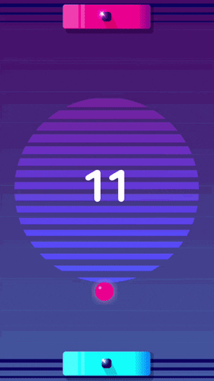

# Trabalho Prático 1 - Ping Phong

Considerado, por muitos, o primeiro jogo eletrônico da história, "Pong" não
só deu início à Atari, mas a toda a industria de jogos. Às vezes é necessário
voltar às origens para buscar inspiração, sendo assim, nos inspiraremos na raiz
de todo o mal.

Neste trabalho, você vai fazer um clone do jogo Pong. Adicionaremos novos
elementos à gameplay do clássico. O objetivo do trabalho é praticar o uso
de uma API gráfica para a criação de jogos e aplicações interativas em
2D, além de exercitar o conceito de programação orientada por eventos. O
trabalho deve ser feito em C/C++, usando OpenGL.
Vale a pena citar que o título do trabalho "Ping Phong" é uma referência
ao pesquisador vietnamita Bui Tuong Phong que dedicou sua carreira à
computação gráfica, você ouvirá falar dele novamente no decorrer da disciplina.

¹ Se optar por outra linguagem diferente de C ou C++, converse com o professor
sobre isso **antes de começar** ;)

## Instruções sobre o jogo

O jogo consiste em uma **câmera fixa** (sem rolagem) em um **ambiente 2D** e
dois **personagens controlados pelos jogadores por meio do teclado** representando
as raquetes, eles devem ser colocados um na direita e o outro na esquerda.
No cenário, há uma bolinha que deve começar andando para a direita
com velocidade constante. Quando a bolinha bate nas extremidades superior e
inferior, ela deve rebater com sentido contrário do eixo Y, mas com o mesmo sentido no
eixo X. Quando a bolinha acerta uma raquete, ela deve rebater com sentido contrário no
eixo X, mas com mesmo sentido no eixo Y, se a bolinha tocar as extremidades direita ou
esquerda, o jogador do lado contrário recebe um ponto, vence o jogador que chegar à
quantidade máxima de pontos delimitada.

O uso de **texturas** neste trabalho é obrigatório. Utilize-as tanto para
dar vida ao ambiente 2D da mesa de ping pong, quanto para estilizar o
personagem e os objetos. Para fins de colisão, os objetos e o personagem
podem ser considerados todos retangulares ou todos circulares, até mesmo a
bola pode ser considerada um retângulo.

O **ambiente do jogo deve ser caracterizado** graficamente. Por exemplo, deve
haver uma imagem para o campo visto de cima com uma rede no meio, coloque uma
caracterização para as barras, pode ser um sprite de raquete ou similar.

Deve haver um _head-up display_ (**HUD**) mostrando a pontuação atual
de cada jogador.

Os seguintes comandos devem ser implementados:

- <kbd>w</kbd> e <kbd>s</kbd> controlam o **player1** e <kbd>o</kbd> e <kbd>l</kbd> controlam o **player2**;
- Clicando na tecla <kbd>p</kbd>, o jogo deve **pausar/continuar**;
- Clicando em <kbd>r</kbd>, o jogo deve ser **reiniciado**;
- Clicando em <kbd>esc</kbd>, o jogo deve ser **encerrado**.

**Atenção:** uma mensagem de confirmação deve ser exibida para as ações de
reiniciar e encerrar o jogo.

A lógica do jogo implementada, o uso de textura, cálculo de colisões, a
interação do teclado e a lógica de jogo equivalem a um total de
**75%** da nota do trabalho. Para conseguir mais pontos, você pode
implementar algumas das funcionalidades adicionais. Essas funcionalidades
serão avaliadas de acordo com a **dificuldade de implementação**, o
**efeito obtido** dentro do jogo e a **qualidade da implementação**.
Implementando-as, você pode obter até **125%** da pontuação do trabalho! :3

Exemplos de funcionalidades com suas respectivas pontuações **máximas** são
mostrados a seguir:

- ❤️ **Regras aprimoradas (10%)**: Customize o comportamento do jogo implementando
  funcionalidades aprimoradas do ping pong profissional.
  (https://www.esportesexpress.com/regras/regras-de-tenis-de-mesas)
  A ideia é seguir os moldes oficiais do jogo, isso inclui:
  - "Sets de 11 (onze) pontos. Número de sets ímpares (um, três, cinco, sete, nove...)."
  - "No caso de empate em 10 pontos, o vencedor será o que fizer 2 pontos consecutivos
  primeiro."
  - "O atleta que atua o 1º set num lado é obrigado a atuar no lado contrário no set
  seguinte."
- ⭐ **Texturas animadas (até 10%)**: crie animações para as texturas tanto
  para o cenário quanto para os objetos e o personagem. **#dikentinha**: busque
  por _spritesheet_ na Internet.
  - Bolinha (**2%**)
  - Jogadores (**até 4%**)
  - Outros objetos ou cenário animados (**até 4%**)
- **Match Point (4%)**: Mostre de alguma forma na interface quando algum jogador
  estiver prestes a ganhar (faltando 1 ponto).
  - **Reizinho (4%)**: Coloque uma coroa ou algum outro sinal no jogador que estiver
  vencendo.
- ❤️ **Obstáculos (7%)**: Coloque obstáculos no campo, a bolinha deve rebater ao
  colidir com eles.
- **Itens (até 12%)**: Você pode criar diferentes itens que afetam o jogo, desde
  raquetes mais suaves ou ásperas a bolinhas mais leves ou pesadas, também pode
  haver power-ups pelo campo, o último jogador que rebateu a bolinha recebe o
  benefício caso ela colida com algum power-up.
- ❤️ **Campeonato** (**8%**): Crie funcionalidades de campeonato, os jogadores
  devem ser colocados em um sistema de chaveamento e as partidas devem selecionar
  o vencedor.  
- ❤️ **Colisão aprimorada** (**8%**): Faça os elementos colidirem na forma com a
  qual são compostos, ou seja, a colisão da bolinha deve ser um círculo e a raquete
  um retângulo ou similar. **#dikentinha**: você pode encontrar ajuda [nesses slides](https://fegemo.github.io/cefet-games/classes/collision/#9)
- ⭐ **Efeito de perspectiva**(**8%**): Crie uma falsa tridimensionalidade em
  seu cenário, fazendo com que a mesa possua proporções ajustadas para diminuir
  os pontos distantes da câmera. você pode usar essa grid como auxílio:
  [GRID](https://imgur.com/SQUgXBa)
- ⭐ **Simular altura da bola**(**8%**): Simule o movimento de subida e
  descida da bola modificando seu tamanho, faça o efeito de subir e de quicar
  da bola.
- ⭐ **Manter razão de aspecto (4%)**: faça com que a razão de aspecto do jogo
  seja sempre mantida, independente das dimensões da janela, e aproveitando
  o máximo de espaço possível (e no centro)
- **Fases (até 8%)**: crie (umas 4) fases diferentes com mudanças no cenário
  e nos tipos de objetos e, quem sabe, com efeitos na física como o vento,
  que deve afetar a forma com que a bolinha viaja pelo ar.
- ⭐ **Telas (até 8%)**: faça um jogo completo, ou seja, implemente telas de  
  _splash screen_, menu inicial, créditos, opções, _game over_, etc.
- ⭐ **Sons (até 8%)**: coloque efeitos sonoros e música de fundo no seu jogo
- **Botões clicáveis (até 4%)**: coloque botões na interface com opções pro
  usuário e possibilite que ele interaja via mouse
  - **Efeito _hover_ (+2%)**: quando o mouse passar por cima do botão, faça
    algum tipo de efeito para comunicar que ele é clicável
- **Highscore salvo em arquivo (até 12%)**: faça a pontuação dos `n` melhores
  jogadores ser salva em um arquivo (e.g., pontuacao.txt) e coloque uma
  tela no jogo para mostrar isso
  - Para ganhar total, faça com que o usuário possa digitar seu nome, que
    um algoritmo de ordenação matenha sempre apenas os `n` melhores e que
    tenha uma tela mostrando isso
- **Controle de versão (4%)**: desenvolva o trabalho usando algum sistema
  de controle de versão (como o git) hospedado em algum serviço gratuito e
  aberto (como o github, bitbucket, gitlab)
  - Não vale fazer só 01 commit no final :P
- **Implementação criativa**: qualquer implementação que não fuja muito do
  pedido, mas que traga elementos novos e interessantes para o seu jogo é
  bem-vinda! (**?%**)

### Um lembrete importante

Preocupe-se **primeiro em implementar as funcionalidades básicas do trabalho!**
Deixe o embelezamento do trabalho e a implementação das funcionalidades extras
para somente quando você já possuir a base lógica do trabalho construída
e funcionando.

## Instruções gerais

O seu código deve estar comentado e, principalmente, organizado: ao
construí-lo, pense que outra pessoa lerá o código e você não estará lá para
explicar seu raciocínio. Portanto, organize-o! Também não é necessário
comentar o código inteiro, mas o faça quando sentir necessidade de uma
explicação adicional à sua lógica.

Seu trabalho pode ser feito individual ou em duplas e deve ser produzido
integralmente por você/dupla. Se recursos de terceiros forem usados
(e.g., imagens, músicas, efeitos sonoros), coloque links para elas na
documentação. A discussão e troca de ideias com os colegas é bem-vinda e
estimulada, mas cada aluno/dupla deve ter seu próprio trabalho.

Trabalhos muito semelhantes receberão nota 0, independente de quem
copiou quem. E claro, trabalhos semelhantes aos de outras pessoas ou
retirados da Internet, também receberão nota 0. Além da nota redonda,
eles serão encaminhados ao colegiado para apreciação.

Outros descuidos também o farão **perder pontos no trabalho**, como:

- Seu trabalho não executa: nota 0;
- Seu trabalho é uma cópia (como já mencionado): nota 0;
- Você não implementou os itens obrigatórios;
- Ausência de algum item obrigatório no que deve ser entregue (descritos
  a seguir);
- Baixa legibilidade/organização do código;
- Baixa qualidade da implementação;
- Entregar fora do prazo. Cada dia de atraso reduz o valor máximo de nota
  de acordo com a equação abaixo, de modo que `x` representa o número de
  dias de atraso e `f(x)` equivale à penalidade percentual da nota:

  
  - Isso implica que 1 ou 2 dias de atraso são pouco penalizados
  - E após 5 dias de atraso, o trabalho vale 0
  - _Seeing is believing_:
    https://www.google.com.br/search?q=y%3D(2%5E(x-2)%2F0.16)%2Cy%3D100

## O que deve ser entregue

Você deve entregar um arquivo .tar.gz, .7z ou .zip via Moodle contendo os
seguintes itens:

1. Pelo menos três screenshots de diferentes cenas de seu jogo;
2. Todo o programa fonte, com makefiles e bibliotecas necessárias para a
   compilação e execução do programa;
3. O arquivo executável do jogo;
4. Um arquivo README contendo (a) instruções para a compilação e execução, e
   (b) a lista de itens adicionais implementados em seu jogo (via formulário
   do Google que será enviado)
5. Um link para um vídeo curto (30 a 60s) no YouTube mostrando seu jogo
   implementado. Faça um vídeo curto!

Qualquer dúvida, entre em contato com o professor ou com o/a monitor(a).
Ou então acrescente a sua interpretação no arquivo README e mãos à obra!
