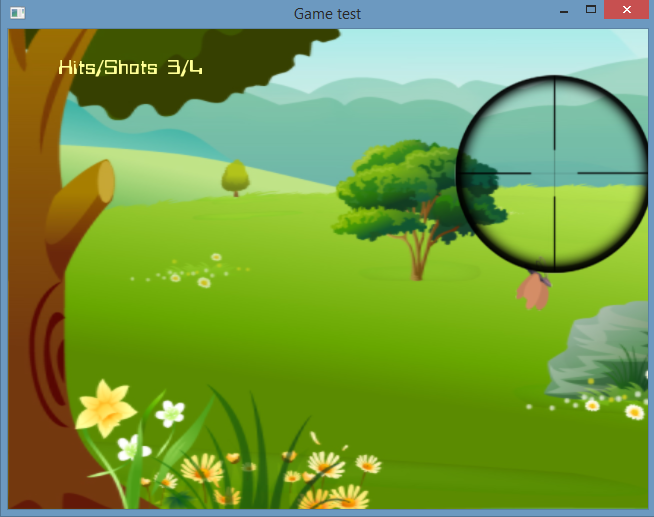

# Trabalho Prático 1 - Shooting Game

Agora que você conhece um pouco mais sobre OpenGL, vamos implementar um jogo digital simples usando seus conhecimentos sobre ele e uma linguagem de programação a sua escolha¹ (**C/C++**, Java, etc.).

_Shooters_, _shooting games_ ou simplesmente joguinhos de tiro-ao-alvo são um gênero comum entre jogos de ação. Geralmente, o jogador pode visualizar os eventos por meio dos olhos do personagem (FPS, ou _first-person shooter_) ou ver o personagem atirando (TPS, _third-person shooter_). Além disso, a câmera pode ser fixa ou móvel, e o jogo pode incluir diversas personalizações, como armas diferentes, número de vidas, etc. - as possibilidades são infinitas!

Um FPS bastante famoso no Brasil é o [Counter-Strike](http://store.steampowered.com/app/10). Houve um tempo que muitos jovens brasileiros iam para *lan houses* (lembram que isso existiu?) jogar CS somente na esperança de gritarem "**HEADSHOT!**" (ou melhor ainda, "**NA FACA!!!**").

¹ Se optar por outra linguagem diferente de C ou C++, converse como professor sobre isso ;)

## Instruções sobre o jogo

Para este trabalho prático, iremos desenvolver um FPS. Mas calma, você não saíra dando _headshots_ por aí não, pois criaremos algo bem mais simples que o Counter-Strike.

O jogo consiste em uma **câmera fixa** em um ambiente 2D e uma **mira** controlada pelo jogador por meio do _mouse_. Os alvos possuem movimento variável, e o objetivo do jogador é eliminar todos os alvos da tela. Os tiros podem ser disparados pelo jogador através de um clique com o botão esquerdo do mouse ou pressionando alguma tecla. Portanto, você deve primeiramente focar em elaborar três fatores:

1. Uma maneira de movimentar a mira com seu cursor;
2. Um modo de fazer com que os alvos variem sua posição dentro do campo de visão do jogador;
3. E um meio de verificar a colisão de um tiro com um alvo.

Com esses três pilares construídos, é hora de usar a sua **criatividade** - sim, ela contará pontos nesse trabalho!

O uso de **texturas** nesse trabalho é obrigatório. Utilize-as tanto para dar vida ao ambiente 2D do campo de visão do jogador quanto estilizar a mira e representar os alvos. Não se preocupe em delimitar os alvos de acordo com a sua textura; para fins de colisão, os alvos podem ser consideradas todos retangulares ou circulares.

Além disso, você deve criar uma maneira do usuário interagir com o jogo através do mouse/teclado:

- O jogador pode ter a opção de disparar um tiro através do mouse ou do teclado;
- Ao clicar na tecla *p*, o jogo deve pausar/continuar;
- Clicando em *r*, o jogo deve ser reiniciado;
- E clicando em *esc*, o jogo deve ser encerrado.

Uma mensagem de confirmação deve ser exibida para as ações de reiniciar e encerrar o jogo.

A lógica do jogo implementada, o uso de textura, a interação do teclado e a criatividade na implementação dos itens mencionados equivalem a um total de **70%** da nota do trabalho. Para conseguir mais pontos, você pode implementar algumas das funcionalidades adicionais no seu jogo. Essas funcionalidades serão avaliadas de acordo com a **dificuldade de implementação**, o **efeito obtido** dentro do jogo e a **qualidade da implementação**. Implementando-as, você pode obter até **133%** da pontuação do trabalho!

Exemplos de funcionalidades com suas respectivas pontuações **máximas** são mostrados a seguir:

- **Texturas animadas**: você pode criar animações para as texturas na OpenGL tanto para o cenário quanto para os alvos. **#diquentinha**: busque por _sprite sequence_ e seja feliz! (**até 10%**)
- **Pontuação**: o usuário pode pontuar de acordo com o número de alvos que ele já eliminou - por exemplo, o usuário vai acumulando pontos e esses são exibidos num placar na tela (**5%**);
- **Tipos de alvo**: pode haver a distinção de alvos que são bons para o usuário (geram pontos positivos) ou que são ruins (geram pontos negativos). Imagine que você está caçando monstros, mas sem querer atira em um coelhinho na tela: obviamente, você deve ser penalizado por atirar em coelhos! (**até 6%**)
- **Alvos espertos**: coloque seus alvos para pensar! Faça com que eles desviem dos projéteis, ou que sejam mais rápidos de acordo com as condições do jogador, por ex.; (**até 10%**)
- **_Power-ups_**: implemente alguns meios do jogador aumentar sua pontuação e/ou maneiras de mudar as suas habilidades. Podem haver itens que geram mais pontos por cada alvo, ou que diminuem/aumentam a quantidade de alvos,  ou que reduzam/aumentem o tamanho da mira etc.; (**até 12%**)
- **Tipos de arma**: implemente diferentes tipos de arma, mostrando qual delas está selecionada na tela - por exemplo, pode ter uma que atira mais projéteis, ou outra mais poderosa que exclui todos os alvos da tela; (**até 10%**)
- **Fases**: novas fases à medida que o jogador ganha mais pontos. Comece numa floresta, depois vá para um deserto, e assim por diante - ou então, vá acrescentando o número e tipos de alvos e *power-ups* disponíveis para o jogador! O nível de dificuldade deve aumentar progressivamente. Sua criatividade é o limite! (**até 12%**)
- **Telas**: faça um jogo completo, ou seja, implemente telas de _splash screen_, menu inicial, créditos, de jogo pausado, etc. (**até 8%**);
- **Colisão _pixel-perfect_** do tiro com os alvos. Em vez de considerar que os alvos são retangulares ou circulares, para fins de colisão, considere os pixels da imagem (**8%**)
- Implementação criativa: qualquer implementação que não fuja muito do pedido, mas que traga elementos novos e interessantes para o seu jogo é bem-vinda! (**?%**)

### Um lembrete importante

Preocupe-se **primeiro em implementar as funcionalidades básicas do trabalho!** Deixe o embelezamento do trabalho e a implementação das funcionalidades extras para somente quando você já possuir a base lógica do trabalho construída e funcionando.

## Instruções gerais

O seu código deve estar comentado e, principalmente, **organizado**: ao construí-lo, pense que outra pessoa irá ler o código e você não estará lá para explicar seu raciocínio, portanto, organize-o! Também não é necessário comentar o código inteiro, mas o faça quando sentir necessidade de uma explicação adicional à sua lógica.

Seu trabalho deve ser feito **individualmente** e produzido integralmente por você. A discussão e troca de ideias com os colegas é bem-vinda e estimulada, mas cada aluno deve ter seu próprio trabalho.

**Trabalhos muito semelhantes receberão nota 0**, independente de quem copiou quem. E claro, trabalhos semelhantes aos de outras pessoas ou retirados da Internet, também receberão nota 0.

Outros descuidos também o farão **perder pontos no trabalho**, como:

- Seu trabalho não executa: nota 0;
- Seu trabalho é uma cópia (como já mencionado): nota 0;
- Você não implementou os itens obrigatórios;
- Ausência de algum item obrigatório no que deve ser entregue (descritos a seguir);
- Baixa legibilidade/organização do código;
- Baixa qualidade da implementação;
- Entregar fora do prazo. Cada dia de atraso reduz o valor máximo de nota de acordo com a equação abaixo, de modo que `x` representa o número de dias de atraso e `f(x)` equivale à penalidade percentual da nota:

  

## O que deve ser entregue

Você deve entregar um **arquivo .tar.gz, .7z ou .zip** via **Moodle** contendo os seguintes itens:

1. Pelo menos três _screenshots_ de diferentes cenas de seu jogo;
2. Todo o programa fonte, com _makefiles_ e bibliotecas necessárias para a compilação e execução do programa;
3. O arquivo executável do jogo;
4. Um arquivo **README** contendo (a) instruções para a compilação e execução, e (b) a lista de itens adicionais implementados em seu jogo.
5. (Opcional bônus, **3%**) Um _link_ para um vídeo no YouTube, Vimeo, etc. mostrando seu jogo implementado!

Qualquer dúvida, entre em contato com o professor ou com o monitor. Ou então acrescente a sua interpretação no arquivo README e mãos à obra!
