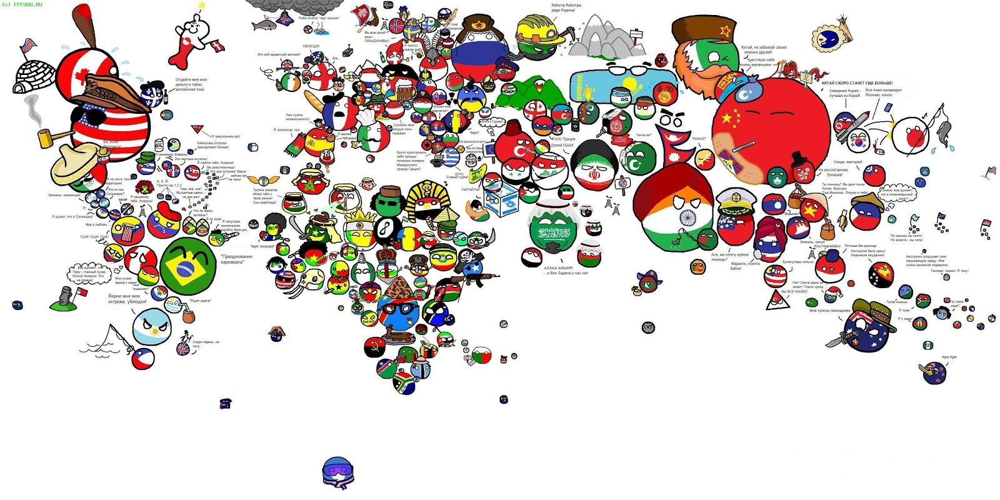
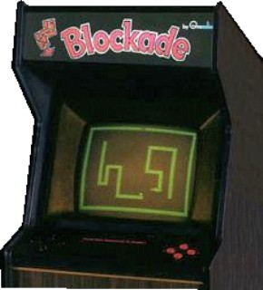
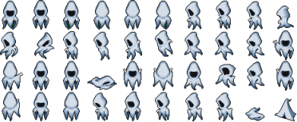
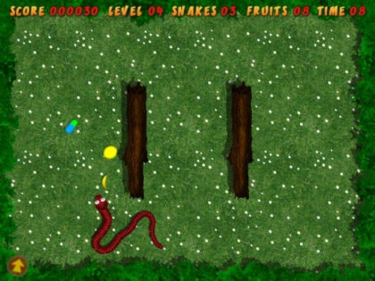
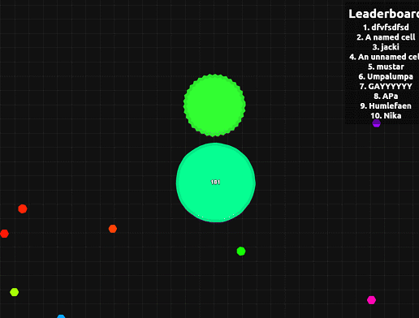

# Trabalho Prático 1 - tp.io

Agora que você conhece um pouco mais sobre OpenGL, vamos implementar um jogo
digital simples usando seus conhecimentos sobre ele e uma linguagem de
programação à sua escolha (**C/C++**, Java, etc. - se optar por outra
linguagem diferente de C ou C++, converse como professor sobre isso
**antes de começar** ;).

Em 1976, a empresa Gremlim criou um jogo de Arcade chamado Blockade, no qual
jogadores controlavam uma cobrinha que deveria coletar paradinhas para crescer
e prosperar até que trombasse nas paredes ou nela mesma.

Esse jogo inaugurou os jogos do tipo _snake_ que foram jogados por nossos
pais e também inspira os que jogamos hoje, como o [Agar.io][agar], o
[Slither.io][slither] e o [Wormax.io][wormax]. Isso mesmo, tudo [.io][poki]!
Você poderá escolher entre essas três modalidades de jogo neste trabalho,
mas não se preocupe - não precisa de ter nada _online_, tampouco ter inimigos com inteligência artificial.

Independente da escolha, o jogo deve possuir os seguintes itens,
valendo 70% da nota:

- Câmera em um ambiente 2D.
- Personagem controlável pelas setas ou 'WASD'.
- Mundo finito. Exemplo: [snake](http://s2.glbimg.com/DTHMxxIU4hMuJU6KoVcwiz6iuf4=/695x0/s.glbimg.com/po/tt2/f/original/2015/05/15/snake-rewind.jpg).
- Surgimento de paradas coletáveis em posições aleatórias.
- Existência de obstáculos e paredes, que matem o personagem e façam o
  jogo reiniciar.
- Comandos básicos do jogo via teclado:
  - encerrar quando a tecla 'Esc' for pressionada.
  - reiniciar quando a tecla 'r' for pressionada.
  - pausar quando a tecla 'p' for pressionada.

**Atenção**: Uma mensagem de confirmação deve ser exibida para as ações de
reiniciar e encerrar o jogo.

Para conseguir mais pontos, você pode implementar algumas das funcionalidades
adicionais no seu jogo. Essas serão avaliadas de acordo com o efeito
obtido dentro do jogo, a dificuldade e a qualidade da implementação. Você
poderá obter até 125% da pontuação no trabalho!

Exemplos de funcionalidades com suas respectivas pontuações **máximas** são
mostrados a seguir:

- Relativo aos **coletáveis** e ao **personagem**:
  1. **Massas diferentes (até 6%)**: paradas coletáveis de tamanhos
     diferentes que aumentam o personagem em por exemplo 2x/3x/4x
  1. **Perda de massa (5%)**: O personagem, em vez morrer, pode apenas
     perder uma porcentagem da massa ao colidir com objetos
  1. **Itens (até 12%)** com poderes místicos:
     - **Teletransporte**: o personagem muda para uma posição aleatório do
       mapa ou para uma posição definida pelo jogador através de algum _input_
     - **Mover mais rápido**: a velocidade do personagem aumenta
     - **Atravessar obstáculos**: permite ao personagem atravessar os
       objetos em cena
  1. **Portais**: permite ao personagem atravessar de um lado para outro do
     mapa através das paredes laterais.
  1. **Tamanho**: o personagem aumenta ou diminui muitoooooo de massa
  1. **Tamanho-1.2**: O personagem diminui de massa gradativamente até morrer,
     isso, é claro, se ele não vir a achar o antídoto ou comer muitaaaa massa
  1. **Escudo protetor**: faz com que as colisões com obstáculos ou com
     inimigos maiores não matem o personagem
  1. **Comida em 2x/3x/4x**: hoje o seu personagem acordou com muita fome e
     por isso toda massa alimenta-o com um multiplicador
- Relativo a **texturas e gráficos**:
  1. **Texturas (até 5%)**: obviamente o personagem não precisa ser uma grande
     e maciça bola de neve... ele pode ter diversas caras. Obstáculos
     e massas também podem ter textura.
  1. **Texturas animadas (até 5%)**: as texturas podem ser animadas, e isso
     pode ser feito por meio de _spritesheets_:

     
  1. **Criar os próprios desenhos (até 6%)**: em vez de
     "emprestar das Internets"
  1. **Fundo lindão e com movimento/animação (até 4%)**: tipo esse aqui:

     
- Relativas à **jogabilidade**:
  1. **_Multiplayer_ local (8%)**: possibilite que outros jogadores existam,
     sendo estes controláveis por outras teclas ou pelo mouse
  1. **Inteligências artificiais (até 6%)**: o jogo pode ter um falso
     _multiplayer_... como outros personagens que interagem com o mundo
     como se fossem jogadores, i.e., eles nascem, comem, crescem e morrem
  1. **Controle de tecla única (até 10%)**: pesquise sobre _one-switch
     games_. Você deve transformar o jogo em um. Uma possibilidade
     simples, mas não ótima, seria automatizar os tiros e a mudança de
     direção e possibilitar ao jogador acionar o impulso
  1. **Controle via mouse (6%)**: o personagem também pode ser controlado por
     mouse, assim como nos jogos de exemplo
  1. **Cenários com obstáculos diferentes (até 8%)**: faça alguns (4) cenários
     (ou fases) diferentes, com obstáculos e texturas diferentes em cada uma
  1. **Vidas (4%)**: após atingir um número mínimo de tamanho o personagem
     perde uma vida, e assim sucessivamente, até morrer. A quantidade de vidas
     precisa aparecer na HUD.
- Relativas ao **mapa** e à **HUD**:
  1. **Cenário maior que câmera - rolagem (até 12%)**: em vez de fazer uma
     câmera fixa, faça com que seja "navegável", ou seja, maior do que o
     espaço visível e que o personagem possa explorar o cenário e a
     câmera acompanhe

     
  1. **Mini-mapa (6%)**: faça um mini-mapa na lateral em tempo real
  1. **Pontuação (5%)**: que tal pontuar a quantidade de massa ingeridas
     pelo(s) jogadore(s). A HUD deve mostrar essa informação
     - **Highest scores (até 6%)**: faça a pontuação dos `n`
       melhores jogadores ser salva em um arquivo (e.g., `pontuacao.txt`) e
       coloque uma tela no jogo para mostrar isso
- Outras funcionalidades:
  1. **Música de fundo (4%)**
  1. **Efeitos sonoros (até 8%)**
  1. **Manter razão de aspecto (4%)**: faça com que a razão de aspecto do jogo
     seja sempre mantida, independente das dimensões da janela, mas que o
     jogo ocupe a maior área possível da janela e ficando centralizado
  1. **Telas (até 10%)**: faça um jogo completo, ou seja, implemente telas de
     _splash screen_, menu inicial, instruções, créditos, opções,
     _game over_, etc
  1. **Implementação criativa (?%)**: qualquer implementação que não fuja
     muito do pedido, mas que traga elementos novos e interessantes para o
     seu jogo é bem-vinda!

### Um lembrete importante

Preocupe-se **primeiro em implementar as funcionalidades básicas do trabalho!**
Deixe o embelezamento do trabalho e a implementação das funcionalidades extras
para somente quando você já possuir a base lógica do trabalho construída
e funcionando.

## Instruções gerais

O seu código deve estar comentado e, principalmente, **organizado**: ao
construí-lo, pense que outra pessoa irá ler o código e você não estará lá
para explicar seu raciocínio, portanto, organize-o! Também não é necessário
comentar o código inteiro, mas o faça quando sentir necessidade de uma
explicação adicional à sua lógica.

Seu trabalho pode ser feito **individual ou em duplas** e produzido
integralmente por você/dupla. Se recursos de terceiros forem usados
(e.g., imagens, músicas, efeitos sonoros), coloque _links_ para elas na
documentação. A discussão e troca de ideias com os colegas é bem-vinda
e estimulada, mas cada aluno/dupla deve ter seu próprio trabalho.

**Trabalhos muito semelhantes receberão nota 0**, independente de quem
copiou quem. E claro, trabalhos semelhantes aos de outras pessoas ou
retirados da Internet, também receberão nota 0. Além da nota redonda,
eles serão encaminhados ao colegiado para apreciação.

Outros descuidos também o farão **perder pontos no trabalho**, como:

- Seu trabalho não executa: nota 0;
- Seu trabalho é uma cópia (como já mencionado): nota 0;
- Você não implementou os itens obrigatórios;
- Ausência de algum item obrigatório no que deve ser entregue (descritos
  a seguir);
- Baixa legibilidade/organização do código;
- Baixa qualidade da implementação;
- Entregar fora do prazo. Cada dia de atraso reduz o valor máximo de nota
  de acordo com a equação abaixo, de modo que `x` representa o número de
  dias de atraso e `f(x)` equivale à penalidade percentual da nota:

  
  - Isso implica que 1 ou 2 dias de atraso são pouco penalizados
  - E após 5 dias de atraso, o trabalho vale 0
  - _Seeing is believing_:
    https://www.google.com.br/search?q=y%3D(2%5E(x-2)%2F0.16)%2Cy%3D100

## O que deve ser entregue

Você deve entregar um **arquivo .tar.gz, .7z ou .zip** via **Moodle** contendo
os seguintes itens:

1. Pelo menos três _screenshots_ de diferentes cenas de seu jogo;
1. Todo o programa fonte, com _makefiles_ e bibliotecas necessárias para a
   compilação e execução do programa;
1. O arquivo executável do jogo;
1. Um arquivo **README** contendo (a) instruções para a compilação e
   execução, e (b) a lista de itens adicionais implementados em seu jogo.
1. (Opcional bônus, **6%**) Um _link_ para um **vídeo curto** (30 a 60s) no
   YouTube mostrando seu jogo implementado!
   - Faça um **vídeo <u>curto</u>**!

Qualquer dúvida, entre em contato com o professor ou com o monitor. Ou então
acrescente a sua interpretação no arquivo README e mãos à obra!

[agar]: http://agar.io/
[slither]: http://slither.io/
[wormax]: http://wormax.io/
[poki]: http://poki.com.br/io
