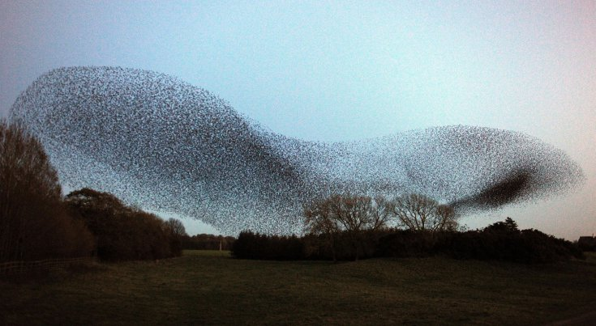
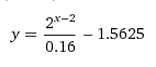

# Trabalho Prático 2 - Boids (Simulação de Bandos)

_Veja a bicharada em ação: [https://www.youtube.com/watch?v=A6nvvFkbRkY](https://www.youtube.com/watch?v=A6nvvFkbRkY)_

[Craig Reynolds](http://www.red3d.com/cwr/), como todo bom programador,
era um cara preguiçoso. Um dia, ele precisou criar a animação de vários animais
que andavam em bando e, em vez de passar dias planejando
a trajetória de cada animal, ele optou por escrever um programa que
fizesse esse trabalho por ele (danadão). Ele chamou cada animal de _boid_ e
[publicou um artigo na conferência SIGGRAPH de 1987 sobre seu
trabalho](http://www.cs.toronto.edu/~dt/siggraph97-course/cwr87/).

Inúmeros jogos e sistemas de simulação física envolvem o planejamento e
coordenação de movimento de grupos. Neste trabalho, vamos desenvolver um
programa que modela **um bando de pássaros virtuais (_boids_) navegando num
espaço tridimensional**.

Cada _boid_ é uma entidade independente, que possui uma posição no espaço e um
vetor velocidade associado (- alô? - oi, aqui é a `struct` falando. Tudo correto, `vetor.h`?). O movimento
do bando obedece um conjunto básico de elementos:

- **Separação** (esq.): cada _boid_ deve manter uma certa distância mínima de
  separação entre ele mesmo e os boids vizinhos (ou outros obstáculos que
  podem estar presentes no cenário)
- **Coesão** (meio): Os _boids_ devem se manter unidos no bando. Na presença de
  obstáculos, eles até podem se separar para evitar o obstáculo, mas devem
  se reagrupar uma vez vencido o obstáculo (assumindo que esse não seja
  muito grande)
- **Alinhamento** (dir.): Os _boids_ tendem a se mover na mesma direção e com a mesma
  velocidade que os boids vizinhos

_(use [o site de Craig Reynolds](http://www.red3d.com/cwr/boids/) e seu [artigo na SIGGRAPH'87](http://www.cs.toronto.edu/~dt/siggraph97-course/cwr87/) para saber exatamente como funcionam)_

O conjunto de restrições acima definem a natureza do movimento num nível
local, mas não define o movimento coletivo do grupo. Para tanto, o
programa deverá implementar um _boid_ especial que representa o objetivo,
ou seja, o grupo, como um tudo, tende a voar na direção desse _boid_-objetivo.
Tanto os _boids_ quanto o _boid_-objetivo devem ser inicializados com valores
razoáveis, e o vetor velocidade do _boid_-objetivo deve ser controlado pelo
usuário através de comandos do teclado (ou do mouse). Lembre-se de
ajustar a direção e o módulo do vetor velocidade de cada _boid_, de forma
a manter o grupo.

Esse trabalho deve ser individual ou em duplas, e como funcionalidade básica, valendo
70% da nota, deve ter os seguintes itens:

1. Deve haver um mundo definido razoavelmente grande, com um "chão" que pode
   ser modelado por um plano horizontal. No centro desse mundo deve haver uma
   torre em forma de cone ou cilindro
1. Devem haver pelo menos 3 modos de visualização (câmeras) distintos:
   1. o olho posicionado no alto da torre no centro do mundo
   1. o olho atrás do bando, a uma distância fixa
   1. o olho a uma distância fixa em direção perpendicular ao vetor que
      representa a velocidade do bando e paralelo ao chão

   Em todos os três modos, a direção de visualização é partindo do olho para o
   centro do bando (ponto médio das posições de cada _boid_), com a normal
   apontando perpendicular ao plano do chão
1. O mundo deve ser iluminado, devendo usar o modelo padrão do OpenGL
1. Cada _boid_ deve ser desenhado como um poliedro tridimensional. Pode ser
   algo simples, como 5 pirâmides:

   
1. O número de _boids_ deve poder variar de acordo com comandos do usuário, por
   exemplo, pressionando a tecla "+" deve criar um novo _boid_ próximo ao bando
   e a tecla "-" elimina um _boid_ do bando (aleatoriamente ou o último
   adicionado)  

Para se obter o restante dos pontos do trabalho (ou até mesmo mais pontos
extras, até um limite de 133% da pontuação original) funcionalidades adicionais
podem/devem ser implementadas no jogo. Essas funcionalidades serão avaliadas
conforme a **dificuldade da implementação**, o **efeito obtido** com ela no
trabalho e a **qualidade da implementação**. Exemplos de funcionalidades
extras com suas respectivas pontuações **máximas**:

1. **Obstáculos (até 10%)**: além do chão e da torre de visualização, outros
   objetos podem ser acrescentados à cena (sugestões: esferas e cones,
   cujos algoritmos de interseção com raios estão dados nas notas de aula
   do Prof. David Mount) e os _boids_ devem evitar colisões com esses
   obstáculos, inclusive violando os outros fatores determinantes do
   comportamento do grupo. O _boid_-objetivo é um fantasma, e passa através
   dos obstáculos
1. **Animação (até 7%)**: Os _boids_ devem ter movimentos animados
   correspondentes ao batido das asas. Isso pode ser implementado
   acrescentando um estado a cada _boid_, que corresponde à posição/rotação da
   asa. Cada _boid_ tem o seu estado independente dos demais
1. **Modelo (até 10%)**: em vez de desenhar os _boids_ usando poliedros
   tridimensionais, você pode criar um modelo usando um _software_ de modelagem
   (e.g., blender, 3dstudio, Maya) e usá-lo no seu programa
1. **Música (até 5%)**: você pode incluir ambientação sonora para seu simulador
1. **Temática (até 5%)**: você pode usar outra temática para seus _boids_ que não
   passarinhos. Por exemplo, pode ser um cardume de peixes, esquadrão de
   aviões anti-alienígenas ou rebanho de ovelhas. Basta que saibam voar
1. **Fog (5%)**: funcionalidade acrescentada por comando do teclado (f),
   podendo ser habilitada e desabilitada durante a execução
1. **Modo de pausa (3%)**: acionado pelo teclado para a simulação dos _bois_,
   congelando a imagem (_boids_ podem ser acrescentados e retirados durante
   a pausa)
1. **Modo de _debug_ (5%)**: acionado pelo teclado, deve mostrar em que direção
   cada _boid_ está voando desenhando um pequeno vetor (setinha) no nariz de
   cada um
1. **Reshape (5%)**: permitir o redimensionamento da janela de visualização sem
   perda da razão de aspecto (sem que haja distorção de achatamento/alongamento)
1. **Skybox (5%)**: se considerarmos que nosso mundo está definido dentro de um
   cubo, podemos colocar uma imagem de textura em cada face interna (6) que
   represente o horizonte naquela direção. [Veja exemplos de skyboxes][skybox]
1. **Roll/pitch/yaw (10%)**: um objeto no espaço está sujeito a rotações em 3
   eixos básicos. Tipicamente, andamos e voamos para a frente. Assim,
   podemos pensar que estamos rotacionados (em cada eixo) com um ângulo
   equivalente à nossa velocidade (em cada eixo). Essas são rotações especiais
   e recebem o nome de _roll, pictch_ e _yaw_. Este item adicional refere-se a
   fazer as rotações _roll, pictch_ e _yaw_ para cada _boid_ de acordo com sua
   velocidade no momento

   
1. **Qualquer outra idéia (??%)** que torne a simulação mais interessante ou
   agradável aos sentidos. Essas idéias precisam ser documentadas e explicadas
   no documento de entrega do trabalho (README.txt)

## Instruções gerais

O trabalho pode ser feito individualmente ou em duplas e deve ser produzido
integralmente pelos aluno ou dupla. Podem discutir idéias com outros colegas,
mas cada aluno/dupla deve ter a sua implementação independente dos demais.
**Trabalhos muito semelhantes receberão notas muito semelhantes (iguais a 0)**,
independente de quem copiou de quem. Trabalhos semelhantes aos de outras
pessoas (ex-alunos, pessoas na Internet) também receberão nota 0.

## O que faz perder nota

Alguns descuidos podem fazer com que sua nota fique abaixo do esperado:
- Seu trabalho não executa: nota 0
- Cópia de trabalho de outrem: nota 0
- Ausência de qualquer item obrigatório da entrega (descrito na próxima seção)
- Ausência de itens da especificação obrigatória
- Baixa legibilidade do código
- Baixa qualidade da implementação
- Atraso na entrega. Cada dia de atraso reduz o valor máximo de nota da
 maneira abaixo. Considere `x` como dias de atraso e `y` a penalidade
 percentual na nota:

 
 - Isso implica que 1 ou 2 dias de atraso são pouco penalizados
 - E após 5 dias de atraso, o trabalho vale 0
 - _Seeing is believing_: https://www.google.com.br/search?q=y%3D(2%5E(x-2)%2F0.16-1.5625)%2Cy%3D100

## O que deve ser **entregue**

Deve ser entregue **um arquivo .tar.gz ou .zip** via **Moodle** contendo:
 1. 3+ _screenshots_ de diferentes cenas do seu jogo
 1. Todo o programa fonte, com os _Makefiles_ e bibliotecas necessárias
    para a compilação e execução do programa
 1. O arquivo executável
 1. Um arquivo **README** contendo:
    - Instruções para **compilação e execução**
    - **Lista de itens adicionais** que seu jogo está pleiteando
 1. [opcional, +3%] O link para um vídeo (youtube, vimeo, dailymotion etc.) do
    seu jogo mostrando as opções implementadas

Qualquer dúvida, entre em contato comigo. Ou acrescente a sua interpretação no
arquivo README e mãos à obra.

[skybox]: https://www.google.com.br/search?q=skybox&safe=off&hl=pt-BR&source=lnms&tbm=isch&sa=X&ei=jMM_VenRNKuasQSCwYDABw&ved=0CAgQ_AUoAg&biw=1366&bih=599
