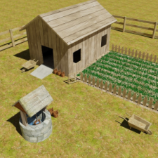
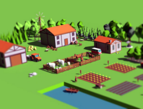
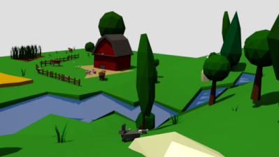
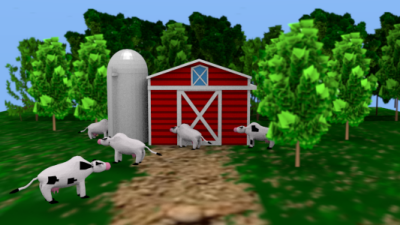

# Trabalho Prático 2 - Gado

Neste trabalho, vamos nos tornar os reis/rainhas do gado e criar, em OpenGL,
um cenário com vaquinhas, bezerros, bois, cavalos
~~e presidentes da república~~ - basta ter quatro patas. Vamos criar uma
cena que tem algo como um estábulo, um espaço cercado e seres vivendo
calmamente (ou não) nesse espaço.

Nosso objetivo é praticar os conceitos de (a) projeção perspectiva,
(b) iluminação dinâmica e sombreamento, (c) modelagem hierárquica, (d)
modelagem e (e) efeitos visuais vistos em sala de aula. E também nos divertir.

Este trabalho pode ser feito em dupla e, como funcionalidade básica,
valendo 70% da nota, deve ter os seguintes itens:

- **Vídeo** curto (30s-60s), que pode ser entregue 1 semana depois
- **Mundo**:
  1. Deve haver um plano representando o chão do mundo
  1. Sobre o chão, devem haver três coisas principais: (a) uma construção
     referente ao estábulo, (b) algo para delimitar a região cercada
     (eg, uma cerquinha) e (c) algumas instâncias de um tipo de animal
     dentro do cercado
     - Esses objetos podem ser desenhados usando composições de sólidos
       GLU e GLUT ou podem ser arquivos `.obj` importados (vide extras)
  1. Além dos objetos principais, devem haver objetos para compor o cenário,
     como árvores, pedregulhos etc.
     - Devem haver pelo menos 02 tipos de objetos diferentes e
       você deve espalhá-los "de maneira harmônica" (não pode ficar um dentro
       do outro etc.)
- **Animais**:
  1. Os animais devem se movimentar de alguma forma - não podem ficar parados
     - Uma ideia simples (mas não muito boa) é fazê-los se movimentarem como
       se fossem a bolinha do jogo Pong: andam em ângulo 45º e quando batem em
       uma parede são refletidos. Outra ideia (melhor) é, de tempos em tempos,
       sortear uma nova direção aleatória para o bichinho se movimentar
     - Eles não devem sair do cercado em sua movimentação - a menos que eles
       saibam saltar =)
     - Não é necessário detectar colisão entre os animais
- **Câmera**:
  1. Você deve usar projeção perspectiva via `glFrustum` ou `gluPerspective`
  1. Devem haver 2 câmeras e o usuário pode alternar entre elas via as teclas
     <kbd>1</kbd> e <kbd>2</kbd>:
     1. Visão de cima, enxergando todos os elementos da fazenda
     1. Visão de terceira pessoa de um boi/vaca/cabrito, posicionada atrás e
        acima de um animal, olhando para sua frente
        - Ao pressionar <kbd>C</kbd>, essa segunda câmera deve alternar entre
          os animais da cena
- **Gráficos**:
  1. Você deve usar o modelo de
     [iluminação do OpenGL, devidamente configurado][lighting]
     - Basta que sua cena tenha 1
       [fonte de luz direcional][lighting-directional] e que todos objetos
       possuam um material associado
    1. Deve ser possível ativar/desativar o modelo de iluminação a partir de uma
       tecla (eg, <kbd>L</kbd>)
    1. Todos (ou a grande maioria) dos objetos devem conter texturas,
       com materiais devidamente configurados

Para se obter o restante dos pontos do trabalho (ou até mesmo mais pontos
extras, até um limite de 125% da pontuação original) funcionalidades adicionais
podem/devem ser implementadas no jogo. Essas funcionalidades serão avaliadas
conforme a **dificuldade da implementação**, o **efeito obtido** com ela no
trabalho e a **qualidade da implementação**. Exemplos de funcionalidades
extras com suas respectivas pontuações **máximas**:

- Relativas ao **Mundo**:
  1. **Relevo usando textura (10%)**: você pode usar uma
     textura em escala de cinza representando o relevo do chão: um ponto branco,
     representa altura 100% e um ponto preto representa altura 0. Esta é uma
     técnica de uso de texturas chamada _height map_. Veja um
     [exemplo de _height map_][height-map] na aula sobre texturas
  1. :bomb: **_Skybox, skyphere ou skydome_ (até 10%)**: se considerarmos
     que nosso mundo está definido dentro de um cubo (_skybox_), podemos
     colocar uma imagem de textura em cada face interna (são 6) que
     represente o horizonte naquela direção. Veja
     [exemplos de texturas de _skyboxes_][skybox] e nossa aula sobre
     [efeitos visuais][visual-fx]. Repare que o cubo do _skybox_ acompanha
     a posição, ou seja, não é possível se aproximar de uma parede, muito
     menos sair do cubo
  1. :bomb: **Modelos no formato .obj (até 10%)**: em vez de usar os
     sólidos da GLU/GLUT, modele um objeto \*simples\* usando um _software_
     CAD, salve-o num formato \*simples\* (_e.g._, `.obj`) e carregue-o no
     seu programa. Há alguns tutoriais disponíveis nas _interwebs_ sobre
     como abrir um arquivo `.obj`, ler a informação sobre os vértices e
     desenhá-los... aqui estão alguns: [tutorial 1][obj-tut-1],
     [tutorial 2][obj-tut-2], [tutorial 3][obj-tut-3]. Também há os exemplos
     do Nate Robins que possuem código para carregar arquivos `.obj`
     - Apenas carregar modelos prontos (6%)
     - Modelar e carregar modelos (10%)
  1. **Fontes de luz pontuais (4%)**: coloque fontes de luz pontuais em
     alguns objetos do cenário (eg, postes, holofotes, _outdoors_ de LED)
  1. **Objetos animados (até 8%)**: crie objetos que têm algum tipo de
     movimentação autônoma (carros, aviões, moinhos)
     - Aqui vale ressaltar que criar cabem algoritmos de inteligência
       artificial para determinação de caminhos dos objetos. Implementações
       mais rebuscadas atingem os 8%
  1. **Mais tipos de objetos (até 8%)**: em vez de compor o cenário com apenas
     03 tipos de objetos, crie uns 7 tipos diferentes (ou seja, +2% por novo
     tipo, limitado a 4 novos tipos)
- Relativas ao **Gráfico**:
  1. :star2: **Dia/noite (até 10%)**: você pode fazer o tempo passar ao longo do dia
     e fazer com que isso reflita na forma como o cenário é renderizado. Isso
     pode ser feito configurando-se a fonte de luz direcional com cores
     diferentes, dependendo da hora do dia, por exemplo
     - Além disso, você pode fazer com que certas coisas só aconteçam de
       dia ou de noite
     - Se tiver um _skybox_, você deve alterá-lo para refletir os horários
       diferentes
  1. :star2: **Neblina (_fog_) (4%)**: funcionalidade acrescentada por
     comando do teclado (<kbd>N</kbd>), podendo ser habilitada e
     desabilitada durante a execução
- Relativas ao **Zeppelin**:  
  1. **Cabine com vidros (5%)**: em vez de "deixar a janela aberta", use
     um material semelhante a um vidro semitransparente para a cabine do
     zeppelin
     - Todo objeto semitransparente precisa ser desenhado por último (ie, ser
       enviado pro _pipeline_ depois dos objetos opacos)
  1. **Faça o zeppelin pousar (6%)**: determine uma região em que o zeppelin
     poderá pousar. Ele deverá estar posicionado logo acima de uma região
     específica - um zeppeliporto - e pousar (com animação para a descida)
     ao pressionar uma tecla
- Relativas à **Câmera**:
  1. **Terceira câmera (5%)**: posicionada dentro da cabine, possibilitando
     uma observação panorâmica da cidade, e que pode ser alterada via
     setinhas do teclado (<kbd>➡️</kbd> e <kbd>⬅️</kbd>), fazendo com que a
     câmera, sem sair de onde está, altere para onde ela está olhando
- Relativas a **Recursos do OpenGL**:
  1. :bomb: **Usar VBOs e VAOs (até 12%)** em vez de `glVertex(...)`: para ter
     um desempenho altíssimo e fazer as coisas do jeito do OpenGL 3+
     - Obs: os sólidos GLU/GLUT usam `glVertex`, logo, são incompatíveis com
       este adicional (você não pode usá-los)
     - A nota é variável de acordo com a variedade do formato dos objetos
  1. :bomb::bomb: **Criar _shaders_ (4%, 6% ou 12%)**: usando GLSL
     (um _vertex_ e um _fragment shader_)
     - Modelo de iluminação de Phong, sombreamento Gouraud (4%)
     - Modelo de iluminação de Phong, sombreamento também (6%)
     - Modelo igual ao anterior, usando textura para _bump_ ou _normal mapping_
       (12%)
- Outros adicionais:
  1. :star: **Música (3%)**: você pode incluir uma música de fundo para
     seu sistema estelar (ou de outra coisa)
  1. **Qualquer outra idéia (??%)** que torne a sua cidade mais interessante ou
     agradável aos sentidos. Essas idéias precisam ser documentadas e
     explicadas no documento de entrega do trabalho (`README.txt`) e no
     formulário de envio de extras implementados

Legenda dos ícones:
  - :star:: item sugerido por ser interessante ou super simplão.
  - :bomb:: item com maior complexidade de implementação - não
    comece por estes!!
  - :bomb::bomb: muitos já trilharam essa rota e não retornaram

## Instruções gerais

O trabalho pode ser feito individualmente ou em duplas e deve ser produzido
integralmente pelos aluno ou dupla. Podem discutir idéias com outros colegas,
mas cada aluno/dupla deve ter a sua implementação independente dos demais.
**Trabalhos muito semelhantes receberão notas muito semelhantes (iguais a 0)**,
independente de quem copiou de quem. Trabalhos semelhantes aos de outras
pessoas (ex-alunos, pessoas na Internet) também receberão nota 0.

## O que faz perder nota

Alguns descuidos podem fazer com que sua nota fique abaixo do esperado:
- Seu trabalho não executa: nota 0
- Cópia de trabalho de outrem: nota 0
- Ausência de qualquer item obrigatório da entrega (descrito na próxima seção)
- Ausência de itens da especificação obrigatória
- Baixa legibilidade do código
- Baixa qualidade da implementação
- Atraso na entrega. Cada dia de atraso reduz o valor máximo de nota da
 maneira abaixo. Considere `x` como dias de atraso e `y` a penalidade
 percentual na nota:

- Isso implica que 1 ou 2 dias de atraso são pouco penalizados
- E após 5 dias de atraso, o trabalho vale 0
- _Seeing is believing_:
  https://www.google.com.br/search?q=y%3D(2%5E(x-2)%2F0.16)%2Cy%3D100

## O que deve ser **entregue**

Deve ser entregue **um arquivo .tar.gz ou .zip** via **Moodle** contendo:
 1. 3+ _screenshots_ de diferentes cenas do seu jogo
 1. Todo o programa fonte, com os _Makefiles_ e bibliotecas necessárias
    para a compilação e execução do programa
 1. O arquivo executável
 1. Um arquivo **README** contendo:
    - Instruções para **compilação e execução**
    - **Lista de itens adicionais** que seu jogo está pleiteando
      (via formulário que será enviados oportunamente)
 1. O link para um vídeo de 30-60s no YouTube mostrando as opções implementadas

Qualquer dúvida, entre em contato comigo. Ou acrescente a sua interpretação no
arquivo README e mãos à obra.

[lighting-directional]: http://fegemo.github.io/cefet-cg/classes/lighting/#37
[obj-tut-1]: http://www.opengl-tutorial.org/beginners-tutorials/tutorial-7-model-loading/
[obj-tut-2]: http://netization.blogspot.in/2014/10/loading-obj-files-in-opengl.html
[obj-tut-3]: https://tutorialsplay.com/opengl/2014/09/17/lesson-9-loading-wavefront-obj-3d-models/
[visual-fx]: http://fegemo.github.io/cefet-cg/classes/visual-effects/#4
[height-map]: http://fegemo.github.io/cefet-cg/classes/textures/#43
[skybox]: https://www.google.com.br/search?q=skybox&safe=off&hl=pt-BR&source=lnms&tbm=isch&sa=X&ei=jMM_VenRNKuasQSCwYDABw&ved=0CAgQ_AUoAg&biw=1366&bih=599
[lighting]: http://fegemo.github.io/cefet-cg/classes/lighting/#26
