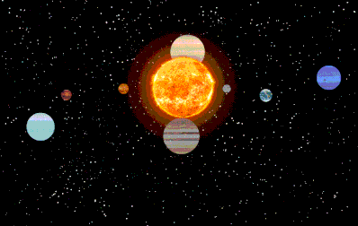
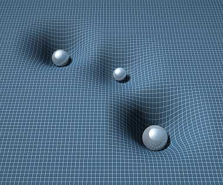

# Trabalho Prático 2 - Sistema Estelar

Neste trabalho, vamos criar um sistema estelar. Ou um modelo atômico. Ou
um aquário em que os peixes girando ao redor dos outros. Nosso objetivo é
praticar os conceitos de projeção perspectiva, iluminação dinâmica,
modelagem hierárquica, sombreamento, modelagem e efeitos visuais
vistos em sala de aula. E também nos divertir.

Esse trabalho pode ser feito em dupla, e como funcionalidade básica,
valendo 70% da nota, deve ter os seguintes itens:

- **Vídeo** curto (30s-60s), que pode ser entregue 1 semana depois
- **Mundo**:
  1. Deve haver objeto no centro (eg, sol) e, ao seu redor, devem
     orbitar outros objetos semelhantes (eg, planetas)
     - Esses objetos podem ser desenhados usando sólidos GLU e GLUT
     - Eles devem possuir uma rotação em torno do seu próprio eixo
  1. Devem haver objetos orbitando os que estão orbitando o principal
     (eg, satélites naturais)
     - Esses objetos devem possuir uma rotação em torno do seu próprio eixo
       também
  1. Todos (ou a grande maioria) dos objetos devem conter texturas,
     com materiais devidamente configurados
  1. Um dos objetos que orbitam os que orbitam (satélites) é especial e
     deve ter uma forma única (eg, um satélite artificial ao redor de
     um planeta)
- **Câmera**:
  1. Você deve usar projeção perspectiva via `glFrustum` ou `gluPerspective`
  1. Devem haver 3 câmeras e o usuário pode alternar entre elas via uma tecla
     (eg, <kbd>c</kbd> ou [<kbd>1</kbd>, <kbd>2</kbd>, <kbd>3</kbd>]):
     1. Visão de cima, enxergando todos os elementos do sistema
     1. Visão "diagonal" e que pode ser alterada via setinhas do teclado
        (<kbd>⬆️</kbd>, <kbd>➡️</kbd>, <kbd>⬇️</kbd>, <kbd>⬅️</kbd>) fazendo
        com que a câmera, sem sair de onde está, altere para onde ela
        está olhando
     1. Câmera na posição logo atrás do objeto especial, olhando para o
        objeto em que ele orbita. Nesse modo, ao pressionar as setinhas
        <kbd>⬆️</kbd> e <kbd>⬇️</kbd> a câmera deve se aproximar do planeta
        ou se afastar (respectivamente)
- **Gráficos**:
  1. Você deve usar o modelo de
     [iluminação do OpenGL, devidamente configurado][lighting]
     - Basta que sua cena tenha 1
       [fonte de luz pontual][lighting-directional] e que todos objetos
       possuam um material
  1. Deve ser possível ativar/desativar o modelo de iluminação a partir de uma
     tecla (no caso de sistema estelar, apenas a estrela iluminaria)
  1. Usar texturas para todos os objetos (ou a grande maioria)

Para se obter o restante dos pontos do trabalho (ou até mesmo mais pontos
extras, até um limite de 125% da pontuação original) funcionalidades adicionais
podem/devem ser implementadas no jogo. Essas funcionalidades serão avaliadas
conforme a **dificuldade da implementação**, o **efeito obtido** com ela no
trabalho e a **qualidade da implementação**. Exemplos de funcionalidades
extras com suas respectivas pontuações **máximas**:

- Relativas ao **Mundo**:
  1. :bomb::bomb: **_Skybox_ (até 10%)**: se considerarmos que nosso mundo
     está definido dentro de um cubo, podemos colocar uma imagem de textura
     em cada face interna (6) que represente o horizonte naquela direção. Veja
     [exemplos de texturas de _skyboxes_][skybox] e nossa aula sobre
     [efeitos visuais][visual-fx]. Repare que o cubo _Skybox_ acompanha
     a posição, ou seja, não é possível se aproximar (muito menos sair) do cubo
  1. **Modo de órbitas visíveis (5%)**: com o pressionar de uma tecla
     (<kbd>o</kbd>), torne possível mostrar/esconder a trajetória de
     todos os elementos orbitantes
  1. :star: **[Plano orbital][plano-orbital] (4%)**: com o pressionar
     de uma tecla (<kbd>p</kbd>), faça mostrar/esconder um plano "infinito"
     que corta o objeto principal (sol) e a maioria dos outros (ou todos)
     bem no meio.
     - Esse plano não deve ter 4 vértices - ele deve ser subdivido em vários
       triângulos (`GL_TRIANGLE_STRIP` fica show)   
     1. :bomb: **Deformação do espaço-tempo (+7%)**: faça o plano apresentar a
        deformação gravitacional no tecido espaço-tempo provocado por objetos
        com grande massa (digamos, a estrela e mais alguns maiores)
        
- Relativas aos **Objetos do sistema**:
  1. :bomb: **Modelos no formato .obj (até 10%)**: em vez de usar os
     sólidos da GLU/GLUT, modele um objeto \*simples\* usando um _software_
     CAD, salve-o num formato \*simples\* (_e.g._, `.obj`) e carregue-o no
     seu programa. Há alguns tutoriais disponíveis nas _interwebs_ sobre
     como abrir um arquivo `.obj`, ler a informação sobre os vértices e
     desenhá-los... aqui estão alguns: [tutorial 1][obj-tut-1],
     [tutorial 2][obj-tut-2], [tutorial 3][obj-tut-3]. Também há os exemplos
     do Nate Robins que possuem código para carregar arquivos `.obj`.
     - Apenas carregar modelos prontos (6%)
     - Modelar e carregar modelos (10%)
  1. **Cinturão de asteróides (3% ou 6%)**: crie o cinturão de asteróides que
     separa os planetas pequenos dos grandes (no caso do Sistema Solar). O
     asteróide não deve ter a mesma forma que os planetas
     - Vários asteróides com pelo menos 3 formatos diferentes (6%)
     - Vários asteróides, mas com mesmo formato (3%)
  1. **Órbitas não circulares (4%)**: crie órbitas elípticas em vez de apenas
     circulares
     1. **Órbitas não-coplanares (+2%)**: faça com que algum(ns) objeto(s)
        tenha(m) órbitas não-coplanares com o plano orbital da maioria
        (eg, Plutão e cometas possuem tais órbitas)
     1. **Cometas com rastros (+8%)**: usando um efeito de partículas, crie
        o rastro que os cometas "deixam para trás" quando se aproximam de
        uma estrela (e esquentam, liberando gases). Falaremos disso na
        aula de [efeitos visuais][visual-fx]
  1. :bomb: **Objetos selecionáveis (8%)**: torne possível que o usuário
     interaja com alguns objetos **usando o mouse**. Por exemplo, faça com
     que o nome do objeto seja escrito na tela quando a pessoa clicar nele.
     Em 3D isso é mais complicado, porque recebemos (x,y) no espaço da janela
     e precisamos convertar para o sistema de coordenadas do mundo e, então,
     verificar se houve colisão. Veja uma maneira usando `gluUnProject(...)`
     e _ray casting_ ([vídeo][3d-picking-video],
     [explicação][3d-picking-explanation])
  1. :moon::star: **Anéis planetários (4%)**: coloque os anéis ao redor dos
     planetas gigantes gasosos (Saturno e Júpiter) e gelados (Urano e Netuno)
  1. :moon: **Atmosferas (4%)**: desenhe o que seria a atmosfera de algum
     planeta. Por exemplo, para a Terra, pode-se desenhar uma esfera com
     a textura que mostra sua superfície, e outra esfera, um pouco maior,
     com alguma transparência, com textura das nuvens
- Relativas à **Câmera**:
  1. **_Tour_ entre os objetos (7%)**: crie uma 4ª câmera que, ao pressionar
     a <kbd>barra de espaço</kbd>, é teletransportada para visualizar apenas
     um corpo celeste, ocupando quase que a tela toda. Apertando
     novamente, deve-se visitar o próximo e daí por diante
     - **Anime o deslocamento da câmera (+4%)** em vez de teletransportá-la
     - Escreva na tela **dados sobre o objeto (+4%)**
- Relativas a **Recursos do OpenGL**:
  1. :bomb: **Usar VBOs e VAOs (até 12%)** em vez de `glVertex(...)`: para ter
     um desempenho altíssimo e fazer as coisas do jeito do OpenGL 3+
     - Obs: os sólidos GLU/GLUT usam `glVertex`, logo, são incompatíveis com
       este adicional (você não pode usá-los)
     - A nota é variável de acordo com a variedade do formato dos objetos
  1. :bomb::bomb: **Criar _shaders_ (4%, 6% ou 10%)**: usando GLSL (um _vertex_ e um
     _fragment shader_)
     - Modelo de iluminação de Phong, sombreamento Gouraud (3%)
     - Modelo de iluminação de Phong, sombreamento também (5%)
     - Modelo igual ao anterior, usando textura para _bump_ ou _normal mapping_
       (10%)
- Outros adicionais:
  1. :star: **Reshape (3%)**: permitir o redimensionamento da janela
     de visualização sem perda da razão de aspecto (sem que haja distorção
     de achatamento/alongamento)
  1. :star: **Música (3%)**: você pode incluir uma música de fundo para
     seu sistema estelar (ou de outra coisa)
  1. :moon: **Fidedignidade (10%)**: em vez de chutar parâmetros de tamanhos,
     distâncias, inclinação etc., use os valores reais
     ([tamanhos relativos no sistema solar][tamanhos-relativos-planetas]).
     Você pode usar como medida, por exemplo, a _unidade astronômica_,
     que é a distância da Terra ao Sol. Daí tudo no seu mundo
     (`glFrustum`, `gluPerspective`) é dado em termos de
     _unidades astronômicas_.
     - Ao fazer o modelo fiel, fica praticamente impossível enxergar
       o sol/planetas/satélites porque eles ficam muito pequenos, dadas
       as distâncias. Então, implemente uma tecla (eg, <kbd>f</kbd>)
       que ativa/desativa um aumento artificial (x10?) em todos os corpos
       celestes para podermos enxergá-los bem
  1. **Qualquer outra idéia (??%)** que torne o sistema mais interessante ou
     agradável aos sentidos. Essas idéias precisam ser documentadas e
     explicadas no documento de entrega do trabalho (`README.txt`) e no
     formulário de envio de extras implementados

Legenda dos ícones:
  - :star:: item sugerido por ser interessante ou super simplão.
  - :bomb:: item com maior complexidade de implementação - não
    comece por estes!!
  - :bomb::bomb: muitos já trilharam essa rota e não retornaram
  - :moon:: apenas para o caso de sistema solar (ou estelar)

## Instruções gerais

O trabalho pode ser feito individualmente ou em duplas e deve ser produzido
integralmente pelos aluno ou dupla. Podem discutir idéias com outros colegas,
mas cada aluno/dupla deve ter a sua implementação independente dos demais.
**Trabalhos muito semelhantes receberão notas muito semelhantes (iguais a 0)**,
independente de quem copiou de quem. Trabalhos semelhantes aos de outras
pessoas (ex-alunos, pessoas na Internet) também receberão nota 0.

## O que faz perder nota

Alguns descuidos podem fazer com que sua nota fique abaixo do esperado:
- Seu trabalho não executa: nota 0
- Cópia de trabalho de outrem: nota 0
- Ausência de qualquer item obrigatório da entrega (descrito na próxima seção)
- Ausência de itens da especificação obrigatória
- Baixa legibilidade do código
- Baixa qualidade da implementação
- Atraso na entrega. Cada dia de atraso reduz o valor máximo de nota da
 maneira abaixo. Considere `x` como dias de atraso e `y` a penalidade
 percentual na nota:

- Isso implica que 1 ou 2 dias de atraso são pouco penalizados
- E após 5 dias de atraso, o trabalho vale 0
- _Seeing is believing_:
  https://www.google.com.br/search?q=y%3D(2%5E(x-2)%2F0.16)%2Cy%3D100

## O que deve ser **entregue**

Deve ser entregue **um arquivo .tar.gz ou .zip** via **Moodle** contendo:
 1. 3+ _screenshots_ de diferentes cenas do seu jogo
 1. Todo o programa fonte, com os _Makefiles_ e bibliotecas necessárias
    para a compilação e execução do programa
 1. O arquivo executável
 1. Um arquivo **README** contendo:
    - Instruções para **compilação e execução**
    - **Lista de itens adicionais** que seu jogo está pleiteando
      (via formulário que será enviados oportunamente)
 1. O link para um vídeo de 30-60s no YouTube mostrando as opções implementadas

Qualquer dúvida, entre em contato comigo. Ou acrescente a sua interpretação no
arquivo README e mãos à obra.

[plano-orbital]: images/plano-orbital.jpg
[tamanhos-relativos-planetas]: http://www.lesud.com/lesud-astronomy_pageid81.html#sat_size
[menu]: http://www.programming-techniques.com/2012/05/glut-tutorial-creating-menus-and.html
[skybox]: https://www.google.com.br/search?q=skybox&safe=off&hl=pt-BR&source=lnms&tbm=isch&sa=X&ei=jMM_VenRNKuasQSCwYDABw&ved=0CAgQ_AUoAg&biw=1366&bih=599
[lighting]: http://fegemo.github.io/cefet-cg/classes/lighting/#26
[lighting-directional]: http://fegemo.github.io/cefet-cg/classes/lighting/#37
[obj-tut-1]: http://www.opengl-tutorial.org/beginners-tutorials/tutorial-7-model-loading/
[obj-tut-2]: http://netization.blogspot.in/2014/10/loading-obj-files-in-opengl.html
[obj-tut-3]: https://tutorialsplay.com/opengl/2014/09/17/lesson-9-loading-wavefront-obj-3d-models/
[visual-fx]: http://fegemo.github.io/cefet-cg/classes/visual-effects/#4
[height-map]: http://fegemo.github.io/cefet-cg/classes/textures/#43
[3d-picking-video]: https://www.youtube.com/watch?v=XygAhqJlGPI
[3d-picking-explanation]: https://www.bfilipek.com/2012/06/select-mouse-opengl.html
