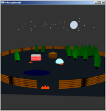
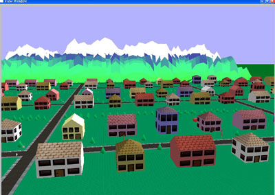
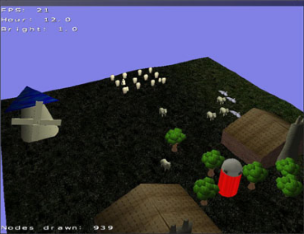

# Trabalho Prático 2 - Townsville

Neste trabalho, vamos criar uma pequena vila chamada _Townsville_. Nosso
objetivo é praticar os conceitos de projeção, iluminação, modelagem e
efeitos visuais vistos em sala de aula. E também nos divertir.

Esse trabalho pode ser feito individualmente, ou em dupla, ou em trio, e
como funcionalidade básica, valendo 85%, 70% ou 60% (respectivamente) da
nota, deve ter os seguintes itens:

- **Mundo**:
  1. Deve haver um mundo definido razoavelmente grande, com um "chão" que pode ser modelado por um plano horizontal.
    - No centro do mundo, deve haver um **moinho a vento**, modelado de forma
      hierárquica, com animação de rotação de suas pás (com o vento passando).
      Repare na 3a. imagem que o moinho pode ser feito usando-se apenas os
      sólidos da GLU e GLUT (cone, pirâmide e cubo).
    - Deve haver um outro tipo de objeto, com instâncias espalhadas pelo
      cenário (como árvores). Também é possível usar apenas GLU e GLUT para
      árvores (cilindros+cones, cone+esferas).
- **Câmera**:
  1. Você deve usar projeção perspectiva via `glFrustum` ou `gluPerspective`.
  1. O controle da câmera pode ser feito de uma das duas formas a seguir:
    - _First-person_ modificado: o teclado (`w,a,s,d`) faz ir pra frente (`w`), trás (`s`), girar poucos graus à esquerda (`a`), girar à direita (`d`).
    - Aérea (tipo helicóptero): posicionada mais acima, olhando sempre
      para o centro do mundo com interação via teclado (`w,a,s,d`). As teclas
      (`w,s`) aumentam ou diminuem distancia da câmera até o centro do mundo
      (_zoom_) e (`s,d`) fazem a câmera girar, concentricamente em relação à
      origem do mundo, para direita ou esquerda (pense num helicóptero
      girando para ver todos os lados de uma casa).
- **Gráficos**:
  1. Você deve usar o modelo de [iluminação do OpenGL, devidamente configurado][lighting].
    - Basta que sua cena tenha 1 [fonte de luz direcional][lighting-directional].
  1. Pelo menos 1 objeto da cena (moinho, árvores) deve ter um material
     com textura.

Para se obter o restante dos pontos do trabalho (ou até mesmo mais pontos
extras, até um limite de 133% da pontuação original) funcionalidades adicionais
podem/devem ser implementadas no jogo. Essas funcionalidades serão avaliadas
conforme a **dificuldade da implementação**, o **efeito obtido** com ela no
trabalho e a **qualidade da implementação**. Exemplos de funcionalidades
extras com suas respectivas pontuações **máximas**:

- Relativas aos **Objetos**:
  1. :star2: **Vários tipos (até 10%)**: em vez de apenas um tipo (_e.g._,
    árvore), pode ter vários outros: casa 1 andar, 2 andares, prédio, celeiro, silo, iglu (?!), pinheiros, árvores redondinhas, ovelhas etc.
  1. **Distribuídos de forma procedural (até 7%)**: em vez de determinar a
    posição de cada objeto você mesmo, crie uma função que o faça de forma
    aleatória ou pseudo-aleatória. Se optar por distribuição aleatória,
    deve tomar cuidado para não colocar objetos "um-den-do-outro". Veja este
    [_post_ do fórum][obj-distribution] e os links nele sobre o assunto.
  1. **Cenário descrito em arquivo (até 5%)**: em vez de instanciar os
    objetos de forma _hard-coded_, crie um arquivo num formato proposto
    por você mesmo (_e.g._, `objetos-fazenda.tp2`) que descreve quantos, que
    tipos, as posições e as orientações (rotação em Y) dos objetos.
  1. :collision: **Modelos no formato .obj (até 10%)**: em vez de usar os
    sólidos da GLU/GLUT, modele um objeto \*simples\* usando um _software_
    CAD, salve-o num formato \*simples\* (_e.g._, `.obj`) e carregue-o no
    seu programa. Há alguns tutoriais disponíveis nas _interwebs_ sobre
    como abrir um arquivo `.obj`, ler a informação sobre os vértices e
    desenhá-los... aqui estão alguns: [tutorial 1][obj-tut-1],
    [tutorial 2][obj-tut-2], [tutorial 3][obj-tut-3].
- Relativas ao **Terreno** (chão):
  1. O chão **subdividido (5%)**: montado a partir de muitos triângulos, em
    vez de apenas um retangulão. A pressionar a tecla `f`, o chão deve
    passar de colorido a modelo de arames (_wireframes_), sendo possível
    ver a subdivisão que foi feita.
  1. :star2: **Texturizado (5%)**: o chão pode ter uma ou mais texturas
    aplicados sobre ele para aumentar o nível de detalhes.
  1. :collision: **Relevo usando textura (10%)**: você pode usar uma
    textura em escala de cinza representando o relevo do chão: um ponto branco,
    representa altura 100% e um ponto preto representa altura 0. Esta é uma
    técnica de uso de texturas chamada _height map_. Veja um
    [exemplo de _height map_][height-map] na aula sobre texturas.
- Relativas a **Navegação**:
  1. :star2: Implementar **as duas câmeras (5%):** e usar a tecla `c` ou
    então `1` e `2` para alternar entre elas.
  1. Câmera **_first-person_ tradicional (até 7%)**: em vez das teclas
    (`a,d`) girarem a câmera, elas vão fazê-la andar de lado. E a posição do
    mouse deve ser usada para alterar para onde a câmera está olhando. Esta é
    a câmera padrão de jogos em primeira pessoa.
  1. **_Head bobbing_ (até 5%)** na câmera _first-person_: ao mover a câmera,
    em vez de deixar sua coordenada Z intacta, aplique uma função matemática,
    cíclica (_e.g._, `sin(t)`, `cos(t)`, [`abs(sin(t))`][bob-abs-sin]) para
    variá-lo e ter a sensação de que é uma pessoa andandando que está segurando a câmera.
  1. **Colisão com objetos (até 7%)**: faça sua câmera _first-person_ evitar
    entrar dentro dos objetos da cena fazendo verificações de colisão com
    eles. Para efeitos dessa verficação, você pode simplificar e fingir que
    cada objeto é apenas um cilindro (que o contém) e impedir que a câmera
    "entre" nesse cilindro.
- Relativas a **Gráficos**:
  1. Fonte de **luz pontual (5%)**: além da fonte luminosa direcional, crie uma
    ou mais fontes de luz pontuais em pontos estratégicos.
  1. :star2: **Neblina (_fog_) (5%)**: funcionalidade acrescentada por
    comando do teclado (`n`), podendo ser habilitada e desabilitada durante
    a execução.
  1. :star2: **Reshape (5%)**: permitir o redimensionamento da janela
    de visualização sem perda da razão de aspecto (sem que haja distorção
    de achatamento/alongamento)
  1. :collision: **_Skybox_ (até 7%)**: se considerarmos que nosso mundo
    está definido dentro de um cubo, podemos colocar uma imagem de textura
    em cada face interna (6) que represente o horizonte naquela direção. Veja
    [exemplos de texturas de _skyboxes_][skybox] e nossa aula sobre
    [efeitos visuais][visual-fx]. Repare que o cubo _Skybox_ acompanha
    a posição, ou seja, não é possível se aproximar (e até sair) do cubo.
  1. **Dia/noite (até 10%)**: você pode fazer o tempo passar ao longo do dia
    e fazer com que isso reflita na forma como a vila é renderizada. Isto pode
    ser feito configurando-se a fonte de luz direcional com cores diferentes,
    dependendo da hora do dia, por exemplo. Além disso, você pode fazer com
    que certas coisas só aconteçam de dia ou de noite. Se tiver um _skybox_,
    pode alterá-lo para os horários diferentes e por aí vai.
- Outros adicionais:
  1. **Outro tema (0%)**: você pode usar uma temática diferente da vila com
    um moinho no centro. Contudo, o objeto central deve ser algo  
    modelado de forma hierárquica, como, por exemplo, um prédio que tem um
    relógio analógico, uma roda gigante (esta é mais difícil!). Além disso,
    esse objeto deve ter uma animação (_e.g._, girando com o vento,
    passando a hora, girando as cadeirinhas).
  1. :star2: **Música (até 3%)**: você pode incluir ambientação sonora para
    sua vila.
  1. **Qualquer outra idéia (??%)** que torne a vila mais interessante ou
     agradável aos sentidos. Essas idéias precisam ser documentadas e explicadas no documento de entrega do trabalho (`README.txt`).

Legenda dos ícones:
  - :star2:: item sugerido por ser interessante ou super simplão.
  - :collision:: item com maior complexidade de implementação - não
    comece por estes!!

## Instruções gerais

O trabalho pode ser feito individualmente ou em duplas e deve ser produzido
integralmente pelos aluno ou dupla. Podem discutir idéias com outros colegas,
mas cada aluno/dupla deve ter a sua implementação independente dos demais.
**Trabalhos muito semelhantes receberão notas muito semelhantes (iguais a 0)**,
independente de quem copiou de quem. Trabalhos semelhantes aos de outras
pessoas (ex-alunos, pessoas na Internet) também receberão nota 0.

## O que faz perder nota

Alguns descuidos podem fazer com que sua nota fique abaixo do esperado:
- Seu trabalho não executa: nota 0
- Cópia de trabalho de outrem: nota 0
- Ausência de qualquer item obrigatório da entrega (descrito na próxima seção)
- Ausência de itens da especificação obrigatória
- Baixa legibilidade do código
- Baixa qualidade da implementação
- Atraso na entrega. Cada dia de atraso reduz o valor máximo de nota da
 maneira abaixo. Considere `x` como dias de atraso e `y` a penalidade
 percentual na nota:

 
 - Isso implica que 1 ou 2 dias de atraso são pouco penalizados
 - E após 5 dias de atraso, o trabalho vale 0
 - _Seeing is believing_: https://www.google.com.br/search?q=y%3D(2%5E(x-2)%2F0.16)%2Cy%3D100

## O que deve ser **entregue**

Deve ser entregue **um arquivo .tar.gz ou .zip** via **Moodle** contendo:
 1. 3+ _screenshots_ de diferentes cenas do seu jogo
 1. Todo o programa fonte, com os _Makefiles_ e bibliotecas necessárias
    para a compilação e execução do programa
 1. O arquivo executável
 1. Um arquivo **README** contendo:
    - Instruções para **compilação e execução**
    - **Lista de itens adicionais** que seu jogo está pleiteando
 1. [opcional, +3%] O link para um vídeo breve (_e.g._, youtube) do
    seu jogo mostrando as opções implementadas.

Qualquer dúvida, entre em contato comigo. Ou acrescente a sua interpretação no
arquivo README e mãos à obra.

[skybox]: https://www.google.com.br/search?q=skybox&safe=off&hl=pt-BR&source=lnms&tbm=isch&sa=X&ei=jMM_VenRNKuasQSCwYDABw&ved=0CAgQ_AUoAg&biw=1366&bih=599
[lighting]: http://fegemo.github.io/cefet-cg/classes/lighting/#26
[lighting-directional]: http://fegemo.github.io/cefet-cg/classes/lighting/#37
[obj-tut-1]: http://www.opengl-tutorial.org/beginners-tutorials/tutorial-7-model-loading/
[obj-tut-2]: http://netization.blogspot.in/2014/10/loading-obj-files-in-opengl.html
[obj-tut-3]: https://tutorialsplay.com/opengl/2014/09/17/lesson-9-loading-wavefront-obj-3d-models/
[obj-distribution]: http://moodle.cefetmg.br/mod/forum/discuss.php?d=3572
[visual-fx]: http://fegemo.github.io/cefet-cg/classes/visual-effects/#4
[height-map]: http://fegemo.github.io/cefet-cg/classes/textures/#43
[bob-abs-sin]: http://www.wolframalpha.com/input/?i=abs%28sin%28x%29%29
