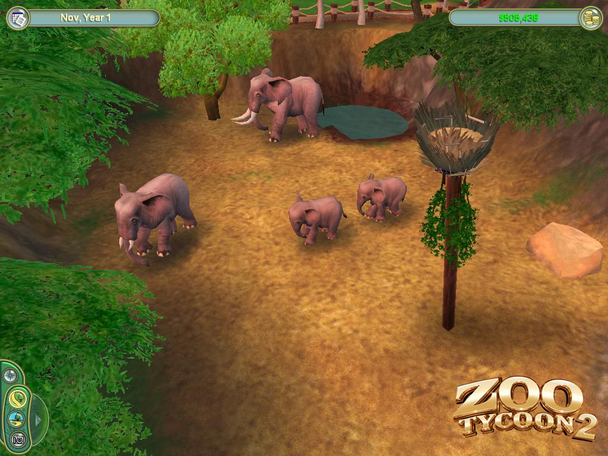

# Trabalho Prático 2 - Zoo

>"Um senhor vai visitar o Jardim Zoológico e para diante de uma jaula.
>Lá dentro está um tigre e uma ovelha. Surpreendido, pergunta ao tratador:  
>- Como é possível que estes dois animais consigam ficar juntos?
>Explica o tratador:  
>- É muito simples: todas as manhãs substituímos a ovelha!"

Neste trabalho, vamos criar um maravilhoso zoológico!  
Nosso objetivo é praticar os conceitos de projeção perspectiva,
iluminação dinâmica, modelagem hierárquica, sombreamento, modelagem e
efeitos visuais vistos em sala de aula. E também nos divertir.

Esse trabalho pode ser feito em dupla, e como funcionalidade básica,
valendo 75% da nota, deve ter os seguintes itens:

- **Vídeo** curto (30s-60s), que pode ser entregue 1 semana depois
- **Mundo**:
  1. Deve haver um plano e sobre ele os objetos que formarão o cenário
     (eg, árvores, decorações, lanchonetes).
     - Esses objetos podem ser desenhados usando sólidos GLU e GLUT ou
       podem ser arquivos `.obj` importados.
     - Deve haver pelo 05 tipos de objetos diferentes compondo o cenário e
       você deve espalhá-los "de maneira harmônica".
  1. Deve haver ao menos 02 espécies diferentes de animais em seu zoológico,
     eles devem ser capazes de:
     - Se movimentar
       - O animal deve sempre "olhar" no sentido em que está se movimentando.
       - Não precisa de animação - vale ponto extra se fizer.
     - Colidir com "paredes"
       - A movimentação mais simples possível é equivalente à da bola do jogo
         Pong: bateu na parede, muda de direção (45º).
- **Câmera**:
  1. Você deve usar projeção perspectiva via `glFrustum` ou `gluPerspective`
  1. Devem haver 2 câmeras e o usuário pode alternar entre elas via as teclas
     <kbd>1</kbd> e <kbd>2</kbd>:
     1. Visão de cima, enxergando os elementos do zoológico,
        controlada pelo teclado.
     2. Visão de um animal específico, apertar as setinhas do teclado deve
        alternar entre os diferentes animais, a câmera deve seguir o animal
        quando ele se movimentar, alterando sua posição e seu alvo.
- **Gráficos**:
  1. Você deve usar o modelo de
     [iluminação do OpenGL, devidamente configurado][lighting]
     - Basta que sua cena tenha 1
       [fonte de luz direcional][lighting-directional] e que todos objetos
       possuam um material associado
    1. Deve ser possível ativar/desativar o modelo de iluminação a partir de uma
       tecla (eg, <kbd>L</kbd>)
    1. Todos (ou a grande maioria) dos objetos devem conter texturas,
       com materiais devidamente configurados. Se não quiser usar textura,
       pode fazer [_low-poly_ bunitão][equilinox].

Para se obter o restante dos pontos do trabalho (ou até mesmo mais pontos
extras, até um limite de 125% da pontuação original) funcionalidades adicionais
podem/devem ser implementadas no jogo. Essas funcionalidades serão avaliadas
conforme a **dificuldade da implementação**, o **efeito obtido** com ela no
trabalho e a **qualidade da implementação**. Exemplos de funcionalidades
extras com suas respectivas pontuações **máximas**:

- Relativas ao **Mundo**:
  1. **Texturas no chão (4%)**: representando as áreas verdes e
     aquelas que representam caminhos dos visitantes.
  1. **Relevo usando textura (10%)**: você pode usar uma
     textura em escala de cinza representando o relevo do chão: um ponto branco,
     representa altura 100% e um ponto preto representa altura 0. Esta é uma
     técnica de uso de texturas chamada _height map_. Veja um
     [exemplo de _height map_][height-map] na aula sobre texturas
  1. :bomb: **_Skybox, skyphere ou skydome_ (até 10%)**: se considerarmos
     que nosso mundo está definido dentro de um cubo (_skybox_), podemos
     colocar uma imagem de textura em cada face interna (são 6) que
     represente o horizonte naquela direção. Veja
     [exemplos de texturas de _skyboxes_][skybox] e nossa aula sobre
     [efeitos visuais][visual-fx]. Repare que o cubo do _skybox_ acompanha
     a posição, ou seja, não é possível se aproximar de uma parede, muito
     menos sair do cubo.
  1. :bomb: **Modelos no formato .obj (até 10%)**: em vez de usar os
     sólidos da GLU/GLUT, modele um objeto \*simples\* usando um _software_
     CAD, salve-o num formato \*simples\* (_e.g._, `.obj`) e carregue-o no
     seu programa. Há alguns tutoriais disponíveis nas _interwebs_ sobre
     como abrir um arquivo `.obj`, ler a informação sobre os vértices e
     desenhá-los... aqui estão alguns: [tutorial 1][obj-tut-1],
     [tutorial 2][obj-tut-2], [tutorial 3][obj-tut-3]. Também há os exemplos
     do Nate Robins que possuem código para carregar arquivos `.obj`.
     - Apenas carregar modelos prontos (6%)
     - Modelar e carregar modelos (10%)
  1. :bomb: **Objetos animados (até 10%)**: crie objetos que têm algum tipo de
     movimentação autônoma (carros, aviões, moinhos)
     - Aqui vale ressaltar que criar cabem algoritmos de inteligência
       artificial para determinação de caminhos dos objetos. Implementações
       mais rebuscadas atingem os 10%.
  1. **Mais tipos de objetos (até 8%)**: em vez de compor o cenário com apenas
     05 tipos de objetos, crie uns 09 tipos diferentes (ou seja, +2% por novo
     tipo, limitado a 4 novos tipos).
  1. **Visitantes (até 8%)**: faça pessoas visitarem o zoológico, elas não
     precisam se movimentar, podemos considerar que estão paradas.
- Relativas aos **Animais**:
  1. **Animação de andar (até 10%)**: faça os animais mexerem as perninhas
     (ou corpinhos, no caso de répteis e peixes) ao andar.
     - Observações: modelos .obj não possuem informações sobre animação -
       tem apenas a posição de cada vértice. Se estiver usando tais modelos,
       você pode dividir os vértices das pernas do restante do corpo para que
       possa animar os pedaços separadamente. O jeito corretíssimo de
       fazer isso é usando outros formatos, como o .fbx (que possui
       informação de animações), mas isso é bastante :bomb:.
  1. :star: **Filhotinhos (até 6%)**: ao invés de utilizar o mesmo modelo
     para todos os animais da mesma espécie, crie variações para diferenciar
     animais adultos e filhotes, ou machos e fêmeas.
       - Variações de tamanho apenas (3%)
       - Variações de tamanhos e machos/fêmeas (6%)
     - **Acasalamento e prole (+6%)**: faça com que animais machos e fêmeas
       possam se acasalar e gerar filhotinhos. Não precisa mostrar o ato
       libidinoso, apenas alguma indicação de que está acasalando já está
       legal (um balãozinho de ❤️?).
  1. **Comportamentos diferentes (até 10%)**: em vez de estar sempre andando,
     faça o animal ficar parado, andar, comer, dormir, fazendo ~~Bolsonaro~~
     cocô. Você pode modelar cada ação do animal como um estado em uma máquina
     de estados e as transições de um estado para outro podem ser aleatórias.
  1. :star: **Movimentação mais esperta (5%)**: em vez de andar e ricochetear
     nas "paredes", faça o animal escolher uma posição aleatória e se movimentar
     até lá. Assim que ele chegar no destino, ele escolhe uma nova posição.
  1. **Criadouros personalizados (5%)**: cada animal possui um habitat
     específico, respeitar essa condição é muito importante, crie criadouros que
     reflitam o habitat natural de cada espécie.
     - **Habitat aquático (+5%)**: desenhe um laguinho cuja superfície é
       semitransparente e levemente ondulada. Usar uma animação da textura da
       água pode deixá-la mais realista também.
- Relativas ao **Gráfico**:
  1. :star2: **Dia/noite (até 10%)**: você pode fazer o tempo passar
     ao longo do dia e fazer com que isso reflita na forma como o cenário é
     renderizado. Isso pode ser feito configurando-se a fonte de luz
     direcional com cores diferentes, dependendo da hora do dia, por exemplo.
     - Além disso, você pode fazer com que certas coisas só aconteçam de
       dia ou de noite.
     - Se tiver um _skybox_, você deve alterá-lo para refletir os horários
       diferentes
  1. **Fontes de luz pontuais (4%)**: coloque fontes de luz pontuais em
     alguns objetos do cenário (eg, postes, holofotes, _outdoors_ de LED)
  1. :star2: **Neblina (_fog_) (4%)**: funcionalidade acrescentada por
     comando do teclado (<kbd>N</kbd>), podendo ser habilitada e
     desabilitada durante a execução
- Relativas à **Câmera**:
  1. **Terceira câmera (5%)**: crie uma nova câmera que dê a visão em primeira
     pessoa do animal, de forma que seja possível posicionar a visão para onde
     o usuário quiser.  
     - *dikentinha:* você pode usar
       [coordenadas esféricas][esfericas] para rotacionar a câmera.
- Relativas a **Recursos do OpenGL**:
  1. :bomb: **Usar VBOs e VAOs (até 12%)** em vez de `glVertex(...)`: para ter
     um desempenho altíssimo e fazer as coisas do jeito do OpenGL 3+
     - Obs: os sólidos GLU/GLUT usam `glVertex`, logo, são incompatíveis com
       este adicional (você não pode usá-los)
     - A nota é variável de acordo com a variedade do formato dos objetos
  1. :bomb::bomb: **Criar _shaders_ (4%, 6% ou 12%)**: usando GLSL
     (um _vertex_ e um _fragment shader_)
     - Modelo de iluminação de Phong, sombreamento Gouraud (4%)
     - Modelo de iluminação de Phong, sombreamento também (6%)
     - Modelo igual ao anterior, usando textura para _bump_ ou _normal mapping_
       (12%)
- Outros adicionais:
  1. :star: **Música (3%)**: você pode incluir uma música de fundo para
     seu zoológico, fiquei sabendo que ajuda a atrair visitantes.
  1. **Qualquer outra idéia (??%)** que torne o seu zoológico mais
     interessante ou agradável aos visitantes. Essas idéias precisam ser
     documentadas e explicadas no documento de entrega do trabalho
     (`README.txt`) e no formulário de envio de extras implementados.

Legenda dos ícones:
  - :star:: item sugerido por ser interessante ou super simplão.
  - :bomb:: item com maior complexidade de implementação - não
    comece por estes!!
  - :bomb::bomb: muitos já trilharam essa rota e não retornaram.

## Instruções gerais

O trabalho pode ser feito individualmente ou em duplas e deve ser produzido
integralmente pelos aluno ou dupla. Podem discutir idéias com outros colegas,
mas cada aluno/dupla deve ter a sua implementação independente dos demais.
**Trabalhos muito semelhantes receberão notas muito semelhantes (iguais a 0)**,
independente de quem copiou de quem. Trabalhos semelhantes aos de outras
pessoas (ex-alunos, pessoas na Internet) também receberão nota 0.

## O que faz perder nota

Alguns descuidos podem fazer com que sua nota fique abaixo do esperado:
- Seu trabalho não executa: nota 0
- Cópia de trabalho de outrem: nota 0
- Ausência de qualquer item obrigatório da entrega (descrito na próxima seção)
- Ausência de itens da especificação obrigatória
- Baixa legibilidade do código
- Baixa qualidade da implementação
- Atraso na entrega. Cada dia de atraso reduz o valor máximo de nota da
 maneira abaixo. Considere `x` como dias de atraso e `y` a penalidade
 percentual na nota:

- Isso implica que 1 ou 2 dias de atraso são pouco penalizados
- E após 5 dias de atraso, o trabalho vale 0
- _Seeing is believing_:
  https://www.google.com.br/search?q=y%3D(2%5E(x-2)%2F0.16)%2Cy%3D100

## O que deve ser **entregue**

Deve ser entregue **um arquivo .tar.gz ou .zip** via **Moodle** contendo:
 1. 3+ _screenshots_ de diferentes cenas do seu jogo
 1. Todo o programa fonte, com os _Makefiles_ e bibliotecas necessárias
    para a compilação e execução do programa
 1. O arquivo executável
 1. Um arquivo **README** contendo:
    - Instruções para **compilação e execução**
    - **Lista de itens adicionais** que seu jogo está pleiteando
      (via formulário que será enviados oportunamente)
 1. O link para um vídeo de 30-60s no YouTube mostrando as opções implementadas

Qualquer dúvida, entre em contato comigo. Ou acrescente a sua interpretação no
arquivo README e mãos à obra.

[equilinox]: https://vignette.wikia.nocookie.net/equilinox/images/b/b4/Equilinox_01.jpg/revision/latest?cb=20180319170603
[lighting-directional]: http://fegemo.github.io/cefet-cg/classes/lighting/#37
[obj-tut-1]: http://www.opengl-tutorial.org/beginners-tutorials/tutorial-7-model-loading/
[obj-tut-2]: http://netization.blogspot.in/2014/10/loading-obj-files-in-opengl.html
[obj-tut-3]: https://tutorialsplay.com/opengl/2014/09/17/lesson-9-loading-wavefront-obj-3d-models/
[visual-fx]: http://fegemo.github.io/cefet-cg/classes/visual-effects/#4
[height-map]: http://fegemo.github.io/cefet-cg/classes/textures/#43
[skybox]: https://www.google.com.br/search?q=skybox&safe=off&hl=pt-BR&source=lnms&tbm=isch&sa=X&ei=jMM_VenRNKuasQSCwYDABw&ved=0CAgQ_AUoAg&biw=1366&bih=599
[lighting]: http://fegemo.github.io/cefet-cg/classes/lighting/#26
[esfericas]: (https://upload.wikimedia.org/wikipedia/commons/f/f1/Coordenadas_esf%C3%A9ricas_figura.svg
