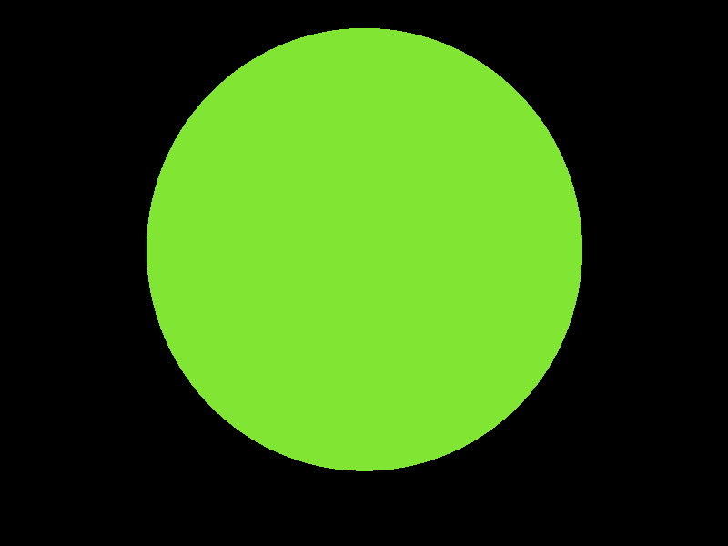
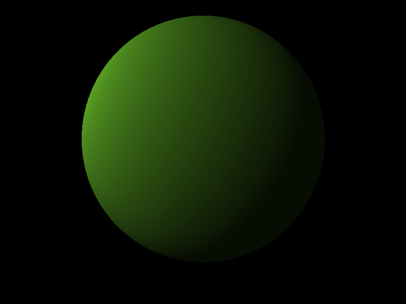
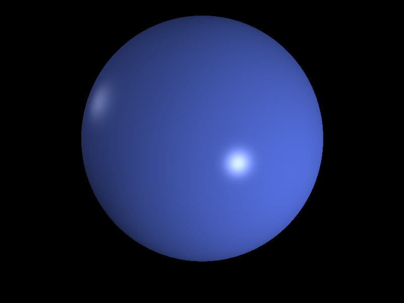
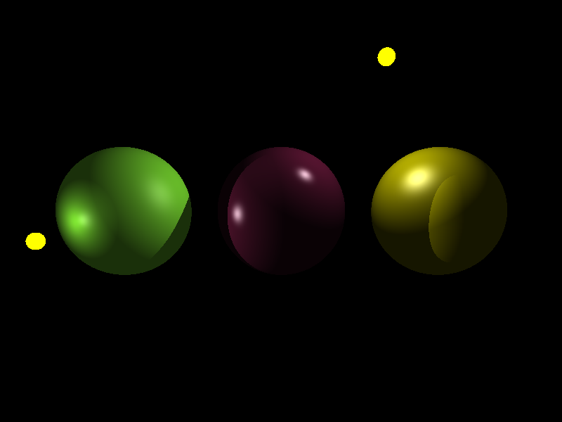

# Trabalho Prático 3 - _Ray Tracer_

Neste trabalho, vamos completar a implementação de um _ray tracer_ para
compreendermos legalzão como funciona um modelo de iluminação global. Ele deve
ser feito em duplas (tipicamente a mesma dos outros trabalhos).

A implementação está dividida nas duas partes descritas a seguir. **Vocês <u>precisam da primeira parte feita</u> para fazer a segunda.**

## Parte 1: Cálculo de **colisão entre raio e esfera**

Faça _download_ do [código seminal do _ray tracer_](http://moodle.cefetmg.br/file.php/292/raytracer-colisao.zip).
Nesta parte, você deve fazer três exercícios:

1. Instalar e se familiarizar com o código fonte do "esqueleto" de um
  _ray tracer_ em C++ ou Java (_choose your destiny_) (30 min)
2. Alterar a cor do fundo da tela para preto (10 min)
3. Implementar a interseção de raio com esfera (60 min)

Você deve entregar no Moodle um **arquivo compactado contendo seu código fonte**.
O valor da primeira parte é de **(7 pontos)** e ela deve ser entregue preferencialmente
em sala, mas a atividade permanecerá **aberta até imediatamente <u>antes da próxima
aula</u> da matéria**.

Saída inicial do programa para cena-simples.txt.

Saída desejada para cena-simples.txt.

## Parte 2: **Colorindo** os pixels com o sombreamento de Phong-_ish_

Nesta parte, vocês implementarão o modelo de iluminação e sombreamento bem semelhante ao de Phong.
Você pode usar o código pronto da primeira parte, ou [baixar o do professor aqui](http://moodle.cefetmg.br/mod/resource/view.php?id=15443).
Acompanhe a apostila do Professor David Mount.
Você vai precisar especialmente das páginas 82 (últimas linhas) e 83.

Além delas, você pode querer visualizar as derivações dos vetores (normal, reflexão, visualização etc.) usados no modelo de Phong. Você vai encontrar essas informações na aula 14 da apostila (páginas 62 até 66).

Considere as cenas descritas pelos arquivos `cena-simples.txt` e `cena-2-fontes-luz.txt`. A saída do seu programa para cada cena deve ser igual às imagens a seguir, na mesma ordem com que os arquivos foram apresentados:

### Extras

Se seu trabalho estiver gerando uma imagem semelhante à imagem a seguir quando usado para renderizar a cena descrita em `cena-3-esferas.txt`, você terá o adicional de **1 ponto extra**.

Na entrega do seu trabalho, **você <u>deve declarar que está pleiteando este item extra</u>** (em um arquivo README.txt no seu código fonte). Caso isso não seja feito no ato da entrega, não adianta pedir pra avaliar depois.

### Entrega

Você deve entregar no Moodle um **arquivo compactado contendo seu código fonte**.
O valor da segunda parte é de **(8 pontos)** e ela deve ser entregue preferencialmente
em sala, mas a atividade permanecerá **aberta até imediatamente <u>antes da próxima
aula</u> da matéria**.
