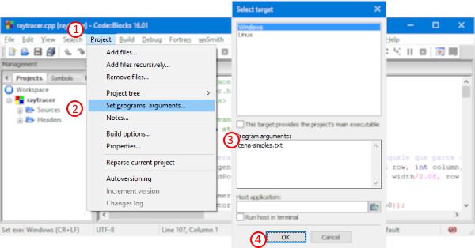
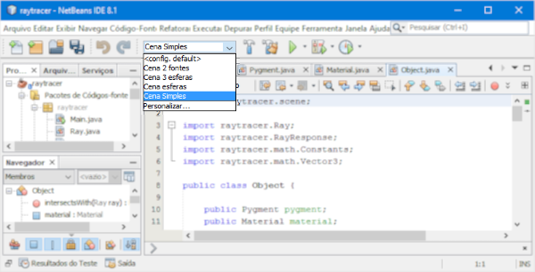

# Trabalho Prático 3 - _Ray Tracer_


Neste trabalho, vamos completar a implementação de um _ray tracer_ simples, que pode se tornar recursivo ou até distribuído, para
compreendermos bem como funciona um modelo de iluminação global. Ele pode
ser feito em duplas.

A implementação está dividida nas duas partes descritas a seguir.
**Vocês <u>precisam da primeira parte feita</u> para fazer a segunda.** Cada parte do trabalho vale a metade da pontuação.

Após ler este enunciado geral do TP3, **leia também o enunciado** da [primeira parte (colisão)][enunciado-colisao] ou da
[segunda parte (sombreamento)][enunciado-sombreamento].

[enunciado-colisao]: collision/README.md
[enunciado-sombreamento]: shading/README.md

## Funcionamento do Programa

O nosso _ray tracer_ é um programa que recebe, como entrada, um arquivo que descreve uma cena tridimensional e produz, como saída, um arquivo de imagem com a cena renderizada.


O programa abre o arquivo de entrada que lhe é passado como primeiro argumento em linha de comando e gera uma imagem no mesmo diretório do arquivo de entrada, com o mesmo nome.

A cena é descrita em um arquivo de texto simples e contém informações sobre (a) a configuração da câmera, (b) as fontes de luz, (c) os pigmentos (as "tintas"), (d) os materiais e, por último, (e) os objetos.


O código para carregar o arquivo de entrada nesse formato e também o código para gerar uma imagem nos formatos bmp, ppm e png já está escrito e funcionando.

Para a descrição da cena, o que é relevante para o trabalho é:

- Posição da **câmera**:

  ```java
  Vector3 posicaoCamera = scene.camera.eye;
  ```
- Posição, cor e atenuação das **fontes de luz**:

  ```java
  Light luz = scene.lights.get(0);
  Vector3 posicaoDaLuz = luz.position;
  Vector3 corDaLuz = luz.color;
  double atenuacaoConstante = luz.constantAttenuation;
  double atenuacaoLinear = luz.linearAttenuation;
  double atenuacaoQuadratica = luz.quadraticAttenuation;
  ```
- Cor dos **pigmentos**:

  ```java
  Pygment pigmento = objetoAtingido.pygment;
  Vector3 corDoPigmento = pigmento.getColorAt(pontoDeIntersecao);
  ```
- Coeficientes (de Phong) dos **materiais**:

  ```java
  Material material = objetoAtingido.material;
  double coeficienteAmbiente = material.ambientCoefficient;
  double coeficienteDifuso = material.diffuseCoefficient;
  double coeficienteEspecular = material.specularCoefficient;
  double expoenteEspecular = material.specularExponent;
  ```
- Posição, raio, pigmento e material das **esferas** (classe `Object`):

  ```java
  Vector3 posicaoDaEsfera = esfera.center;
  double raioDaEsfera = esfera.radius;
  Pygment pigmento = esfera.pygment;
  Material material = esfera.material;
  ```

## Entradas para Teste

Há 7 arquivos de entrada disponibilizados para teste:

| Cena                    | Descrição                                                                                         | Primitivas                                  | Sombras? |     Recursivo?     | Objetivo                                   |
|-------------------------|---------------------------------------------------------------------------------------------------|---------------------------------------------|:--------:|:------------------:|--------------------------------------------|
| `cena-simples.txt`      | Uma fonte de luz e uma esfera verde no centro da cena.                                            | Esfera                                      |    Não   |         Não        |       |
| `cena-primitivas.txt`   | Uma fonte de luz e uma de cada primitiva geométrica suportada.                                    | Esfera, Plano, Círculo, Cilindro, Triângulo |    Sim   |         Não        |    |
| `cena-2-fontes-luz.txt` | Duas fontes de luz e uma esfera azul no centro, com material que também responde à luz especular. | Esfera                                      |    Não   |         Não        |  |
| `cena-arvore.txt`       | Uma árvore, um chão e um cubo em xadrez, com um céu.                                              | Esfera, Plano, Cilindro, Triângulo          | Sim      | Não                |        |
| `cena-empilhadas.txt`   | Três fontes de luz, dez esferas empilhadas que são reflexivas, assim como o chão.                 | Esfera                                      |    Sim   |      Reflexão      |    |
| `cena-whitted.txt`      | Uma fonte de luz, uma esfera transparente e outra reflexiva e uma esfera para o chão.             | Esfera                                      |    Sim   | Reflexão, Refração |       |
| `cena-cornell-box.txt`  | Uma fonte de luz, três esferas em uma sala, sendo uma opaca, uma reflexiva e outra transparente.  | Esfera                                      |    Sim   | Reflexão, Refração |   |


## Opções de Desenvolvimento

O código seminal está disponibilizado em C++ e Java. Você tem a liberdade de escolha da linguagem e de sistema operacional entre Windows e Linux.

### C++

Como ambiente de desenvolvimento do projeto em C++, está disponível:

  - Um **arquivo de projeto do CodeBlocks** na pasta `cpp/CodeBlocks` devidamente configurado tanto para Windows quanto para Linux.
    - Para alterar qual imagem de entrada será usada, basta passar o nome do arquivo desejado como argumento de linha de comando para o programa. Para fazer isso no CodeBlocks:
      
  - Um **Makefile** configurado para compilação **no Linux** na pasta `cpp/Makefile` com os seguintes _targets_:
    - `make clean`, para limpar arquivos temporários e executáveis
    - `make all`, para compilar
    - `make run-simples`, para executar com `cena-simples.txt`
    - `make run-primitivas`, idem para `cena-primitivas.txt`
    - `make run-2-fontes-luz`, idem para `cena-2-fontes-luz.txt`
    - `make run-arvore`, idem para `cena-arvore.txt`
    - `make run-empilhadas`, idem para `cena-empilhadas.txt`
    - `make run-whitted`, idem para `cena-whitted.txt`
    - `make run-cornell-box`, idem para `cena-cornell-box.txt`


### Java

Para desenvolver em Java, o código seminal inclui um **projeto no NetBeans** que pode ser usado tanto no Windows quanto no Linux, sem modificação.

Para alterar o arquivo de entrada, basta selecionar a "Configuração de Execução" desejada:


É possível usar a IDE Eclipse também, porém a configuração de execução dos arquivos de entrada deve ser feita por você.

## Entrega do Trabalho

Você deve entregar no Moodle um **arquivo compactado contendo**:
1. O código fonte (apenas a pasta da linguagem escolhida)
1. Os arquivos de projeto (eg do Netbeans, ou do CodeBlocks ou Makefile - que já estão no lugar certo)
1. O executável gerado automaticamente ao compilar/executar

O trabalho deve ser entregue em sala (professor dará "visto") mas, caso aconteça de não terminar a tempo, a atividade permanecerá **aberta até imediatamente <u>antes da próxima aula</u> da matéria**.
Se o trabalho for entregue depois da aula de laboratório, ele valerá 90% da nota.


