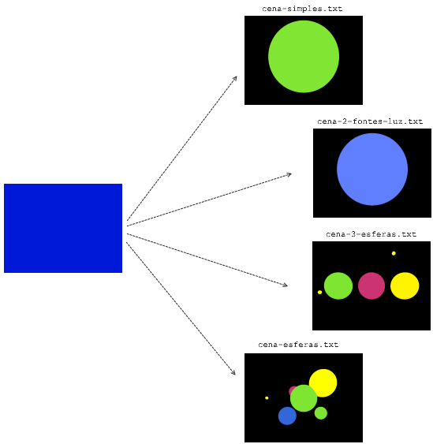

# Trabalho Prático 3 - _Ray Tracer_

Veja as instruções sobre a primeira parte do trabalho a seguir.

## Parte 1: Cálculo de **colisão entre raio e esfera**

Faça _download_ do [código seminal do _ray tracer_](http://moodle.cefetmg.br/file.php/292/raytracer-colisao.zip).
Nesta parte, você deve fazer três exercícios:

1. Instalar e se familiarizar com o código fonte do "esqueleto" de um
  _ray tracer_ em C++ ou Java (30 min)
2. Alterar a cor do fundo da tela para preto (10 min)
3. Implementar a interseção de raio com esfera (60 min)

Sobre (3), a função `intersectsWith(Ray ray)` deve: 

- Retornar `true`/`false` informando se houve colisão do raio com a esfera ou não
- Caso tenha havido colisão, preencher o objeto `ray` com os devidos valores para:
  - O valor de `t` para a primeira colisão, no campo `ray.intersectionT`¹
  - O ponto de interseção, no campo `ray.intersectionPoint`¹
  - O vetor normal no ponto de interseção, no campo `ray.intersectionNormal`¹
  
¹O valor de `t`, do ponto de interseção e da normal nesse ponto não são necessários para gerar as imagens esperadas na atividade desta semana, mas serão usados na atividade da segunda parte do trabalho. Portanto, faça-as corretamente nesta primeira etapa porque os valores serão utilizados na segunda etapa.

Ao executar o programa, independente de qual entrada é fornecida, ele está sempre gerando uma imagem toda azul.

Veja como deve ficar a saída para cada uma das entradas disponibilizadas:

## Material de Apoio

Acompanhe a apostila do Professor David Mount.
Você vai precisar especialmente das páginas 79 e 80, para uma introdução a _ray tracing_, da página 83 para representação de raios e das páginas 85 e 86 para determinação de interceptação de raio com esfera.
