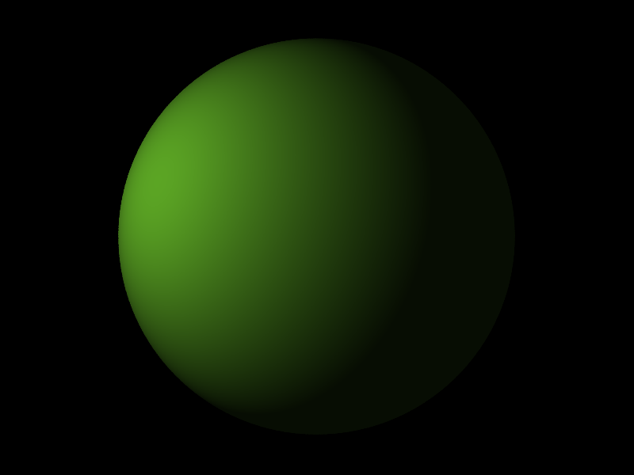
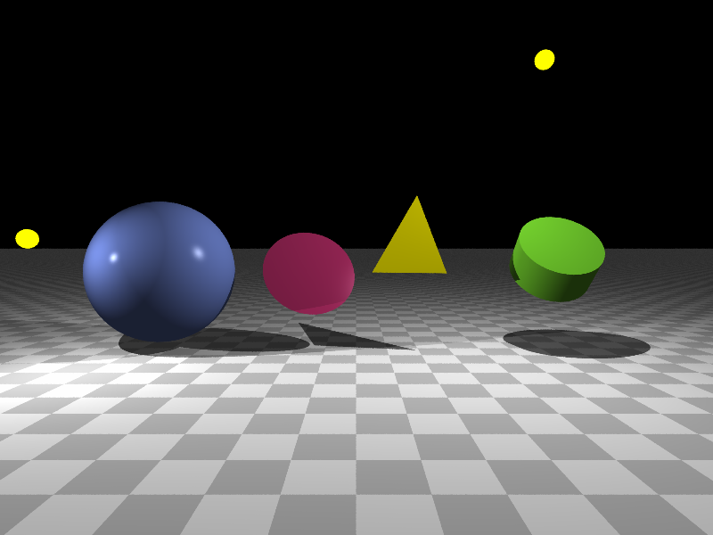
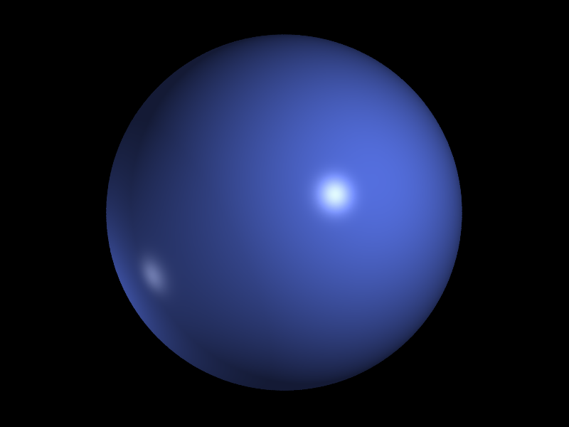
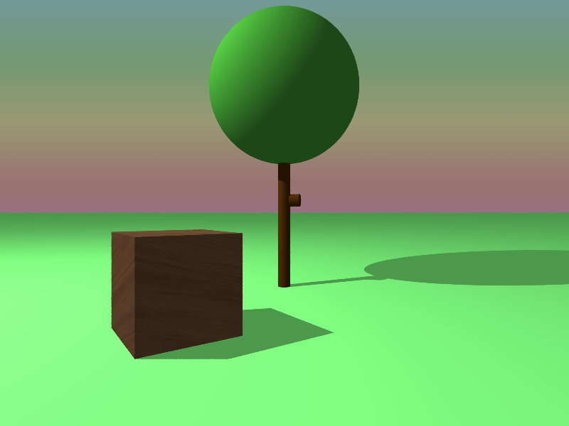
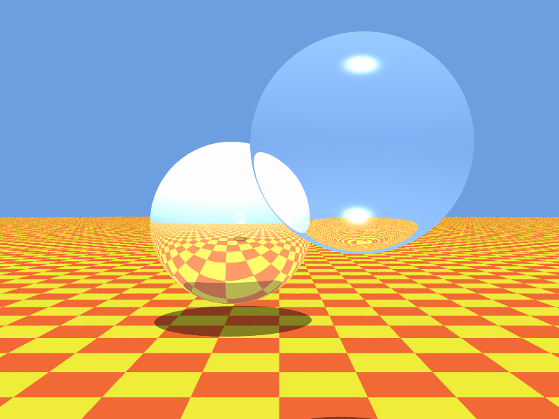

# Trabalho Prático 3 - _Ray Tracer_

Veja as instruções sobre a segunda parte do trabalho a seguir.

## Parte 2: **Colorindo** os pixels com o sombreamento de Phong-_ish_

Nesta parte, vocês implementarão o modelo de iluminação e sombreamento bem semelhante ao de Phong, que está descrito na apostila do bisavô de vocês, o prof. David Mount.

Você pode usar seu próprio código pronto da primeira parte, ou baixar a primeira parte pronta lá no Moodle.

As saídas para os arquivos de entrada de exemplo devem ser idênticas a estas:

|   `cena-simples.txt`        |    `cena-primitivas.txt` |   `cena-2-fontes-luz.txt` |    `cena-arvore.txt` |
|---------------------------------------------------------------------|---------------------------------------------------------------------|------------------------------------------------------------------------|-------------------------------------------------------------|
|    `cena-empilhadas.txt` |   `cena-whitted.txt`        |   `cena-cornell-box.txt`   |                                                             |

Eis uma sugestão da ordem de implementação do exercício:

1. Implementar a componente ambiente da fórmula de Phong (5 min)
1. Implementar a componente difusa (20 min)
1. Implementar a componente especular (20 min)
1. Implementar a verificação de sombras (10 min)
1. (+15%) Transformar o raytracer em recursivo (chamando `castRay(scene, ray)` recursivamente para raios de reflexão e de refração)
1. (+10%) Transformar o raytracer em distribuído (lançando eg. 10 raios por pixel e tirando a média, feito na `renderScene(scene)`)
   - Ideia: em vez de lançar apenas 1 raio, lançar 10 para cada pixel. 
     Para calcular uma leve perturbação no raio, você pode lançar o raio para um pixel não inteiro.
     Por exemplo, para o primeiro pixel (i,j) = (0,0), poderia escolher aleatoriamente números 
     como (-0.1, 0.3), (0.5, -0.2) etc.

### Critérios de Avaliação

A imagem gerada deve ser idêntica àquela que representa a imagem objetivo para o respectivo arquivo de entrada.

Mais detalhadamente, as características que devem estar presentes nas imagens:

- componente ambiente
- componente difusa
- componente especular
- atenuação da luz
- sombras provocadas por um objeto no outro
- correta determinação de sobreposição de objetos em relação à câmera
- devida iluminação para o lado interno de objetos

## Material de Apoio

Acompanhe a apostila do Professor David Mount.
Você vai precisar especialmente das páginas 82 (últimas linhas) e 83.

Além delas, você pode querer visualizar as derivações dos vetores (normal, reflexão, visualização etc.) usados no modelo de Phong. Você vai encontrar essas informações na aula 14 da apostila (páginas 62 até 66).

Para saber como calcular o raio de reflexão e de refração, veja as páginas 81 e 82 da apostila.
