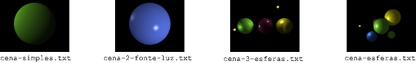

# Trabalho Prático 3 - _Ray Tracer_

Veja as instruções sobre a primeira parte do trabalho a seguir.

## Parte 2: **Colorindo** os pixels com o sombreamento de Phong-_ish_

Nesta parte, vocês implementarão o modelo de iluminação e sombreamento bem semelhante ao de Phong, que está descrito na apostila do bisavô de vocês, o Prof. David Mount.
Você pode usar o código pronto da primeira parte, mas eu sugiro baixar o do professor no Moodle porque ele está cheio de comentários mostrando o que deve ser feito, passo a passo.

As saídas para os arquivos de entrada de exemplo devem ser idênticas a estas:

Eis uma sugestão da ordem de implementação do exercício:

1. implementar a componente ambiente da fórmula de Phong
1. implementar a componente difusa
1. implementar a componente especular
1. implementar a verificação de sombras

### Critérios de Avaliação

A imagem gerada deve ser idêntica àquela que representa a imagem objetivo para o respectivo arquivo de entrada.

Mais detalhadamente, as características que devem estar presentes nas imagens:

- componente ambiente
- componente difusa
- componente especular
- sombras provocadas por um objeto no outro
- correta determinação de sobreposição de objetos em relação à câmera
- devida iluminação para o lado interno de objetos

## Material de Apoio

Acompanhe a apostila do Professor David Mount.
Você vai precisar especialmente das páginas 82 (últimas linhas) e 83.

Além delas, você pode querer visualizar as derivações dos vetores (normal, reflexão, visualização etc.) usados no modelo de Phong. Você vai encontrar essas informações na aula 14 da apostila (páginas 62 até 66).
