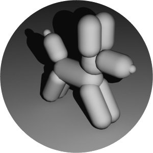

# Trabalho Prático 4 - Animação

Neste trabalho, você e outro colega criarão uma animação tridimensional
simples.

A dupla deve usar um programa de modelagem e animação em 3D como o blender, 3ds
Max, Maya, Cinema 4D ou LightWave 3D e criar uma pequena animação de 15 a 25
segundos. A utilização de **outro programa diferente dos listados** deve ser
**aprovada pelo professor**.

Os modelos e a animação não precisam ser profissionais e devem ser criados por
vocês. Você pode usar conjunto de primitivas do programa como esferas, cilindros,
pirâmides, cubos e formar objetos compostos (à la _boid_ de 5 pirâmides).
Por exemplo, um cachorro feito de "cápsulas":

Você até pode usar um modelo de terceiros, mas precisa mencionar de onde veio e pode
ser aplicada uma penalidade na pontuação referente à modelagem do seu trabalho.

O trabalho pode ser feito individualmente, ou em dupla, ou em trio, e
como funcionalidade básica, valendo 85%, 70% ou 60% (respectivamente) da
nota, deve ter os seguintes itens:

1. Um personagem principal (não precisa ser um "ser vivo", pode ser uma colher)
1. Pelo menos uma fonte de luz
1. Pelo menos uma textura em um objeto (no chão, por exemplo)
1. Um cenário com um pouco de detalhamento
  - Por exemplo, se for um cenário de escritório, além das 4 paredes, chão e
    teto, deve ter uma mesa, armário, porta, janela (tudo simples)
1. Animações simples dos objetos, mas de uma forma "verossímel"
  - Se for um cachorro andando, ele deve parecer que está andando =)

Para ganhar os pontos restantes (e mais uns pontinhos extras, até um
limite de 133%) podem ser conseguidos com funcionalidades adicionais,
descritas a seguir:

1. **(até 10%):** uso de sons e trilha sonora
1. **(5%):** uso de uma textura para _bump mapping_ ou _displacement mapping_
  - Na verdade, usar textura para algo que não seja para determinar a cor dos objetos
1. **(5-15%):** criação de modelos mais complexos
1. **(4%):** uso de fontes de luz _spot light_
1. **(até 12%):** uso de texturas em todos os objetos da cena (aplicáveis)
1. **(10%):** animação via _rigging_ (uso de "ossos")
1. **(até 10%):** um ou mais sistemas de partículas para criar fumaça, vapor, fogo
   ou outros fenômenos naturais
1. **(até 5%):** uso de animação de texturas
1. **(até 5%):** uso de simulações físicas
1. **(5-10%):** animação da câmera
  - Câmera em movimento (5%)
  - Alternância entre câmeras diferentes (5%)
1. **(1%):** a cada 2s adicionais da animação acima de 25s. Só não vale
   fingir que é o Stanley Kubrick no filme 2001: Uma Odisséia no Espaço. Limite
   de 10% adicionais neste item.
1. **(??%):** outros adicionais propostos por você e avaliados pelo
  professor

A entrega será dividida em 2 partes:

- **Entrega (1):** Roteiro + mini [_storyboard_](http://pt.wikipedia.org/wiki/Storyboard) (**03/Nov/15** - terça-feira) via Moodle
  - Você deve enviar, pelo Moodle, **o roteiro** (1 parágrafo) e um **_storyboard_** bem simples (sequência de quadros -
    algo entre 4-6 quadros - desenhados com os acontecimentos da sua animação), bem como mencionar quem integra
    a dupla/trio
- **Entrega (2):** Animação final: um **vídeo no Youtube** e uma apresentação de **slides** (**03/Dez/15** - terça-feira)
  - Você deve gerar um vídeo usando a própria ferramenta de modelagem (pode haver pós-edição, sem problemas) e
    fazer _upload_ para o Youtube (Vimeo, etc.)
  - Também deve haver uma apresentação de slides (PowerPoint etc.) com 4 slides, a ser apresentada em 10 min, contendo:
    - **Slide 1**: capa com título, nome dos integrantes
    - **Slide 2**: ferramentas usadas, os principais desafios e uma screenshot da sua animação
       aberta no programa utilizado para criá-la
    - **Slide 3**: lista de adicionais sendo pleiteados
    - **Slide 4**: referências aos tutoriais e material que foram usados
  - O link e a apresentação devem ser entregues pelo Moodle (há tarefas separadas para cada um)

No dia da entrega (**03/Dez/15**), teremos as apresentações dos slides + vídeos
no horário da nossa aula. Portanto, tudo deve ser entregue antes das 16:40. Trabalhos entregues depois
disso terão notas iguais a 0.
