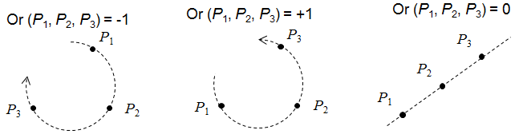
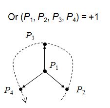
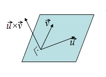
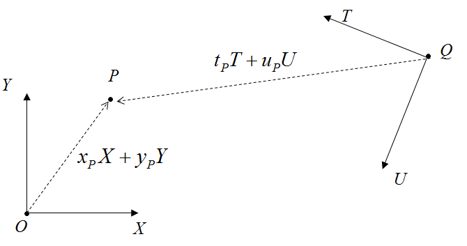

# Mudança de Base e Orientação

---
# Roteiro

1. Orientação
1. Produto Vetorial
1. Mudança de Sistema de Coordenadas
1. Exercícios

---
# Orientação

---
## Orientação

- Orientação de 2 pontos em 1D
  - P_1 < P_2, P_1 = P_2 ou P_1 > P_2
- Orientação de 3 pontos em 2D
  - O percurso P_1, P_2, P_3  é feito no sentido dos ponteiros do relógio, no
    sentido contrário ou são colineares

    

---
## Orientação

- Orientação de 4 pontos em 3D
  - O percurso P_1, P_2, P_3, P_4  está definido segundo a regra da mão direita,
    mão esquerda ou são coplanares

    

---
## Computando a orientação

- A orientação de n+1 pontos em um espaço n-dimensional é dado pelo **sinal
  do determinante da matriz** cujas colunas são as coordenadas homogêneas
  dos pontos **com o 1 vindo primeiro**

  
    Or_2(P_1,P_2,P_3)=sign\left(\begin{vmatrix}1&1&1\\\x_1&x_2&x_3\\\y_1&y_2&y_3\end{vmatrix}\right)
  
  
    Or_3(P_1,P_2,P_3,P_4)=sign\left(\begin{vmatrix}1&1&1&1\\\x_1&x_2&x_3&x_4\\\y_1&y_2&y_3&y_4\\\z_1&z_2&z_3&z_4\end{vmatrix}\right)
  
- O OpenGL faz isto internamente para descobrir
  qual a orientação dos polígonos

---
# Produto Vetorial

---
## Produto Vetorial

- Da geometria Euclidiana, permite achar um vetor perpendicular a outros dois
- 
  Útil na construção de sistemas de coordenadas
  

    \vec{u} \times \vec{v} = \begin{bmatrix}u_y v_z - u_z v_y\\\u_z v_x - u_x v_z\\\u_x v_y - u_y v_x\end{bmatrix}
  

---
## Produto Vetorial (cont.)

- Propriedades (assume-se \vec{u}, \vec{v} linearmente independentes):
  - Antisimetria: \vec{u} \times \vec{v} = -\vec{v} \times \vec{u}
  - Bilinearidade:
    - \vec{u} \times (\alpha \vec{v}) = \alpha (\vec{u} \times \vec{v})  e
    - \vec{u} \times (\vec{v} + \vec{w}) = (\vec{u} \times \vec{v}) + (\vec{u} \times \vec{w})
  - \vec{u} \times \vec{v} é perpendicular tanto a \vec{u} quanto a \vec{v}
  - O comprimento de \vec{u} \times \vec{v} é igual a área do paralelogramo definido por  \vec{u} e \vec{v}, isto é, \lVert \vec{u} \times \vec{v} \rVert = \lVert \vec{u} \rVert \lVert \vec{v} \rVert \sin \theta

---
# Mudança de Sistema de Coordenadas

---
## Sistema de Coordenadas (**revisão**)

- Um sistema de coordenadas para R^n é definido por um ponto (origem) e n vetores
- Por exmplo: Seja um sistema de coordenadas para R^2 definido pelo ponto O e
  os vetores X e Y. Então,
  - Um ponto P é dado por coordenadas x_P e y_P tais que

    
P = x_P . X + y_P . Y + O

  - Um vetor V é dado por coordenadas x_V e y_V tais que

    
V = x_V . X + y_V . Y

---
## Mudança de Sistema

- Se estabelecemos um outro sistema (ex.: Q/
  T/U), como computar
  as coordenadas nesse novo sistema?

  

---
## Mudança de Sistema (cont.)

- Como computar as coordenadas de um ponto P = (x_P, y_P) em O/X/Y dadas as
  coordenadas de P em Q/T/U, isto é, (t_P, u_P)?

  1. Defina P como um ponto no sistema Q/T/U
  1. Defina as componentes do sistema Q/T/U no sistema O/X/Y
  1. Fatore a fórmula de forma a isolar as componentes de O/X/Y
  1. Você achou P = (x_P, y_P) :)

---
## Algebricamente...

<ul class="steps-base-change">
  <li>
    P[Q]=t_P T + u_P U + Q
  </li>
  <li>
    \color{red}{Q[O]}=x_Q X + y_Q Y + O 
    \color{blue}{T[O]}=x_T X + y_T Y 
    \color{green}{U[O]}=x_U X + y_U Y
  </li>
  <li>
    =t_P \color{blue}{\left(x_T X + y_T Y\right)} + u_P \color{green}{\left(x_U X + y_U Y\right)} + \color{red}{\left(x_Q X + y_Q Y + O\right)}
    =X \left(t_P x_T + u_P x_U + x_Q\right) + Y \left(t_P y_T + u_P y_U + y_Q\right) + O
  </li>
  <li>
    
x_P=t_P x_T + u_P x_U + x_Q

    
y_P=t_P y_T + u_P y_U + y_Q

  </li>
</ul>

---
## Mudança de Sistema (cont.)

- 

    \begin{bmatrix}x_P\\\y_P\end{bmatrix}=
    \begin{bmatrix}x_T&x_U\\\y_T&y_U\end{bmatrix}\times
    \begin{bmatrix}t_P\\\u_P\end{bmatrix}+
    \begin{bmatrix}x_Q\\\y_Q\end{bmatrix}
  

  A equação anterior, vista **de forma matricial**:
- Usando **coordenadas homogêneas**, podemos usar
  **apenas uma multiplicação** de matriz com vetor:

  

    \begin{bmatrix}x_P\\\y_P\\\1\end{bmatrix}=
    \begin{bmatrix}x_T&x_U&x_Q\\\y_T&y_U&y_Q\\\0&0&1\end{bmatrix}\times
    \begin{bmatrix}t_P\\\u_P\\\1\end{bmatrix}
  

- Ou seja, dadas as coordenadas de um ponto ou vetor em um sistema Q/T/U,
  podemos **achar suas coordenadas em um sistema O/X/Y <u>multiplicando as
  coordenadas por uma matriz</u>**

---
## Mudança de Sistema (cont.)

- Se quiser passar uma coordenada do sistema O/X/Y para Q/T/U, basta
  **resolver o problema inverso**:

  

    \begin{bmatrix}x_P\\\y_P\\\1\end{bmatrix}=
    \begin{bmatrix}x_T&x_U&x_Q\\\y_T&y_U&y_Q\\\0&0&1\end{bmatrix}^{-1}\times
    \begin{bmatrix}t_P\\\u_P\\\1\end{bmatrix}
  

---
## Exemplo Concreto

- Considere que:
  - P[Q] = (2.5, 1)
  - Sistema Q/T/U dado em
    O/X/Y:
    - Q[O]= (3.5, 1.25)
    - T[O]= (-1, 0.25)
    - U[O]= (-0.25, -1)
- Calcule as coordenadas de P no sistema
  O/X/Y.

---
## Resolvendo o Exercício

- Matriz de mudança de sistemas de coordenadas:
  

    \begin{bmatrix}x_P\\\y_P\\\1\end{bmatrix}=
    \begin{bmatrix}x_T&x_U&x_Q\\\y_T&y_U&y_Q\\\0&0&1\end{bmatrix}\times
    \begin{bmatrix}t_P\\\u_P\\\1\end{bmatrix}
  

- Materializando para o P
  
\begin{bmatrix}x_P\\\y_P\\\1\end{bmatrix}=\begin{bmatrix}-1&-0.25&3.5\\\0.25&-1&1.25\\\0&0&1\end{bmatrix} \cdot \begin{bmatrix}2.5\\\1\\\1\end{bmatrix}

- Resultado: P[O] = (0.75, 0.875)

---
# Referências

1. Lições 6 e 7 das anotações do prof. David Mount
