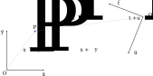
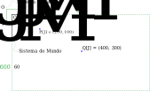

<!-- {"layout": "title"} -->
# Mudança de Base e Orientação
## Mais algumas operações geométricas

---
<!-- {"layout": "centered"} -->
# Roteiro

1. Orientação
1. Produto vetorial
1. Mudança de sistema de coordenadas
1. Exercícios

---
<!-- {"layout": "regular"} -->
# Orientação (1/2)

- Orientação de 2 pontos em 1D <!-- {.bullet} -->
  - <span class="math">P_1 < P_2</span>, <span class="math">P_1 = P_2</span> ou <span class="math">P_1 > P_2</span>
- Orientação de 3 pontos em 2D <!-- {.bullet} -->
  - O percurso <span class="math">P_1, P_2, P_3</span>  é feito no sentido dos ponteiros do relógio, no
    sentido contrário ou são colineares

    

---
<!-- {"layout": "regular"} -->
## Orientação (2/2)

- Orientação de 4 pontos em 3D
  - O percurso <span class="math">P_1, P_2, P_3, P_4</span>  está definido segundo a regra da mão direita,
    mão esquerda ou são coplanares

     <!-- {.centered} -->

---
<!-- {"layout": "regular"} -->
## Computando a orientação

- A orientação de <span class="math">n+1</span> pontos em um espaço
  <span class="math">n</span>-dimensional é dado pelo **sinal
  do determinante da matriz** cujas colunas são as coordenadas homogêneas
  dos pontos **com o 1 vindo primeiro**

  <span class="math" style="font-size: 0.8em;">
    Or_2(P_1,P_2,P_3)=sign\left(\begin{vmatrix} 1 & 1 & 1 \\ x_1 & x_2 & x_3 \\ y_1 & y_2 & y_3\end{vmatrix}\right)
  </span>
  <div class="math push-right" style="font-size: 0.8em">
    Or_3(P_1,P_2,P_3,P_4)=sign\left(\begin{vmatrix} 1 & 1 & 1 & 1 \\ x_1 & x_2 & x_3 & x_4 \\ y_1 & y_2 & y_3 & y_4 \\ z_1 & z_2 & z_3 & z_4\end{vmatrix}\right)
  </div>

---
<!-- {"layout": "regular"} -->
# Produto vetorial

- 
  Encontra um vetor perpendicular a outros dois
  <div class="math push-right" style="font-size: 0.8em;">
    \vec{u} \times \vec{v} = \begin{bmatrix}u_y v_z - u_z v_y \\ u_z v_x - u_x v_z \\ u_x v_y - u_y v_x\end{bmatrix}
  </div>  
- Propriedades (assume-se <span class="math">\vec{u}</span>, <span class="math">\vec{v}</span> linearmente independentes):
  - Antissimetria: <span class="math">\vec{u} \times \vec{v} = -\vec{v} \times \vec{u}</span>
  - Bilinearidade:
    - <span class="math">\vec{u} \times (\alpha \vec{v}) = \alpha (\vec{u} \times \vec{v})</span>  e
    - <span class="math">\vec{u} \times (\vec{v} + \vec{w}) = (\vec{u} \times \vec{v}) + (\vec{u} \times \vec{w})</span>
  - <span class="math">\vec{u} \times \vec{v}</span> é perpendicular tanto a <span class="math">\vec{u}</span> quanto a <span class="math">\vec{v}</span>
  - O comprimento de <span class="math">\vec{u} \times \vec{v}</span> é igual à área do paralelogramo definido por  <span class="math">\vec{u}</span> e <span class="math">\vec{v}</span>, isto é, <span class="math">\lVert \vec{u} \times \vec{v} \rVert = \lVert \vec{u} \rVert \lVert \vec{v} \rVert \sin \theta</span>

---
<!-- {"layout": "section-header"} -->
# Mudança de Sistema de Coordenadas

---
<!-- {"layout": "regular"} -->
## Sistema de coordenadas (**revisão**)

- Um sistema de coordenadas para <span class="math">R^n</span> é definido por um ponto (origem) e <span class="math">n</span> vetores
- Por exemplo: Seja um sistema de coordenadas para <span class="math">R^2</span> definido pelo ponto <span class="math">O</span> e
  os vetores <span class="math">\vec{x}</span> e <span class="math">\vec{y}</span>. Então,
  - Um <u>ponto</u> <span class="math">P</span> é dado por coordenadas <span class="math">(x_P, y_P)</span> tais que

    <div class="math">P = x_P . \vec{x} + y_P . \vec{y} + O</div>
  - Um <u>vetor</u> <span class="math">\vec{v}</span> é dado por coordenadas <span class="math">(x_v, y_v)</span> tais que

    <div class="math">\vec{v} = x_v . \vec{x} + y_v . \vec{y}</div>

---
<!-- {"layout": "regular"} -->
## Mudança de sistema (em <span class="math">R^2</span>)

Dados dois sistemas (eg., <span class="math">Q</span>/
<span class="math">\vec{x}</span>/<span class="math">\vec{y}</span>
<span class="math">O</span>/
<span class="math">\vec{t}</span>/<span class="math">\vec{u}</span>), como computar
as coordenadas de P dadas em um sistema no outro? <!-- {style="margin-bottom: 0;"} -->

 <!-- {style="max-height: 400px;"} --> <!-- {p:.centered} -->

---
<!-- {"layout": "centered-horizontal"} -->
## Mudança: um problema prático

 <!-- {.large-width.centered} -->

```c
glViewport(0, 0, 800, 600);
// left, right, bottom, top, near, far
glOrtho(0, 80, 60, 0, -1, 1);
```

---
<!-- {"layout": "regular"} -->
## Mudança de sistema (cont.)

- Problema: dadas as coordenadas do ponto <span class="math">P</span> no sistema <span class="math">Q</span>/<span class="math">\vec{t}</span>/<span class="math">\vec{u}</span> <span class="math">(t_P, u_P)</span>, como encontrar as coordenadas de <span class="math">P</span> no sistema <span class="math">O</span>/<span class="math">\vec{x}</span>/<span class="math">\vec{y}</span> <span class="math">(x_P, y_P)</span>?

<ul class="steps-base-change">
  <li>Defina <span class="math">P</span> como um ponto no sistema <span class="math">Q</span>/<span class="math">\vec{t}</span>/<span class="math">\vec{u}</span></li>
  <li>Defina as componentes do sistema <span class="math">Q</span>/<span class="math">\vec{t}</span>/<span class="math">\vec{u}</span> no sistema <span class="math">O</span>/<span class="math">\vec{x}</span>/<span class="math">\vec{y}</span></li>
  <li>Fatore a fórmula para isolar as componentes de <span class="math">O</span>/<span class="math">\vec{x}</span>/<span class="math">\vec{y}</span></li>
  <li>Você achou <span class="math">P = (x_P, y_P)</span> :)</li>
</ul>

---
<!-- {"layout": "regular"} -->
## Algebricamente...

<style>
.steps-base-change {
  display: flex;
  flex-wrap: wrap;
  list-style-type: none;
  counter-reset: step;
}
.steps-base-change > li::before {
  counter-increment: step;
  content: "Passo " counter(step);
  counter-increment: step;
  content: "Passo " counter(step);
  font-size: 0.6em;
  background: orange;
  border-radius: 0.25em;
  padding: 0em 0.5em;
  color: white;
  box-shadow: 2px 2px 3px rgba(0,0,0,0.25);
  display: block;
  width: 4em;
  line-height: 2em;
}
.steps-base-change > li:nth-of-type(1),
.steps-base-change > li:nth-of-type(2) {
  justify-content: space-between;
  width: 50%;
}
.steps-base-change > li:nth-of-type(3),
.steps-base-change > li:nth-of-type(4) {
  width: 100%;
}
.steps-base-change > li:nth-of-type(2) {
  text-align: left;
}
</style>

<ul class="steps-base-change">
  <li>
    <span class="math bullet">P[Q]=t_P \vec{t} + u_P \vec{u} + Q</span>
  </li>
  <li>
    <span class="math bullet">\color{red}{Q[O]}=x_Q \vec{x} + y_Q \vec{y} + O</span><br>
    <span class="math bullet">\color{blue}{\vec{t}[O]}=x_t \vec{x} + y_t \vec{y}</span><br>
    <span class="math bullet">\color{green}{\vec{u}[O]}=x_u \vec{x} + y_u \vec{y}</span>
  </li>
  <li>
    <span class="math bullet">P[Q]=t_P \color{blue}{\left(x_t \vec{x} + y_t \vec{y}\right)} + u_P \color{green}{\left(x_u \vec{x} + y_u \vec{y}\right)} + \color{red}{\left(x_Q \vec{x} + y_Q \vec{y} + O\right)}</span>
    <span class="math bullet" style="display: block">P[Q]=\vec{x} \left(t_P x_t + u_P x_u + x_Q\right) + \vec{y} \left(t_P y_t + u_P y_u + y_Q\right) + O</span>
  </li>
  <li>
    <div class="math bullet">x_P=t_P x_t + u_P x_u + x_Q</div>
    <div class="math bullet">y_P=t_P y_t + u_P y_u + y_Q</div>
  </li>
</ul>

---
<!-- {"layout": "regular"} -->
## Mudança de sistema (cont.)

- <div class="math" style="float: right;">
    \begin{bmatrix}x_P \\ y_P\end{bmatrix}=
    \begin{bmatrix}x_T&x_U \\ y_T&y_U\end{bmatrix}\times
    \begin{bmatrix}t_P \\ u_P\end{bmatrix}+
    \begin{bmatrix}x_Q \\ y_Q\end{bmatrix}
  </div>
  A equação anterior, vista <strong>de forma matricial</strong>:
- Usando **coordenadas homogêneas**, podemos usar
  **apenas uma multiplicação** de matriz com vetor:

  <div class="math">
    \begin{bmatrix}x_P \\ y_P \\ 1\end{bmatrix}=
    \begin{bmatrix}x_t&x_u&x_Q \\ y_t&y_u&y_Q \\ 0&0&1\end{bmatrix}\times
    \begin{bmatrix}t_P \\ u_P \\ 1\end{bmatrix}
  </div>

Ou seja, dadas as coordenadas de um ponto ou vetor em um sistema
<span class="math">Q/\vec{t}/\vec{u}</span>, podemos **achar suas coordenadas
em um sistema <span class="math">O/\vec{x}/\vec{y}</span>
<u>multiplicando-as por uma matriz</u>** <!-- {p:.note.info} -->

---
<!-- {"layout": "regular"} -->
## Mudança de sistema (cont.)

- Se quiser passar uma coordenada do sistema
<span class="math">O/\vec{x}/\vec{y}</span> para
<span class="math">Q/\vec{t}/\vec{u}</span>, basta **resolver o
problema inverso**:

  <div class="math">
    \begin{bmatrix}t_P \\ u_P \\ 1\end{bmatrix}=
    \begin{bmatrix}x_t&x_u&x_Q \\ y_t&y_u&y_Q \\ 0&0&1\end{bmatrix}^{-1}\times
    \begin{bmatrix}x_P \\ y_P \\ 1\end{bmatrix}
  </div>

---
<!-- {"layout": "regular"} -->
## Exemplo concreto

- Calcule as coordenadas de <span class="math">P</span> no sistema
  <span class="math">O/\vec{x}/\vec{y}</span>.
- Considere que:
  - <span class="math">P[Q] = (2.5, 1)</span>
  - Sistema <span class="math">Q/\vec{t}/\vec{u}</span> dado em
    <span class="math">O/\vec{x}/\vec{y}</span>:
    - <span class="math">Q[O]= (3.5, 1.25)</span>
    - <span class="math">\vec{t}[O]= (-1, 0.25)</span>
    - <span class="math">\vec{u}[O]= (-0.25, -1)</span>

---
<!-- {"layout": "regular", "state": "show-active-slide-and-previous"} -->
## Resolvendo o exercício

- Matriz de mudança de sistemas de coordenadas:
  <div class="math">
    \begin{bmatrix}x_P \\ y_P \\ 1\end{bmatrix}=
    \begin{bmatrix}x_t&x_u&x_Q \\ y_t&y_u&y_Q \\ 0&0&1\end{bmatrix}\times
    \begin{bmatrix}t_P \\ u_P \\ 1\end{bmatrix}
  </div>
- Materializando para o <span class="math">P</span>
  <div class="math">\begin{bmatrix}x_P \\ y_P \\ 1\end{bmatrix}=\begin{bmatrix}-1&-0.25&3.5 \\ 0.25&-1&1.25 \\ 0&0&1\end{bmatrix} \times \begin{bmatrix}2.5 \\ 1 \\ 1\end{bmatrix}</div>
- Resultado: <span class="math">P[O] = (0.75, 0.875)</span>

---
<!-- {"layout": "centered"} -->
# Referências

1. Lições 6 e 7 das anotações do prof. David Mount
