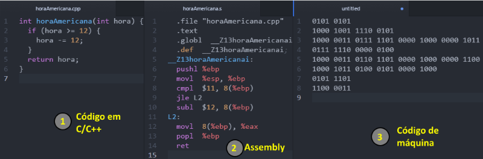
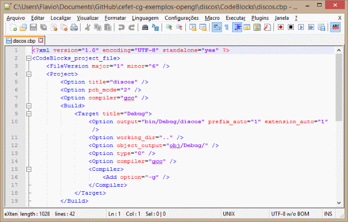
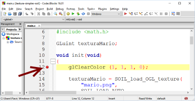

<!--
  backdrop: c-jump-boardgame
-->

# Cê

---
# Roteiro

1. Breve descrição da linguagem
1. Alterando valores dentro de funções
  - Passagem por valor e por referência
1. Imprimindo no terminal
  - `printf`
1. Agrupando informação
  - `struct, enum`
1. Dividindo seu programa em módulos
  - `#include "meuProgramaFavorito.h"`
1. ~~Makefiles~~ IDEs, pra que te quero
1. Depuração

---
# Revisão de PC1

---
## História do C

- Desenvolvida entre 1969 e 1973, juntamente com o Unix
  <figure class="portrait right">
    
  </figure>
  Feita por Dennis Ritchie praticamente sozinho
- Projetada para programação de:
  - Sistemas operacionais
  - Programas utilitários
  - Compiladores
- Evoluiu a partir da linguagem B

---
<figure class="picture-steps">
  
  
</figure>

---
## Tipos de dados

- Tipos básicos
  - `char, int, float, double`...
- Feitos para se equiparar à capacidade do processador
  - Tradução natural para a linguagem assembly
- Fundamentalmente não-portáteis

---
## Exemplos dos tipos

```c
int i;                      // inteiro

int *j, k;                  // ponteiro para inteiro j, inteiro k

unsigned char *ch;          // ponteiro para char sem sinal

int a[3][5];                // vetor de 3 posições de 5 inteiros

float f[10];                // vetor de 10 floats

char nextChar(int, char*);  // função de 2 parâmetros

int *func1(float);          // função que retorna int*

int (*func2)(void);         // ponteiro para função que ret. int
```
Exemplo de [Ponteiro para Função](codeblocks:c-ponteiro-para-funcao/CodeBlocks/c-ponteiro-para-funcao.cbp)

---
# Alterando valores dentro de funções

---
## Passando valores a funções **por cópia**

- Em C, quando uma função recebe um argumento, tipicamente ela
  recebe uma **cópia** do valor real
  - Portanto, se a função altera seu valor, ao sair dela,
    o valor da variável será o mesmo valor de antes da alteração
- Veja o exemplão na próxima página.

---
## Exemplo de passagem de valores por cópia

```c
void atendePessoaNoRangoDoRei(int fila) {
  fila--;
}

int main(int argc, char* argv[]) {
  int fila = 30;
  printf("Pessoas: %d\n");            // Imprime 30
  atendePessoaNoRangoDoRei(fila);
  printf("Pessoas: %d\n");            // Imprime 30 :O

  return 0;
}
```

---
## Passando valores **por endereço de memória**

- Contudo, às vezes precisamos alterar o valor das variáveis
  recebidas como argumento da função
  - Para isso, podemos passar o **"endereço" de memória da variável**,
    em vez do seu valor
- Exemplo:
  ```c
  void atendePessoaNoRangoDoRei_Hipotetico(int *fila) {
    (*fila)--;
  }
  ```
  ```
  atendePessoaNoRangoDoRei(&fila);
  ```
  - Ainda assim o C está **copiando o valor** para a função. Contudo, ele
    **<u>copiou o endereço de memória</u> e não o valor**

---
# Imprimindo no terminal

---
## Entrada e saída (E/S)

- E/S em C pode ser realizado de forma básica usando os utililtários da
  **biblioteca `stdio.h`**
  - O nome advém de **_Standard in/out_**
- Para escrever texto no terminal, tipicamente usamos a função de [impressão
  formatada (`printf`)](http://www.cplusplus.com/reference/cstdio/printf/)
  - Com ela, é possível facilmente formatar os dados a serem escritos
    - Cada variável é representada pelo caractere `%`, seguido por uma letra
      que indica seu tipo e alguns modificadores (opcionais). O formato completo
      é dado por:
      ```
      %[flags][largura][.precisão][comprimento]identificador
      ```
  - [Referência sobre a `stdio.h`](http://www.cplusplus.com/reference/cstdio/)

---
## Identificadores de tipos de variáveis para o printf

<table>
  <tbody>
    <tr><th><i>identificador</i></th><th>Saída</th><th>Exemplo</th></tr>
    <tr><td><tt>d</tt> <i>ou</i> <tt>i</tt></td><td>Inteiro com sinal, decimal</td><td><tt>392</tt></td></tr>
    <tr><td><tt>x</tt></td><td>Inteiro sem sinal, hexadecimal</td><td><tt>7fa</tt></td></tr>
    <tr><td><tt>f</tt></td><td>Ponto flutuante</td><td><tt>392.65</tt></td></tr>
    <tr><td><tt>e</tt></td><td>Notação científica (mantissa/expoente)</td><td><tt>3.9265e+2</tt></td></tr>
    <tr><td><tt>c</tt></td><td>Caractere</td><td><tt>a</tt></td></tr>
    <tr><td><tt>s</tt></td><td><i>String</i></td><td><tt>sample</tt></td></tr>
    <tr><td><tt>p</tt></td><td>Endereço de ponteiro</td><td><tt>b8000000</tt></td></tr>
  </tbody>
</table>

---
## Modificadores (apenas alguns)

- De precisão: especificamos quantas casas decimais queremos mostrar
  ```c
  printf("PI: %f.5", M_PI);         // imprime 3.14159
  ```
- _Flags_:
  - `-`: alinha o número à esquerda, em vez de à direita
  - `+`: o número será mostrado com sinal de `+`, caso seja positivo
    ```c
    printf("%+d, %+f", 45, 8.35);   // imprime +45, +8.35
    ```

---
# Agrupando informação
## com
# Estruturas de Dados

---
## Motivação

- Às vezes precisamos reunir informações variadas sobre um mesmo objeto
  - Por exemplo, um vetor geométrico possui um `float` para `x` e outro
    para `y`
- A linguagem permite a criação de **estruturas de dados**. Para tal,
  usamos a sintaxe:
  ```c
  struct vetor2d {
    float x;
    float y;
  };
  ```

---
## Como usar uma estrutura (1/2)

- Uma vez definida, podemos usar a estrutura para criar objetos que têm
  o mesmo tipo definido por ela:
  ```c
  struct vetor2d posicao;
  struct vetor2d velocidade;
  ```
- Então, podemos acessar os membros de cada objeto (`x` e `y`):
  ```c
  posicao.x = 1.5f;
  velocidade.y *= 2;  // vel.y = vel.y * 2;
  ```

---
## Como usar uma estrutura (2/2)

- <u>Alternativamente</u>, podemos **criar a estrutura de dados** <u>e</u> **definir
  um novo tipo de dados** ao mesmo tempo usando o `typedef`:
  ```c
  typedef struct vetor2d {
    float x;
    float y;
  } tipo_vetor2d;
  ```
- Daí, na hora de declarar variáveis, **podemos omitir a palavra `struct`**:
  ```c
  tipo_vetor2d posicao;
  tipo_vetor2d velocidade;
  ```


---
## Mas o quê agrupar?

- Em um jogo de navinha, por exemplo:
  - Tudo relacionado ao jogador:
    ```c
    struct navinha {
        tipo_vetor2d posicao;   // posição do centro
        float anguloDirecao;    // pra onde tá olhando
        float largura, altura;  // dimensões
        int vidas;
        int pontuacao;
        int identificadorTextura;
        // ...
    };
    ```

---
# Dividindo seu programa em módulos

---
## Pré-processador

- Foi uma adição tardia à linguagem (que, na verdade, está **fora** dela)
  - Tapa alguns buracos na linguagem
  - São os comandos que começam com o símbolo `#`
    - `#define, #ifdef, #include` etc.
- Quando compilamos um programa em C, três grandes etapas são executadas, na
  seguinte ordem:
    - Pré-processamento
    - Compilação
    - Linkedição (ò.Ó)

---
## Pré-processador

- Constantes
  ```c
  #define NUM_LADOS 25
  ```
- Macros com argumentos
  ```
  #define min(x,y) ((x) < (y) ? (x) : (y))
  ```
- Compilação condicional
  ```c
  #ifdef ESTOU_COMPILANDO_NUM_RWINDOWS
    ...
  #elif
    ...
  #endif
  ```

---
## Pré-processador

- Inclusão de arquivos: &lt; &gt; ou áspas
  - **`#include <arquivo1.h>`** <br>
    Esta variação é usada para cabeçalhos do sistema
    - Ela procura pelo arquivo **em uma lista de diretórios padrão**
      (e.g., `C:\MinGW\include`, `/usr/include`)
    - Podemos incluir outros diretórios, [usando a opção -I do compilador](https://gcc.gnu.org/onlinedocs/cpp/Include-Syntax.html#Include-Syntax)
  - **`#include "arquivo2.h"`** <br>
    Esta variação é usada para seus próprios cabeçalhos
    - Ela procura pelo arquivo **no mesmo diretório** do arquivo que estamos compilando

---
## Dividindo em .h e .c

- Por que dividir?
  1. Promover o **reaproveitamento de código**
  1. Melhorar a **legibilidade** do código
- Usamos os arquivos .h (de cabeçalho, _header_) para **compartilhar
  algumas informações entre vários arquivos** fonte (.c ou outros .h)
  - O <u>**.h** é a parte que queremos deixar **pública**</u> de um .c
- Exemplo de informação que deve ser compartilhada:
  - Estruturas de dados
  - Algumas funções "públicas"
  - Variáveis globais (entre arquivos)

---
## Exemplão (.h e .c)

- vetor.c
  ```c
  #include "vetor.h"
  struct vetor multiEscalar(struct vetor v, float escalar) {
      v.x *= escalar;   v.y *= escalar;
      return v;
  }
  ```
- vetor.h (o que estamos "exportando" para nossos clientes)
  ```c
  struct vetor {    // a estrutura de dados
      float x, y;
  };
  struct vetor multiEscalar(struct vetor, float);
  ```

---
## Exemplão (continuação)

- **Para usar** o seu módulo `vetor` em outro arquivo do seu programa
  (_e.g._, `main.c`), você **deve incluir o arquivo `vetor.h`**
  - Fazendo isso, seu outro arquivo (_e.g._, `main.c`) saberá:
    1. o que é um `struct vetor`
    1. que existe uma função `somaEscalar`
      - que recebe um `struct vetor` e um `float`

---
## Exemplo de utilização

```c
#include "vetor.h"

int main(int argc, char* argv[]) {
  struct vetor velocidade;
  velocidade.x = 1.0f;
  velocidade.y = 0.7f;
  printf("vel: (%.2f, %.2f)\n", velocidade.x, velocidade.y);

  velocidade = multiEscalar(velocidade, 2);
  printf("vel * 2: (%.2f, %.2f)\n", velocidade.x, velocidade.y);

  return 0;
}
```
---
# Compilador

---
<figure class="picture-steps">
  
  
</figure>

---
## Compilando na mão

- O GCC é o compilador da linguagem C (e de C++, Objective-C, Objective-C++...)
  mais famoso e utilizado
- Ele foi feito para Unix e só executa lá
  - Felizmente, alguns _ports_ não oficiais foram feitos para Windows:
    1. **MinGW** (Minimal GNU for Windows)
    1. Cygwin
    1. TDM
- Vamos entender como usar o compilador diretamente \o/

---
## Usando o GCC

- Fazemos o processo em dois passos: (1) compilação e (2) linkedição
  1. Para compilar um programa com dois arquivos .c:
    ```shell
    gcc -o arquivo1.o -c arquivo1.c -Wall
    gcc -o arquivo2.o -c arquivo2.c -Wall
    ```
  1. Para fazer a linkedição e gerar o executável
    ```shell
    gcc -o programa.exe arquivo1.o arquivo2.o -lglut32 -lm
    ```
- [Referência sobre a invocação do GCC](https://gcc.gnu.org/onlinedocs/cpp/Invocation.html#Invocation)

---
## Processo de compilação



---
## Como posso eu mesmo fazer isso?

- Para instruir o compilador para gerar código **assembly**:
  ```bash
  $ g++ -S meuArquivo.c
  ```
  - Um arquivo com nome `meuArquivo.s` será gerado, contendo instruções em assembly
- Para compilar normalmente (e gerar código de máquina):
  ```bash
  $ g++ meuArquivo.c
  ```
- Para visualizar o código de máquina (arquivo `.o` ou `.exe`)
  ```bash
  $ objdump -d meuArquivo.exe
  ```

---
## Compilação e Ligação (_link-edition_)


```bash
gcc -o programa.exe arquivo1.o arquivo2.o -lglut32 -lm
```
**`-lglut32`** significa que existe um arquivo chamado `libglut32.a` em algum
  lugar

---
# ~~Makefiles~~ IDEs, pra que te quero

---
## Uma IDE

- É um **ambiente de desenvolvimento integrado**
- Exemplos:
  - CodeBlocks
  - Visual Studio
  - Eclipse etc.
- Reúne ferramentas e utilitários normalmente utilizados para a programação
  - Um desses utilitários (o rei da floresta) é um compilador
- Apesar da facilidade gratuita dos IDEs, como não precisamos usar
  os compiladores diretamente, ficamos sem conhecer (e entender) como
  ele funciona

---
## Desmistificando o "arquivo de projeto" (.cbp)



---
## E o tal Makefile?

```makefile
OPCOES_COMPILADOR= -Wall

main.o: main.c
    gcc -o main.o -c main.c $(OPCOES_COMPILADOR)

all: $(TODOS_ARQUIVOS_OBJ)
    gcc -o main main.o -lglut32 -lm

run: all
    main.exe

clean:
    del *.o main
```

---
## Como usar o Makefile?

- Tendo o aplicativo **make** instalado e visível em seu terminal, você pode:
  ```shell
  $ make all
  ```
  - Para compilar, ou apenas `make` (`all` é o _target_ padrão)
- ```shell
  $ make run
  ```
  - Para executar o programa

---
## Makefile (1/3)

- Makefile simples
  ```makefile
  aplicacao:  aplicacao.c vetor.c
      gcc -o aplicacao aplicacao.c vetor.c -I.
  ```
  1. Coloque esse conteúdo em um **arquivo `Makefile` ou `makefile`**
  1. **Digite `make`** na pasta e o GCC compilará o programa
    - `make` (sem argumentos) executa a primeira regra do arquivo
    - a regra só será executada se os arquivos à direita tiverem mudado desde a
      última execução

---
## Makefile (2/3)

- Makefile simples++
  ```
  CC=gcc
  CFLAGS=-I.
  aplicacao:  aplicacao.o vetor.o
      $(CC) -o aplicacao aplicacao.o vetor.o $(CFLAGS)
  ```
  - `CC` e `CFLAGS` são constantes
  - Usamos as constantes na forma `$(CC)` e `$(CFLAGS)`
  - Problema: quando alteramos um arquivo `.h`, **o make não recompila**

---
## Makefile (3/3)

- Makefile bacana
  ```
  CC=gcc
  CFLAGS=-I.
  DEPS=vetor.h
  %.o: %.c $(DEPS)
      $(CC) -c -o $@ $< $(CFLAGS)

  aplicacao: aplicacao.o vetor.o
      $(CC) -o aplicacao aplicacao.o vetor.o $(CFLAGS)
  ```
  - `DEPS` é o conjunto de todos os arquivos `.h`
  - `%.o`: regra se aplica a todos os arquivos `.o`
  - `$@` e `$<` representam o lado esquerdo e direito

---
# Depuração de Programas

---
## Depuração

- Quando temos um problema no código que não conseguimos explicar,
  temos três opções:
  1. Verificar o código laboriosamente com olhar de águia meticulosa
  1. Espalhar `printf` por toda a parte
  1. Usar a temperança e **depurar o código**
- Depurar (_to debug_) consiste em executar o código fonte passo a passo
  com o objetivo de se encontrar erros difíceis
- Neste ponto, um IDE é extremamente útil
  - Mas quem sabe depurar não é a IDE, mas **o utilitário `gdb`** distribuído
    junto com o `gcc`

---
## Depurando no CodeBlocks

- 
  Para depurar, definimos **_breakpoints_** - linhas no código onde a
  execução do programa será pausada:
- Depois, executamos a aplicação **em modo _debug_**:

  
  - O programa começará a ser executado, mas pausará no _breakpoint_

---
## Referências da linguagem C

- Guia sobre o _linker_ (linkeditor)
  - http://www.lurklurk.org/linkers/linkers.html
- Tudo sobre o preprocessador:
  - https://gcc.gnu.org/onlinedocs/cpp/
- Tudo sobre o compilador mais utilizado (gcc):
  - https://gcc.gnu.org/onlinedocs/gcc-4.9.2/gcc/index.html
