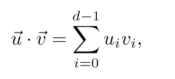
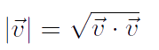
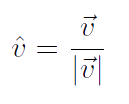
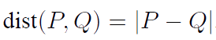
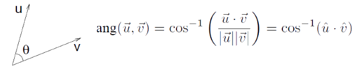
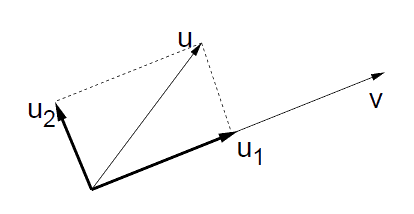

<!--
  backdrop: affine-geometry
-->

# Geometria

---
# Roteiro

1. Motivação
1. História da Geometria
1. Geometria Afim
1. Geometria Euclidiana
1. Sistema de Coordenadas

---
# Motivação

---
## Motivação

- Muitas áreas na computação usam **programação geométrica**
  - Computação Gráfica, Visão Computacional, Robótica,
    <abbr title="Geographic Information Systems">GIS</abbr>
- Computação Gráfica lida com geometria de retas e objetos lineares num espaço
  bi ou tridimensional

---
## Problemas Típicos (1/2)

- **Interseção** (ou colisão)
  - Dado um cubo e um raio ~~privatizador~~ (uma semi-reta), o raio acerta o cubo?
  - Se acerta, em qual face?
  - Se ele refletir dessa face, em qual direção?
- **Transformação**
  - Dados 4 vértices formando um polígono, quais seriam as novas coordenadas se
    o polígono fosse rotacionado 30° no eixo X?
    - Ou então se mudarmos a câmera de posição

---
## Problemas Típicos (2/2)

- **Orientação**
  - 3 pontos colineares definem um plano. Dado um quarto ponto, ele está acima,
    abaixo ou pertence ao plano?
- **Mudança de coordenadas**
  - Dada uma esfera em um sistema de coordenadas (e.g., polar), quais seriam as coordenadas
    da esfera em um outro sistema de coordenadas (e.g., cartesiano)?

---
## Exemplo de problema: **rotação**

- Para gerar a segunda figura a partir da primeira, preciso reescrever as
  coordenadas de cada vértice "na mão"?

- Sim, é possível!
  - Mas dá muito trabalho e **bons programadores são preguiçosos**

---
## Exemplo de problema: **rotação** (cont.)

- E se quisermos fazer uma animação?

<iframe src="../../samples/rotate/rotate-anim.htm" width="100%" height="500" frameborder="0"></iframe>

---
# Objetivos de hoje

- Vamos supor que estamos na década de 90 e **vamos inventar uma peça de
  _hardware_ para fazer os cálculos necessários** (podemos batizá-la de
  placa de vídeo :) para gerar imagens à partir de cenas bi/tridimensionais
- Vamos precisar:
  1. Definir que **tipos de operações com números** nosso _hardware_ deve fazer
  1. Restringir as operações a um **conjunto mínimo viável** (porque _hardware_
    é caro e complexo)
  1. Encontrar uma forma de fazer **várias operações ao mesmo tempo** (para
    que seja rápido)

---
# Geometria

---
## Geometria

- Um dos mais antigos ramos da matemática
  - Usado para demarcação de terras (geo + metria)
- Civilizações muito antigas devem ter tido uma compreensão bastante
  sofisticada de geometria
  - Aplicação em construções, como as pirâmides
- Porém, somente na época de **Euclides**, a geometria foi axiomatizada e
  formalizada
  - **300 a.C.** na Grécia

---
## Surgimento da **Geometria Afim**

- Somente por volta de **1600 d.C.**, com Descartes, as coordenadas
  cartesianas foram desenvolvidas
  - Possibilitando conceitos geométricos serem representados algebricamente
- A partir dos anos **1800 d.C.** começou-se a questionar se a geometria
  de Euclides era a única geometria possível
  - Novas geometrias foram propostas:
    - Lobachevski (hiperbólica), Gauss (diferencial)
- Vamos discutir 3 geometrias ao longo da matéria:
  - Geometria euclidiana (300 a.C.)
  - Geometria afim (1800+ d.C.)
  - Geometria projetiva (1900 d.C., _en passant_)

---
# Geometria Afim

---
## **Definição** de Geometria Afim

- Estudo de propriedades geométricas preservadas por
  transformações afim
  - Informalmente chamada de "estudo das linhas paralelas"
- Conceitos:
    - **Transformação linear**: função entre dois espaços de vetores
      que preserva soma de vetores e multiplicação por escalares
      - Exemplo: rotação de um objeto
    - **Transformação afim**: transformações lineares + transformação de
      translação

---
## Elementos da Geometria Afim

- Elementos fundamentais:
  - **Escalares**: números reais
  - **Pontos**
  - **Vetores (livres)**:
    - Representam apenas um deslocamento em uma direção/sentido
    - Não são posicionados
  - ~~Distâncias~~, ~~Ângulos~~ Fim! :)
- Não há o conceito de origem do mundo
- Premissa da geometria afim: preservar **paralelismo** e **colineraridade**

---
## **Escalar**

- Números reais
- Representa uma **grandeza não geométrica**
- Notação típica:
  - Letras minúsculas (inclusive gregas):
    - \alpha, \beta, \gamma, x, t

---
## **Ponto** e **Vetor**

- Podem ser representados por um conjunto de coordenadas no espaço
  (R^2, R^3, R^n)
- **Ponto**
  - Representa uma localização no espaço
  - Notação típica: letras maíusculas
    - P, Q, R
- **Vetor**
  - Representa uma grandeza geométrica. Entendido como um deslocamento.
  - Notação típica: letras minúsculas com setinha
    - \vec{u}, \vec{v}, \vec{w}

---
## Operações (1/4)

- Multiplicação escalar-vetor
  - \vec{v} = \alpha \times \vec{u}

---
## Operações (2/4)

- Adição vetor-vetor
  - \vec{w} = \vec{u} + \vec{v}
  - \vec{w} = \vec{u} - \vec{v}
    - \vec{w} = \vec{u} + (-1 \times \vec{v})

---
## Operações (3/4)

- Diferença ponto-ponto
  - \vec{v} = P - Q

---
## Operações (4/4)

- Adição ponto-vetor
  - Q = P + \vec{u}
  - Q = P - \vec{u}

---
## **Combinação Afim**

- 
  Dados dois pontos P e Q,
  um ponto entre P e Q que
  divide o segmento PQ em
  dois com proporções \alpha e
  (1 - \alpha), \alpha \in [0, 1]
  - No ponto central, \alpha = \frac{1}{2}
- Corresponde a pegar o vetor P - Q, multiplicar
  pelo escalar \alpha, e então somar o vetor
  resultante ao ponto Q:
  
R = Q + \alpha (P-Q)

  
R = Q + \alpha P - \alpha Q

  
R = (1 - \alpha) Q + \alpha P

---
## Combinação Afim (cont.)

- Observe que na medida em que \alpha varia entre
  0 e 1,
  R varia de Q até
  P
- Podemos permitir \alpha variar arbitrariamente,
  definindo toda a reta
- No caso particular em que \alpha \in [0,1],
  chamamos a combinação afim de **combinação convexa**

---
## **Definição Geral** da Combinação Afim

- Dada uma sequência de pontos P_1, P_2, ..., P_n,
  uma combinação afim seria uma soma da forma:
  
\alpha_1 P_1 + \alpha_2 P_2 + ... + \alpha_n P_n

  ...onde os escalares satisfazem a regra:

  
\sum_{i=1}^{n} {\alpha} = 1

- Para combinação convexa, \alpha_i \ge 0 e
  1 \le i \le n
- O que seria uma combinação afim de 3 pontos? E uma combinação convexa?

---
## Combinação Afim de 3 pontos

---
# Geometria Euclidiana

<blockquote style="font-style: italic">
  Um ponto é aquele que não tem partes. 
  Uma linha é um comprimento sem espessura. 
  As extremidades de uma linha são pontos. 
  Uma linha reta é a linha que percorre uniformemente os pontos nela mesma.
</blockquote>
As primeiras quatro definições do livro _Elementos_ do poeta Euclides

---
## Geometria Euclidiana

- Não existem elementos para expressar ângulos e distâncias em geometria afim
- Acrescenta-se uma operação: **Produto Interno**
  - Definição
    - Transforma dois vetores em um escalar
    - Expressa como (u, v) ou u &middot; v
  - Várias propriedades
    - Positividade: (u, u) &ge; 0, e (u, u) = 0 &hArr; u = 0
    - Simetria: (u, v) = (v, u)
    - Bilinearidade: (u, v+w) = (u, v) + (u, w) e (u, &alpha;v) = &alpha;(u, v)

---
## Produto Interno

- Foco na definição mais comum de produto interno
  - _Dot Product_, ou **produto escalar**
  - Suponha que um vetor num espaço Rn é expressado como d escalares
    (coordenadas): u = (u0, u1, ..., d-1)

    

---
## Conceitos derivados

- Comprimento (norma)
  - Dado pela raiz quadrada da do produto interno do vetor consigo mesmo

    
- Normalização
  - 
    Um vetor não nulo normalizado corresponde a um vetor na mesma direção do
    vetor original, porém com comprimento unitário

---
## Conceitos derivados (cont.)

- Distância entre dois pontos
  - 
    Corresponde ao comprimento do vetor diferença

- Ângulo
  - O ângulo entre dois vetores corersponde ao arco-cosseno do produto interno
    dos dois vetores normalizados

    

---
## Conceitos derivados (cont.)

- Ortogonalidade
  - Dois vetores são ditos ortogonais (perpendiculares) se o produto interno é 0
- Projeção ortogonal
  - Dados u e v, pode-se representar u como sendo a soma de dois vetores
    u1 e u2 tais que u1 é paralelo a v e
    u2 é perpendicular
    
  - u1 é chamado a projeção ortogonal de u em v

---
## Representação de objetos

- Se a geometria afim não define uma origem, não temos como representar objetos
  ainda
- A partir de 2 vetores **linearmente independentes**
  (\vec{u}_1 e \vec{u}_2)
  é possível representar unicamente qualquer outro vetor num plano
  - Conceito de algebra linear
  - Combinação linear:

    
\vec{v} = \alpha_1 \vec{u}_1 + \alpha_2 \vec{u}_2

- **Em OpenGL**: `glOrtho` nos permite definir exatamente esses vetores

---
## Representação de vetores (cont.)

- Dada uma base ortonormal (ortogonal, unitária) e o espaço R³
  - Qualquer vetor pode ser expresso como a combinação linear:
    
\vec{v} = \alpha_x \vec{e}_x + \alpha_y \vec{e}_y + \alpha_z \vec{e}_z

  - O vetor (\alpha_x, \alpha_y, \alpha_z)
    contém as **coordenadas cartesianas** do vetor \vec{v}

---
## Representação de pontos (cont.)

- Vamos considerar um ponto arbitrário O como o centro do nosso espaço
- Consideremos, também, uma base u (u0, u1, u2)
- Dado um ponto P qualquer, P - O é um vetor
  - Que pode ser expresso a partir de uma combinação linear dos
    vetores da base

    P = &alpha;0u0 + &alpha;1u1 + &alpha;2u2 + O;

---
# Sistema de Coordenadas

Um sistema de coordenadas para um espaço afim n-
dimensional consiste de um **ponto origem** e um conjunto de
**n vetores de base linearmente independentes**

---
## Exemplo

---
## **Coordenadas Homogêneas**

- Vetores e pontos no espaço R^n são normalmente
  representados por uma tupla com n+1 escalares
  - Define-se que o último componente seja:
    - 0 para vetores
    - 1 para pontos
- A coordenada homogênea é usada para se distinguir um ponto de um vetor
  - última coordenada = 1 &hArr; ponto
  - última coordenada = 0 &hArr; vetor
  - outros valores, operação ilegal

---
## Sistemas de Coordenadas alternativos

- Podemos ter mais de um sistema presente em um mesmo modelo
  - Para conveniência da modelagem
  - Cada objeto tem o seu
  - Coordenadas da cena
- Sistema de coordenadas padrão
  - e0 = (1, 0, 0, 0)
  - e1 = (0, 1, 0, 0)
  - e2 = (0, 0, 1, 0)
  - O = (0, 0, 0, 1)
---
# Referências

1. Apêndice A do livro Real-Time Rendering
1. Lições 6 e 7 das anotações do prof. David Mount
