# Composição de Transformações e
# Modelagem Hieráquica

---
# Objetivos

1. Entender como compor transformações
1. Entender a (grande) utilidade das pilhas de matrizes em OpenGL

---
# Composição de Transformações

---
## Composição de Transformações

- Frequentemente é necessário fazer várias transformações
  geométricas para posicionar objetos
  - Exemplo: combinação de rotações e translações
- A **ordem com que transformações** são aplicadas importa...
  - ...porque a multiplicação de matrizes <u>não é comutativa</u>

---
## Compondo transformações

- Há 02 formas para compor transformações. Sejam:
  - <span class="math">A</span> a matriz que já tínhamos
  - <span class="math">B</span> a matriz com a nova transformação
  - <span class="math">C</span> a matriz resultante
- (1) **<u>Pós</u>-multiplicação**: nova matriz à <u>direita</u> da existente
  - <span class="math">C = A \times B</span>
- (2) **<u>Pré</u>-multiplicação**: nova matriz à <u>esquerda</u> da existente
  - <span class="math">C = B \times A</span>
- O OpenGL faz **<u>pós</u>-multiplicação** com suas funções de
  multiplicação de matriz (_e.g._, `glTranslate`, `glOrtho`)


<!-- - Contudo, se invertermos a ordem com que invocamos as transformações,
  podemos "fazer o OpenGL" pré-multiplicar
  - Qual forma usar **depende de como você prefere pensar** -->


<!-- ## Duas formas de se pensar

- Como você pensa na composição é a forma de determinar como
  você deveria concatenar as matrizes (pré ou pós)
- 
  Ambas as formas funcionam mas, dependendo da situação, uma forma
  pode ser mais conveniente que a outra
- Exemplo: suponha 3 transformações:
  1. <span class="math">R(30)</span>: rotaciona 30°
  1. <span class="math">T(2,0)</span>: translada 2u eixo x
  1. <span class="math">S(0.5)</span>: escala por 0,5
 -->

---
## Exemplo: <u>pós</u>-multiplicação

- <pre style="float: right; margin-left: 1em;"><code class="hljs lang-c">glLoadIdentity();
glRotate(30);
glTranslate(2, 0);
glScale(0.5);
desenhaNaOrigem();</code></pre>
  Exemplo: suponha 3 transformações:
  1. <span class="math">R(30)</span>: rotaciona 30°
  1. <span class="math">T(2,0)</span>: translada 2u eixo x
  1. <span class="math">S(0.5)</span>: escala por 0,5
- <span class="math">M = I \times R \times T \times S</span>
- Devemos considerar que estamos transformando o sistema de coordenadas
  ("cursor onde desenhar"), e não os objetos

---
## <u>Pós</u>-multiplicação: sistema **local**

- <pre style="float: right; margin-left: 1em;"><code class="hljs lang-c">glLoadIdentity();
glRotate(30);
glTranslate(2, 0);
glScale(0.5);
desenhaNaOrigem();</code></pre>
  Tudo que é feito altera a posição e orientação do
  sistema de coordenadas local


<figure class="picture-steps clean">
  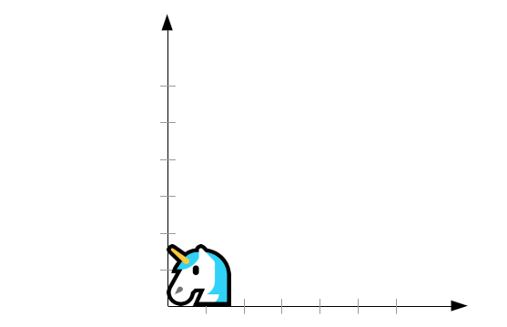
  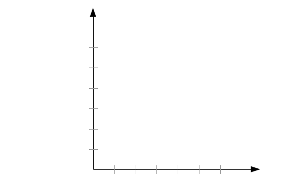
  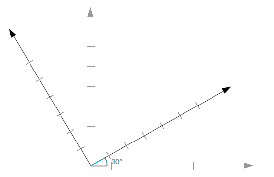
  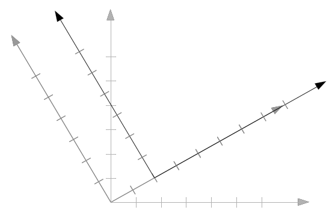
  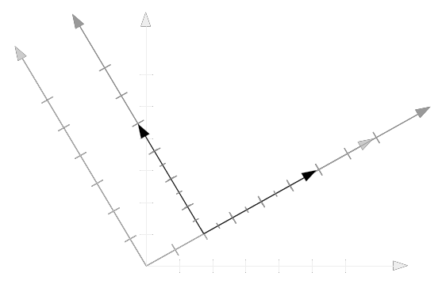
  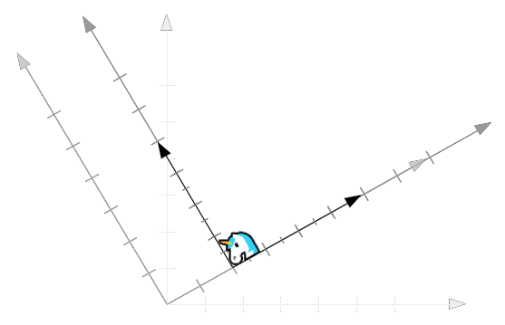
</figure>

---
## <u>Pré</u>-multiplicação: sistema **global**

- <pre style="float: right; margin-left: 1em;"><code class="hljs lang-c">glLoadIdentity();
glScale(0.5);
glTranslate(2, 0);
glRotate(30);
desenhaNaOrigem();</code></pre>
  Tudo que é feito é relativo à origem e a base do sistema
  de coordenadas global (do mundo)

<figure class="picture-steps clean">
  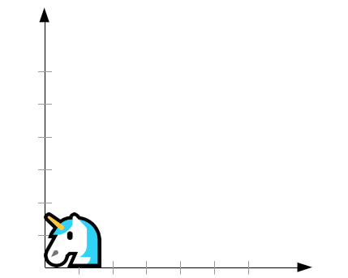
  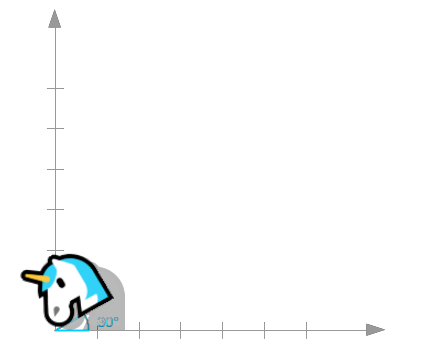
  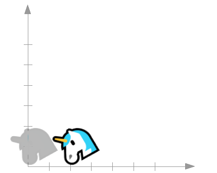
  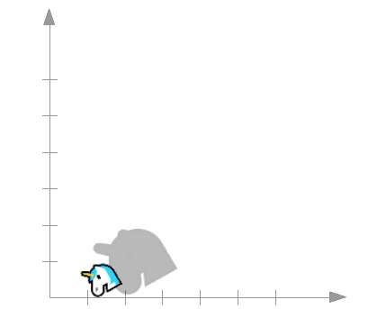
</figure>


---
## Qual forma devo usar?

- As duas formas funcionam, então é uma questão de decisão
- Os dois métodos darão a sequência de transformação na ordem inversa
- Normalmente é mais fácil controlar o objeto pensando nas
  transformações como **alterando o sistema de coordenadas local**
  - O OpenGL funciona com **pós-multiplicação**, então é mais
    fácil pensar assim

---
## Pós-multiplicação em OpenGL

- Para cada nova matriz de transformação, o OpenGL a pós-multiplica com
  a matriz no topo da pilha corrente:
  - <span class="math">M' = M \times T_{nova}</span>
  - <span class="math">NovaNaPilha = AtualDaPilha \times NovaTransformacao</span>
- Exemplo: fazer uma translação e então rotação
  - 0) <span class="math">M = Identidade</span>
  - 1) Translação <span class="math">T(t_x, t_y)</span>: <span class="math">M = M \times T</span>
  - 2) Rotação <span class="math">R(\alpha)</span>: <span class="math">M = M \times R</span>
  - 3) Transformando um ponto <span class="math">P</span>: <span class="math">P' = M \times P</span>

---
## Transformação em OpenGL

- Ao usar OpenGL, devemos pensar na transformação de objetos
  como uma alteração do sistema de coordenadas local
- Todas as transformações são executadas **relativas ao sistema
  de coordenadas corrente**

---
## Translação de sistema de coordenadas

- Transladar (3, 3)
  <figure style="position: relative;width:100%;height:300px;">
    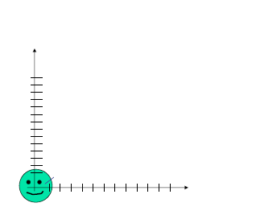
    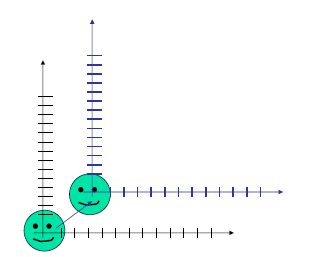
  </figure>

---
## Translação de sistema de coordenadas

- Transladar (3, 3)
  <figure style="position: relative;width:100%;height:300px;">
    
    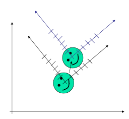
  </figure>


---
## Rotação de sistema de coordenadas

- Rotacionar (30°)
  <figure style="position: relative;width:100%;height:300px;">
    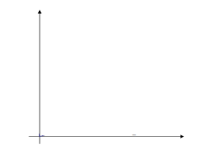
    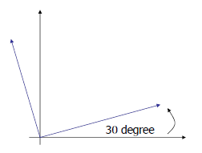
  </figure>

---
## Escala de sistema de coordenadas

- Escalar (.5, .5)
  <figure style="position: relative;width:100%;height:300px;">
    
    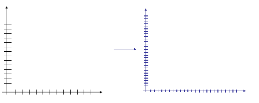
  </figure>

---
## Resumindo

- Em OpenGL
  - Pense nas transformações como movimentação de sistemas de coordenadas
  - Chame as funções de transformação nessa ordem
  - OpenGL faz pós-multiplicação de matrizes
  - A matriz de acumulação multiplicará os vértices dos objetos
- Exemplo: [Composição de Tranformações](codeblocks:composicao-transformacoes/CodeBlocks/composicao-transformacoes.cbp)

---
# Modelagem Hierárquica


---
## Exemplo do carro (1)

```c
void desenhaCarroTodo(struct chassi_t chassi) {
  glPushMatrix();
    glTranslatefv(chassi.posicaoCentro);
    desenhaChassi();

    for (int i = 0; i < NUM_RODAS; i++) {
      glPushMatrix();
        glTranslatefv(chassi.roda[i].posicaoCentro)
        desenhaRodaEPneu();
      glPopMatrix();      
    }
  glPopMatrix();
}
```

---
## Exemplo do carro (2)

```c
void desenhaRodaEPneu() {
  desenhaRoda();

  for (int i = 0; i < NUM_PARAFUSOS; i++) {
    glPushMatrix();
      float angulo = ((float)i) / NUM_PARAFUSOS;
      glRotatef(angulo, 0, 0, 1);
      glTranslatefv(RAIO_PARAFUSO)
      desenhaParafuso();
    glPopMatrix();      
  }
  desenhaPneu();
}
```

- Exemplo: [Braço do Robô](codeblocks:braco-robo/CodeBlocks/braco-robo.cbp)

---
# Trabalho Prático 2 \o/

_A wild TP2 appears..._

---
## TP2: Zeppelin


  -- _Neste trabalho, vamos criar um zeppelin sobrevoando uma pequena cidade._
  _Ou um [DeLorean](https://pt.wikipedia.org/wiki/Back_to_the_Future)_
  _sobrevoando a futurista Hill Valley. Ou um OVNI sobrevoando uma fazenda_
  _para abduzir vaquinhas._

- Enunciado no Moodle (ou [na página do curso](https://github.com/fegemo/cefet-cg/blob/master/assignments/tp2-zeppelin/README.md)).
