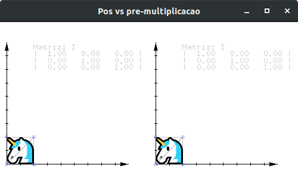

<!-- { "layout": "title" } -->
# Composição de Transformações e Modelagem Hieráquica

---
<!-- { "layout": "section-header" } -->
# Composição de Transformações

1. Entender como combinar transformações

---
<!-- { "layout": "regular" } -->
## Composição de transformações

- Frequentemente é necessário fazer várias transformações
  geométricas para posicionar objetos
  - Exemplo: combinação de rotações e translações
- A **ordem com que transformações** são aplicadas <u>importa</u>...
  - ...porque a multiplicação de matrizes <u>não é comutativa</u>

---
<!-- { "layout": "regular" } -->
## Compondo transformações

- Há 02 formas para compor transformações. Sejam:
  - <span class="math">A</span> a matriz que já tínhamos <small>(no topo da pilha atual)</small>
  - <span class="math">B</span> a matriz com a nova transformação <small>(gerada e.g. via `glTranslate`)</small>
  - <span class="math">C</span> a matriz resultante <small>(da multiplicação das duas)</small>
- (1) **<u>Pós</u>-multiplicação**: nova matriz à <u>direita</u> da existente
  - <span class="math">C = A \times B</span>
- (2) **<u>Pré</u>-multiplicação**: nova matriz à <u>esquerda</u> da existente
  - <span class="math">C = B \times A</span>

O OpenGL faz **<u>pós</u>-multiplicação** com suas funções de
multiplicação de matriz (_e.g._, `glTranslate`, `glRotate`, `glOrtho`). <!-- {p:.note.info} -->

---
<!-- {"layout": "2-column-content", "slideClass": "compact-code-more"} -->
## **Exemplo**: <u>pós</u>-multiplicação

1. ```c
   glLoadIdentity();         // carrega identidade
   glRotatef(30);            // se existisse versão 2d
   glTranslate(2, 0);        // idem
   glScale(0.5);             // idem
   desenhaUnicornioNaOrigem(); // 🦄
   ```
   <!-- {ol:.no-margin.no-bullet style="padding-left: 0;"} -->
1. <div class="math bullet" style="font-size: 14px;">M = \begin{vmatrix}1 & 0 & 0 \\0 & 1 & 0 \\0 & 0 & 1\end{vmatrix} \times \begin{vmatrix}0.87 & -0.5 & 0 \\0.5 & 0.87 & 0 \\0 & 0 & 1\end{vmatrix} \times \begin{vmatrix}1 & 0 & 2 \\0 & 1 & 0 \\0 & 0 & 1\end{vmatrix} \times \begin{vmatrix}0.5 & 0 & 0 \\0 & 0.5 & 0 \\0 & 0 & 1\end{vmatrix}</div>
1. <div class="math bullet" style="font-size: 14px;">M = \begin{vmatrix}0.43 & -0.25 & 1.73 \\0.25 & 0.43 & 1 \\0 & 0 & 1\end{vmatrix}</div>

- Suponha 3 transformações:
  1. <span class="math">R(30)</span>: rotaciona 30°
  1. <span class="math">T(2,0)</span>: translada 2u eixo x
  1. <span class="math">S(0.5)</span>: escala por 0,5
- <span class="math">M = I \times R \times T \times S</span>
- Devemos considerar que estamos transformando o sistema de coordenadas
  ("cursor onde desenhar"), e não os objetos

---
<!-- {"layout": "2-column-content", "slideClass": "compact-code-more"} -->
## <u>Pós</u>-multiplicação: sistema **local**

- ```c
  glLoadIdentity();
  glRotate(30);
  glTranslate(2, 0);
  glScale(0.5);
  desenhaUnicornioNaOrigem();
    // v3 (0,2)----(2,2) v2
    //      |        |
    //      |        |
    // v0 (0,0)----(2,0) v1
  ```
  Tudo que é feito altera a posição e orientação do
  sistema de coordenadas local <!-- {ul:.no-bullet style="padding: 0;"} -->
- <div class="math bullet" style="font-size: 14px;">M = \begin{vmatrix}0.43 & -0.25 & 1.73 \\0.25 & 0.43 & 1 \\0 & 0 & 1\end{vmatrix}</div>

1. <figure class="picture-steps clean">
     
     
     
     
     
     
   </figure>
1. <!-- {ol:.no-bullet.bulleted.no-margin style="padding-left: 0"} -->
   Supondo 4 vértices indo de 0 a 2 em <span class="math">x, y</span>:
   - <div class="math" style="font-size: 14px;">M \times v_0 = \begin{vmatrix}0.43 & -0.25 & 1.73 \\0.25 & 0.43 & 1 \\0 & 0 & 1\end{vmatrix} \times \begin{vmatrix}0 \\ 0 \\ 1\end{vmatrix} = \begin{vmatrix}1.73 \\ 1 \\ 1\end{vmatrix}</div>
   - <div class="math" style="font-size: 14px;">M \times v_1 = \begin{vmatrix}0.43 & -0.25 & 1.73 \\0.25 & 0.43 & 1 \\0 & 0 & 1\end{vmatrix} \times \begin{vmatrix}2 \\ 0 \\ 1\end{vmatrix} = \begin{vmatrix}2.6 \\ 1.5 \\ 1\end{vmatrix}</div>
   - <div class="math" style="font-size: 14px;">M \times v_2 = \begin{vmatrix}0.43 & -0.25 & 1.73 \\0.25 & 0.43 & 1 \\0 & 0 & 1\end{vmatrix} \times \begin{vmatrix}2 \\ 2 \\ 1\end{vmatrix} = \begin{vmatrix}2.10 \\ 2.37 \\ 1\end{vmatrix}</div>


---
<!-- {"layout": "2-column-content", "slideClass": "compact-code-more"} -->
## <u>Pré</u>-multiplicação: sistema **global**

- ```c
  glLoadIdentity();
  glScale(0.5);
  glTranslate(2, 0);
  glRotate(30);
  desenhaNaOrigem();
  ```
  Tudo que é feito é relativo à origem e a base do sistema
  de coordenadas global (do mundo) <!-- {.no-bullet} -->


1. <!-- {ol:.no-bullet} -->
   <figure class="picture-steps clean">
   
   
   
   
   </figure>
   <figure class="picture-steps clean" style="display: inline-block">
   
   </figure>

---
<!-- { "layout": "centered-horizontal" } -->
## Exemplo: [pós vs pré-multiplicação](codeblocks:pos-pre-multiplicacao/CodeBlocks/pos-pre-multiplicacao.cbp)



---
<!-- { "layout": "regular" } -->
## Qual forma devo usar?

- As duas formas funcionam, então é uma questão de decisão
- Os dois métodos darão a sequência de transformação na ordem inversa
- Normalmente é mais fácil controlar o objeto pensando nas
  transformações como **alterando o sistema de coordenadas local**
  - O OpenGL funciona com **pós-multiplicação**, então é mais
    fácil pensar assim

---
<!-- { "layout": "regular" } -->
## Resumindo

- Em OpenGL
  - Pense nas transformações como movimentação de sistemas de coordenadas
  - Chame as funções de transformação nessa ordem
  - OpenGL faz pós-multiplicação de matrizes
  - A matriz de acumulação multiplicará os vértices dos objetos
- Exemplo: [Composição de Transformações](codeblocks:composicao-transformacoes/CodeBlocks/composicao-transformacoes.cbp)

---
<!-- { "layout": "section-header", "slideClass": "modelagem-hierarquica" } -->
# Modelagem Hierárquica

---
<!-- { "layout": "regular" } -->
## Exemplo do carro (1/2)

```c
void desenhaCarroTodo(struct chassi_t chassi) {
    glPushMatrix();
        float* centroChassi = chassi.posicao;
        glTranslatef(centroChassi[0], centroChassi[1], centroChassi[2]);
        desenhaChassi();

        for (int i = 0; i < NUM_RODAS; i++) {
            float* centroRoda = chassi.rodas[i].posicao;
            glPushMatrix();
                glTranslatef(centroRoda[0], centroRoda[1], centroRoda[2]);
                desenhaRodaEPneu();
            glPopMatrix();      
        }
    glPopMatrix();
}
```

---
<!-- { "layout": "regular", "slideClass": "compact-code" } -->
## Exemplo do carro (2/2)

```c
void desenhaRodaEPneu() {
    desenhaRoda();

    for (int i = 0; i < NUM_PARAFUSOS; i++) {
        glPushMatrix();
            float angulo = ((float)i) / NUM_PARAFUSOS;
            glRotatef(angulo, 0, 0, 1);
            glTranslatef(RAIO_PARAFUSO, 0, 0);
            desenhaParafuso();
        glPopMatrix();      
    }
    desenhaPneu();
}
```

- Exemplo: [Braço do Robô](codeblocks:braco-robo/CodeBlocks/braco-robo.cbp)

---
<!-- { "layout": "main-point" } -->
# Trabalho Prático 2 \o/

_A wild TP2 appears..._ <!-- {style="color: white;"} -->

---
<!-- { "layout": "regular" } -->
## TP2: Parque de Diversões


  -- _A Disney comprou o CEFET ~~for legal reasons, that's a joke~~ e colocou
  a turma de Computação Gráfica para administrar os parques da empresa. Seu
  trabalho é projetar o próximo parque de diversões._

- Enunciado no Moodle (ou [na página do curso](https://github.com/fegemo/cefet-cg/blob/master/assignments/tp2-amusement/README.md)).
