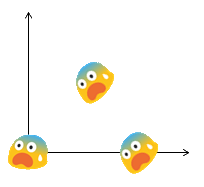
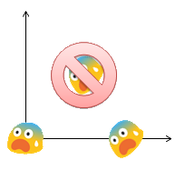
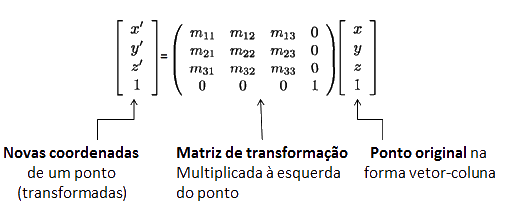
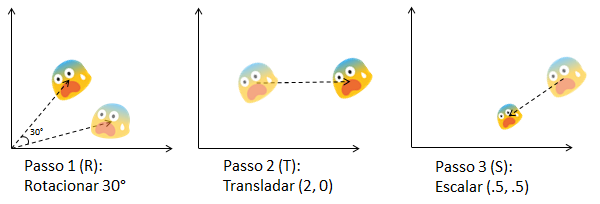
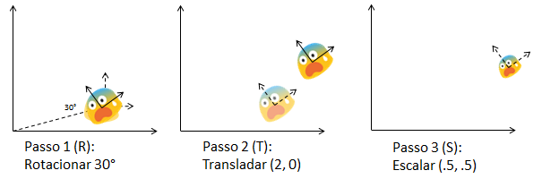

# Composição de Transformações
## +
# Modelagem Hieráquica
---
# Objetivos

1. Entender como compor transformações
1. Entender a (grande) utilidade das pilhas de matrizes em OpenGL

---
# Composição de Transformações

---
## Composição de Transformações

- Frequentemente é necessário fazer várias transformações
  geométricas para posicionar objetos
  - Exemplo: combinação de rotações e translações
- A **ordem** com que transformações são aplicadas importa
  - Multiplicação de matrizes não é comutativa

    

---
## Exemplo

- Translação (5,0) e depois rotação (60°) ou
- Rotação (60°) e depois translação (5,0)?
- Rotação e depois translação!!  

<figure style="position: relative;width:100%;height:100px;left:50%;margin-left:-50px">
  
  
</figure>

---
## Compondo transformações

- Vamos considerar uma transformação genérica de um ponto

  

---
## Compondo transformações - concatenação

- Há duas formas de se concatenar duas matrizes de transformação
  1. Pré-multiplicação
  1. Pós-multiplicação
- Pré-multiplicação é multiplicar a nova matriz (B) **à esquerda** da
  matriz existente (A) para receber o resultado (C):
  - C = B * A
- Pós-multiplicação é multiplicar a nova matriz (B) **à direita** da
  matriz existente (A) para receber o resultado (C):
  - C = A * B
- Qual forma usar **depende de como você prefere pensar**
  - O OpenGL usa **pós-multiplicação**

---
# Marotinho: [Transformação em OpenGL](https://moodle.cefetmg.br/mod/quiz/view.php?id=18346)

---
## Duas formas de se pensar

- Como você pensa na composição é a forma de determinar como
  você deveria concatenar as matrizes (pré ou pós)
- Ambas as formas funcionam mas, dependendo da situação, uma forma
  pode ser mais conveniente que a outra

  

---
## Transformando em relação ao **sistema global**

- Tudo que é feito é relativo à origem e a base do sistema
  de coordenadas global (do mundo)

  
- Neste caso, **pré-multplicamos** as matrizes para encontrar a
  composta (M):
  - M = S * T * R

---
## Transformando em relação ao **sistema local**

- Tudo que é feito altera a posição e orientação do
  sistema de coordenadas local

  
- Neste caso, **pós-multplicamos** as matrizes para encontrar a
  composta (M):
  - M = R * T * S

---
## Qual forma devo usar?

- As duas formas funcionam, então é uma questão de decisão
- Os dois métodos darão a sequência de transformação na ordem inversa
- Normalmente é mais fácil controlar o objeto pensando nas
  transformações como **alterando o sistema de coordenadas local**
  - O OpenGL funciona com **pós-multiplicação**, então é mais
    fácil pensar assim

---
## Pós-multiplicação em OpenGL

- Para cada nova matriz de transformação, o OpenGL a pós-multiplica com
  a matriz no topo da pilha corrente:
  - M' = M * T_{nova}
  - NovaNaPilha = AtualDaPilha * NovaTransformacao
- Exemplo: fazer uma translação e então rotação
  - 0) M = Identidade
  - 1) Translação T(t_x, t_y): M = M * T
  - 2) Rotação R(\alpha): M = M * R
  - 3) Transformando um ponto P: P' = M * P

---
## Transformação em OpenGL

- Ao usar OpenGL, devemos pensar na transformação de objetos
  como uma alteração do sistema de coordenadas local
- Todas as transformações são executadas **relativas ao sistema
  de coordenadas corrente**

---
## Translação de sistema de coordenadas

- Transladar (3, 3)
  <figure style="position: relative;width:100%;height:300px;">
    
    
  </figure>

---
## Translação de sistema de coordenadas

- Transladar (3, 3)
  <figure style="position: relative;width:100%;height:300px;">
    
    
  </figure>

---
## Rotação de sistema de coordenadas

- Rotacionar (30°)
  <figure style="position: relative;width:100%;height:300px;">
    
    
  </figure>

---
## Escala de sistema de coordenadas

- Escalar (.5, .5)
  <figure style="position: relative;width:100%;height:300px;">
    
    
  </figure>

---
## Resumindo

- Em OpenGL
  - Pense nas transformações como movimentação de sistemas de coordenadas
  - Chame as funções de transformação nessa ordem
  - OpenGL faz pós-multiplicação de matrizes
  - A matriz de acumulação multplicará os vértices dos objetos
- Exemplo: [Composição de Tranformações](codeblocks:composicao-transformacao/CodeBlocks/composicao-transformacao.cbp)

---
# Modelagem Hierárquica

- Vide slides do professor Moisés Pereira
- Exemplo: [Braço do Robô](codeblocks:braco-robo/CodeBlocks/braco-robo.cbp)
