<!-- {"layout": "title"} -->
# Introdução à Computação Gráfica
## Conceitos importantes

---
<!-- {"layout": "centered"} -->
# Roteiro

1. Conceitos básicos
1. Dispositivos gráficos
1. Representação de Imagens
1. Modelos usados em Computação Gráfica

---
<!-- {"layout": "section-header", "slideClass": "conceitos-basicos"} -->
# Conceitos básicos

- Definição
- Usos comuns
- Áreas envolvidas

---
<!-- {"layout": "stripe"} -->
# Computação Gráfica

 <!-- {.stripe} -->

Definição: *s.f.* conjunto de **algoritmos, técnicas e metodologias** para
o **tratamento e a representação gráfica de informações** por meio da
criação, armazenamento e manipulação de desenhos por meio de
computadores e periféricos gráficos.

---
<!-- {"layout": "centered"} -->
# Quem usa Computação Gráfica?

1. ## Jogos <!-- {ol:.card-list.cover} -->
   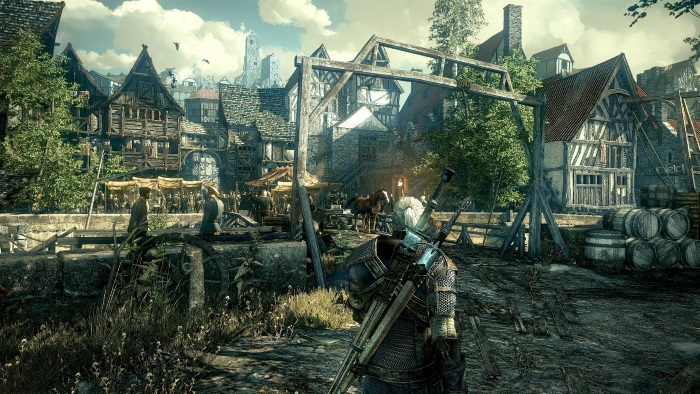 <!-- {style="width: 300px"} -->
1. ## Entretenimento
     <!-- {style="width: 300px"} -->
1. ## CAD
   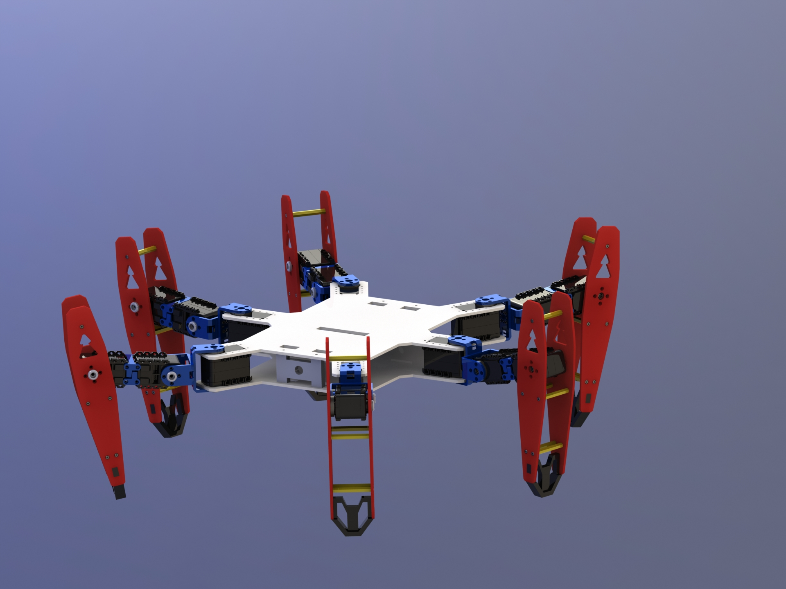  <!-- {style="width: 300px"} -->
1. ## Educação e Treinamento
   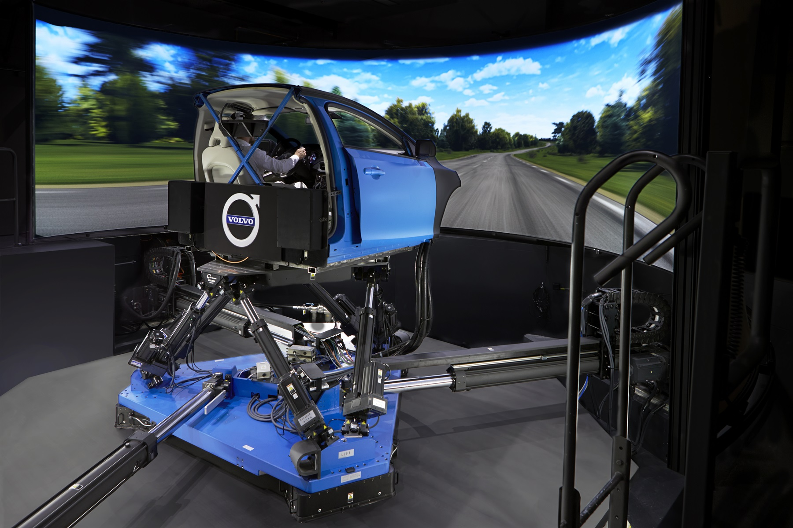  <!-- {style="width: 300px"} -->
1. ## Arte
   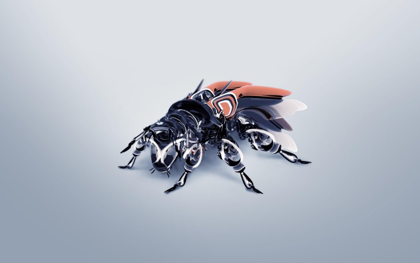  <!-- {style="width: 300px"} -->

*[CAD]: Computer Aided Design*

---
<!-- {"backdrop": "area-games"} -->
# Jogos

---
<!-- {"backdrop": "area-entertainment"} -->

# Entretenimento

<iframe src="https://player.vimeo.com/video/172374044" width="640" height="360" frameborder="0" allowfullscreen></iframe>

---
<!-- {"backdrop": "area-cad"} -->
# CAD (_Computer Aided Design_)

---
<!-- {"backdrop": "area-education"} -->
# Educação e Treinamento

---
<!-- {"backdrop": "area-art"} -->
# Arte por Computador

---
<!-- {"layout": "centered-horizontal"} -->
# **Problemas abordados** na área

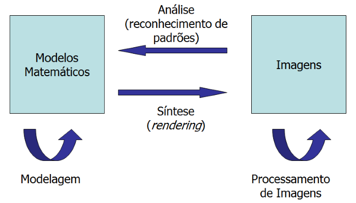

---
<!-- {"layout": "regular"} -->
## Processamento Digital de Imagens

- 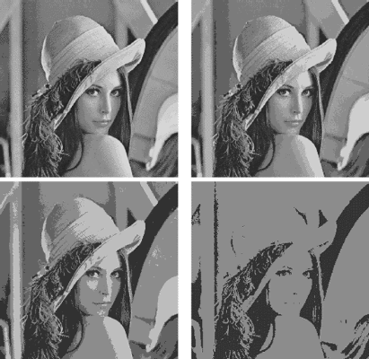 <!-- {.push-right} -->
  Área que envolve as **técnicas de transformação de imagens**, em que tanto
  a imagem original quanto a imagem resultado apresentam-se **sob uma
  representação visual** (geralmente matricial)
- Estas transformações **visam melhorar as características visuais da imagem** em geral,
  _e.g._:
  - aumentar o contraste
  - alterar o foco
  - diminuir ruídos e algumas distorções

---
<!-- {"layout": "regular"} -->
## Análise de Imagens

- 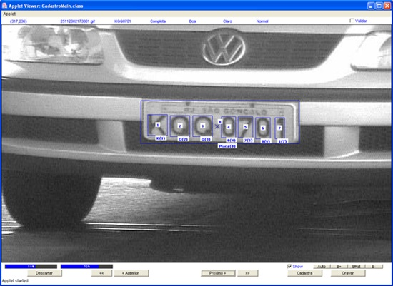 <!-- {.push-right} -->
  Área que procura **obter a especificação dos componentes de uma imagem a
  partir de sua representação visual**
- Por exemplo, reconstrução de primitivas elementares
  (cubos, esferas, etc.) que aproximam um objeto visualizado em uma imagem
  - Ou reconhecimento de caracteres em fotos ➡️
---
<!-- {"layout": "centered-horizontal"} -->
## Outro exemplo de Análise de Imagens

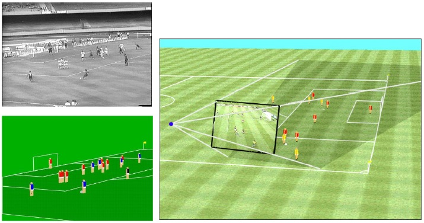

---
<!-- {"layout": "2-column-highlight-and-list"} -->
## Modelagem

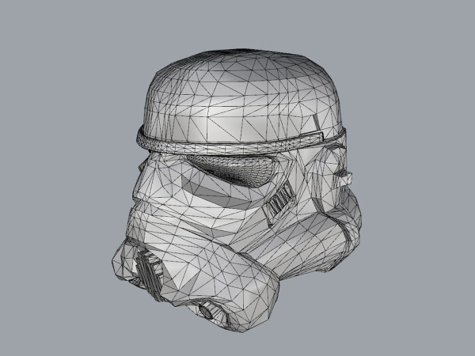

- A modelagem geométrica consiste de um **conjunto de métodos que visam
  descrever a forma e as características geométricas de um objeto**
- Ela provê uma descrição ou modelo muito mais analítico,
  matemático e abstrato que o real

---
<!-- {"layout": "2-column-highlight-and-list"} -->
## Síntese (ou renderização)

- A síntese de imagem designa o **processo de geração de imagens
  digitais a partir da descrição dos elementos que compõem uma cena 3D**,
  baseando-se em modelos que descrevem o comportamento da luz
- Síntese e modelagem são consideradas, por muitos autores, como
  **a própria Computação Gráfica de hoje em dia**.

---
<!-- {"layout": "regular"} -->
## Foco deste curso

- **Modelagem e <u>síntese</u>** de imagens
  - Processamento de imagens é uma área por si só
  - Visão computacional estuda a análise de imagens (e vídeos)
- Teoria e prática das técnicas e algoritmos envolvidos em modelagem e síntese
- Geração de imagens em tempo real
  - Mas também veremos geração *offline*

1. ## Modelagem
    <!-- {ol:.card-list.centered style="max-width: 400px"} -->
1. ## Renderização
   

---
<!-- {"layout": "centered"} -->
## Professor, mas eu quero fazer desenhos em 3D!

- Você pode fazer isso e ganhar pontinhos extras nos trabalhos
- Contudo, o foco do curso está em conhecer e entender como funcionam as
  ferramentas utilizadas na criação de imagens e animações 3D
- Algumas ferramentas para criar cenas 3D:
  - [3ds Max](3ds-max) (~5 GB, licença de estudante gratuita)
  - [Maya lt](maya-lt) (~5 GB, licença de estudante gratuita)
  - [blender](blender) (~300 MB, gratuito)
  - [ZBrush](z-brush) (comercial)
  - [clara.io](claraio) (tem versão gratuita, programa limitado)

[blender]: http://www.blender.org/
[claraio]: https://clara.io/
[3ds-max]: http://www.autodesk.com/education/free-software/3ds-max
[maya-lt]: http://www.autodesk.com/education/free-software/maya-lt
[z-brush]: http://pixologic.com/

---
<!-- {"layout": "section-header", "slideClass": "pixels-gradient"} -->
# Dispositivos gráficos

- Interface gráfica
- Monitores
- Arquiteturas de sistemas gráficos

---
<!-- {"layout": "regular"} -->
## Interfaces gráficas

- 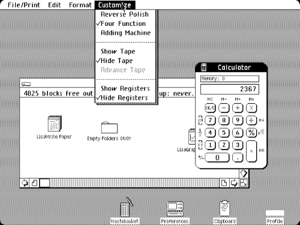 <!-- {.push-right} -->
  Interfaces baseadas em texto (~1980)
- Interface WIMP: Windows, Icons, Menus and Pointers

*[WIMP]: Windows, Icons, Menus and Pointers*

---
<!-- {"layout": "regular"} -->
## Dispositivos gráficos

- Monitores **raster**
  - Raster é a discretização da imagem em pedacinhos,
    os _picture elements_ (ou **pixels**)
  - Tecnologias diferentes:
    - CRT
    - Plasma
    - LCD, LED <!-- {ul^0:.multi-column-list-3} -->
- 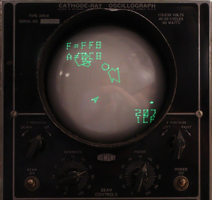
  Monitores vetoriais (1963)
  - Desenham como uma caneta, eg osciloscópio ➡️
  - Em desuso desde 1970
- Impressoras

---
<!-- {"layout": "centered"} -->
## _Cathode Ray Tube_ (CRT)

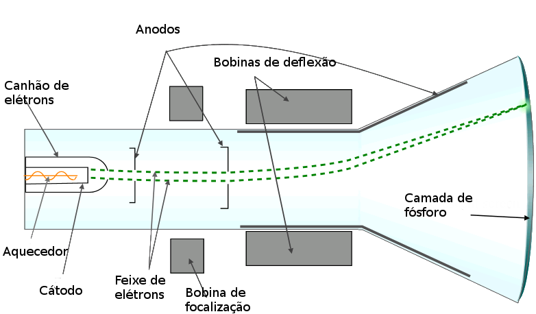

---
<!-- {"backdrop": "subpixel"} -->
<iframe width="800" height="450" src="https://www.youtube.com/embed/3BJU2drrtCM?start=70" frameborder="0" allow="encrypted-media" allowfullscreen></iframe>

<input type="range" id="subpixel-size" value="2" min="2" max="80" oninput="document.querySelector('.subpixel').style.setProperty('--subpixel-size', `${this.value}px`)">

---
<!-- {"layout": "regular"} -->
## Outros monitores

- _Liquid Cristal Display_ (LCD) - e LED
  - Cada pixel são três (rgb) "orifícios" que permitem passagem de luz branca
  - Demonstração: [Desmontando um monitor de LCD (Enginner Guy)][lcd-teardown]
- Plasma
  - Composto por um grande número de lâmpadas de neon
  - Cada pixel tem uma célula de fósforo que é incandencida por raios violeta
    emitidos pelo plasma
  - Cada pixel tem 3 (rgb) subpixels

[lcd-teardown]: http://www.engineerguy.com/videos/video-lcd.htm

---
<!-- {"layout": "regular", "embeddedStyles": ".diagrama-arquitetura-e-calculo-framebuffer li {font-size: 0.85em}"} -->
# Arquitetura de sistema gráfico raster

- Um monitor raster precisa receber uma **matriz de valores para seus pixels**
  - Costumamos chamar **matriz 2D de valores que representam cores** de um **raster**
- É necessário ter espaço em memória primária (eg, RAM) para armazenar o raster
  - Essa memória se chama **_frame buffer_** (ou _color buffer_)

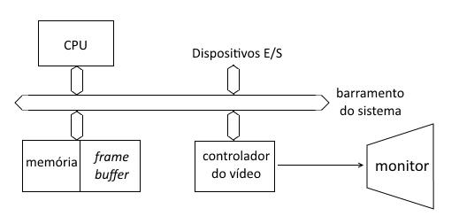 <!-- {.push-left} -->

1. Quanto de espaço ocupa o _framebuffer_? <!-- {li:.note.info style="list-style-type: none"} -->
   1. Identificar (a) resolução do monitor e (b) quantos bytes por cor  <!-- {ol^0:.bulleted} -->
      1. 800 x 600 (largura x altura) <!-- {ol^0:style="list-style-type: lower-latin"} -->
      1. 24 bits (3 bytes)
   1. Multiplicar e converter para MB
      1. tam = (800 \times 600) \times 3 bytes <!-- {ol^0:style="list-style-type: lower-latin"} -->
      1. tam = 1,37 MB

*[MB]: mega bytes*

---
<!-- {"layout": "centered-horizontal"} -->
## Arquitetura **simples** vs **moderna**

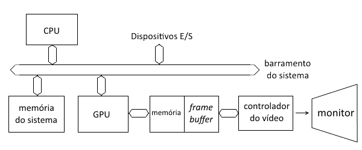 <!-- {.push-right} -->

---
<!-- {"layout": "section-header", "slideClass": "rainbow-picture"} -->
# Cores e imagens

- Representação de cores
- Imagens digitais

---
<!-- {"layout": "regular"} -->
# Representação de cores

- Radiação eletromagnética pode ser entendida como ondas ou um fluxo de
  partículas sem massa, chamadas de fótons
- É caracterizada pela frequência/comprimento da onda

  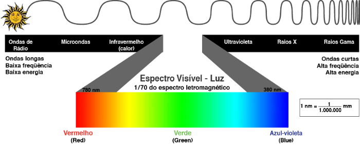 <!-- {.centered} -->

---
<!-- {"layout": "regular"} -->
## Espectro da luz visível

- As ondas eletromagnéticas raramente aparecem em apenas 1 frequência,
  mas sim como uma **combinação**. Exemplo:

    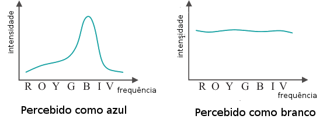
- A luz é percebida como a **mistura (ou soma) das frequências** da onda
  eletromagnética
- Para representar no computador, precisamos de uma **forma discreta** para
  representar a cor

---
<!-- {"layout": "centered-horizontal"} -->
## Representação de cores

Depende da natureza do dispositivo gráfico:

1. ## Modelos **subtrativos** <!-- {ol:.card-list.title-top} -->
   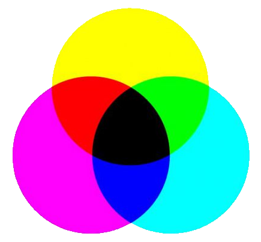 <!-- {.medium-width} -->
      ~ baseados em tinta
      ~ usado para impressão
      ~ ⬅️ CMYK
1. ## Modelos **aditivos**
   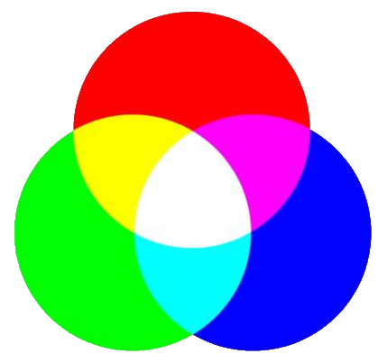  <!-- {.medium-width} -->
    ~ baseados em luz visível
    ~ usado em telas
    ~ ↖️ RGB, HSL

---
<!-- {"layout": "regular"} -->
## O modelo RGB de cores

- Monitores: 24-bit RGB
  - 8 bits para vermelho (0 a 255)
  - 8 bits para verde
  - 8 bits para azul
  - Exemplo:   (255, 213, 213) ou (1, 0.84, 0.84)
    - Seletor de cores: <input type="color">
- Variação: 32-bit RGBA
  - +8 bits para alfa (opacidade)

---
<!-- {"layout": "regular", "backdrop": "vector-vs-raster-bottom"} -->
# Representação de imagens digitais

Imagens podem ser representadas em duas formas principais:
- **Vetoriais** <!-- {.alternate-color} --> <!-- {ul^0:.multi-column-list-2} -->
  - Descritas por modelos geométricos
  - Ocupam menos espaço
  - Não perdem qualidade se ampliadas
  - Formatos comuns: [**svg, cdr, ai**] <!-- {.alternate-color} -->
- **Raster**
  - Matriz de **pixels** (_picture elements_)
  - Muito simples de gerar e exibir
  - Perdem qualidade se ampliadas
  - Formatos comuns: [**gif, jpg, png, bmp**]

---
<!-- {"layout": "centered"} -->
## Comparação: **vetorial** <!-- {.alternate-color} --> _vs_ **raster**

- ::: zoomable .inline display: inline-block
  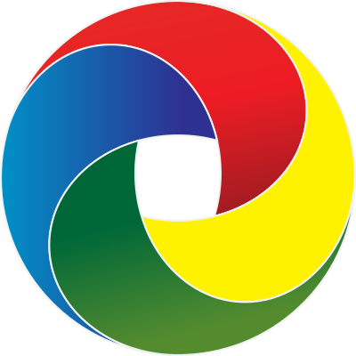 <!-- {style="width: 500px;" draggable="false"} -->
  :::
  Arquivo
    ~ 6,4 kB

  Resolução
    ~ ∞

  Formato
    ~ .svg
- ::: zoomable .inline display: inline-block
  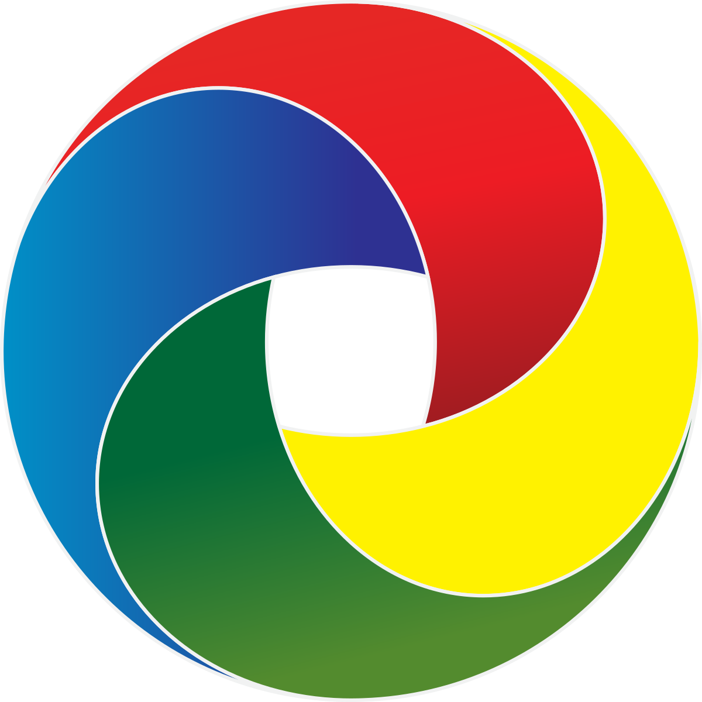 <!-- {style="width: 500px;" draggable="false"} -->
  :::
  Arquivo
    ~ 142 kB

  Resolução
    ~ 1200x1200

  Formato
    ~ .png

<!-- {ul:.card-list} -->

---
<!-- {"layout": "section-header"} -->
# Modelos de sistema visual

- Olho humano
- Câmera estenopeica
- Frustum de visualização

---
<!-- {"layout": "centered"} -->
## Modelos de sistema visual

- Há várias formas de tentar reproduzir o sistema visual:
  1. Modelo do olho humano
  1. Modelo da camera escura (estenopeica)
  1. Modelo do _frustum_ de visualização
- Vamos escolher um \o/

---
<!-- {"layout": "regular"} -->
## (1) Modelo do olho humano

- 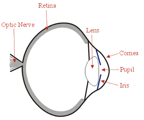
  Fótons (raios de luz) entram pela pupila de forma reta até atingirem a retina
- A imagem é formada pela contribuição da luz nos cones e bastonetes da retina
  - Cones: bons identificadores de cores
  - Bastonetes: identificam luz em baixa intensidade
- Quanto mais próximo ao centro da retina, maior o nível de detalhes que
  percebemos
- Este modelo é **complexo demais** para a Computação Gráfica
  - Basicamente porque o sistema visual humano envolve fatores até
    [mesmo psicológicos da percepção de luminosidade](http://web.mit.edu/persci/gaz/)

[optics-illusion]: http://web.mit.edu/persci/people/adelson/checkershadow_description.html

---
<!-- {"layout": "centered-horizontal"} -->
## Qual é mais escuro? A ou B?

<figure class="picture-steps">
  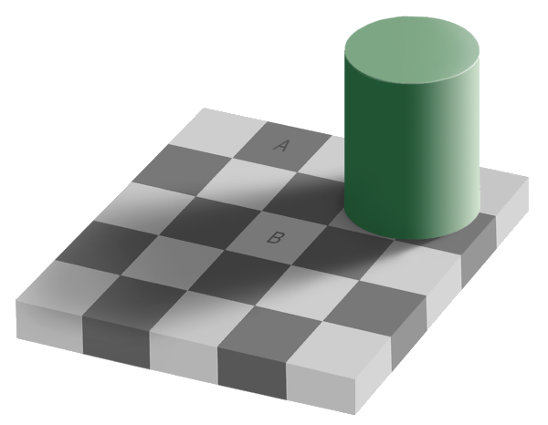
  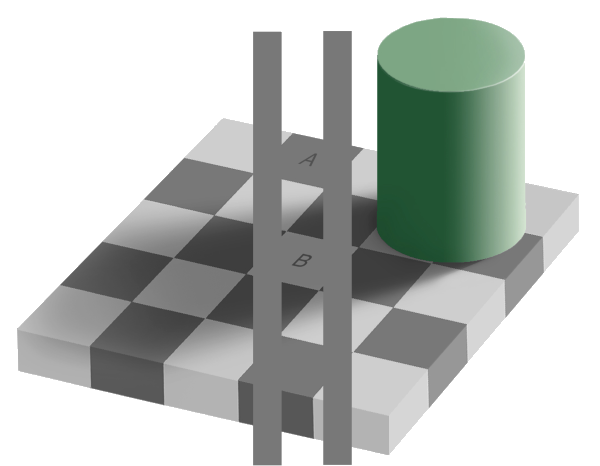
</figure>

---
<!-- {"layout": "2-column-content"} -->
## (2) Modelo da câmera estenopeica

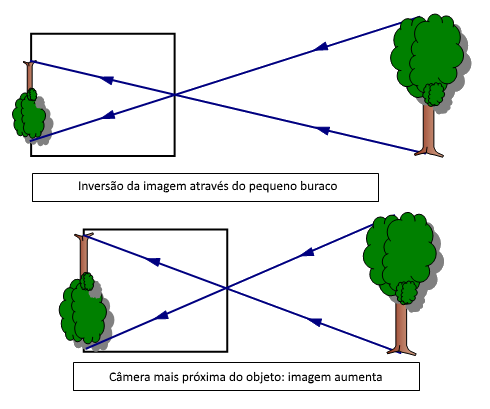

- Versão mais simples de um modelo de visão
- Imagens mais próximas são retratadas maiores
- Modelo bastante semelhante ao que usamos

---
<!-- {"layout": "centered-horizontal"} -->
## (3) O modelo de _View Frustum_

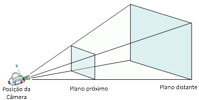

- A câmera é colocada na ponta da pirâmide
- **_Frustum_**: sólido geométrico que é um **tronco de pirâmide** formado pelo
  plano próximo e plano distante
- Apenas o que está dentro do _frustum_ é retratado

---
<!-- {"layout": "regular"} -->
# Sumário das opções

1. Foco em **renderização** de imagens tridimensionais em tempo real
1. Modelo de **representação de imagens**
   - Usamos monitores _raster_
   - Vamos gerar imagens _raster_
   - É possível usar imagens vetoriais, rasterizando-as
1. Modelo de **cores**
   - Discretizamos em RGB (opcionalmente com A)
   - Representação com 8 bits por componente
1. Modelo de **câmera**
   - Vamos usar o modelo do _view frustum_
   - É possível usar outros modelos mais complexos

---
<!-- {"layout": "centered"} -->
# Referências

- [Programa de modelagem 3D blender][blender]
- [Aplicativo Web de modelagem 3D clara.io][claraio]
- [Programa de modelagem 3D Autodesk 3ds Max][3ds-max]
- [Programa de modelagem 3D Autodesk Maya][maya-lt]
- [Programa de modelagem 3D ZBrush][z-brush]
- [Desmontando um monitor de LCD (Enginner Guy)][lcd-teardown]
- [Explicação da ilusão de ótica][optics-illusion]

[blender]: http://www.blender.org/
[claraio]: https://clara.io/
[3ds-max]: http://www.autodesk.com/education/free-software/3ds-max
[maya-lt]: http://www.autodesk.com/education/free-software/maya-lt
[z-brush]: http://pixologic.com/
[lcd-teardown]: http://www.engineerguy.com/videos/video-lcd.htm
[optics-illusion]: http://web.mit.edu/persci/people/adelson/checkershadow_description.html
