<!--
  backdrop: lighting-balloons
-->

# Iluminação e Sombreamento

---
# Objetivos

1. Gerar imagens com maior realismo
1. Conhecer formas de modelar a iluminação de objetos
1. Entender os custos computacionais dos diferentes modelos


---
# Roteiro

1. Iluminação em Computação Gráfica
1. Tipos de modelos
1. Modelo local de Phong
1. Iluminação em OpenGL
1. Sombreamento
1. Atenuação
1. _Fog_ (neblina)

---
## De volta ao _pipeline_


---
# Iluminação em Computação Gráfica

---
## Cena sem _vs_ com iluminação

<figure style="position:relative; height:450px;width:800px;">
  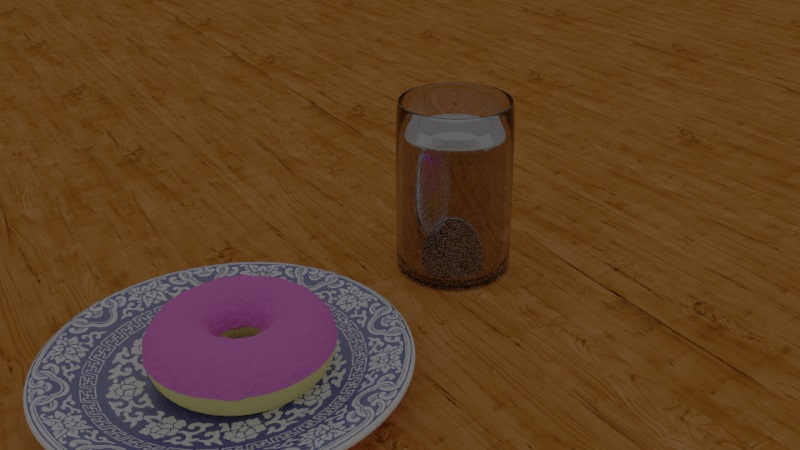
  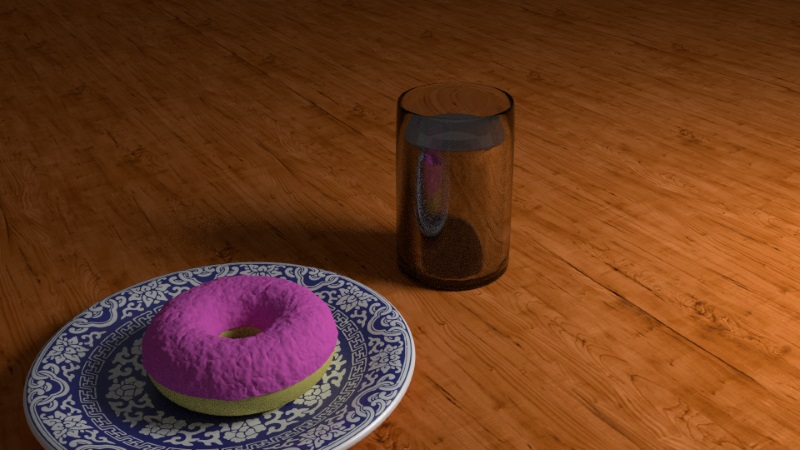
</figure>

---
## Iluminação

- 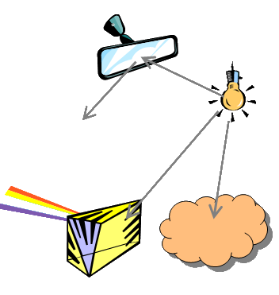
  Estudo de como a luz interage com objetos de uma cena
    - Como a luz é **emitida**
    - Como ela é **transmitida**
    - Ela é **absorvida, refratada, refletida**?
- Em Computação Gráfica, a iluminação trata do **cálculo da contribuição de cada fonte de luz
  para cada vértice** dos objetos de uma cena e a posterior **determinação da cor (ou sombreamento)
  dos _pixels_**  

---
## Fontes de luz

- Alguns objetos podem emanar luz - eles são chamados **fontes de luz**
- A luz das fontes afeta a superfície dos objetos de uma cena de acordo com as
  características da superfície do objeto - chamamos essas características de
  **material**
- Há vários tipos de fonte de luz:
  1. Ambiente
  1. Pontual
  1. Direcional
  1. Holofote (_Spotlights_)

---
## Materiais

- São um modelo de como objetos reagem às fontes de luz
  - Pode ser entendido como o material com que os objetos são feitos:
    - Vidro
    - Madeira
    - Porcelana
- Definem parâmetros de interação com a luz
  - Reflexão
  - Transparência
  - Coeficientes etc.

---
# Modelos de Iluminação

---
## Modelos de Iluminação

- Modelo **físico**
  - _real-life_, programado por Deus em C++
- Modelos **locais**
  - Apenas caminhos do tipo fonte luminosa → superfície → olho são tratados
  - A intensidade da luz em um vértice é dada pelas
    fontes de luz da cena
  - Simples
    - Ex.: Modelo de Phong no OpenGL
- Modelos **globais**
  - Muitos caminhos da transmissão da luz são considerados
  - A intensidade é dada pelas fontes de luz e pela interação dos fótons com
    todos os objetos da cena
  - Complexos (e.g., _ray tracing_, _radiosidade_)

---
## Modelo físico

- 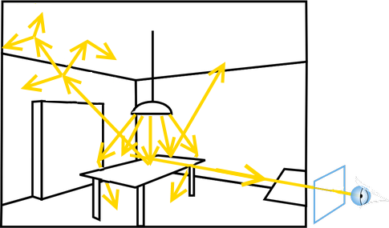
  A luz é modelada como **radiação eletromagnética**
  - Este modelo está descrito no capítulo de ótica do seu livro de física mais próximo =)
- Leva em conta todas as interações (todos os caminhos da luz), **infinitamente**
- Intratável computacionalmente
  - Pelo menos para aplicações em tempo real

---
## Modelo local

- 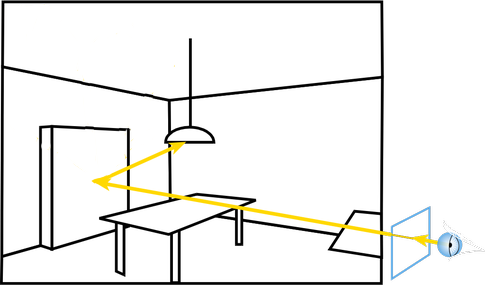
  Considera-se **apenas a porção da luz que vai da fonte de luz para  
  o objeto** (vértice) iluminado
  - Um objeto não "tampa" o outro (i.e., sem sombras)
- A luz é discretizada em componentes vermelha, verde e azul
- Como os objetos da cena não interferem na cor um do outro, uma vez que
  a cor de um vértice foi calculada e ele passou pelo pipeline, suas informações podem
  ser descartadas

---
## Modelo global

- 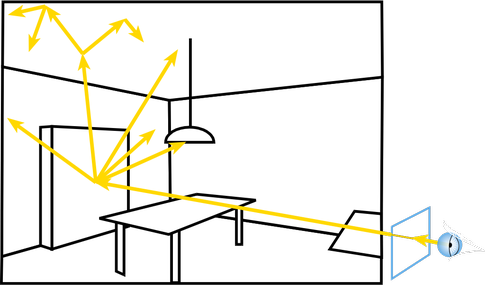
  Considera-se **vários caminhos percorridos pela luz**, incluindo a relação
  entre os objetos da cena
  - Um objeto pode impedir que outro receba a luz (i.e., há sombras)
  - Objetos podem ser semi-transparentes e a luz pode refletir ou refratar


---
# Montando um modelo local

---
## Conceitos

- Uma fonte de luz é descrita por:
  - Uma cor (da luz) em componentes `RGB`
- Cada objeto da cena é feito por um **material** que:
  - Pode ser [0, 100%] fosco e reflete uma cor `RGB` (**difusa**)
  - Pode ser [0, 100%] polido e reflete a cor da luz (**especular**)
  - Pode emitir [0, 100%] luz de uma cor (**emissiva**)
  - É indiretamente [0, 100%] iluminado pelas infinitas interações da luz na cena (**ambiente**)
  - A cor final do vértice pode ser dada pelo **somatório dessas 4 componentes**

---
## **Cor ambiente** de um objeto

- Ainda que um objeto não esteja diretamente iluminado, ele deve
  aparecer na cena
  - Por causa da iluminação indireta, refletida por todos os objetos da cena
- Não possui características espaciais nem direcionais
- Pode possuir cor
- A quantidade de luz ambiente é constante em todo o ambiente
- A quantidade de luz ambiente refletida por um objeto independe da geometria
  do objeto

---
## **Cor difusa** de um objeto

- Objetos foscos refletem a luz em todas as direções uniformemente e possuem uma cor
- Segundo a Lei de Lambert (fluxo de energia):
  - a luminosidade aparente da superfície não depende da posição do observador, mas apenas do cosseno do
    **ângulo entre a normal e a direção da luz**

    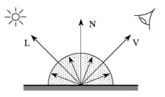

---
## Calculando a contribuição **difusa**

- Intensidade da luz em um ponto p é dada por:

  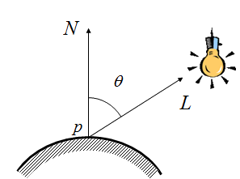

---
## **Iluminação especular** em um objeto

- Simula a reflexão à maneira de um espelho (objetos altamente polidos)
- Depende da disposição entre observador, objeto e fonte de luz
- Em um espelho perfeito, a reflexão se dá em ângulos iguais
  - Observador só enxergaria a reflexão de uma fonte pontual se estivesse na direção certa

---
## Calculando a contribuição **especular**

- A intensidade da contribuição especular em um ponto p é dada por:

  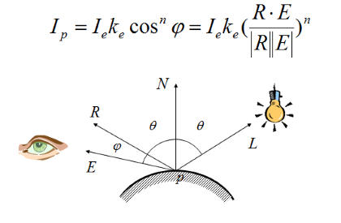

---
## Expoente de Especularidade

- Indica quão polida é a superfície
  - Espelho ideal tem especularidade infinita
  - Na prática, usam-se valores entre 5 e 100


---
## Componentes do Modelo de Phong

- **Emissão**: contribuição que não depende de fontes de luz (fluorescência)
- **Ambiente**: contribuição que não depende da geometria
- **Difusa**: contribuição correspondente ao  espalhamento da reflexão lambertiana (independe da posição do observador)
- **Especular**: contribuição referente ao comportamento de superfícies polidas

---
## Componentes do Modelo de Phong (cont.)


---
## Demonstração do Modelo de Iluminação de Phong

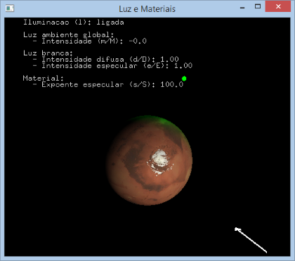

- Exemplo: [luz-e-material](codeblocks:luz-e-material/CodeBlocks/luz-e-material.cbp)

---
# Iluminação em OpenGL

---
## Iluminação em OpenGL

- Implementa o modelo de iluminação de _Phong_
- O modelo é computado **apenas para os vértices** dos polígonos
  - Cor dos pixels no interior dos polígonos é obtida por interpolação linear
- É possível configurar alguns efeitos atmosféricos:
  - Atenuação da luz
  - Neblina

---
## Iluminação em OpenGL

- Uma fonte de luz é descrita por:
  - Cor ambiente
  - Cor difusa
  - Cor especular
  - Posição
- Um material é descrito por:
  - Cor ambiente
  - Cor difusa
  - Cor especular
    - Expoente de especularidade
  - Cor emissiva

---
## **3 passos** para iluminar

- O sistema de iluminação do OpenGL vem, por padrão, **desativado**. Para ativá-lo,
  devemos tomar as seguintes medidas:
  1. Ativar/desativar o sistema quando apropriado:
     ```c
     glEnable(GL_LIGHTING);
     //...
     glDisable(GL_LIGHTING);
     ```
  1. Ativar e configurar uma ou mais fontes de luz (veremos como)
  1. Configurar materiais antes de desenhar os objetos  (idem)


---
## Passo 2: Ativando **fontes de luz**

- Para ativar uma fonte:
  ```c
  glEnable(source);
  ```
  - `source` é uma constante cujo nome é `GL_LIGHT`**`N`**,
    começando com `GL_LIGHT0`
  - Quantas? Pelo menos 8, mas para ter certeza:
    ```
    glGetIntegerv(GL_MAX_LIGHTS, &n);
    ```

---
## Passo 2: Configurando **fontes de luz**

- Para configurar as propriedades de cada fonte:
  ```c
  glLightfv(source, property, value);
  ```
  - `property` é uma constante designando:
    - Coeficientes de cor usados no modelo de iluminação:
      `GL_AMBIENT,` **`GL_DIFFUSE,`** `GL_SPECULAR`
    - Geometria da fonte
     **`GL_POSITION,`** `GL_SPOT_DIRECTION, GL_SPOT_CUTOFF,  GL_SPOT_EXPONENT`
    - Coeficientes de atenuação
      `GL_CONSTANT_ATTENUATION, GL_LINEAR_ATTENUATION, GL_QUADRATIC_ATTENUATION`

---
## Passo 3: Configurando o **material**

- Especificados por:
  ```c
  glMaterialfv (face, property, value);
  ```
  - `face` designa quais lados da superfície se quer configurar:
    ```c
    GL_FRONT, GL_BACK, GL_FRONT_AND_BACK;
    ```
  - `property` designa a propriedade do modelo de iluminação:
    ```c
    GL_AMBIENT, GL_DIFFUSE, GL_SPECULAR,
    GL_EMISSION, GL_SHININESS;
    ```

---
## Geometria

- Além das propriedades da luz e do material, a **geometria do objeto** também
  é importante
  - A posição dos vértices com relação ao olho e à fonte luminosa
    contribui no cálculo dos efeitos atmosféricos
    - _e.g._, atenuação da energia da luz
  - A _normal_ dos polígonos é fundamental
    - Não é calculada automaticamente
    - Precisa ser especificada com `glNormal()`
    - Mas como calculamos o vetor normal de cada face?

---
## Computando o vetor normal

- 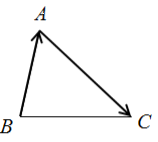
  Triângulo
  - Dados três vértices, podemos:
    <div class="math">\vec{n} = normalizar((A-B)\times(C-A))</div>
- Polígono planar
  - Uma opção é usar a fórmula do triângulo para quaisquer 3 vértices
  - Outra opção é determinar a equação do plano:
    - <span class="math">ax + by + cz + d = 0</span>
    - Normal tem coordenadas <span class="math">(a, b, c)</span>

---
## Vetor normal de superfícies paramétricas

- 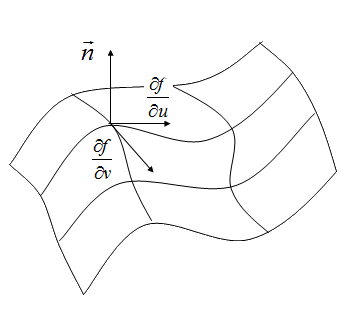
  Normal é dada pelo produto vetorial dos gradientes em relação aos
  parâmetros <span class="math">u</span> e <span class="math">v</span>

  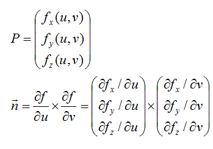

---
## Iluminação **ambiente**

- Dada pelas cores `GL_AMBIENT` tanto das fontes luminosas quanto
  dos materiais
- Além das fontes luminosas, o OpenGL possui uma **luz ambiente
  <u>global</u>**, que é usada para iluminar uniformemente todos os
  objetos da cena
  ```c
  glLightMaterialfv (GL_LIGHT_MODEL_AMBIENT, color);
  ```
- Contribuição da luz ambiente global para um vértice é dada por:
  <span class="math">A = I_ak_a</span>, onde:
  - <span class="math">I_a</span> é a cor da luz ambiente global
  - <span class="math">k_a</span> é a cor ambiente do material

---
## Fontes <u>posicionais</u> _vs_ <u>direcionais</u>

- É possível **configurar uma fonte de luz** para que ela seja <u>direcional</u>
  em vez de <u>posicional</u>
  - Ao definir a posição da fonte via:
    ```c
    glLightfv(GL_LIGHT0, GL_POSITION, position);
    ```
    se `position` for um vetor cujo 4º elemento é igual a:
      - 1, então a luz é posicional
      - 0, então a luz é direcional
- Para fontes de luz posicionais, é possível definir um fator de
  atenuação que leva em conta a distância d entre a fonte de luz e o
  objeto sendo iluminado

---
## **Atenuação**

- A atenuação de uma fonte de luz é calculada como:
  <div class="math">aten = \frac{1}{k_c+k_ld+k_qd^2}</div>
- Os coeficientes são definidos pela função `glLight()`, usando os parâmetros
  `GL_CONSTANT_ATTENUATION, GL_LINEAR_ATTENUATION` e `GL_QUADRATIC_ATTENUATION`
  - Exemplo:
    ```
    glLightf(GL_LIGHT0, GL_LINEAR_ATTENUATION, 1.0);
    ```
- Por padrão, há uma atenuação de:
  - <span class="math">k_c = 1</span>, <span class="math">k_l = 0</span>,
    <span class="math">k_q = 0</span>  

---
## Cor resultante de um vértice: <span class="math">C</span>

- A atenuação só é aplicada sobre às componentes difusa
  <span class="math">D</span> e especular <span class="math">S</span>
  - Não faz sentido para ambiente <span class="math">A</span>, nem
    emissiva <span class="math">E</span>
- A fórmula que calcula a cor de um vértice devida a uma **fonte luminosa
  <span class="math">i</span>** é dada por:
  <div class="math">C_i=A_i + aten(D_i + S_i)</div>
- Portanto, no total, a cor é dada pela contribuição da iluminação ambiente (parcela não associada com fontes de luz)
  somada à luz emitida e às contribuições fonte luminosa
    <span class="math">C_i</span>:

    <div class="math">C=A_{global} + E + \sum{A_i + aten(D_i + S_i)}</div>

---
# Recapitulando iluminação

- Vimos alguns modelos para simularmos um sistema de iluminação local
  nas nossas cenas de forma a torná-las mais realísticas
- O modelo de iluminação **calcula a cor <u>de cada vértice</u>** da
  nossa geometria, dadas fontes de luz e o material dos objetos
- Contudo, ainda não sabemos a **cor <u>de cada pixel</u>**, que é o
  que precisamos para gerar imagens

---
# De volta ao _pipeline_ gráfico


---
## Fase do **Rasterizador**


- <u>Sombreamento de Pixels</u>
  - Para cada pixel que possui um fragmento, devemos obter sua cor
- Já temos a cor de **cada vértice**, mas precisamos determinar a cor de cada
  fragmento de pixel agora
  - Para isso, precisamos de uma equação que, dadas as cores dos vértices,
    possamos **atribuir cores para cada pixel**

---
<!--
  backdrop: shading
-->

# Sombreamento

---
## Sombreamento

- Uma opção seria calcular a iluminação em cada pixel da nossa geometria
  - Contudo, isso é caro computacionalmente
- Uma opção melhor é **interpolar** os valores da função de iluminação
  **nos vértices dos polígonos para os pixels** no interior do polígono
  - Assim, aumentamos muito a velocidade de renderização

---
## Tipos de Sombreamento

- Há três tipos principais de sombreadores:
  - Constante (_flat_)
    ```c
    glShadeModel(GL_FLAT);
    ```
  - Gouraud
    ```c
    glShadeModel(GL_SMOOTH);    // é o valor padrão
    ```
  - Phong
    ```c
    glShadeModel(GL_PHONG);    // não está impl.!!
    ```

---
## _Flat shading_

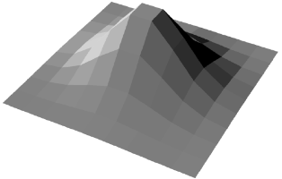

- **Uma única cor por primitiva** - é a cor do primeiro vértice
- Precisa de (apenas) **01 vetor normal para cada polígono**
- Extremamente rápido, mas produz imagens facetadas, pois a transição de um
  polígono para outro adjacente é nítida

---
<!--
  backdrop: lowpoly
-->

# _Low poly is the new pixel art_

---
## Desenhos com _flat shading_

<figure class="picture-steps">
  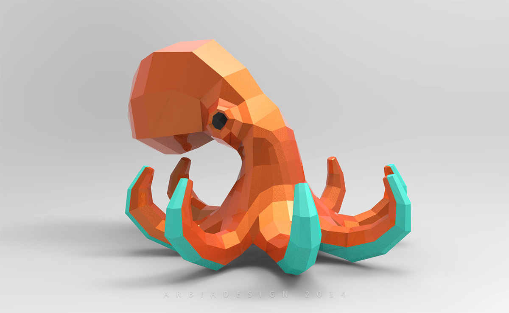
  
  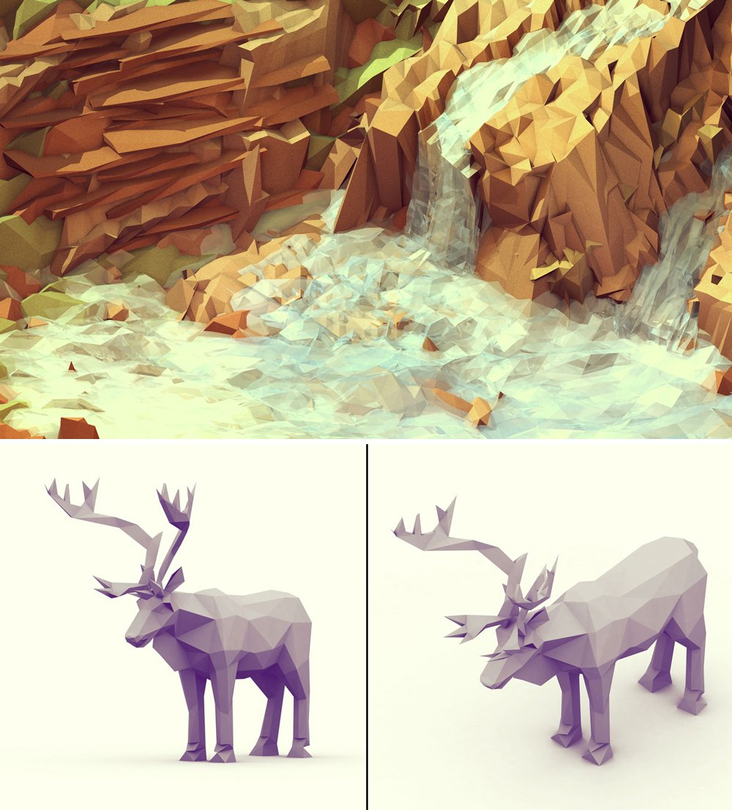
  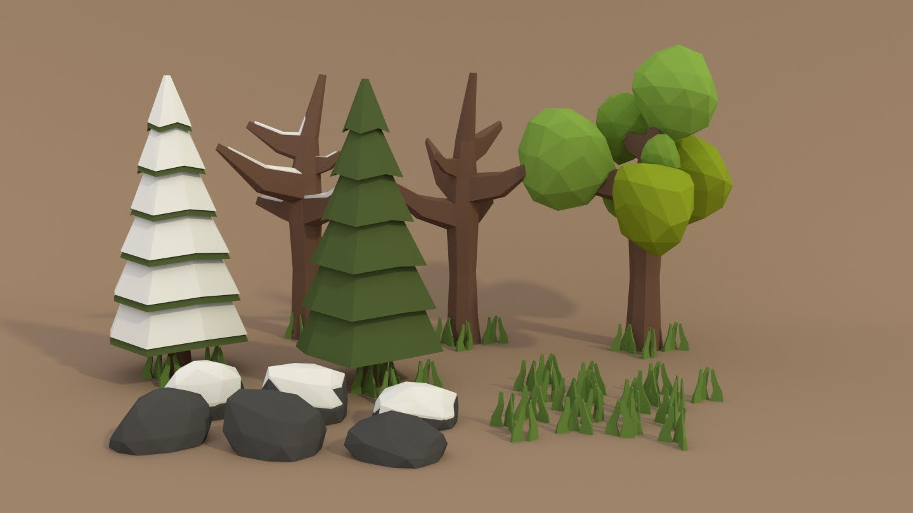
</figure>

---
## _Gouraud shading_


- Usa a cor calculada **em cada vértice** pelo modelo de iluminação
- Para colorir o polígono, interpola a cor dos vértices em seu interior
- Qualidade da imagem é muito maior, mas o custo é maior

---
## _Gouraud shading_ (cont.)

- Deve haver **01 vetor normal por vértice** (e não por face)
- Ele precisa ser fornecido como a média das normais das faces
  adjacentes ao vértice


---
## Limitações do _Gouraud shading_

- Realces da luz especular (**_highlights_**) sofrem por baixa amostragem de
  vértices

  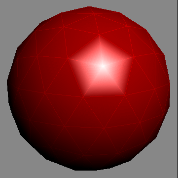
  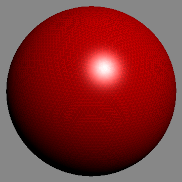

---
## _Phong shading_

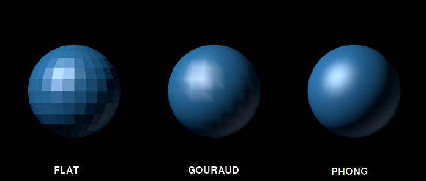

- Não confundir com o **modelo de iluminação de _Phong_**

---
## _Phong shading_ (cont.)

- <u>Interpola as normais</u> dos vértices para os pixels, em vez das cores
  - A função de iluminação deve ser avaliada **para cada pixel**
- Significativamente mais caro
- Não oferecido pelo OpenGL no _pipeline_ gráfico fixo
  - É possível implementar usando versões mais novas do OpenGL

---
## Consertando o problema dos _highlights_ de Gouraud

<p style="text-align: right">
  
  Em **_Gouraud_**, temos uma amostragem de vértices muito menor &rarr;
</p>

<p style="clear: right;">
  
  &larr; Em **_Phong_**, a amostragem é bem maior
</p>


---
## Comparação dos três modelos de **sombreamento**

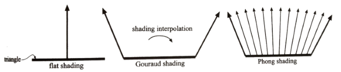

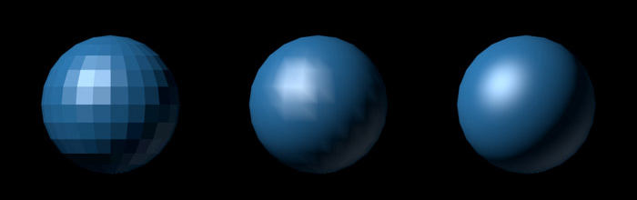

---
## (a) Sem iluminação, (b) _flat_, (c) _gouraud_, (d) _phong_

<figure class="picture-steps">
  
  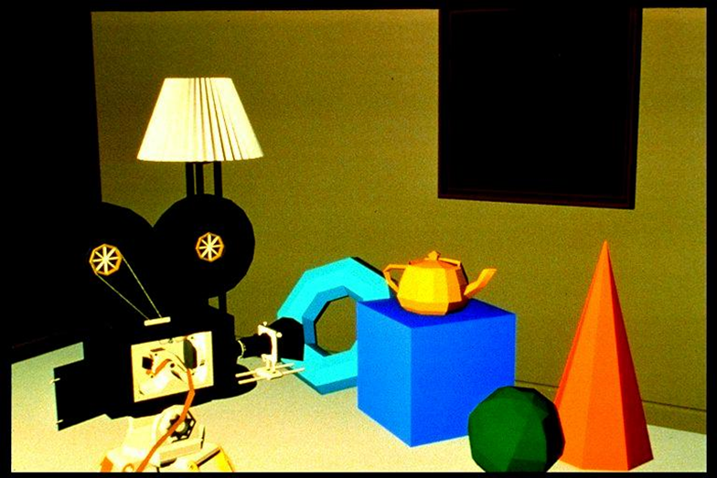
  
  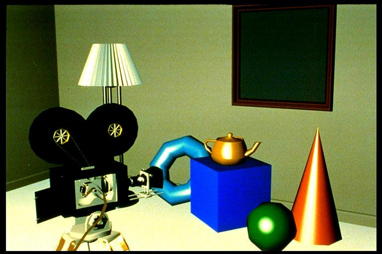
</figure>

---
# _Fog_

---
## Neblina (_Fog_)

<figure class="picture-steps">
  
  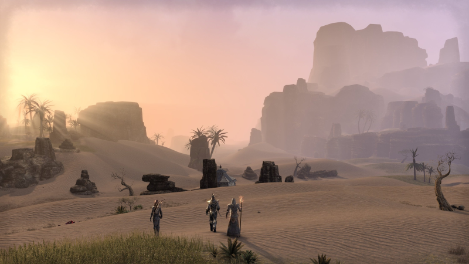
  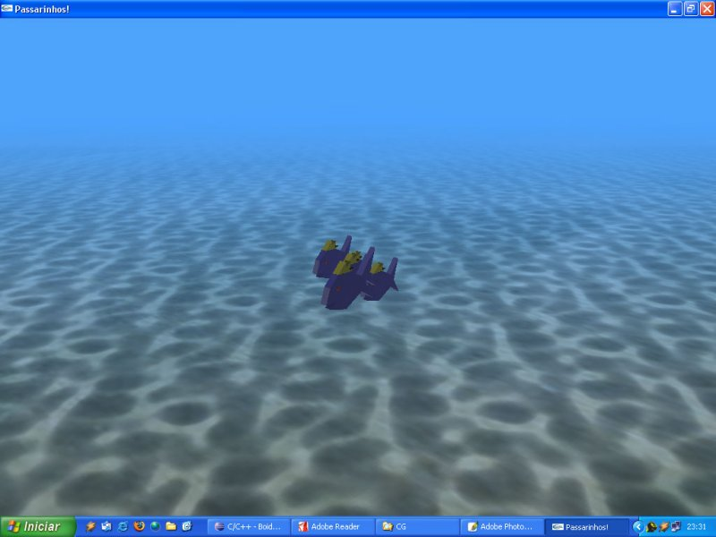
</figure>

---
## _Fog_ no Zelda 64

<iframe src="https://www.youtube.com/embed/_9AcRhzV3qA?ecver=2" width="480" height="360" frameborder="0" allowfullscreen></iframe>

---
## _Fog_ no Turok 64

<iframe src="https://www.youtube.com/embed/cOVpcC8GwXM?ecver=2" width="480" height="360" frameborder="0" allowfullscreen></iframe>

---
## _Fog_ com cor do _skybox_ no Temple Run 2

<iframe src="https://www.youtube.com/embed/wTTrtp-yy4I?ecver=2" width="480" height="360" frameborder="0" allowfullscreen></iframe>

---
## _Fog_ (cont.)

```c
  float[] cor = { .5f, .5f, .5f };
  glClearColor(cor[0], cor[1], cor[2], 1.0f);

  glFogi(GL_FOG_MODE, GL_EXP);        // Linear, exp. ou exp²
  glFogfv(GL_FOG_COLOR, cor);         // Cor
  glFogf(GL_FOG_DENSITY, 0.35f);      // Densidade
  glHint(GL_FOG_HINT, GL_DONT_CARE);  // Não aplicar se não puder
  glFogf(GL_FOG_START, 1.0f);         // Profundidade inicial
  glFogf(GL_FOG_END, 5.0f);           // Profundidade final
  glEnable(GL_FOG);                   // Liga GL_FOG
```
- [Referência do `glFog`](https://www.opengl.org/sdk/docs/man2/xhtml/glFog.xml)
- Cor da neblina = cor do `glClearColor`

---
# Referências

- Livro _Real-Time Rendering (3<sup>rd</sup> edition)_
  - Capítulo 5: _Visual Appearance_
- Livro _Computer Graphics with OpenGL (4<sup>th</sup> edition)_
  - Capítulo 17: _Illumination Models and Surface-Rendering Methods_
- Livro _Computer Graphics through OpenGL (2<sup>nd</sup> edition)_
  - Capítulo 11: [_Color and Light_](http://www.sumantaguha.com/files/materials/ch11.pdf)
- _Red Book_
  - [Capítulo 5: _Lighting_](http://www.glprogramming.com/red/chapter05.html)
  - [Capítulo 6: _Blending, Antialiasing, Fog, and Polygon Offset_](http://www.glprogramming.com/red/chapter06.html)
