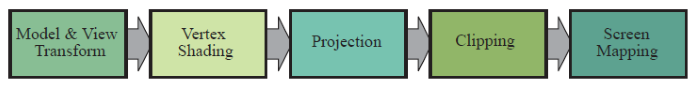

# Iluminação

---
# Objetivos

1. Gerar imagens com maior realismo
1. Conhecer formas de modelar a iluminação de objetos
1. Entender os custos computacionais dos diferentes modelos

---
# Roteiro

1. Iluminação em Computação Gráfica
1. Modelos físicos
1. Modelos locais
1. Iluminação em OpenGL
1. Modelos globais
1. Atenuação

---
## De volta ao _pipeline_

---
## Sombreamento de vértices

---
# Iluminação em Computação Gráfica

---
## Cena sem _vs_ com iluminação

<figure style="position:relative;">
  
  
</figure>

---
## Conceitos de iluminação em CG

- Alguns objetos podem emanar luz - eles são chamados **fontes de luz**
- A luz das fontes afeta a superfície dos objetos de uma cena de acordo com as
  características da superfície do objeto - chamamos essas características de
  **material**
- Iluminação em CG se trata do cálculo da contribuição de cada fonte de luz
  para cada vértice dos objetos e a posterior colorização (ou sombreamento)
  dos _pixels_

---
## Fontes de luz

- Objetos que emanam luz
- Há três tipos de fonte de luz:
  1. Ambiente
  1. Direcional
  1. Pontual
  1. Holofote (_Spotlights_)

---
## Ambiente

- Ainda que um objeto não esteja diretamente iluminado, ele deve
aparecer na cena
- Por causa da iluminação indireta, refletida por todos os objetos da cena
- Marreta padrão na maioria dos modelos de iluminação
- Não possui características espaciais nem direcionais
- Pode possuir cor
- A quantidade de luz ambiente é constante em todo o ambiente
- A quantidade de luz ambiente refletida por um objeto independe da geometria
do objeto
- Parâmetro da superfície

---
## Materiais

---
## Iluminação

---
# Modelos de Iluminação

---
## Modelo físico

- Luz modelada como radiação eletromagnética
- Leva em conta todas as interações (todos os
caminhos da luz)
- Intratável computacionalmente

---
# Referências

- Capítulos 4 e 6 (parcialmente) do livro Real-Time Rendering
