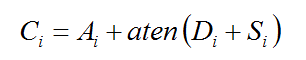
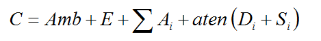

# Iluminação

---
# Objetivos

1. Gerar imagens com maior realismo
1. Conhecer formas de modelar a iluminação de objetos
1. Entender os custos computacionais dos diferentes modelos


---
# Roteiro

1. Iluminação em Computação Gráfica
1. Modelos físicos
1. Modelos locais
1. Iluminação em OpenGL
1. Modelos globais
1. Atenuação

---
## De volta ao _pipeline_


---
# Iluminação em Computação Gráfica

---
## Cena sem _vs_ com iluminação

<figure style="position:relative; height:450px;width:800px;">
  
  
</figure>

---
# Conceitos de iluminação em CG

---
## Iluminação

- 
  Estudo de como a luz interage com objetos de uma cena
    - Emissão
    - Transmissão
    - Absorção
    - Refração
    - Reflexão
- Iluminação em CG se trata do cálculo da contribuição de cada fonte de luz
  para cada vértice dos objetos e a posterior colorização (ou sombreamento)
  dos _pixels_

---
## Fontes de luz

- Alguns objetos podem emanar luz - eles são chamados **fontes de luz**
- A luz das fontes afeta a superfície dos objetos de uma cena de acordo com as
  características da superfície do objeto - chamamos essas características de
  **material**
- Há três tipos de fonte de luz:
  1. Pontual
  1. Direcional
  1. Ambiente
  1. Holofote (_Spotlights_)

---
## Luz Ambiente

- Ainda que um objeto não esteja diretamente iluminado, ele deve
aparecer na cena
- Por causa da iluminação indireta, refletida por todos os objetos da cena
- Marreta padrão na maioria dos modelos de iluminação
- Não possui características espaciais nem direcionais
- Pode possuir cor
- A quantidade de luz ambiente é constante em todo o ambiente
- A quantidade de luz ambiente refletida por um objeto independe da geometria
do objeto

---
## Materiais

- São um modelo de como objetos reagem às fontes de luz
  - Pode ser entendido como o material com que os objetos são feitos:
    - Vidro
    - Madeira
    - Porcelana
- Definem parâmetros de interação com a luz
  - Reflexão
  - Transparência
  - Coeficientes etc.

---
# Modelos de Iluminação

---
## Modelos de Iluminação

- Tipicamente, a luz é amostrada (espaço discreto)
- Modelos locais
  - Apenas caminhos do tipo fonte luminosa → superfície → olho são tratados
  - Simples
    - Ex.: OpenGL
- Modelos globais
  - Muitos caminhos (_ray tracing_, radiosidade)
  - Complexos

---
## Modelo físico

- 
  Luz modelada como radiação eletromagnética
- Leva em conta todas as interações (todos os caminhos da luz)
- Intratável computacionalmente
  - Pelo menos para tempo real

---
## Iluminação Difusa

- Característica de materiais foscos.
- Lei de Lambert (fluxo de energia):
  - a luminosidade aparente da superfície não depende da posição do observador, mas apenas do cosseno do 
    ângulo entre a normal e a direção da luz

    

---
## Modelo Difuso

- Intensidade em um ponto p é dada por:

  

---
## Iluminação Especular

- Simula a reflexão à maneira de um espelho (objetos altamente polidos).
- Depende da disposição entre observador, objeto e fonte de luz.
- Em um espelho perfeito, a reflexão se dá em ângulos iguais
  - Observador só enxergaria a reflexão de uma fonte pontual se estivesse na direção certa.
- No modelo de _Phong_, simulam-se refletores imperfeitos assumindo que luz é
  refletida segundo um cone cujo eixo passa pelo observador.

---
## Modelo de Phong

- Contribuição especular é dada por

  

---
## Coeficiente de Especularidade

- Indica quão polida é a superfície
  - Espelho ideal tem especularidade infinita
  - Na prática, usam-se valores entre 5 e 100


---
## Componentes do Modelo de Phong

- **Emissão**: contribuição que não depende de fontes de luz (fluorescência)
- **Ambiente**: contribuição que não depende da geometria
- **Difusa**: contribuição correspondente ao  espalhamento da reflexão lambertiana (independe da posição do observador)
- **Especular**: contribuição referente ao comportamento de superfícies polidas

---
## Componentes do Modelo de Phong (cont.)


---
# Iluminação em OpenGL

---
## Iluminação em OpenGL

- Assume fontes pontuais de luz
   - Onidirecionais
   - _Spot_
- Interações de luz com superfície modeladas em componentes (modelo de _Phong_):
  - Emissão
  - Ambiente
  - Difusa  
  - Especular

---
## Iluminação em OpenGL

- Suporte a efeitos atmosféricos como:
  - Atenuação
  - Fog
- Modelo de iluminação é computado apenas nos vértices dos polígonos.
- Suporta _Gouraud shading_ (próxima aula)
  - Cor dos pixels no interior dos polígonos é obtida por interpolação linear.

---
## Fontes de Luz

- Para ligar uma fonte:
  ```c
  glEnable (source);
  ```
  - source é uma constante cujo nome é `GL_LIGHT`<sub>i</sub>,
    começando com `GL_LIGHT0`
  - Quantas? Pelo menos 8, mas para ter certeza:
    ```c
    glGetIntegerv( GL_MAX_LIGHTS, &n );
    ```
- Não esquecer de ligar o cálculo de cores pelo modelo de iluminação
  ```c
  glEnable (GL_LIGHTING);
  ```

---
## Fontes de Luz

- Para configurar as propriedades de cada fonte:
  ```c
  glLightfv(source, property, value);
  ```
  - `property` é uma constante designando:
    - Coeficientes de cor usados no modelo de iluminação:
      `GL_AMBIENT, GL_DIFFUSE, GL_SPECULAR`
    - Geometria da fonte
      `GL_POSITION, GL_SPOT_DIRECTION, GL_SPOT_CUTOFF,  GL_SPOT_EXPONENT`
    - Coeficientes de atenuação
      ```c
      GL_CONSTANT_ATTENUATION,
      GL_LINEAR_ATTENUATION,
       GL_QUADRATIC_ATTENUATION
      ```

---
## Propriedades de Material

- Especificados por:
  ```c
  glMaterialfv (face, property, value);
  ```
  - `face` designa quais lados da superfície se quer configurar:
    ```c
    GL_FRONT, GL_BACK, GL_FRONT_AND_BACK;
    ```
  - `property` designa a propriedade do modelo de iluminação:
    ```c
    GL_AMBIENT, GL_DIFFUSE, GL_SPECULAR,
    GL_EMISSION, GL_SHININESS;
    ```

---
## Geometria

- Além das propriedades da luz e do material, a geometria do objeto também
  é importante
  - A posição dos vértices com relação ao olho e à fonte luminosa
    contribui no cálculo dos efeitos atmosféricos
  - A _normal_ é fundamental
    - Não é calculada automaticamente
    - Precisa ser especificada com `glNormal()`

---
## Computando o vetor normal

- 
  Triângulo
  - Dados três vértices,

    
- Polígono planar
  - Uma opção é usar a fórmula do triângulo para quaisquer 3 vértices
  - Outra opção é determinar a equação do plano
    - `x + by + cz + d = 0`
    - Normal tem coordenadas `(a, b, c)`

---
## Vetor Normal de Superfícies Paramétricas

- 
  Normal é dada pelo produto vetorial dos gradientes em relação aos
  parâmetros u e v

  

---
## Iluminação Ambiente

- Componente que modela como uma constante o efeito da reflexão de outros
  objetos do ambiente
- Depende dos coeficientes GL_AMBIENT tanto das fontes luminosas quanto
  dos materiais
- É ainda possível usar luminosidade ambiente não relacionada com fontes
  luminosas
  ```c
  glLightMaterialfv (GL_LIGHT_MODEL_AMBIENT, params);
  ```
- Contribuição é dada por:

  

---
## Atenuação

- Para fontes de luz posicionais (w = 1), é possível definir um fator de
  atenuação que leva em conta a distância d entre a fonte de luz e o
  objeto sendo iluminado
- Coeficientes são definidos pela função `glLight()`
- Por _default_, não há atenuação `(c0=1, c1=c2=0)`

  

---
## Juntando tudo

- A atenuação só é aplicada sobre às componentes difusa e especular.
- A fórmula que calcula a cor de um vértice devida a uma fonte luminosa i é dada por:

  

- Portanto, no total, a cor é dada pela contribuição da iluminação ambiente (parcela não associada com fontes de luz) 
  somada à luz emitida e às contribuições Ci

  

---
# Referências

- Capítulos 5 e 7 (parcialmente) do livro Real-Time Rendering
- [Capítulo 5 do OpenGL RedBook](http://www.glprogramming.com/red/chapter05.html)
