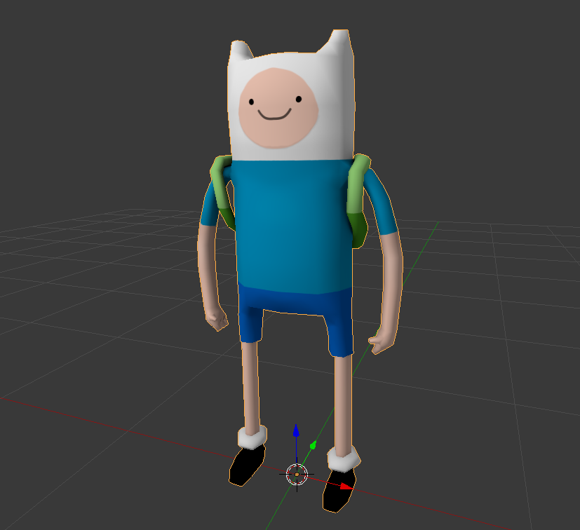
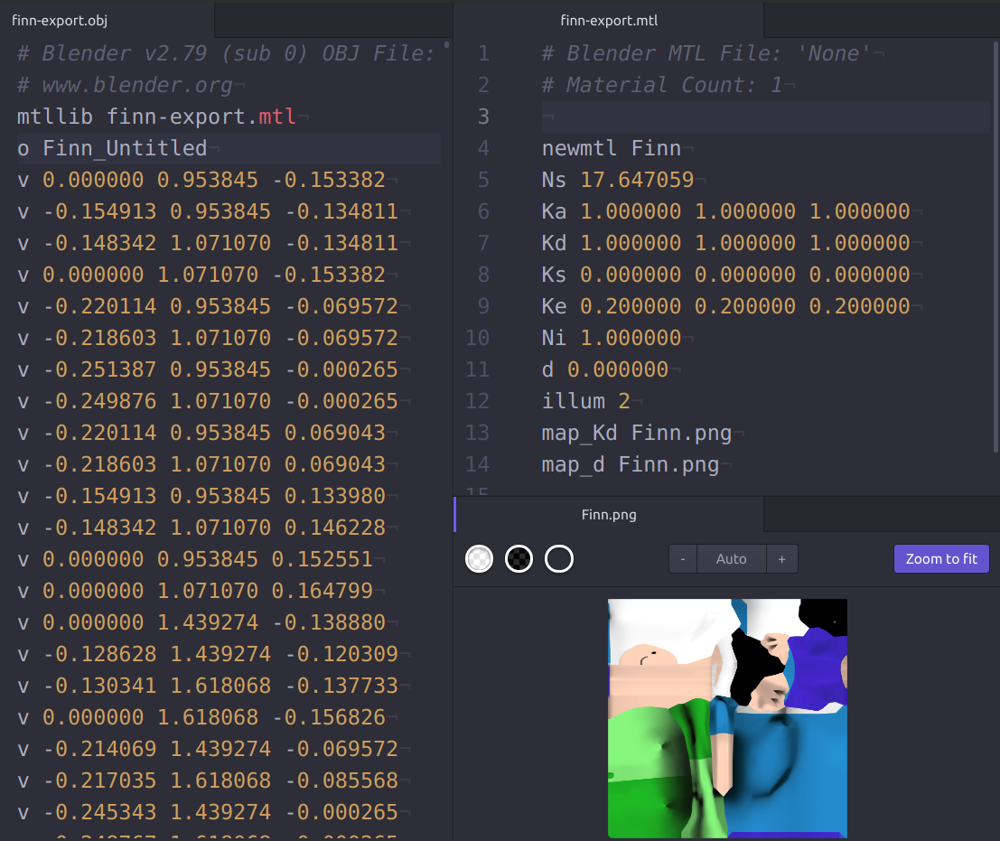
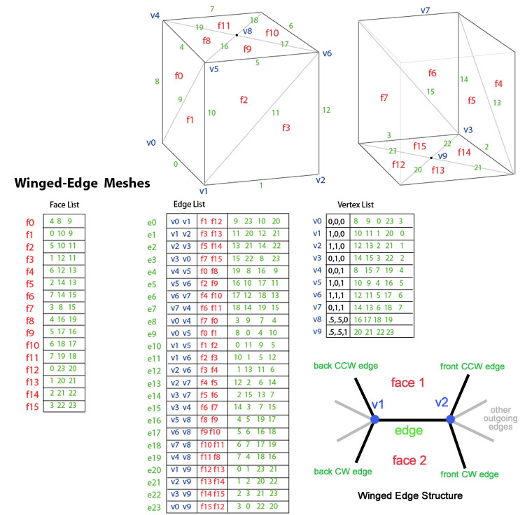
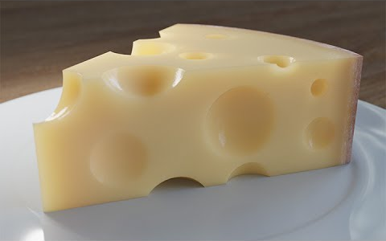

<!-- {"layout": "title"} -->
# Modelagem de Objetos

---
<!-- {"layout": "centered"} -->
# Objetivos

1. Parar de desenhar retângulos :)
1. Conhecer algumas formas para a representação de objetos complexos
1. Refletir sobre melhores formatos para armazenamento de objetos e para sua
   renderização

---
<!-- {"layout": "tall-figure-right"} -->
## Um arquivo .obj

::: figure .no-margin
 <!-- {style="max-width: 220px"} -->
 <!-- {style="max-width: 220px"} -->
:::

1. Vamos usar um **visualizador de arquivos .obj**. Sugestões:

   Windows <!-- {dl:.dl-6} -->
     ~ Obj Model Viewer ([download][omv])

   Linux/OSX
     ~ ctmviewer (`sudo apt install openctm-tools`)
     ~ view3dscene (loja do Ubuntu), blender etc.

1. **Abrir um modelo** descrito em um arquivo .obj
1. Após visualizar o modelo, vamos **abrir** o arquivo `.obj` **usando um
   editor de texto** e entender o que está acontencendo ali

[omv]: https://sourceforge.net/projects/objmodelviewer/

---
<!-- {"layout": "2-column-highlight-and-list"} -->
## Formato Wavefront (.obj - <small>[🌐 especificação][obj-spec]</small>)

::: figure .no-margin width: 50%
 <!-- {style="width: calc(100% - 42px); margin-left:42px"} -->
:::

- Descreve em cada linha: <!-- {ul:.no-bullet style="width: 40%; margin-left: 3em"} -->

  `v` <!-- {dl:.dl-3} -->
    ~ Coordenadas de um vértice <span class="math">(x, y, z)</span>

  `vt`
    ~ Coordenada de textura <span class="math">(s, t)</span>

  `vn`
    ~ Coordenada de vet. normal <span class="math">(x, y, z)</span>

  `f`
    ~ Uma face (polígono) <span class="math">(i_v \/\/ i_{vt} \/\/ i_{vn})</span>

- Coeficientes do material, textura

[obj-spec]: ../../attachments/obj-spec.pdf

---
<!-- {"layout": "regular"} -->
# Paradigmas de Abstração

 <!-- {p:.centered} -->

- Exemplo: uma serra o mundo físico (F) ao mundo matemático (M)
   <!-- {.centered} --> <!-- {ul:.full-width} -->

---
<!-- {"layout": "regular", "backdrop": "paradigma-universos"} -->
## Paradigma dos Universos

FÍSICO
  ~ Contém **objetos do mundo real** que pretendemos estudar

MATEMÁTICO
  ~ Contém uma **descrição abstrata** dos objetos do mundo físico

REPRESENTAÇÃO
  ~ Constituído por **representações simbólicas e finitas** associadas a
    objetos do universo matemático

IMPLEMENTAÇÃO
  ~ Associamos às descrições simbólicas e finitas do universo de
    representação com **estrutura de dados**, com a finalidade de se
    obter uma representação do objeto no computador

Vamos focar nos universos da **REPRESENTAÇÃO** e da **IMPLEMENTAÇÃO**

---
<!-- {"layout": "regular", "backdrop": "paradigma-universos"} -->
## Problemas da Área

- Estudar fenômenos em F
- Estudar as relações entre R e M
- Definir representações de modelos em M
- Estudar conversões entre representações R
- Definir métodos de implementação I
- Comparar estratégias em I

---
<!-- {"layout": "section-header", "backdrop": "paradigma-universos"} -->
# Representação

- Perguntas: <!-- {ul:.content} -->
  1. Como representar superfícies e sólidos de uma forma finita?
  1. Como representar objetos concretos (volumes)?

---
<!-- {"layout": "regular", "backdrop": "paradigma-universos"} -->
## Tipos de **Representação**

- Pontos
- Curvas
- **Superfícies e Sólidos**
  - Um sólido é uma superfície que é (ou tenta ser) fechada
- Volumes
  - Exemplo de "Sólido _vs_ Volume": **Cubo**
    - Superfície = 6 quadriláteros
      - <span class="math">(0,0,0)(0,0,1)(0,1,1)...</span>
    - Volume = espaço interno
      - <span class="math">0 \leq x,y,z \leq 1</span>

---
<!-- {"layout": "regular"} -->
## Descrição dos **Sólidos**

- Um **sólido é um conjunto tridimensional de pontos**
- Conjuntos de pontos podem ser descritos
  1. Por suas fronteiras com o universo
  1. Por um conjunto de escalares
     - Definidos por equações
     - Amostrados
  1. Por composição de sólidos mais simples
- Originam três tipos de representação:
  1. Por bordo ou fronteira (B-rep – _Boundary Representation_)
  1. Por particionamento do espaço (_grids_, _quadtrees_, _Octrees_ etc.)
  1. Operações de conjuntos (CSG – _Constructive Solid Geometry_)

---
<!-- {"layout": "regular"} -->
## Representação Linear por Partes

- 
  Superfície parametrizada com geometria complexa pode ser aproximada por uma
  superfície linear por partes
- Pode-se particionar o domínio da parametrização por um conjunto de polígonos
  - Tipicamente **usamos triângulos** (todos os vértices no mesmo plano)
  - Os triângulos formam um **lado de dentro e um de fora**
  - Devemos **usar uma orientação consistente**: _e.g._, sempre CW ou sempre CCW
- Abordagens: (a) sopa de polígonos e (b) malha poligonal

---
<!-- {"layout": "2-column-content"} -->
## Sopa de Polígonos


- Organização aleatória (caos)
- Não estruturado (`GL_TRIANGLES`)
  – A única ordem garantida é de lado de dentro/fora
- Não contém informação sobre a conectividade dos triângulos
- Muita informação (vértices) redundante

---
<!-- {"layout": "2-column-content"} -->
## _Pros/Cons_ da Sopa de Polígonos


- Vantagens:
  - Fácil de implementar
- Problemas:
  - Redundância
  - Sem conectividade
  - Difícil editar/transformar
  - Risco de _cracking_

---
<!-- {"layout": "2-column-content"} -->
## Malhas Poligonais

- Do inglês _polygonal mesh_ ou apenas **_mesh_** <!-- {ul:.bullet} -->
- Gera uma malha poligonal, definida por um (i) conjunto de vértices, um (ii)
  conjunto de arestas e um (iii) conjunto de faces
  - Cada aresta é compartilhada por no máximo duas faces
  - A interseção de duas faces é uma aresta, um vértice ou vazia
- Adjacência de vértices, arestas e faces é chamada de **topologia** da superfície

1.  <!-- {li:.bullet style="list-style: none"} -->
   #### Malhas Uniformes:
   _grids_, **_fans_**, **_strips_**
   - Conectividade é implícita
   - Muito eficiente
   - Processamento fácil
   - Evita transformações redundantes

---
<!-- {"layout": "regular"} -->
## Operações sobre Malhas Poligonais

-  <!-- {.push-right} --> <!-- {ul:.full-width} -->
  **Desenhar a malha**
- Achar todas as arestas que incidem em um vértice
- Achar as faces que incidem numa aresta ou vértice
- Achar as arestas na fronteira de uma face

---
<!-- {"layout": "section-header", "backdrop": "paradigma-universos"} -->
# Implementação

---
<!-- {"layout": "centered"} -->
## Tipos de **Codificação de Malhas**

1. Explícita
1. Ponteiros para lista de vértices
1. Ponteiros para lista de arestas
1. _Winged-Edge_

---
<!-- {"layout": "regular"} -->
## (1) Codificação Explícita

- A **mais simples**
- **Cada face** armazena explicitamente a **lista ordenada das coordenadas dos
  seus vértices**:
  <div class="math">P={(x_1,y_1,z_1),(x_2,y_2,z_2),\cdots,(x_n,y_n,z_n)}</div>
- Muita redundância de informação
- Consultas de adjacência são complicadas
  - São necessários algoritmos geométricos para determinar adjacências
    entre faces, arestas ou mesmo vértices

---
<!-- {"layout": "regular"} -->
## (2) Ponteiros para Lista de Vértices

- Vértices são armazenados separadamente em uma lista (ou _array_). _E.g._:
  ```c
  struct vertice { float x,y,z };
  typedef struct vertice listaVertices[];  
  ```
- Faces referenciam seus vértices através de ponteiros
  ```c
  struct face {
    struct vertice * v1, * v2, * v3;
  };
  typedef struct face listaFaces[];
  ```

---
<!-- {"layout": "regular"} -->
## Exemplo de **(2) Ponteiros para Lista de Vértices**

 <!-- {p:.centered} -->

- <span class="math">V = \left\\{ V_1 = (x_1, y_1, z_1), V_2 = (x_2, y_2, z_2), \cdots, V_4 = (x_4, y_4, z_4) \\right\\}</span>
- <span class="math">P_1 = \left\\{ V_1, V_2, V_4 \\right\\}</span>
- <span class="math">P_2 = \\left\\{ V_4, V_2, V_3 \\right\\}</span>

---
<!-- {"layout": "regular"} -->
## _Pros/Cons_ (2) Ponteiros para Lista de Vértices

- Vantagens:
  - Proporciona maior economia de memória
- Desvantagens:
  - Achar adjacências ainda é complicado
  - Arestas ainda são desenhadas duas vezes

---
<!-- {"layout": "regular"} -->
## (3) Ponteiros para Lista de Arestas

- Há também uma lista de arestas
  ```c
  typedef struct aresta listaArestas[];
  ```
- Faces referenciam as suas arestas através de ponteiros
- Arestas são desenhadas percorrendo-se a lista de arestas
- Introduzem-se referências para as duas faces que compartilham uma aresta
  ```c
  struct aresta {
    struct vertice * v1, * v2;
    struct face * f1, * f2;
  }
  ```
  - Facilita a determinação das duas faces incidentes na aresta

---
<!-- {"layout": "regular"} -->
## Exemplo de **(3) Ponteiros para Lista de Arestas**

- <span class="math">V = \left\\{ V_1 = (x_1, y_1, z_1), V_2 = (x_2, y_2, z_2), ..., V_4 = (x_4, y_4, z_4) \\right\\}</span>
-  <!-- {.push-right} -->
  <span class="math">E_1 = \left\\{ V_1, V_2, P_1, \lambda \\right\\}</span>
- <span class="math">E_2 = \left\\{ V_2, V_3, P_2, \lambda \\right\\}</span>
- <span class="math">E_3 = \left\\{ V_3, V_4, P_2, \lambda \\right\\}</span>
- <span class="math">E_4 = \left\\{ V_2, V_4, P_1, P_2 \\right\\}</span>
- <span class="math">E_5 = \left\\{ V_4, V_1, P_1, \lambda \\right\\}</span>
- <span class="math">P_1 = \left\\{ E_1, E_4, E_5 \\right\\}</span>
- <span class="math">P_2 = \\left\\{ E_2, E_3, E_4 \\right\\}</span>

---
<!-- {"layout": "regular"} -->
## _Pros/Cons_ (3) Ponteiros para Lista de Arestas

- Vantagens:
  - Não desenha arestas duas vezes
  - Fácil achar adjacência entre vértices
- Desvantagens:
  - Achar adjacências ainda é complicado:
    - <q>Me dê todas as arestas adjacentes a <span class="math">E_1</span></q>
      - É necessário percorrer todas as arestas para fazê-lo:
        <span class="math">O(E)</span>
    - <q>Me dê todas as faces adjacentes a <span class="math">V_1</span></q>
      - Para cada face, visitar cada aresta e ver se o vértice está lá:
        <span class="math">O(F\*3\*2) = O(6F) = O(F)</span>

---
<!-- {"layout": "tall-figure-left"} -->
## (4) _Winged-Edge_ (Aresta Alada)

 <!-- {p:.centered} -->

- Criada em 1974 por Baumgart
- Foi um marco na representação por fronteira
- Armazena informação na estrutura associada às arestas (número de campos é fixo)
- Ao todo, 9 tipos de adjacência entre vértices, arestas e faces
  podem ser calculados em tempo constante

---
<!-- {"layout": "centered"} -->
## 9 tipos de Relacionamentos de Adjacência


---
<!-- {"layout": "centered"} -->
 <!-- {style="max-height: 600px;"} -->

---
# Representações por Células

---
<!-- {"layout": "regular"} -->
## Representações por Células

- Dividem o espaço em sub-regiões convexas
  - **Grids**: cubos de tamanho igual
  - **_Octrees_**: cubos cujos lados são potências de 2
- Cada célula do espaço tem um valor, que é constante dentro dela
1. Em 2D: <!-- {ol:.layout-split-2} -->
   - _Grids_ (matriz 2D)
   - _Quadtrees_
1. Em 3D:
   - _Grids_ (matriz 3D)
   - _Octrees_

---
<!-- {"layout": "regular"} -->
## Grids vs Quadtrees (2D)

 <!-- {p:.centered} -->

- Objeto bidimensional (esquerda), sua representação usando um grid (centro)
  e sua representação usando uma quadtree (direita)

---
<!-- {"layout": "regular"} -->
## Representação de uma **Quadtree** (2D)

 <!-- {p:.centered} -->

- Neste exemplo, o objeto é formado apenas por um ponto (vinho)

---
<!-- {"layout": "regular"} -->
## Representação de uma **Quadtree** (2D) - cont.

- 
  Mais um exemplo de quadtree
- Uma **árvore quaternária** pode ser usada para representar uma quadtree
- Apenas os quadrantes que possuem subquadrantes terão nós filhos (i.e.,
  ocuparão espaço na memória)

---
<!-- {"layout": "regular"} -->
## Octrees

- São úteis para a visualização de objetos que podem ser particionados:
  - 
    Imagens médicas
  - 
    Imagens obtidas por meio de sensores de densidade
- Cada elemeto de um quadrante em um _grid_ é chamado de **voxel**

<!-- ## Voxels


- Um **voxel** representa um valor em um _grid_ tridimensional
  - Pixel = _picture element_; Voxel = _volume element_ -->

---
## Exemplo: _octree_


---
<!-- {"layout": "2-column-content"} -->
# Como desenhar?

- Para converter da representação por campos escalares para _b-rep_:
  - Algoritmo **_marching cubes_**
- Com o objeto em _b-rep_, basta desenhar

<iframe width="560" height="315" src="https://www.youtube.com/embed/B_xk71YopsA" frameborder="0" allow="accelerometer; autoplay; encrypted-media; gyroscope; picture-in-picture" allowfullscreen></iframe>

---
<iframe width="100%" height="100%" src="https://fegemo.github.io/marching-squares/" frameborder="0" allow="accelerometer; autoplay; encrypted-media; gyroscope; picture-in-picture" allowfullscreen></iframe>

---
# Representação CSG

*[CSG]: Constructive Solid Geometry*

---
<!-- {"layout": "regular"} -->
# _Constructive Solid Geometry_

- Operações CSG definem objetos através de operações regularizadas de
  conjuntos de pontos
  - União, Interseção e Diferença
- Possibilita uma codificação bastante simples e concisa
- Requer mais computação para renderizar do que _boundary representation_ (_b-rep_)

 <!-- {p:.centered} -->

*[CSG]: Constructive Solid Geometry*

---
<!-- {"layout": "regular"} -->
## Codificação do CSG: Árvore

-  <!-- {.push-right style="max-height: 200px;"} -->
  Um modelo CSG é codificado por uma árvore <!-- {ul:.full-width} -->
  - **Folhas** contêm objetos **primitivos**
    - Paralelepípedos, cilindros, prismas, pirâmides, esferas, cones etc.
  - Os **nós internos** contêm **operações de conjunto** ou transformações

<iframe src="../../samples/csg/index.html" width="100%" height="400" frameborder="0"></iframe>

*[CSG]: Constructive Solid Geometry*

---
<!-- {"layout": "centered"} -->
## Exemplo (🌐 [tutorial no blender](https://www.youtube.com/watch?v=ViGTkjW997E))



---
# Referências

- Capítulo 13 do livro Computer Graphics with OpenGL, 4th edition
