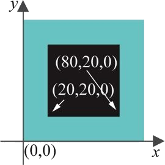
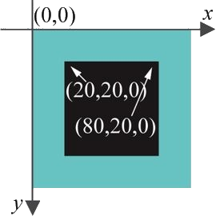
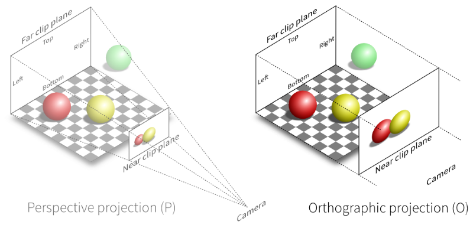
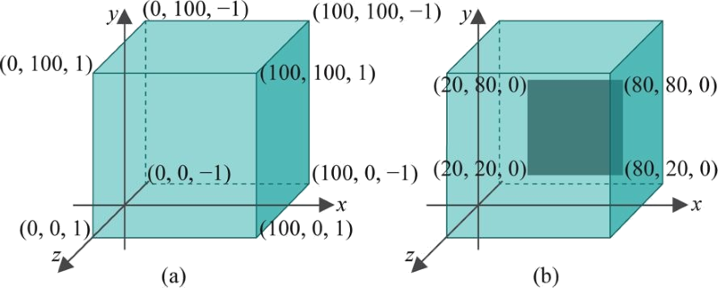
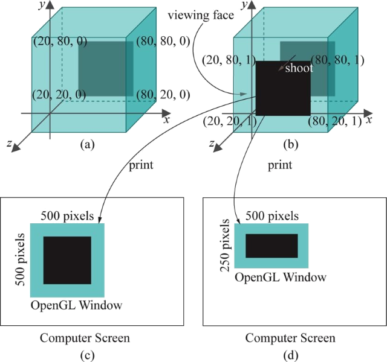
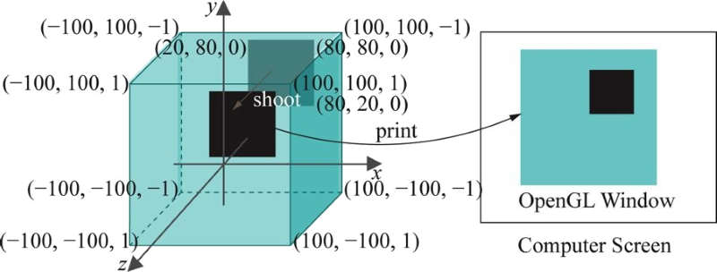
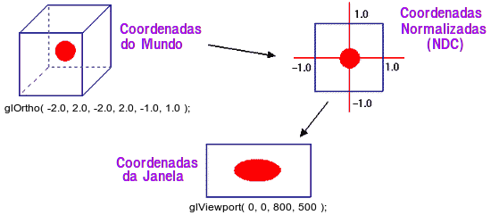
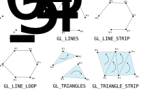
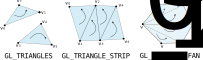
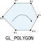

<!-- {"layout": "title"} -->
# Introdução a OpenGL **_hands on_**
## Sistemas de coordenadas, cores e primitivas geométricas

---
<!-- {"layout": "centered"} -->
# Roteiro

1. Primeiro programa (_again!_)
1. Sistemas de Coordenadas
1. _Clipping_ (recorte)
1. Cores, Máquina de Estado e Interpolação
1. Primitivas Geométricas
1. Convenção de nomes do OpenGL
1. Lista de exercícios 1

---
<!-- {"layout": "centered-horizontal"} -->
# Primeiro programa

 <!-- {.bordered} -->

---
<!-- {"layout": "centered-horizontal", "state": "transition-zoom-in"} -->
## O código fonte, um pouco maior

```c
#include <GL/glew.h>      // glew.h deve vir antes
#include <GL/freeglut.h>  // do freeglut.h

// callback de desenho (display)
void desenhaMinhaCena() {
    glClear(GL_COLOR_BUFFER_BIT);
    glColor3f(0, 1, 0);

    // desenha um POLYGON por seus vértices
    glBegin(GL_POLYGON);
        // NOVIDADE: antes os valores eram -0.5, 0.5
        glVertex3f(20, 20, 0);
        glVertex3f(80, 20, 0);
        glVertex3f(80, 80, 0);
        glVertex3f(20, 80, 0);
    glEnd();
    glFlush();
}

// NOVIDADE: uma função que vamos chamar dentro
//    do "main"
// Inicia algumas variáveis de estado do OpenGL
void inicializa() {
    // define qual é a cor do fundo
    glClearColor(1, 1, 1, 1); // branco

    // desenho preenchido vs. contorno
    //glPolygonMode(GL_FRONT_AND_BACK, GL_LINE);
}

// NOVIDADE: callback para o evento "reshape"
void redimensionada(int width, int height) {
   glViewport(0, 0, width, height);

   glMatrixMode(GL_PROJECTION);
   glLoadIdentity();
   glOrtho(0, 100, 0, 100, -1, 1);

   glMatrixMode(GL_MODELVIEW);
   glLoadIdentity();
}

// NOVIDADE: callback de "keyboard"
void teclaPressionada(unsigned char key, int x, int y) {
    // vê qual tecla foi pressionada
    switch(key) {
    case 27:      // Tecla "ESC"
        exit(0);  // Sai da aplicação
        break;
    default:
        break;
    }
}

// função principal
int main(int argc, char** argv) {
   glutInit(&argc, argv);

   glutInitContextVersion(1, 1);
   glutInitContextProfile(GLUT_COMPATIBILITY_PROFILE);

   glutInitDisplayMode(GLUT_SINGLE | GLUT_RGBA);
   glutInitWindowSize(500, 500);
   glutInitWindowPosition(100, 100);

   glutCreateWindow("Hello World");

   // registra callbacks para alguns eventos
   glutDisplayFunc(desenhaMinhaCena);
   glutReshapeFunc(redimensionada);  
   glutKeyboardFunc(teclaPressionada);

   // configura valor inicial de algumas
   // variáveis de estado do OpenGL
   inicializa();

   glutMainLoop();
   return 0;
}
```

Exemplo: [hello-world-callbacks](codeblocks:hello-world-callbacks/CodeBlocks/hello-world-callbacks.cbp)

---
<!-- {"layout": "centered", "state": "transition-zoom-in"} -->
## Apenas a função de desenho

```c
void desenhaMinhaCena() {
    // 1. apaga o conteúdo da janela
    glClear(GL_COLOR_BUFFER_BIT);
    // 2. começa a usar a cor VERDE
    glColor3f(0, 1, 0);
    // 3. gera os vértices de um quadrado
    glBegin(GL_POLYGON);
        // NOVIDADE: antes os valores eram -0.5, 0.5
        glVertex3f(20, 20, 0);
        glVertex3f(80, 20, 0);
        glVertex3f(80, 80, 0);
        glVertex3f(20, 80, 0);
    glEnd();
    // 4. efetivamente desenha
    glFlush();
}
```

---
<!-- {"layout": "centered", "state": "transition-zoom-in"} -->
## Apenas o pedaço que desenha

```c
// 3. gera os vértices de um quadrado
glBegin(GL_POLYGON);
    // NOVIDADE: antes os valores
    // eram -0.5, 0.5
    glVertex3f(20, 20, 0);  // vértice 0
    glVertex3f(80, 20, 0);  // v1
    glVertex3f(80, 80, 0);  // v2
    glVertex3f(20, 80, 0);  // v3
glEnd();
```

---
<!-- {"layout": "regular"} -->
## glBegin e glEnd

- **Os "cantos" do quadrado** estão especificados por **4 vértices** entre
  `glBegin` e `glEnd`
- Para **criar um vértice, usamos `glVertex3f`** e passamos as suas coordenadas
  (x, y, z) como argumento
- Mas qual é o **sistema de coordenadas** que estamos usando?


 <!-- {p:.center-aligned.full-width.no-margin} -->


---
<!-- {"layout": "section-header"} -->
# Sistemas de coordenadas

- Projeção ortogonal
- Volume de visualização
- Coordenadas do mundo
- Coordenadas da janela
- Recorte (_clipping_)

---
<!-- {"layout": "regular"} -->
# Projeção ortogonal

- O que os valores das coordenadas dos vértices significam?
  - No vértice `(20, 20, 0)`, 20 está em mm, cm ou pixels?
- Experimento
  - Alterar `glutInitWindowSize()` para os argumentos (300, 300) e depois
  (500, 250)
- Para entender o que as coordenadas representam, precisamos entender o
  mecanismo de renderização do OpenGL
  - Declaração da projeção sendo usada:
    ```c
    //     left, right, bottom, top, near, far
    glOrtho(0,   100,        0, 100, -1,    1);
    ```
    - [Documentação da função `glOrtho`](https://www.opengl.org/sdk/docs/man2/xhtml/glOrtho.xml)

---
<!-- {"layout": "centered-horizontal"} -->
# Projeção ortogonal (cont.)



---
<!-- {"layout": "regular"} -->
## glOrtho - definindo a projeção a ser usada

```c
glOrtho(0, 100, 0, 100, -1, 1);

// Referência de glOrtho(...):
// glOrtho(left, right, bottom, top, near, far);
```
Documentação do OpenGL 2: https://www.opengl.org/sdk/docs/man2/

- É usado para definir a projeção ortogonal da cena
- Entenda como o **"tamanho do mundo"** - até onde as coisas aparecem

---
<!-- {"layout": "2-column-content"} -->
## glOrtho - o tamanho do mundo

 <!-- {style="width: 500px"} -->


- Forma um cubo com lados alinhados aos eixos
  - `left` até `right` no eixo X
  - `bottom` até `top` no eixo Y
  - `near` até `far` no eixo Z
- **Tudo que está dentro é desenhado**, tudo que está fora é descartado
  - Se `glOrtho(0, 100, 0, 100, -1, 1)`
    - vértice em `(0,   0, 0)`: ↙️
    - vértice em `(0, 100, 0)`: ↖️

---
<!-- {"layout": "centered"} -->
## O volume de visualização do `hello-world.c`



Repare **onde estão os vértices** do quadrado<br>dentro do cubo de visualização

---
<!-- {"layout": "centered", "state": "show-active-slide-and-previous"} -->
## Código que desenha

```c
// 3. gera os vértices de um quadrado
glBegin(GL_POLYGON);
    // NOVIDADE: antes os valores
    // eram -0.5, 0.5
    glVertex3f(20, 20, 0);  // vértice 0
    glVertex3f(80, 20, 0);  // v1
    glVertex3f(80, 80, 0);  // v2
    glVertex3f(20, 80, 0);  // v3
glEnd();
```

---
<!-- {"layout": "2-column-content"} -->
## Os 2 Passos para renderização

Passo 1 <!-- {dl:.dl-6 style="line-height: 1.15em"} -->
  ~ **"Fotografar"** (a ➡️ b)
  ~ Objetos são **projetados perpendicularmente**  na caixa de
    visualização (o plano próximo, ou _near plane_)

Passo 2
  ~ **"Revelar"** (b ➡️ c)
  ~ O **plano de visualização** é escalado ("redimensionado") para
     caber na janela

 <!-- {style="width: 500px"} -->


---
<!-- {"layout": "regular"} -->
## Sistema de **coordenadas global** ou "do mundo"

- É o sistema de coordenadas definido via `glOrtho` (ou `glFrustum`,
  para projeção perspectiva)
- Tudo o que colocarmos na nossa cena deve ser definido nesse sistema de
  coordenadas
  - Em `hello-world.c`, nossa cena contém apenas os 4 vértices do quadrado
  - Mas poderia haver outros vértices com coordenadas "fora do mundo"
    - `glVertex3f(300, 0, 0)`

### Experimento:  
Trocar a caixa de visualização para:
```c
glOrtho(-100, 100, -100, 100, −1, 1);
```

---
<!-- {"layout": "regular"} -->
## Resultado do experimento

-  <!-- {.half-width.push-left} --> <!-- {li:.no-bullet.bulleted} -->
  ### Mais experimentos:
  - Trocar o sistema de coordenadas pelos seguintes valores e testar
    1. ```c
       glOrtho( 0, 200,  0, 200, −1, 1);
       glOrtho(20,  80, 20,  80, −1, 1);
       glOrtho( 0, 100,  0, 100, −2, 5);
       ```
  - Conclusões: <!-- {.clear-both} -->
    1. **Especificamos o sistema de coordenadas global**
       com `glOrtho` ou `glFrustum`
    1. A **unidade de medida** dos valores dos vértices é definida
       pelo sistema de coordenadas: `(20, 20, 0)` não representa pixels!

---
<!-- {"layout": "regular"} -->
## Sistema de coordenadas **da janela**

- Experimento: trocar `glutInitWindowSize(500, 500)` por
  `glutInitWindowSize(500, 250)`
  1. Por que o quadrado deixou de ser quadrado?
  1. Como fazer com que ele continue quadrado ao redimensionar?


1. Porque na fase de "impressão", **o conteúdo** da cena "fotografada" foi
  **redimensionado** para que fosse revelado
1. Podemos **fixar a tela de pintura** (_viewport_)
   ```c
   glViewport(0, 0, 500, 500);  // solução meh
   ```
   ...ou veja como fazer isso em de um jeito bacana em [manter-razao-aspecto](codeblocks:manter-razao-aspecto/CodeBlocks/mater-razao-aspecto.cbp)

---
<!-- {"layout": "regular"} -->
## Os **02 sistemas de coordenadas**

 <!-- {.large-width} --> <!-- {p:.centered} -->

- Sistema de **coordenadas do mundo** (`glOrtho` ou `glFrustum`): <!-- {ul:.multi-column-list-2} -->
  - Um espaço 3D virtual em que criamos nossas cenas
  - Unidade de medida: **arbitrária** <!-- {.alternate-color} -->
- Sistema de **coordenadas da janela** (`glViewport`):
  - Espaço 2D real onde as imagens "reveladas" são desenhadas
  - Unidade de medida: **pixel** <!-- {.alternate-color} -->


---
<!-- {"layout": "centered"} -->
## Experimento com a coordenada z

1. Alterar as coordenadas `z` de alguns vértices para [-1, 1]
   - Nada acontece visualmente
   - Os vértices continuam dentro da caixa de visualização que definimos via
    `glOrtho`

---
<!-- {"layout": "section-header"} -->
# _Clipping_ (recorte)

- Objetos fora do volume: **descartados**
- Objetos no meio do caminho: **recortados** <!-- {.alternate-color} -->
- Objetos dentro do volume: **incluídos**

---
<!-- {"layout": "regular"} -->
## _Clipping_ (Recorte)

- Vértices desenhados fora da caixa de visualização são descartados
- Experimento <!-- {li:.bulleted} -->
  - Desenhar um novo quadrado com os vértices abaixo
    ```c
     glBegin(GL_POLYGON);
        glVertex3f(120, 120, 0);
        glVertex3f(180, 120, 0);
        glVertex3f(180, 180, 0);
        glVertex3f(120, 180, 0);
     glEnd();
    ```
    - Resultado: o novo quadrado não aparece porque foi descartado - todos seus
    vértices estavam fora da caixa de visualização que definimos no `glOrtho`

---
<!-- {"layout": "regular"} -->
## _Clipping_ (Recorte)

- Experimento
  1. Redefinir nossa caixa de visualização para mostrar os dois quadrados
  1. Representar um triângulo, em vez de quadrado, e alterar o valor `z` para
    valores fora da caixa de visualização (_e.g._, -2.5, -5)

---
<!-- {"layout": "regular"} -->
## O que aconteceu?

 <!-- {.medium-width} --> <!-- {p:.centered style="margin-top: 0; margin-bottom: 0"} -->

- Um algoritmo de _clipping_ descartou o vértice que ficou de fora, mas criou
  outros dois na interseção com o volume <!-- {ul:.no-margin} -->
  - Algoritmos de _**line** clipping_: <!-- {ul^0:.multi-column-list-2} -->
    1. Cohen-Sutherland, 1967
    1. Lian-Barsky, 1984
  - Algoritmos de _**polygon** clipping_:
    1. Sutherland-Hodgman, 1974
    1. Weiler-Atherton, 1977

---
<!-- {"layout": "section-header"} -->
# Cores e Primitivas Geométricas

---
## Cores

- ```c
  void desenha() {
    //..
    glColor3f(1, 0, 0);
    //... desenha coisas em vermelho
    glColor3f(0, 0, 1);
    // ... desenha coisas em azul
  }
  ```
  A cor do quadrado é definida pelos três parâmetros da função `glColor3f`
  - RGB (vermelho, verde, azul)
- Os valores de cada componente são presos (**_clamped_**) entre `0` e `1`:
  - **Se** menores que `0` **então** `0`
  - **Se** maiores que `1.0` **então** `1.0`
  - **Se** entre `0.0` e `1.0` **então** usa o valor

---
## OpenGL é uma máquina de estados

- A função `glColor3f(...)` **altera a cor de pintura CORRENTE**
- Todos os vértices desenhados têm a cor da COR CORRENTE
- A COR CORRENTE muda apenas se chamarmos `glColor3f(...)` novamente
- Este é um modelo de máquina de estados
  - O OpenGL mantém o estado de coisas como cor, grossura das linhas,
    tamanho dos pontos etc.
- Outro exemplo:
  - `glClearColor(...)`, que usamos dentro da nossa função `setup()`,
    é como **alteramos a cor do fundo**

---
<!-- {"layout": "2-column-content"} -->
## Valores RGB de algumas cores

<iframe src="../../samples/rgb-cube/index.html" width="100%" height="350" frameborder="0"></iframe>

- <span class="color-portrait black"> </span> Preto: `glColor3f(0.0, 0.0, 0.0)` <!-- {ul:.no-bullet} -->
- <span class="color-portrait red"> </span> Vermelho: `glColor3f(1.0, 0.0, 0.0)`
- <span class="color-portrait green"> </span> Verde: `glColor3f(0.0, 1.0, 0.0)`
- <span class="color-portrait blue"> </span> Azul: `glColor3f(0.0, 0.0, 1.0)`
- <span class="color-portrait yellow"> </span> Amarelo: `glColor3f(1.0, 1.0, 0.0)`
- <span class="color-portrait magenta"> </span> Magenta: `glColor3f(1.0, 0.0, 1.0)`
- <span class="color-portrait ciano"> </span> Ciano: `glColor3f(0.0, 1.0, 1.0)`
- <span class="color-portrait gray"> </span> Cinza: `glColor3f(0.6, 0.6, 0.6)`
- <span class="color-portrait white"> </span> Branco: `glColor3f(1.0, 1.0, 1.0)`

---
<!-- {"layout": "regular"} -->
## Experimento com cores

1. Alterar a cor do quadrado
1. Desenhar um quadrado de cada cor
1. Desenhar um quadrado de forma que cada vértice possua uma cor diferente

---
<!-- {"layout": "section-header"} -->
# Primitivas Geométricas

Que tipos de objetos podemos desenhar?

 <!-- {style="width: 450px;"} -->

---
<!-- {"layout": "regular"} -->
## Primitivas Geométricas

- São as construções geométricas que o OpenGL entende
- São os "tijolos" para construirmos objetos complexos
- Exemplos
  1. Pontos (`GL_POINTS`)
  1. Linhas (`GL_LINES`)
  1. Triângulos (`GL_TRIANGLES`)
- Usamos como um **argumento para <u>`glBegin`</u>**. Por exemplo:
  ```c
  glBegin(GL_POINTS);
      glVertex3f(x, y, z)
      // ...
  glEnd();
  ```

---


---


---
## Do livro vermelho ([online](http://www.glprogramming.com/red/))

| Primitiva         	| Descrição                                                                                                                                                                                                                                                                                                                                                                                                                            	|
|-------------------	|-------------------------------------------------------------------------------------------------------------------------------------------------------------------------------------------------------------------------------------------------------------------------------------------------------------------------------------------------------------------------------------------------------------------------------------------------------------------	|
| `GL_POINTS`       	| Desenha um ponto para cada vértice n.                                                                                                                                                                                                                                                                                                                                                                                                                           	|
| `GL_LINES`        	| Desenha uma série de segmentos de linha desconectados. São desenhados entre v<sub>0</sub> e v<sub>1</sub>, v<sub>2</sub> e v<sub>3</sub>, v<sub>3</sub> e v<sub>4</sub> e daí em diante. Se n é ímar, o último vértice não faz parte de um segmento.                                                                                                                                                                                                                                                                                  	|
| `GL_LINE_STRIP`   	| Desenha um segmento de v<sub>0</sub> a v<sub>1</sub>, então de v<sub>1</sub> a v<sub>2</sub> e daí por diante, desenhando o segmento v<sub>n-2</sub> para v<sub>n-1</sub>. Então, um total de n-1 segmentos são desenhados. Nada é desenhado a menos que n seja maior que 1.                                                                                                                                                                                                                                                        	|
| `GL_LINE_LOOP`    	| Mesmo que `GL_LINE_STRIP`, exceto que um segmento final é desenhado de v<sub>n-1</sub> até v<sub>0</sub>, completando o circuito.                                                                                                                                                                                                                                                                                                                                                         	|


---
## Do livro vermelho ([online](http://www.glprogramming.com/red/))

| Primitiva         	| Descrição                                                                                                                                                                                                                                                                                                                                                                                                                            	|
|-------------------	|-------------------------------------------------------------------------------------------------------------------------------------------------------------------------------------------------------------------------------------------------------------------------------------------------------------------------------------------------------------------------------------------------------------------------------------------------------------------	|
| `GL_TRIANGLES`    	| Desenha uma série de triângulos usando os vértices v<sub>0</sub>, v<sub>1</sub>, v<sub>2</sub>, depois v<sub>3</sub>, v<sub>4</sub>, v<sub>5</sub>, e daí por diante. Se n não é um múltiplo de 3, o último ou os 2 últimos vértices são ignorados.                                                                                                                                                                                                                                                                               	|
| `GL_TRIANGLE_STRIP`| Desenha uma série de triângulos usando os vértices v<sub>0</sub>, v<sub>1</sub>, v<sub>2</sub>, depois v<sub>2</sub>, v<sub>1</sub>, v<sub>3</sub> (repare na ordem), então v<sub>2</sub>, v<sub>3</sub>, v<sub>4</sub> e daí por diante. A ordem é para assegurar que os triângulos estão todos desenhados com a mesma orientação de forma que a tira possa formar parte de uma superfície corretamente. Preservar a orientação é importante para algumas operações, como _culling_.                                                                                    |
| `GL_TRIANGLE_FAN` 	| Mesmo que `GL_TRIANGLE_STRIP`, exceto que os vértices são v<sub>0</sub>, v<sub>1</sub>, v<sub>2</sub>, depois v<sub>0</sub>, v<sub>2</sub>, v<sub>3</sub>, depois v<sub>0</sub>, v<sub>3</sub>, v<sub>4</sub>, e daí por diante.                                                                                                                                                                                                                                                                                                                                         	|



---
## Do livro vermelho ([online](http://www.glprogramming.com/red/))

| Primitiva         	| Descrição                                                                                                                                                                                                                                                                                                                                                                                                                            	|
|-------------------	|-------------------------------------------------------------------------------------------------------------------------------------------------------------------------------------------------------------------------------------------------------------------------------------------------------------------------------------------------------------------------------------------------------------------------------------------------------------------	|
| ~~`GL_QUADS`~~    	| Desenha uma série de quadriláteros de forma análoga a `GL_TRIANGLES`.                                                                                                                                                                                                                                                                       	 	|
| ~~`GL_QUAD_STRIP`~~| Desenha uma série de quadrilátores começando com v<sub>0</sub>, v<sub>1</sub>, v<sub>3</sub>, v<sub>2</sub>, então v<sub>2</sub>, v<sub>3</sub>, v<sub>5</sub>, v<sub>4</sub>, depois v<sub>4</sub>, v<sub>5</sub>, v<sub>7</sub>, v<sub>6</sub> e daí por diante. n deve ser pelo menos 4 antes que algo seja desenhado. Se n é ímpar, o último vértice será ignorado.                                                                                                                                                                                                                               	|
| ~~`GL_POLYGON`~~  	| Desenha um polígono usando os pontos v<sub>0</sub>, ... , v<sub>n-1</sub> como vértices. n deve ser pelo menos 3, ou nada é desenhado. Ademais, o polígono especificado não deve se auto-intersectar e deve ser convexo. Se os vértices não satisfazerem essas condições, os resultados são imprevisíveis.                                                                                                                                                                                  |


---
## Experimentos com as primitivas

1. Desenhar pontos (`GL_POINTS`) em vez de quadrados. Para que os
  pontos fiquem visíveis, **aumentar seu tamanho usando `glPointSize()`**.

1. Usar outras primitivas: `GL_LINES, GL_LINE_STRIP, GL_LINE_LOOP`

---
## Preenchimento

- Estávamos desenhando polígonos preenchidos até agora
- Mas podemos querer desenhar apenas a sua silhueta (contorno)
  ```c
  glPolygonMode( GL_FRONT_AND_BACK, GL_LINE );  // ou GL_FILL
  ```
  - Assinatura da função:
    ```
    glPolygonMode(faces, modo);
    ```
    - `faces`: `GL_FRONT`, `GL_BACK` ou `GL_FRONT_AND_BACK`
    - `modo`: `GL_FILL` (padrão, para preencher) ou `GL_LINE` (contorno)
  - Documentação do [`glPolygonMode`][doc-glpolygonmode]

[doc-glpolygonmode]: https://www.opengl.org/sdk/docs/man2/xhtml/glPolygonMode.xml

---
## Experimento com tipo de preenchimento

1. Alterar a forma de desenho das primitivas
  ```c
  glPolygonMode( GL_FRONT_AND_BACK, GL_LINE );  //GL_FILL
  ```
  e a primitiva para
  ```c
  glBegin( GL_TRIANGLE_STRIP );
      ...
  ```

---
# Convenção de nomes do OpenGL

---


- Notas:
  - `glVertex2f(x, y)` = `glVertex3f(x, y, 0)`
  - `glColor` é análogo
    - mas não há cores com apenas 2 componentes (_i.e._, `glColor2f`)

---
# Lista de exercícios 1

Link via **Moodle**

---
# Referências

- Documentação do OpenGL 2: https://www.opengl.org/sdk/docs/man2/
- Livro Vermelho: http://www.glprogramming.com/red/
