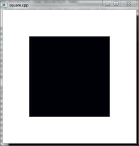
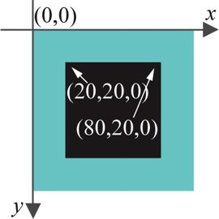
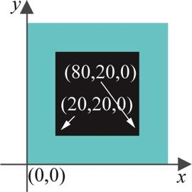
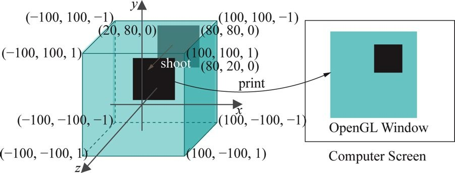
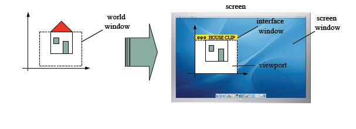
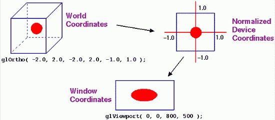

# Introdução a OpenGL **_hands on_**

---
# Roteiro

1. Primeiro programa
1. Projeção Ortogonal, Caixa de Visualização e **Coordenadas do Mundo**
1. A Janela do OpenGL e as **Coordenadas da Tela**
1. **_Clipping_** (recorte)

---
# Primeiro programa (square.c)



---
## square.c

```c
#include <GL/glut.h>

// Drawing routine.
void drawScene(void)
{
   glClear(GL_COLOR_BUFFER_BIT);

   glColor3f(0.0, 0.0, 0.0);

   // Draw a polygon with specified vertices.
   glBegin(GL_POLYGON);
      glVertex3f(20.0, 20.0, 0.0);
      glVertex3f(80.0, 20.0, 0.0);
      glVertex3f(80.0, 80.0, 0.0);
      glVertex3f(20.0, 80.0, 0.0);
   glEnd();

   glFlush();
}

// Initialization routine.
void setup(void)
{
   glClearColor(1.0, 1.0, 1.0, 0.0);
  //glPolygonMode( GL_FRONT_AND_BACK, GL_LINE );
}

// OpenGL window reshape routine.
void resize(int w, int h)
{
   glViewport(0, 0, w, h);
   glMatrixMode(GL_PROJECTION);
   glLoadIdentity();
   glOrtho(0.0, 100.0, 0.0, 100.0, -1.0, 1.0);
   glMatrixMode(GL_MODELVIEW);
   glLoadIdentity();
}

// Keyboard input processing routine.
void keyInput(unsigned char key, int x, int y)
{
   switch(key)
   {
      case 27:
         exit(0);
         break;
      default:
         break;
   }
}

// Main routine.
int main(int argc, char **argv)
{
   glutInit(&argc, argv);

   glutInitDisplayMode(GLUT_SINGLE | GLUT_RGBA);
   glutInitWindowSize(500, 500);
   glutInitWindowPosition(100, 100);
   glutCreateWindow("square.cpp");
   glutDisplayFunc(drawScene);
   glutReshapeFunc(resize);  
   glutKeyboardFunc(keyInput);

   setup();

   glutMainLoop();
   return 0;
}
```

---
## Apenas a função de desenho

```c
void drawScene(void)
{
   glClear(GL_COLOR_BUFFER_BIT);

   glColor3f(0.0, 0.0, 0.0);

   // Draw a polygon with specified vertices.
   glBegin(GL_POLYGON);
      glVertex3f(20.0, 20.0, 0.0);
      glVertex3f(80.0, 20.0, 0.0);
      glVertex3f(80.0, 80.0, 0.0);
      glVertex3f(20.0, 80.0, 0.0);
   glEnd();

   glFlush();
}
```

---
## Apenas o pedaço que desenha

```c
glBegin(GL_POLYGON);
   glVertex3f(20.0, 20.0, 0.0);
   glVertex3f(80.0, 20.0, 0.0);
   glVertex3f(80.0, 80.0, 0.0);
   glVertex3f(20.0, 80.0, 0.0);
glEnd();
```

---
## glBegin e glEnd

- Os "cantos" do quadrado estão especificados por quatro vértices entre
  `glBegin` e `glEnd`
- Para criar um vértice, usamos `glVertex3f` e passamos as coordenadas
- Mas qual é o **sistema de coordenadas** que estamos usando?

---
## Possíveis sistemas de coordenadas




---
# Projeção Ortogonal, Caixa de Visualização e **Coordenadas do Mundo**

---
## Projeção Ortogonal

- O que os valores das coordenadas dos vértices significam?
  - No vértice (20.0, 20.0, 0.0), 20.0 é em mm., cm. ou pixels?
- Experimento
  - Alterar `glutInitWindowSize()` para os argumentos (300, 300) e depois
  (500, 250)
- Para entender o que as coordenadas representam, precisamos entender o
  mecanismo de renderização do OpenGL
  - Declaração da projeção:
    ```c
    glOrtho(0.0, 100.0, 0.0, 100.0, -1.0, 1.0);
    ```

---
## Projeção Ortogonal (cont.)


---
## glOrtho

- ```c
glOrtho(0.0, 100.0, 0.0, 100.0, -1.0, 1.0);
```
- ```c
glOrtho(left, right, bottom, top, near, far);
```
- Documentação do OpenGL 2: https://www.opengl.org/sdk/docs/man2/

---
## glOrtho (cont.)


---
## glOrtho (cont.)

- Forma uma caixa com lados alinhados aos eixos
  - esquerda - direita
  - baixo - topo
  - perto - longe
- **Tudo que está dentro é desenhado**, tudo que está fora é descartado

---
## A Caixa de Visualização do square.c


---
## Passos para renderização

1. "Fotografar": objetos são **projetados perpendicularmente**  na caixa de
  visualização (o _plano próximo_ - _near plane_)
  - Figura (a) para figura (b)
1. "Revelar": o **plano de visualização** é escalado ("redimensionado") para
  caber na janela
  - Figura (b) para figura (c)

---
## Passos para renderização (cont.)


---
## Sistema de **coordenadas global**

- Ou sistema de coordenadas do mundo
- É o sistema de coordenadas que definimos via `glOrtho` (ou `glFrustum`)
- Tudo o que colocarmos na nossa cena deve ser definido nesse sistema de
  coordenadas
  - Em `square.c`, nossa cena é apenas o quadrado

---
## Sistema de coordenadas global (cont.)

- Trocar a caixa de visualização de
  ```c
  glOrtho(0.0, 100.0, 0.0, 100.0, −1.0, 1.0);
  ```
- Para
  ```c
  glOrtho(0.0, 100.0, 0.0, 100.0, −1.0, 1.0);
  ```

---
## Resultado do experimento



---
## Mais experimentos

- Trocar o sistema de coordenadas pelos seguintes valores e testar
  1. ```c
     glOrtho(0.0, 200.0, 0.0, 200.0, −1.0, 1.0)
     ```
  1. ```c
     glOrtho(20.0, 80.0, 20.0, 80.0, −1.0, 1.0)
     ```
  1. ```c
     glOrtho(0.0, 100.0, 0.0, 100.0, −2.0, 5.0)
     ```
- Conclusão: **podemos especificar qual é o sistema de coordenadas globais**
  usando `glOrtho` se estamos usando projeções ortogonais
  - E `glFrustum` se quisermos projeção perspectiva

---
## Sistema de coordenadas **da tela**

- Experimento: Trocar `glutInitWindowSize(500, 500)` por
  `glutInitWindowSize(500, 250)`
  1. Por que o quadrado deixou de ser quadrado?
  1. Como fazer com que ele continue quadrado ao redimensionar?


1. Porque na fase de "impressão", **o conteúdo** da cena "fotografada" foi
  **redimensionado** para que fosse revelado
1. Podemos **fixar a tela de pintura** (_viewport_)
  - ```c
    glViewport(0, 0, 500, 500);
    ```

---
# A Janela do OpenGL e as **Coordenadas da Tela**

---
## Os **dois espaços de coordenadas**

1. Global/Mundo/Objeto
  - Um espaço 3D virtual em que criamos nossas cenas
1. da Tela (_Viewport_)
  - Espaço 2D real onde as imagens "reveladas" são desenhadas

---
## **Mapeamento** entre os dois espaços de coordenadas

- 
- 

---
## Experimento

- Alterar as coordenadas `z` de alguns vértices para [-1, 1]
  - Nada acontece visualmente
  - Os vértices continuam dentro da caixa de visualização que definimos via
    `glOrtho`

---
# _Clipping_ (Recorte)

---
## _Clipping_

- Vértices desenhados fora da caixa de visualização são "recortados"
- Experimento
  - Desenhar um novo quadrado com os vértices abaixo
    ```c
     glBegin(GL_POLYGON);
        glVertex3f(120.0, 120.0, 0.0);
        glVertex3f(180.0, 120.0, 0.0);
        glVertex3f(180.0, 180.0, 0.0);
        glVertex3f(120.0, 180.0, 0.0);
     glEnd();
    ```
---
## _Clipping_

- Resultado: o novo quadrado não aparece porque foi _clipped_ - todos seus
  vértices estavam fora da caixa de visualização que definimos no `glOrtho`
- Experimento
  1. Redefinir nossa caixa de visualização para mostrar os dois quadrados
  2. Representar um triângulo, em vez de quadrado, e alterar o valor `z` para
    valores fora da caixa de visualização (-1, -2.5)

---
## Triângulo recortado


---
# Referências

- Documentação do OpenGL 2: https://www.opengl.org/sdk/docs/man2/
