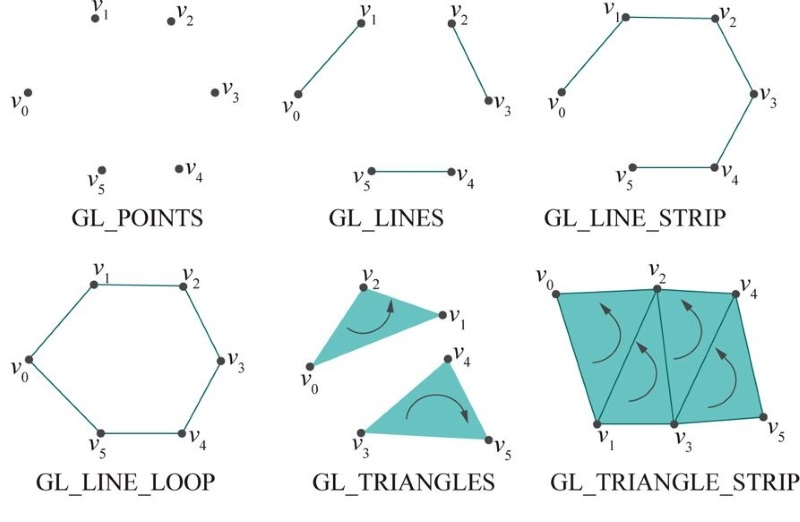
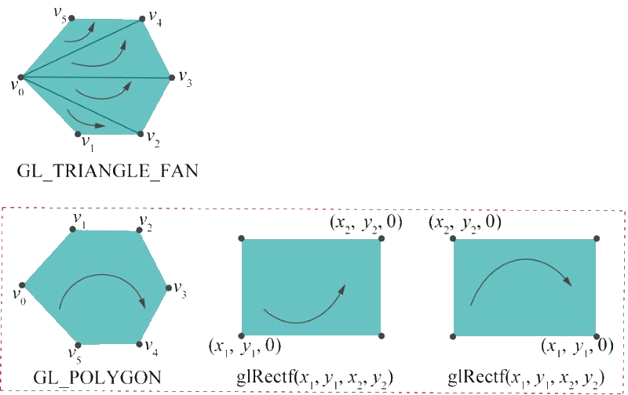
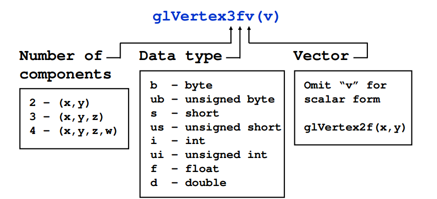

# Introdução a OpenGL **_hands on_** - Parte 2

---
# Roteiro

1. Primeiro programa
1. Cores, Máquina de Estado e Interpolação
1. Primitivas Geométricas
1. Criando uma pequena animação
1. Convenção de nomes do OpenGL
1. Lista de exercícios 1

---
# Primeiro programa (square.c)


---
## square.c

```c
#include "GL/glut.h" // use sinal maior,menor

// Rotina de desenho
void drawScene(void)
{
   glClear(GL_COLOR_BUFFER_BIT);

   glColor3f(0.0, 0.0, 0.0);

   // Desenha um polígono por seus vértices
   glBegin(GL_POLYGON);
      glVertex3f(20.0, 20.0, 0.0);
      glVertex3f(80.0, 20.0, 0.0);
      glVertex3f(80.0, 80.0, 0.0);
      glVertex3f(20.0, 80.0, 0.0);
   glEnd();

   glFlush();
}

// Inicia certas variáveis do OpenGL
void setup(void)
{
   glClearColor(1.0, 1.0, 1.0, 0.0);
   //glPolygonMode( GL_FRONT_AND_BACK, GL_LINE );
}

// Callback de "reshape"
void resize(int w, int h)
{
   glViewport(0, 0, w, h);
   glMatrixMode(GL_PROJECTION);
   glLoadIdentity();
   glOrtho(0.0, 100.0, 0.0, 100.0, -1.0, 1.0);
   glMatrixMode(GL_MODELVIEW);
   glLoadIdentity();
}

// Callback de "tecla pressionada"
void keyInput(unsigned char key, int x, int y)
{
   switch(key)
   {
      case 27:
         exit(0);
         break;
      default:
         break;
   }
}

// Função principal
int main(int argc, char** argv)
{
   glutInit(&argc, argv);

   glutInitDisplayMode(GLUT_SINGLE | GLUT_RGBA);
   glutInitWindowSize(500, 500);
   glutInitWindowPosition(100, 100);
   glutCreateWindow("square.cpp");

   // Registra callbacks para eventos
   glutDisplayFunc(drawScene);
   glutReshapeFunc(resize);  
   glutKeyboardFunc(keyInput);

   setup();

   glutMainLoop();
   return 0;
}
```

---
# Cores, Máquina de Estado e Interpolação

---
## Cores

- A cor do quadrado é definida pelos três parâmetros da função `glColor3f`
  - RGB (vermelho, verde, azul)
- Os valores de cada componente são presos (_clamped_) entre .0 e 1.0
  - Se menores que `0`, `0`
  - Se maiores que `1.0`, `1.0`
  - Se entre `0.0` e `1.0`, usa o valor

---
## Valores RGB de algumas cores

- Preto: `glColor3f(0.0, 0.0, 0.0)`
- Vermelho: `glColor3f(1.0, 0.0, 0.0)`
- Verde: `glColor3f(0.0, 1.0, 0.0)`
- Azul: `glColor3f(0.0, 0.0, 1.0)`
- Amarelo: `glColor3f(1.0, 1.0, 0.0)`
- Magenta: `glColor3f(1.0, 0.0, 1.0)`
- Ciano: `glColor3f(0.0, 1.0, 1.0)`
- Branco: `glColor3f(1.0, 1.0, 1.0)`

---
## Máquina de estados

- A função `glColor3f(...)` **altera a cor de pintura CORRENTE**
- Todos os vértices desenhados têm a cor da COR CORRENTE
- A COR CORRENTE muda apenas se chamarmos `glColor3f(...)` novamente
- Este é um modelo de máquina de estados
  - O OpenGL mantém o estado de coisas como cor, grossura das linhas,
    tamanho dos pontos etc.
- `glClearColor(...)` é como **alteramos a cor do fundo**

---
## Experimento com cores

1. Alterar a cor do quadrado
1. Desenhar um quadrado de cada cor
1. Desenhar um quadrado com cores interpoladas

---
# Primitivas Geométricas

---
## Primitivas Geométricas

- Também chamadas de primitivas de desenho ou apenas primitivas
- São as construções geométricas que o OpenGL entende
- Exemplos
  1. Pontos (`GL_POINTS`)
  1. Linhas (`GL_LINES`)
  1. Polígonos (`GL_POLYGON`)
- São os "tijolos" para construirmos objetos complexos

---


---


---
## Do livro vermelho ([online](http://www.glprogramming.com/red/))

| Primitive         	| Description                                                                                                                                                                                                                                                                                                                                                                                                                          	|
|-------------------	|-------------------------------------------------------------------------------------------------------------------------------------------------------------------------------------------------------------------------------------------------------------------------------------------------------------------------------------------------------------------------------------------------------------------------------------------------------------------	|
| GL_POINTS         	| Draws a point at each of the n vertices.                                                                                                                                                                                                                                                                                                                                                                                                                          	|
| GL_LINES          	| Draws a series of unconnected line segments. Segments are drawn between v0 and v1, between v2 and v3, and so on. If n is odd, the last segment is drawn between vn-3 and vn-2, and vn-1 is ignored.                                                                                                                                                                                                                                                               	|
| GL_LINE_STRIP     	| Draws a line segment from v0 to v1, then from v1 to v2, and so on, finally drawing the segment from vn-2 to vn-1. Thus, a total of n-1 line segments are drawn. Nothing is drawn unless n is larger than 1. There are no restrictions on the vertices describing a line strip (or a line loop); the lines can intersect arbitrarily.                                                                                                                              	|
| GL_LINE_LOOP      	| Same as GL_LINE_STRIP, except that a final line segment is drawn from vn-1 to v0, completing a loop.                                                                                                                                                                                                                                                                                                                                                              	|

---
## Do livro vermelho ([online](http://www.glprogramming.com/red/))

| Primitive         	| Description                                                                                                                                                                                                                                                                                                                                                                                                                          	|
|-------------------	|-------------------------------------------------------------------------------------------------------------------------------------------------------------------------------------------------------------------------------------------------------------------------------------------------------------------------------------------------------------------------------------------------------------------------------------------------------------------	|
| GL_TRIANGLES      	| Draws a series of triangles (three-sided polygons) using vertices v0, v1, v2, then v3, v4, v5, and so on. If n isn't an exact multiple of 3, the final one or two vertices are ignored.                                                                                                                                                                                                                                                                           	|
| GL_TRIANGLE_STRIP 	| Draws a series of triangles (three-sided polygons) using vertices v0, v1, v2, then v2, v1, v3 (note the order), then v2, v3, v4, and so on. The ordering is to ensure that the triangles are all drawn with the same orientation so that the strip can correctly form part of a surface. Preserving the orientation is important for some operations, such as culling. (See "Reversing and Culling Polygon Faces") n must be at least 3 for anything to be drawn. 	|
| GL_TRIANGLE_FAN   	| Same as GL_TRIANGLE_STRIP, except that the vertices are v0, v1, v2, then v0, v2, v3, then v0, v3, v4, and so on (see Figure 2-7).                                                                                                                                                                                                                                                                                                                                 	|

---
## Do livro vermelho ([online](http://www.glprogramming.com/red/))

| Primitive         	| Description                                                                                                                                                                                                                                                                                                                                                                                                                          	|
|-------------------	|-------------------------------------------------------------------------------------------------------------------------------------------------------------------------------------------------------------------------------------------------------------------------------------------------------------------------------------------------------------------------------------------------------------------------------------------------------------------	|
| GL_QUADS          	| Draws a series of quadrilaterals (four-sided polygons) using vertices v0, v1, v2, v3, then v4, v5, v6, v7, and so on. If n isn't a multiple of 4, the final one, two, or three vertices are ignored.                                                                                                                                                                                                                                                              	|
| GL_QUAD_STRIP     	| Draws a series of quadrilaterals (four-sided polygons) beginning with v0, v1, v3, v2, then v2, v3, v5, v4, then v4, v5, v7, v6, and so on (see Figure 2-7). n must be at least 4 before anything is drawn. If n is odd, the final vertex is ignored.                                                                                                                                                                                                              	|
| GL_POLYGON        	| Draws a polygon using the points v0, ... , vn-1 as vertices. n must be at least 3, or nothing is drawn. In addition, the polygon specified must not intersect itself and must be convex. If the vertices don't satisfy these conditions, the results are unpredictable.                                                                                                                                                                                                                                                                                                                                                                                                                                                              	|

---
## Experimentos com as primitivas

1. Desenhar pontos (`GL_POINTS`) em vez de quadrados. Para que os
  pontos fiquem visíveis, aumentar seu tamanho (`glPointSize()`).

1. Usar outras primitivas: `GL_LINES, GL_LINE_STRIP, GL_LINE_LOOP`

---
## Preenchimento

- Estávamos desenhando polígonos preenchidos até agora
- Mas podemos estipular que queremos apenas sua silhueta
  ```c
  glPolygonMode( GL_FRONT_AND_BACK, GL_LINE );  //GL_FILL
  ```

---
## Experimento com tipo de preenchimento

1. Alterar a forma de desenho das primitivas
  ```c
  glPolygonMode( GL_FRONT_AND_BACK, GL_LINE );  //GL_FILL
  ```
  e a primitiva para
  ```c
  glBegin( GL_TRIANGLE_STRIP );
      ...
  ```

---
# Criando uma pequena animação

---
## glutTimerFunc(msecs, func, value)

- Podemos registrar uma _callback_ para **ser invocada daí a `x` ms**.
- Podemos usá-la p/ alterar parâmetros (cor, posição etc.) da cena
  ```c
    void mudaCena()
    {
      // altera a cor do quadrado
      ...
      // atualiza a tela (desenha() será invocada novamente)
      glutPostRedisplay();
      // registra a callback novamente
      glutTimerFunc(25, mudaCena, 0);
    }
    glutTimerFunc(0, mudaCena, 0);
  ```

---
## Experimento

1. Criar um quadrado que muda de cor
  ```c
  void timerColored()
  {
    color += colorIncrement;
  	if (color > 1) {
  		color = 1; colorIncrement = colorIncrement * -1;
  	} else if (color < 0) {
  		color = 0; colorIncrement = colorIncrement * -1;
  	}
    glutPostRedisplay();
    glutTimerFunc(25, timerColored, 0);
  }
  ```

---
# Convenção de nomes do OpenGL

---


---
# Lista de exercícios 1

Link via **Moodle**

---
# Referências

- Documentação do OpenGL 2: https://www.opengl.org/sdk/docs/man2/
- Livro Vermelho: http://www.glprogramming.com/red/
