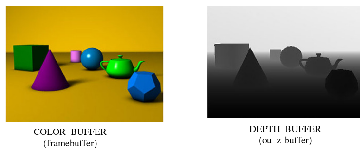

<!-- {"layout": "title"} -->
# Introdução a OpenGL **_hands on_**
## parte 2

---
<!-- {"layout": "centered"} -->
# Roteiro

1. **Tipos** de dados
1. **Re**-desenhando a tela
1. Criando uma pequena **animação**
1. Escrevendo **texto**
1. Ordem de desenho (**_depth buffer_** e coordenada Z)

---
<!-- {"layout": "section-header", "slideClass": "data-types"} -->
# **Tipos de dados** em OpenGL

- Por que ter "tipos" de dados?
- Tipos do OpenGL

---
<!-- {"layout": "regular"} -->
## Tipos em C

- A linguagem C possui diversos tipos de dados primitivos
  ```c
  int numCarros = 10;
  float pesoEmKg = 895.532f;
  double terraParaSol = 1.49597870700e11;
  long int numeroDeCliquesNosSlides = 20040402040l;
  ```
- Esses tipos diferentes usam **quantidades diferentes de espaço (bits)**
  da memória
  - Um `short int`, **normalmente** usa 16 bits
  - Um `int`, 32 bits
  - Um `float`, 32 bits
  - Um `double`, 64 bits

---
<!-- {"layout": "regular"} -->
## Tipos em OpenGL

- Contudo, compiladores (e plataformas) diferentes **podem** usar uma
  **quantidade de bits diferente** do tradicional
  - Por exemplo, o console Nintendo possuía apenas 8 bits
- O OpenGL, com seu objetivo de executar em plataformas variadas, sugere
  o uso de seus próprios tipos de dados
  - Exemplo: `GLint` em vez de `int`
- Assim, **garante-se a precisão necessária** (_e.g._, 32 bits) em cada
  tipo de dados, em vez de deixar o compilador da plataforma decidir
- A seguir, veja o **mapeamento** dos tipos primitivos em **C para os
  tipos sugeridos pelo OpenGL**

---
<!-- {"layout": "regular"} -->
## Tabela de tipos do OpenGL

| Tipo em C                       | Descrição do tipo         | Tipo do OpenGL                | Sufixo |
|---------------------------------|---------------------------|-------------------------------|:------:|
| `signed char`                   | 8-bit inteiro             | `GLbyte`                      | b      |
| `short`                         | 16-bit inteiro            | `GLshort`                     | s      |
| `int` ou `long`                 | 32-bit inteiro            | `GLint, GLsizei`              | i      |
| `float`                         | 32-bit ponto flutuante    | `GLfloat, GLclampf`           | f      |
| `double`                        | 64-bit ponto flutuante    | `GLdouble, GLclampd`          | d      |
| `unsigned char`                 | 8-bit inteiro sem sinal   | `GLubyte, GLboolean`          | ub     |
| `unsigned short`                | 16-bit inteiro sem sinal  | `GLushort`                    | us     |
| `unsigned int or unsigned long` | 32-bit inteiro sem sinal  | `GLuint, GLenum, GLbitfield`  | ui     |

---
<!-- {"layout": "section-header", "slideClass": "redrawing"} -->
# **Re**-desenhando a Tela

- Alterando o estado do programa
- Avisando o sistema de janelas

---
<!-- {"layout": "regular"} -->
## O problema

- Mesmo quando altera-se alguma característica da cena via código, a janela continua da mesma forma, _e.g._:
  ```c
  glPolygonMode(GL_FRONT_AND_BACK, GL_LINES);
  ```
  - Precisamos redesenhar a tela... mas como?
    - Chamar `desenhaMinhaCena()` diretamente?
      - Não devemos!
  - Quem manda desenhar é o Freeglut (sistema de janelas), por meio do **evento _"display"_**
    - Então, **basta avisar ao Freeglut** que, assim que possível, ele deve mandar **disparar um <u>evento _display_</u>**

---
<!-- {"layout": "regular"} -->
## A solução

- Para avisar ao Freeglut que a janela deve ser redesenhada, usamos o comando `glutPostRedisplay()`:
  ```c
  void teclaPressionada(unsigned int key, int x, int y) {
    // ...
    glutPostRedisplay();
  }
  ```
- Para uma animação, precisamos redesenhar várias vezes por segundo
  - Tipicamente chamamos `glutPostRedisplay()` várias vezes/segundo

---
<!-- {"layout": "section-header", "slideClass": "animation"} -->
# Criando uma pequena animação

- Usando freeglut, precisamos do evento _timer_ ou _idle_
  (`glutTimerFunc` ou `glutIdleFund`)
- A _callback_ deve alterar o estado da aplicação
- A função de desenho simplesmente desenha **o estado atual**

> **Animação** é alterar o valor de algo **ao longo do tempo**

---
<!-- {"layout": "regular"} -->
## glutTimerFunc(msecs, func, value) [🌐](https://www.opengl.org/resources/libraries/glut/spec3/node64.html)

- Podemos registrar uma _callback_ para **ser invocada daí a `x` ms**.
- Podemos usá-la p/ alterar parâmetros (cor, posição etc.) da cena
  ```c
  void atualizaCena(int valorQualquer) {
      // altera algo na cena
      ...
      // atualiza a tela (desenha() será invocada novamente)
      glutPostRedisplay();
      // registra a callback novamente...
      glutTimerFunc(33, atualizaCena, 0); // por quê 33? 1000/33 = 30fps
  }
  ```

---
<!-- {"layout": "3-column-content", "playMediaOnActivation": {"selector": "#color-animation" }, "slideClass": "compact-code-more"} -->
## Animando uma cor

- <video width="100%" preload="auto" controls loop src="../../videos/animacao-cor.mp4" id="color-animation" class="bordered subtly-round"></video>
  [Animação de cor](codeblocks:animacao-cor/CodeBlocks/animacao-cor.cbp) <!-- {ul:.no-bullet.no-margin.no-padding.center-aligned} -->

```c
float tom = 0.5;
float incremento = 0.01;

void mudaCor(int valor) {
  tom += incremento;
  if (tom > 1 || tom < 0) {
    // inverte o sinal
    incremento *= -1;
  }
  glutPostRedisplay();

  glutTimerFunc(33, mudaCor, 0);
}
```

```c
void desenhaCena() {
  glClear(GL_COLOR_BUFFER_BIT);

  glColor3f(tom, tom, tom);
  glBegin(GL_TRIANGLE_FAN);
      glVertex3f(20, 20, 0);
      glVertex3f(80, 20, 0);
      glVertex3f(80, 80, 0);
      glVertex3f(20, 80, 0);
  glEnd();

  // ...
}
```

---
<!-- {"layout": "regular"} -->
## Usando **2 _frame buffers_**

- Quando estamos criando uma animação - **atualizando a tela várias
  vezes por segundo**, podemos ter um problema de
  **"imagens" estateladas** (_flickering_) <!-- {ul:.bulleted} -->
- Isso acontece porque estamos escrevendo no `COLOR_BUFFER` ao mesmo tempo que
  ele é enviado ao monitor
-  <!-- {.push-right.half-width} -->
  Para evitar, usamos um _**double buffer**_:
  1. _front-buffer_: é quem está sendo mostrado pelo monitor
  1. _back-buffer_: é onde estamos "pintando" o próximo quadro
- Após terminar de desenhar no _back buffer_, invertemos quem é _front_ com o _back_

---
<!-- {"layout": "regular"} -->
## Usando **2 _Buffers_** com Freeglut

1. Configuramos o freeglut com **`GLUT_DOUBLE`** <u>em vez de</u> `GLUT_SINGLE`:
   ```c
   int main(int argc, char** argv) {
       glutInitDisplayMode(GLUT_RGB | GLUT_DOUBLE);
   }
   ```
1. Na _callback_ de _display_, **`glutSwapBuffers()`** <u>em vez de</u>
   `glFlush()`:
   ```c
   void desenha() {
       glutSwapBuffers();
   }
   ```

---
<!-- {"layout": "centered-horizontal"} -->
## Outra animação: **segue o mouse**

 <!-- {.medium-width.centered.bordered.subtly-round} -->

Exemplo: [animacao-segue-mouse](codeblocks:animacao-segue-mouse/CodeBlocks/animacao-segue-mouse.cbp)

---
<!-- {"layout": "section-header", "slideClass": "text"} -->
# Escrevendo Texto

- Como desenhar texto com OpenGL

---
<!-- {"layout": "regular"} -->
## Gráficos _raster_

- Até agora, vimos como desenhar primitivas geométricas em OpenGL
  - `GL_TRIANGLE_FAN`, `GL_TRIANGLE_STRIP` etc.
- Contudo, queremos também **desenhar áreas retangulares de cores**
  - Exemplos:
    1. Colocar imagens na tela
    1. Escrever texto
- Veremos duas formas para escrever texto na tela
  1. OpenGL puro
  1. Freeglut _to the rescue_ \o/

---
<!-- {"layout": "regular"} -->
## **_Bitmaps_ e fontes** (OpenGL puro)

- O OpenGL provê primitivas de nível baixo para a escrita de caracteres na tela
-  <!-- {.push-right} -->
  Os comandos `glRasterPos()` e `glBitmap()` posicionam e desenham um _bitmap_
- Pode-se usar _display lists_ (próxima aula) para armazenar o _bitmap_ de cada letra e apenas
  usá-lo por seu índice posteriormente
- O restante é com a gente =)
  - [Exemplo de desenho de texto **em OpenGL "puro"**](codeblocks:fontes-opengl-f/CodeBlocks/fontes-opengl-f.cbp)

---
<!-- {"layout": "regular"} -->
## **Exemplo** de texto na tela em OpenGL puro

```c
GLubyte matrizDePixels[24] = {
    0xc0, 0x00, 0xc0, 0x00, 0xc0, 0x00, 0xc0, 0x00, 0xc0, 0x00, 0xff, 0x00,
    0xff, 0x00, 0xc0, 0x00, 0xc0, 0x00, 0xc0, 0x00, 0xff, 0xc0, 0xff, 0xc0 };
void inicializa() {
    glPixelStorei(GL_UNPACK_ALIGNMENT, 1);
}
void desenha() {
    glClear(GL_COLOR_BUFFER_BIT);
    glColor3f(1, 1, 1);
    glRasterPos2i(20, 20);
    glBitmap(10, 12, 0.0, 0.0, 11.0, 0.0, matrizDePixels);
    glBitmap(10, 12, 0.0, 0.0, 11.0, 0.0, matrizDePixels);
    glBitmap(10, 12, 0.0, 0.0, 11.0, 0.0, matrizDePixels);
    glFlush();
}
```

---
<!-- {"layout": "2-column-content"} -->
## glBitmap [🌐](https://www.khronos.org/registry/OpenGL-Refpages/gl2.1/xhtml/glBitmap.xml)

```c
void glBitmap(
  GLsizei width,
  GLsizei height,
  GLfloat xorig,
  GLfloat yorig,
  GLfloat xmove,
  GLfloat ymove,
  const GLubyte* bitmap);
```

## glRasterPosi [🌐](https://www.khronos.org/registry/OpenGL-Refpages/gl2.1/xhtml/glRasterPos.xml)

```c
void glRasterPos2i(GLint x, GLint y);
```

---
<!-- {"layout": "regular"} -->
## **_Bitmaps_ e fontes** (usando GLUT)

- Freeglut já implementou algumas fontes (usando `glBitmap()`) e nos oferece **algumas
  opções mais simples**
- Documentação da função [`glutBitmapCharacter`](http://freeglut.sourceforge.net/docs/api.php#FontRendering)
  ```c
  void glutBitmapCharacter(void* font, int character);
  ```
  - Algumas opções para o parâmetro `font`:
    ```c
    GLUT_BITMAP_8_BY_13
    GLUT_BITMAP_9_BY_15
    GLUT_BITMAP_TIMES_ROMAN_10
    GLUT_BITMAP_HELVETICA_18
    ```

---
<!-- {"layout": "centered-horizontal", "slideClass": "compact-code-more"} -->
## **Exemplo** de texto na tela em GLUT

```c
void escreve(void* fonte, char* texto, float x, float y) {
  glRasterPos2f(x, y);

  for (int i = 0; i < strlen(texto); i++) {
     glutBitmapCharacter(fonte, texto[i]);
  }
}

void desenha() {
  glClear(GL_COLOR_BUFFER_BIT);
  glColor3f (1.0, 1.0, 1.0);
  texto(GLUT_BITMAP_HELVETICA_18, "FFF", 20, 20);
  glFlush();
}
```
- Exemplo: [texto com freeglut](codeblocks:fontes-glut/CodeBlocks/fontes-glut.cbp)
- Exemplo: [texto com em OpenGL puro](codeblocks:fontes-opengl/CodeBlocks/fontes-opengl.cbp)

---
<!-- {"layout": "section-header", "slideClass": "draw-order"} -->
# Ordem de desenho

- A ordem dos comandos de desenho importa?

---
<!-- {"layout": "2-column-content"} -->
## Atividade

1. Desenhar um anel vermelho <!-- {ol:.no-bullet.center-aligned} -->
   

- Há pelo menos 03 formas:  
  1. Desenhar um círculo vermelho grande, depois um branco pequeno
  1. Igual anterior, mas coloca o branco mais próximo da tela
  1. Desenhar um círculo furado

---
<!-- {"layout": "regular"} -->
## Função: desenhaCirculo(R, x, y, z)

```c
void desenhaCirculo(float raio, float x, float y, float z) {
  float t;

  glBegin(GL_TRIANGLE_FAN);
    glVertex3f(x, y, z);
      for(int i = 0; i <= NUM_LADOS; ++i) {
        t = 2 * M_PI * i / NUM_LADOS;
        glVertex3f(x + cos(t) * raio, y + sin(t) * raio, z);
      }
  glEnd();
}
```

- Exemplo: [discos](codeblocks:discos/CodeBlocks/discos.cbp)
- E se alterarmos a ordem do branco com o vermelho?


---
<!-- {"layout": "regular"} -->
## O que aconteceu?

- Por padrão, o OpenGL usa o **algoritmo do pintor** para a **determinação da
  visibilidade** dos polígonos

   <!-- {.large-width} -->
  - O que é desenhado por último aparece na frente
  - O OpenGL simplesmente desenha os triângulos, na ordem que pedimos

---
<!-- {"layout": "regular"} -->
## Ativando: **teste de profundidade**

- Para que o OpenGL teste a coordenada `Z`, (1) <u>precisamos ativar
  o **teste de profundidade**</u>
  ```c
  glEnable(GL_DEPTH_TEST);
  // desenha
  glDisable(GL_DEPTH_TEST);
  ```
- Também precisamos (2) <u>limpar o _depth buffer_</u>, ao limparmos a cor
  da janela
  ```c
  glClear(GL_COLOR_BUFFER_BIT | GL_DEPTH_BUFFER_BIT);
  ```
- E (3) <u>avisar a freeglut</u> que vamos usar o _depth buffer_
  ```c
  glutInitDisplayMode(GLUT_DOUBLE | GLUT_RGB | GLUT_DEPTH);
  ```

---
<!-- {"layout": "centered-horizontal"} -->
## O _depth buffer_ (ou **z-buffer**)



---
<!-- {"layout": "centered"} -->
# Referências

- Capítulo 4 do livro **Computer Graphics with OpenGL 4th edition**
- Documentação do OpenGL 2: https://www.opengl.org/sdk/docs/man2/
- Livro Vermelho: http://www.glprogramming.com/red/ (capítulo 8)
