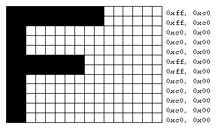
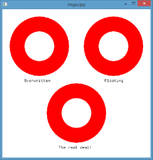

# Introdução a OpenGL **_hands on_** - Parte 3

---
# Roteiro

1. Tipos de dados
1. Gráficos _raster_
1. _Depth buffer_ e a coordenada Z


---
# Tipos de dados em OpenGL

---
## Tipos em C

- A linguagem C possui diversos tipos de dados primitivos
  ```c
  int numCarros = 10;
  float pesoEmKg = 895.532f;
  double terraParaSol = 1.49597870700e11;
  long int numeroDeCliquesNosSlides = 20040402040l;
  ```
- Esses tipos diferentes usam **quantidades diferentes de espaço (bits)** da memória
  - Um `short int`, **normalmente** usa 16 bits
  - Um `int`, 32 bits
  - Um `float`, 32 bits
  - Um `double`, 64 bits

---
## Tipos em OpenGL

- Contudo, compiladores (e plataformas) diferentes podem usar uma quantidade diferente do tradicional
  - Por exemplo, o console Nintendo possuía apenas 8 bits
- O OpenGL, com seu objetivo de executar em plataformas variadas, sugere o uso de seus próprios tipos de dados
  - Exemplo: `GLint` em vez de `int`
- Assim, **garante-se a precisão necessária** (e.g., 32 bits) em cada tipo de dados, em vez de deixar o compilador
  da plataforma decidir
- A seguir, veja o **mapeamento** dos tipos primitivos em **C para os tipos sugeridos pelo OpenGL**

---
## Tabela de tipos do OpenGL

| Tipo em C                       | Descrição do tipo         | Tipo do OpenGL                | Sufixo |
|---------------------------------|---------------------------|-------------------------------|:------:|
| `signed char`                   | 8-bit inteiro             | `GLbyte`                      | b      |
| `short`                         | 16-bit inteiro            | `GLshort`                     | s      |
| `int` ou `long`                 | 32-bit inteiro            | `GLint, GLsizei`              | i      |
| `float`                         | 32-bit ponto flutuante    | `GLfloat, GLclampf`           | f      |
| `double`                        | 64-bit ponto flutuante    | `GLdouble, GLclampd`          | d      |
| `unsigned char`                 | 8-bit inteiro sem sinal   | `GLubyte, GLboolean`          | ub     |
| `unsigned short`                | 16-bit inteiro sem sinal  | `GLushort`                    | us     |
| `unsigned int or unsigned long` | 32-bit inteiro sem sinal  | `GLuint, GLenum, GLbitfield`  | ui     |


---
# Gráficos _raster_

---
## Gráficos _raster_

- Até agora, vimos como desenhar primitivas geométricas em OpenGL
- Contudo, queremos também **desenhar áreas retangulares de cores**
  - Exemplos:
    1. Colocar imagens na tela
    1. Escrever texto
- Veremos duas formas para escrever texto na tela
  1. OpenGL puro
  1. GLUT _to the rescue_ \o/

---
## **_Bitmaps_ e fontes** (OpenGL puro)

- O OpenGL provê primitivas de nível baixo para a escrita de caracteres na tela
- 
  Os comandos `glRasterPos*()` e `glBitmap()` posicionam e desenham um _bitmap_
- Pode-se usar _display lists_ (próxima aula) para armazenar o _bitmap_ de cada letra e apenas
  usá-lo por seu índice posteriormente
- O restante é com a gente =)
  - [Exemplo de desenho de texto **em OpenGL "puro"**](codeblocks:fontes-opengl-f/CodeBlocks/fontes-opengl-f.cbp)

---
## **Exemplo** de texto na tela em OpenGL puro

```c
GLubyte rasters[24] = {
   0xc0, 0x00, 0xc0, 0x00, 0xc0, 0x00, 0xc0, 0x00, 0xc0, 0x00,
   0xff, 0x00, 0xff, 0x00, 0xc0, 0x00, 0xc0, 0x00, 0xc0, 0x00,
   0xff, 0xc0, 0xff, 0xc0};

void init(void)
{
   glPixelStorei (GL_UNPACK_ALIGNMENT, 1);
   glClearColor (0.0, 0.0, 0.0, 0.0);
}

void display(void)
{
   glClear(GL_COLOR_BUFFER_BIT);
   glColor3f (1.0, 1.0, 1.0);
   glRasterPos2i (20, 20);
   glBitmap (10, 12, 0.0, 0.0, 11.0, 0.0, rasters);
   glBitmap (10, 12, 0.0, 0.0, 11.0, 0.0, rasters);
   glBitmap (10, 12, 0.0, 0.0, 11.0, 0.0, rasters);
   glFlush();
}
```

---
## **glBitmap**

```c
void glBitmap(
  GLsizei width,
  GLsizei height,
  GLfloat xorig,
  GLfloat yorig,
  GLfloat xmove,
  GLfloat ymove,
  const GLubyte* bitmap);
```

## **glRasterPosi**

```c
void glRasterPos2i(GLint x, GLint y);
```

---
## **_Bitmaps_ e fontes** (usando GLUT)

- GLUT já implementou algumas fontes (usando `glBitmap()`) e nos oferece **algumas
  opções mais simples**
- Documentação da função [glutBitmapCharacter](https://www.opengl.org/documentation/specs/glut/spec3/node76.html)
  ```c
  void glutBitmapCharacter(void *font, int character);
  ```
  - Algumas opções para o parâmetro `font`:
    ```c
    GLUT_BITMAP_8_BY_13
    GLUT_BITMAP_9_BY_15
    GLUT_BITMAP_TIMES_ROMAN_10
    GLUT_BITMAP_HELVETICA_18
    ```

---
## **Exemplo** de texto na tela em GLUT

```c
void drawString (void * font, char *s, float x, float y, float z) {
    unsigned int i;
    glRasterPos3f(x, y, z);

    for (i = 0; i < strlen (s); i++)
       glutBitmapCharacter (font, s[i]);
}

void display() {
   glClear(GL_COLOR_BUFFER_BIT);
   glColor3f (1.0, 1.0, 1.0);
   drawString(GLUT_BITMAP_HELVETICA_18, "FFF", 20, 20, 0);
   glFlush();
}

```

- [Exemplo de texto usando GLUT](codeblocks:fontes-glut/CodeBlocks/fontes-glut.cbp)
- [Mesmo exemplo, em OpenGL puro](codeblocks:fontes-opengl/CodeBlocks/fontes-opengl.cbp)

---
# Depth buffer e a coordenada Z

---
## Atividade

- Desenhar um anel vermelho


---
## **Três** formas

1. Desenha um círculo vermelho grande, depois um branco pequeno
1. Igual anterior, mas coloca o branco mais próximo da tela
1. Desenha um círculo furado

---
## Função: desenhaDisco(R, x, y, z)

```c
void drawDisc(float R, float X, float Y, float Z) {
  float t;
  int i;

  glBegin(GL_TRIANGLE_FAN);
    glVertex3f( X, Y, Z);
      for(i = 0; i <= N; ++i) {
        t = 2 * PI * i / N;
        glVertex3f(X + cos(t) * R, Y + sin(t) * R, Z);
      }
  glEnd();
}
```

- [Exemplo do Disco](codeblocks:discos/CodeBlocks/discos.cbp)

---
## Experimento

- E se alterarmos a ordem do branco com o vermelho?

---
## **Depth Buffer**

- O OpenGL simplesmente desenha os triângulos, na ordem que pedimos
- Para que ele faça um teste da coordenada `Z`, precisamos ativar o **teste
  de profundidade**
  - ```c
    glEnable(GL_DEPTH_TEST);
    // desenha
    glDisable(GL_DEPTH_TEST);
    ```
- Também precisamos limpar o _depth buffer_, da mesma forma que limpamos a cor
  da janela
  ```c
  glClear(GL_COLOR_BUFFER_BIT | GL_DEPTH_BUFFER_BIT);
  ```

---
## Experimento

- Alterar o código para usar o _depth buffer_
- O segundo anel é desenhado de forma correta independente da ordem de desenho

  

---
# Referências

- Capítulo 4 do livro **Computer Graphics with OpenGL 4th edition**
- Documentação do OpenGL 2: https://www.opengl.org/sdk/docs/man2/
- Livro Vermelho: http://www.glprogramming.com/red/ (capítulo 8)
