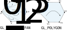
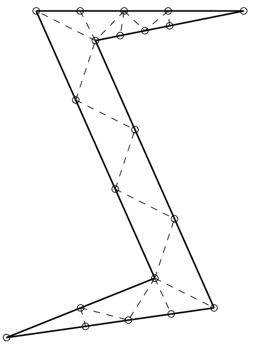

<!-- {"layout": "title"} -->
# Introdução a OpenGL **_hands on_**
## parte 3

---
<!-- {"layout": "centered"} -->
# Roteiro

1. [Display lists](#display-lists)
1. [Orientação dos polígonos](#orientacao-dos-poligonos)
1. [Posicionamento de objetos](#posicionamento-de-objetos)
1. [Usando texturas](#usando-texturas)
1. **[Trabalho Prático 1](#tp1)**

---
<!-- {"layout": "section-header", "slideClass": "display-list", "slideHash": "display-lists"} -->
# Display Lists

- Revendo o exercício
- Como armazenar objetos para desenho

---
<!-- {"layout": "regular"} -->
## Exercício 2 da lista

 <!-- {p:.centered} -->

- \#comofaz para desenhar linhas e o polígono ao mesmo tempo?

---
<!-- {"layout": "2-column-content", "slideClass": "compact-code-more"} -->
## Opção 1

- Desenha-se o polígono **preenchido** e, **em seguida, em _wire_**: <!-- {ul:.bullet} -->
  ```c
  glColor3f(0, 0, 1);     // azul
  glPolygonMode(GL_FRONT_AND_BACK, GL_FILL);
  glBegin(GL_TRIANGLE_STRIP);
      // 10 vértices aqui...
  glEnd();

  glColor3f(0, 0, 0);     // preto
  glPolygonMode(GL_FRONT_AND_BACK, GL_LINE);
  glBegin(GL_TRIANGLE_STRIP);
      // os mesmos 10 vértices aqui...
  glEnd();
  ```

1. **Discussão**: <!-- {ol:.no-bullet.bullet} -->
   - Temos um **_code smell_** - algo está errado
   - **Não devemos repetir código** para que não precisemos alterar mais de um
     lugar caso precisemos no futuro
     - Princípio DRY - _Don't Repeat Yourself_
   - Podemos resolver isso extraindo o código repetido para uma função...
     - Esse processo se chama **refatorar o código**

---
<!-- {"layout": "2-column-content", "slideClass": "compact-code-more"} -->
## Opção 2: uma função: `desenhaAnelQuadrado()`

```c
void desenhaAnelQuadrado() {
    glBegin(GL_TRIANGLE_STRIP);
        // 10 vértices aqui...
    glEnd();
}
//...

void desenhaCena() {
    glColor3f(0, 0, 1);     // azul
    glPolygonMode(GL_FRONT_AND_BACK, GL_FILL);
    desenhaAnelQuadrado();

    glColor3f(0, 0, 0);     // preto
    glPolygonMode(GL_FRONT_AND_BACK, GL_LINE);
    desenhaAnelQuadrado();
}
```

1. **Discussão**: <!-- {ol:.bulleted.no-bullet} -->
   - Resolvemos o _code smell_, mas não paramos por aí
   - E se, em vez de 10 vértices, nosso polígono tivesse 1 mil vértices?
     - Cada chamada a `glVertex` faz **uma viagem da CPU à GPU**
   - Solução: o OpenGL pode **registrar um polígono** caso queiramos desenhá-lo
     várias vezes

---
<!-- {"layout": "regular"} -->
## Opção 3 - usando **lista de visualização**

- Em vez de chamar o método de desenho na _callback_ de desenho, vamos registar
  os vértices **em tempo de <u>inicialização</u> do programa** e apenas instruir o
  OpenGL a executar esses vértices em tempo de desenho
- Assim, otimizamos bem as chamadas de desenho de vértices

---
<!-- {"layout": "regular", "slideClass": "two-column-code compact-code-more"} -->
## Opção 3: implementação

```c
int listaAnel;

void desenhaCena() {
  glColor3f(0, 0, 1);       // azul
  glPolygonMode(GL_FRONT_AND_BACK, GL_FILL);
  glCallList(listaAnel);    // chama a lista

  glColor3f(0, 0, 0);       // preto
  glPolygonMode(GL_FRONT_AND_BACK, GL_LINE);
  glCallList(listaAnel);    // chama a lista
}


void criaListaAnelQuadrado() {
  listaAnel = glGenLists(1);
  glNewList(listaAnel,
    GL_COMPILE);  
    glBegin(GL_TRIANGLE_STRIP);
      // os 10 vértices
    glEnd();
  glEndList();
}

int main(int c, char** v) {
  //...
  criaListaAnelQuadrado();
  glutMainLoop();
}

```

---
<!-- { "layout": "section-header", "slideClass": "orientacao-de-poligonos", "slideHash": "orientacao-de-poligonos" } -->
# Orientação de Polígonos
## Lado da frente e de trás

---
<!-- { "layout": "regular" } -->
# Orientação

- Todo polígono convexo possui um lado de fora e um lado de dentro
  - Ou lado da frente e lado de trás
- Em computação gráfica, é importante saber qual é o lado do polígono que
  estamos vendo por:
  - **Desempenho**: muitas vezes desenhamos só o lado de fora/frente
  - **Flexibilidade**: alguns polígonos podem precisar ser desenhados
    diferentemente se o estamos pela frente ou por trás
- Em OpenGL, definimos a orientação dos polígonos de forma implícita,
  **de acordo com a primitiva**...

---
<!-- { "layout": "regular" } -->
# Orientação no OpenGL

- O lado de fora/frente de um polígono em OpenGL é dado **<u>pela ordem</u>
  em que declaramos seus vértices**
   <!-- {.centered style="margin-bottom: 1em;"} -->
- 🔄 (CCW), vemos o lado da frente
- 🔃 (CW), vemos o lado de trás

*[CCW]: Counterclockwise*
*[CW]: Clockwise*

---
<!-- { "layout": "regular", "slideClass": "compact-code-more" } -->
# Exemplo de Orientação

```c
void desenhaMinhaCena() {
    //...
    glPolygonMode(GL_BACK, GL_FILL);  // Lado de trás: contorno
    glPolygonMode(GL_FRONT, GL_LINE); // Da frente: preenchido
    // Desenha um quadrado de lado 60
    glBegin(GL_TRIANGLE_FAN);
        glVertex2i(-30, -30);
        glVertex2i( 30, -30);
        glVertex2i( 30,  30);
        glVertex2i(-30,  30);
    glEnd();
    //...
}
```
- [Exemplo de Orientação](codeblocks:orientacao-poligonos/CodeBlocks/orientacao-poligonos.cbp)
  - É possível inverter: `glFrontFace(GL_CW)` (mas não há muito motivo)

---
<!-- { "layout": "section-header", "slideClass": "posicionamento", "slideHash": "posicionamento-de-objetos" } -->
# Posicionamento de objetos

- O jeito ruim
- O jeito bão <sup>(c)</sup>

---
<!-- { "layout": "regular" } -->
# Posicionando Objetos - O Jeito Ruim <!-- {.bullet} -->

-  <!-- {.push-right.bullet style="max-height: 300px;"} -->
  A forma como temos posicionado objetos não é legal:
  ```c
  glBegin(GL_TRIANGLE_FAN);
      glVertex2f(nave.x,              nave.y);
      glVertex2f(nave.x + nave.larg,  nave.y);
      glVertex2f(nave.x + nave.larg,  nave.y + nave.alt);
      glVertex2f(nave.x,              nave.y + nave.alt);
  glEnd();
  ```
  - Problema: e se houver muito mais do que 4 vértices? *➡️*
  - Questão: não seria bem mais fácil definir as coordenadas se **pudéssemos
    assumir que estamos <u>sempre na origem</u>?**

---
<!-- { "layout": "regular" } -->
# Posicionando Objetos - Do Jeito Bão <sup>(c)</sup>

- Damos as coordenadas assumindo que estamos na origem, mas
  transladamos o objeto para onde queremos que ele realmente seja
  desenhado:
  - Na aula sobre [transformações](../transforms/) veremos
    como o `glTranslate`, `glPushMatrix` e o `glPopMatrix` funcionam <!-- {ul^0:.push-right style="max-width: 220px;"} -->
  ```c
  glPushMatrix();                 // Importante!!
      glTranslatef(nave.x, nave.y, 0);
      glBegin(GL_TRIANGLE_FAN);
          glVertex2f(-nave.larg/2, -nave.alt/2); // v3---v2
          glVertex2f( nave.larg/2, -nave.alt/2); // |     |
          glVertex2f( nave.larg/2,  nave.alt/2); // |     |
          glVertex2f(-nave.larg/2,  nave.alt/2); // v0---v1
      glEnd();
  glPopMatrix();                  // Importante!!
  ```

---
<!-- { "layout": "section-header", "slideClass": "usando-texturas", "slideHash": "usando-texturas" } -->
# Usando Texturas

---
<!-- { "layout": "regular" } -->
# Texturas

- Teremos uma [aula sobre texturas](../textures) mais a frente
- Contudo, vamos começar a aprender para já ir usando
- As funções básicas são:
  - `glEnable(GL_TEXTURE_2D);`, para **habilitar texturas**
  - `glBindTexture(GL_TEXTURE_2D, int)`, para **começar a usar** uma textura
  - `glTexCoord2f(x, y)`, para definir **coordenada de textura para cada vértice**
- Vamos ver um exemplo...
  - [Textura simples usando SOIL](codeblocks:textura-simples-soil/CodeBlocks/textura-simples-soil.cbp)

---
<!-- { "layout": "regular" } -->
# Variável global

- Temos uma variável global que armazenará um **identificador de textura**, que é
  um número inteiro que será gerado pelo OpenGL
  ```c
  GLuint texturaDoMario;
  ```
  - Pense nesta variável como guardando o **número da gavetinha** onde o OpenGL
    reservou espaço para a **matriz de cores da imagem**

---
<!-- { "layout": "regular" } -->
# Na _callback_ de desenho

```c
void desenhaMinhaCena() {
    //...
    glEnable(GL_TEXTURE_2D);
    glBindTexture(GL_TEXTURE_2D, texturaDoMario);
    glBegin(GL_TRIANGLE_FAN);
        glTexCoord2f(0, 0); glVertex3f(-1, -1,  0);
        glTexCoord2f(1, 0); glVertex3f( 1, -1,  0);
        glTexCoord2f(1, 1); glVertex3f( 1,  1,  0);
        glTexCoord2f(0, 1); glVertex3f(-1,  1,  0);
    glEnd();
    glDisable(GL_TEXTURE_2D);
  //...
}
```

---
<!-- { "layout": "regular" } -->
# Explicando o uso das funções

- Ao desenhar o polígono que queremos texturizar, devemos seguir **3 passos**:
  1. **Habilitar** o uso de texturas bidimensionais
  1. **Especificar qual textura vamos aplicar** ao próximo polígono a ser desenhado
  1. **Mapear** cada canto da textura a cada vértice do polígono
- Agora, falta saber como carregar uma imagem no OpenGL para servir de textura

---
<!-- { "layout": "regular" } -->
# Carregando texturas

- O OpenGL não possui funções para carregar texturas
- Basicamente, precisamos abrir o arquivo de imagem nós mesmos (`fopen` e amigos) e
  usar outros 4-5 métodos do OpenGL para então conseguirmos usar um arquivo como
  textura:
  - `glGenTextures(...), glTexParameteri(..), glTexImage2D(...), glTexEnvf(...)`
- Veremos como esses métodos funcionam em aulas futuras, mas hoje vamos usar
  uma **biblioteca chamada SOIL** que possui funções para carregar arquivos de imagem
  diretamente

---
<!-- { "layout": "regular" } -->
# SOIL

- Biblioteca para carregar arquivos de imagem no formato esperado pelo OpenGL
- Suporta diversos formatos de imagem:
  - png
  - jpg
  - bmp etc.
- Para baixar e ler a documentação: http://lonesock.net/soil.html

*[SOIL]: Simple OpenGL Image Library*

---
<!-- { "layout": "regular" } -->
# Em alguma função de inicialização

```c
GLuint texturaDoMario;    // id da textura

GLuint carregaTextura(char* arquivo) {
    GLuint idTextura = SOIL_load_OGL_texture(
        arquivo,        // ⬅️ do parâmetro
        SOIL_LOAD_AUTO,
        SOIL_CREATE_NEW_ID,
        SOIL_FLAG_INVERT_Y
    );

    if (idTextura == 0) {
        printf("Erro carregando a textura: '%s'\n", SOIL_last_result());
    }

    return idTextura;
}

void inicializa() {
  texturaDoMario = carregaTextura("mario.png");
}
```

---
<!-- { "layout": "centered", "slideHash": "tp1" } -->
# Trabalho Prático 1 \o/

_A wild TP1 appears..._

---
<!-- {"layout": "2-column-content"} -->
# TP1: **Galaxian**


> Um dos primeiros jogos que surgiu se chamava Galaxian.
> Nele, o jogador pilota uma nave que fica na parte de baixo
> da tela e, com ela, se defende de um ataque alienígena.


 <!-- {.push-right style="width: 210px; margin-left: 1em"} -->
- Enunciado no Moodle

---
# Referências

- Documentação do OpenGL 2: https://www.opengl.org/sdk/docs/man2/
- Livro Vermelho: http://www.glprogramming.com/red/
