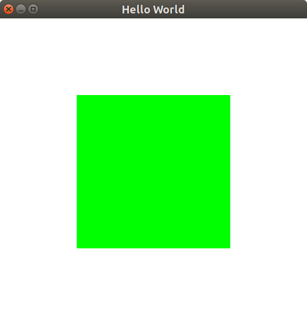
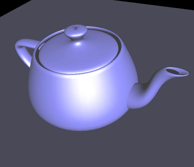
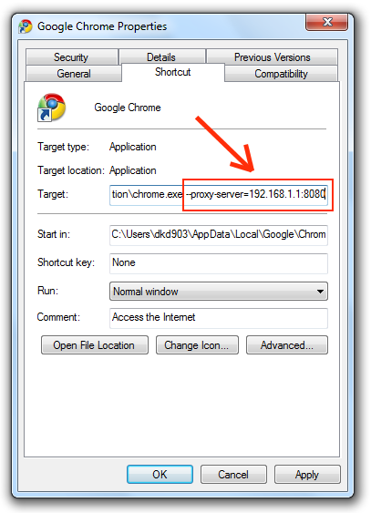
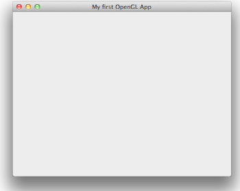

# OpenGL, Sistemas de Janelas e GLUT

---
# Roteiro

1. _Hello World_
1. Conceitos
1. Sistemas de janelas
1. Criando um projeto OpenGL
1. GLUT
1. Para casa: **TP0**

---
# _Hello World_

---
Apenas uma janela preta com um quadrado branco :)

```c
#include 'GL/glut.h'

void desenharMinhaCena(void)
{
    glClear(GL_COLOR_BUFFER_BIT);
    glBegin(GL_POLYGON);
        glVertex3f(0.0, 0.0, 0.0);
        glVertex3f(0.5, 0.0, 0.0);
        glVertex3f(0.5, 0.5, 0.0);
        glVertex3f(0.0, 0.5, 0.0);
    glEnd();
    glFlush();
}

int main(int argc, char** argv)
{
    glutInit(&argc, argv);
    glutInitDisplayMode(GLUT_SINGLE);
    glutInitWindowSize(300, 300);
    glutInitWindowPosition(100, 100);
    glutCreateWindow("Hello world :D");
    glutDisplayFunc(desenharMinhaCena);
    glutMainLoop();
    return 0;
}
```

---
# Rodando nosso _Hello World_...



---
# Conceitos

---
## Cena 3D



---
## Cena 3D (cont.)

1. É um conjunto de:
  1. Objetos geométricos (triângulos, pontos, linhas etc.)
  1. Fontes de iluminação
  1. Texturas (imagens "grudadas" nos obj. geométricos)
  1. Materiais (propriedades físicas (reflexão, cor) dos obj. geométricos)

---
## OpenGL

1. _Open Graphics Library_ ou biblioteca gráfica aberta
1. Funciona como uma **máquina de estados**
1. É uma API (_Application Programming Interface_) de acesso a recursos (algoritmos
   e mesmo _hardware_) gráficos que oferece rotinas para:
  1. Desenhar primitivas e imagens
  1. Alterar variáveis de estado (cor, material, fontes de luz)
  1. Consultar variáveis de estado

---
## OpenGL (cont.)

1. OpenGL é um padrão em evolução
  1. Mecanismo padronizado de extensões
  1. Novas versões são estabelecidas por um comitê (ARB) de usuários e
    fabricantes
    1. Tornou-se OpenGL Working group dentro do Khronos Group em Setembro de
    2006
1. Depende de um sistema de janelas
  1. OpenGL cuida apenas de gerar o "conteúdo" das janelas

---
# Sistemas de janelas

---
## Sistemas de janelas (**SJ**)

1. Principal meio de interação homem/máquina
  1. Baseado no conceito de WIMP
1. Tela é dividida em janelas (eventualmente superpostas) controladas por
  aplicações que têm a incumbência de mantê-las sempre atualizadas
1. Cada sistema operacional tem o seu. O linux tem MUITAS opções
  1. Cada sistema de janelas possui uma API distinta
    1. `#include 'QtOpenGL' `
    1. `#include 'windows.h' `, etc.

---
## Sistemas de janelas (cont.)

Utiliza o paradigma de **programação orientada a eventos** (PoE).

1. A interação é comunicada via **eventos**
  - Mouse se movimentou (10u, 5u)
  - A tecla 'K' foi pressionada
  - Janela foi redimensionada
1. Eventos são "tratados" por rotinas _callback_
  1. Redesenhar a janela quando ela for redimensionada
  1. Mover objeto X quando a tecla <key>W</key> for pressionada
1. Demonstração de PoE (em Javascript)

---
## Sistemas de janelas (cont.)

1. As APIs contém rotinas como
  1. **Criar janela**
  1. **Reposicionar e desenhar** janela
  1. Desenhar botões, barras, menus (**_widgets_**)
  1. **Disparar eventos** na aplicação que contenha o foco

---
## _Widgets_ no X e no Windows




---
## _Hello World_ OpenGL no Windows e no OSX




---
## Interação do OpenGL com os SJs

1. Um programa OpenGL
  1. é responsável apenas pelo **conteúdo da janela**
  1. pode registrar para **"escutar" eventos** disparados pelo sistema de
     janelas
  1. precisa ser incluído junto da API de um SJ

---
Como cada SJs tem uma API diferente


Como faço se eu quiser fazer um programa OpenGL que **execute em vários
sistemas operacionais**?

---
## GLUT (OpenGL Toolkit)

- **API portátil** de acesso aos SJs que cria uma abstração
- **Não** é parte **oficial** do OpenGL
- Encapsula e **esconde as camadas proprietárias**

---
Hmm... Precisa de mais motivação para usar o GLUT??
Veja um _hello world_ usando GLUT e outro usando a API do SJ do Windows.

https://gist.github.com/fegemo/ddfa33441281e564eefe
https://gist.github.com/fegemo/1f534a2a59d7d289ec48

---
# Criando um projeto em OpenGL

---
## Você vai precisar de:

- Um ambiente para desenvolvimento em C/C++
  - Uma IDE ou editor de texto (CodeBlocks, DevCpp etc.)
  - Um compilador (gcc, mingW, cygwin + gcc)
- As bibliotecas do OpenGL e do GLUT (.dll, .h)
- A biblioteca GLU (OpenGL Utilities) que facilita algumas funções
  do OpenGL

---
## Tutoriais de configuração

1. Tutorial de Configuração de projeto usando OpenGL em várias plataformas
(Windows, Linux) e ambientes (DevCpp, CodeBlocks etc.)
  - [PDF][tut-isabela-manssour-pdf]
  - [html][tut-isabela-manssour-html]
1. [Capítulo 2 do Tutorial de Utilização do OpenGL][tut-opengl-marcionilo]
1. Mais tutoriais (de alunos) estão disponíveis no **Moodle**

[tut-isabela-manssour-pdf]: http://wiki.icmc.usp.br/images/c/c2/Introdu%C3%A7%C3%A3oPr%C3%A1ticaOpenGL.pdf
[tut-isabela-manssour-html]: http://www.inf.pucrs.br/~manssour/CG/pratica1/
[tut-opengl-marcionilo]: http://www.cin.ufpe.br/~mgrb/arquivos/TutorialOpenGL-MarcioniloBarbosa.pdf

---
# Programas em OpenGL

---
## Anatomia de um programa OpenGL/GLUT

```c
#include 'GL/glut.h'
// Outros cabeçalhos

void desenharMinhaCena(void) {
  //...
}
void teclaPressionada() {
  //...
}
// Outras callbacks

int main(int argc, char** argv) {
    // Inicialização do GLUT
    glutInit(&argc, argv);
    // Inicialização e configuração da janela
    glutInitDisplayMode(GLUT_SINGLE);
    glutInitWindowSize(300, 300);
    glutInitWindowPosition(100, 100);
    glutCreateWindow("Hello world :D");

    // Registro de callbacks de eventos
    glutDisplayFunc(desenharMinhaCena);
    glutKeyboardFunc(desenharMinhaCena);

    // Dá início no loop de atualização
    glutMainLoop();
    return 0;
}
```

---
## Headers OpenGL/GLUT
```c
#include 'GL/glut.h'
```
1. O GLUT já inclui automaticamente os headers do OpenGL, então não é necessário
  incluir o `gl.h` e o `glu.h`
  ```c
  #include 'GL/gl.h'
  #include 'GL/glu.h'
  ```
1. Se GLUT não for usado, os headers OpenGL têm que ser incluídos
  explicitamente, junto com os de outra camada de interface (`windows.h`)

---
## GLUT – Registrando _Callbacks_

- _Callbacks_ são rotinas que serão chamadas para tratar eventos.
- Para uma rotina _callback_ ser efetivamente chamada ela precisa ser
  registrada através da função `glutXxxFunc(callback)`
  - Onde `Xxx` designa uma classe de eventos e _callback_ é o nome da rotina
    - `glutKeyboardFunc`
    - `glutMouseFunc` etc.
- Por exemplo, para registrar uma _callback_ de desenho chamada Desenho, usa-se
`glutDisplayFunc(Desenho);`

---
## GLUT – _Callback_ de **desenho**

- Chamada automaticamente sempre que a janela precisa
- Todo programa GLUT precisa ter uma!
- Exemplo:
  ```c
void display(void) {
    glClear( GL_COLOR_BUFFER_BIT );
    glBegin( GL_TRIANGLE_STRIP );
    glVertex3fv( v[0] );
    glVertex3fv( v[1] );
    glVertex3fv( v[2] );
    glVertex3fv( v[3] );
    glEnd();
    glutSwapBuffers(); // double-buffering!
}
  ```

---
## GLUT – Callback de **redimensionamento**

- Chamada sempre que a janela é redimensionada, isto é, teve seu tamanho
  alterado
- Tem a forma
  ```c
void reshape (int width, int height) { }
  ```
  - `width`/`height` são a nova largura/altura da janela (em pixels)
  - Se uma rotina de redimensionamento não for especificada, o GLUT usa uma
    rotina de redimensionamento _default_ que simplesmente ajusta o _viewport_
    para usar toda a área da janela

---
## GLUT - Outras _callbacks_

- Outras callbacks comumente usadas
  - Eventos de teclado
  ```c
  void keyboard (unsigned char key, int x, int y)
  ```
  - Eventos de _mouse_
  ```c
void mouse (int button, int state, int x, int y)
void motion (int x, int y)
void passiveMotion (int x, int y)
  ```

---
## GLUT - Outras _callbacks_ (cont.)

- Evento "tô atoa"
  ```c
  void idle (void)
  ```
  Chamada continuamente quando nenhum outro evento ocorre
- Várias outras

---
## Programa OpenGL/GLUT - Inicialização

Inicialização do GLUT
```c
glutInit (int* argc, char** argv)
```
Estabelece contato com sistema de janelas
Em X, opções de linha de comando são processadas e removidas

---
## Programa OpenGL/GLUT - Inicialização (cont.)

- Inicialização da janela:
  ```c
  glutInitDisplayMode (int modo)
  ```
  Estabelece o tipo de recursos necessários para as janelas que serão
criadas. Modo é um "ou" bit-a-bit de constantes:
    - `GLUT_RGB` cores dos pixels serão expressos em RGB
    - `GLUT_DOUBLE` bufferização dupla (ao invés de simples)
    - `GLUT_DEPTH` buffer de profundidade (z-buffer)
    - `GLUT_ACCUM` buffer de acumulação
    - `GLUT_ALPHA` buffer de cores terá componente alfa

---
## Programa OpenGL/GLUT - Inicialização (cont.)

- Posicionamento da janela
  ```c
  glutInitWindowPosition (int x, int y)
  ```
  Estabelece a posição inicial do canto superior esquerdo da janela a ser criada
- Tamanho da janela
  ```c
  glutInitWindowSize (int width, height)
  ```
  Estabelece o tamanho (em pixels) da janela a ser criada

---
## Programa OpenGL/GLUT - Inicialização (cont.)

- Criação da(s) janela(s)
  ```c
  int glutCreateWindow (char* nome)
  ```
  - Cria uma nova janela primária (top-level)
  - Nome é tipicamente usado para rotular a janela
  - O número inteiro retornado é usado pelo GLUT para identificar a janela
- Outras inicializações
  - Após a criação da janela é costumeiro configurar variáveis de estado do
    OpenGL que não mudarão no decorrer do programa. Por exemplo:
    - Cor do fundo
    - Tipo de sombreamento de desejado

---
## Programa OpenGL/GLUT – Laço Principal

- Depois de registradas as _callbacks_, o controle é entregue ao sistema de
  janelas:
  ```c
  glutMainDisplayLoop (void)
  ```
- Esta rotina na verdade é o "despachante" de eventos
- Ela nunca retorna

---
# Para casa: TP0

---
## TP0: Instalação do OpenGL

1. Atividade A (valor: 1 ponto):
  1. Para a próxima aula, você deve configurar um ambiente de desenvolvimento em OpenGL (até a versão 2.0)
  1. Escreva um programa `hello world` em OpenGL e GLUT cujo **título da janela é seu nome completo**
    - Sua cena deve conter apenas um quadrado, como no exemplo desta aula 
  1. **No Moodle**, poste uma _screenshot_ da sua janela na tarefa do TP0
1. Atividade B (valor: até 1 ponto **extra**): 
  - Opcionalmente, você pode escrever um guia passo a passo sobre como configurar o OpenGL usando suas ferramentas 
    favoritas
  - Os passos **DEVEM** ser reprodutíveis e funcionar para que se consiga os pontos
