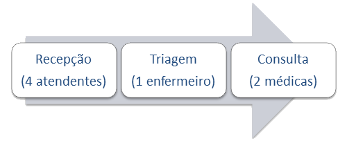
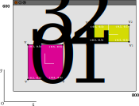
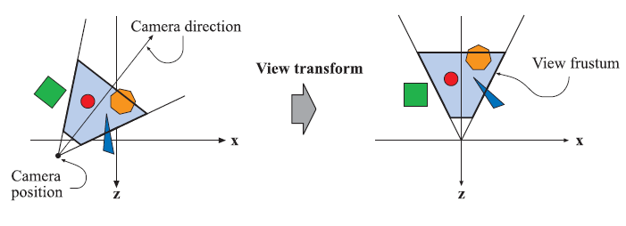
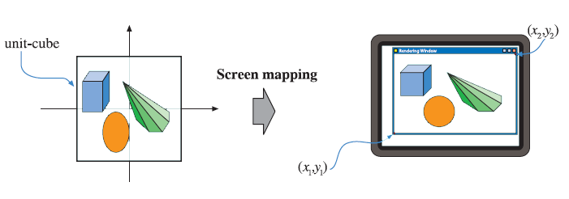
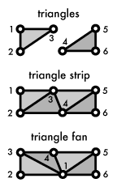
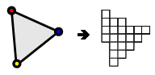
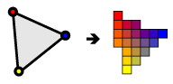

<!-- {"layout": "title"} -->
# Pipeline Gráfico

---
<!-- {"layout": "regular"} -->
# Objetivos

1. Entender o que acontece desde um `glVertex3f(x,y,z)` até a imagem renderizada
   na tela
1. Conhecer o que o OpenGL (e o DirectX, e outras APIs gráficas) fazem
   com a geometria criada até que uma imagem seja gerada

---
<!-- {"layout": "centered"} -->
# Roteiro

1. O _pipeline_ gráfico
1. Estágio de **Aplicação**
1. Estágio de **Geometria**
1. Estágio de **Rasterização**

---
<!-- {"layout": "section-header", "slideClass": "o-pipeline-grafico"} -->
# O _pipeline_ gráfico

---
<!-- {"layout": "regular"} -->
## Um _pipeline_

1. **Divisão** de trabalho **em etapas**
1. As etapas são executadas **em paralelo**
1. Exemplo: pipeline de pacientes em um hospital
  
  - A velocidade com que se atende pacientes é dada pela **velocidade da etapa
    mais lenta**

---
<!-- {"layout": "regular"} -->
## O _pipeline_ **gráfico**

 <!-- {p:.centered} -->

- É o **processo de transformação de um modelo de descrição de objetos** (vértices)
  **em uma imagem digital** (imagem renderizada na tela)
  - Pense como o processo que acontece assim que `glFlush()` é executado
- Dividido em três etapas conceituais:
  1. Aplicação
  1. Geometria
  1. Rasterização <!-- {ol:.multi-column-list-3} -->

---
<!-- {"layout": "regular"} -->
## O _pipeline_ gráfico

- Cada etapa pode ser, por si só, outro _pipeline_
- O **tempo de renderização** é dado pela velocidade da etapa mais devagar
  - Depende da cena e de como foi implementada
- Na analogia do hospital:
  1. Os **vértices** são os **pacientes** que precisam ser renderizados
  1. Para isso eles precisam passar por algumas etapas, em que **são
    transformados**
  1. Os **atendentes/enfermeiros/médicos** são componentes de **_software_
    ou _hardware_**

---
<!-- {"layout": "regular", "embeddedStyles": "#fases-aplicacao .rasterizacao, #fases-aplicacao .geometria { fill: #ddd !important; stroke: #999 !important;}", "embedSVG": "img[src$='.svg']"} -->
# Estágio de **aplicação**

 <!-- {p:.centered} --> <!-- {#fases-aplicacao} -->

- Controlado pelo desenvolvedor
- É onde define-se a descrição dos objetos da cena
  - Basicamente, seu **código fonte** de um programa em OpenGL
- Ao final do estágio, sua saída são as primitivas geométricas a serem
  entregues para o próximo estágio, de geometria

---
<!-- {"layout": "regular"} -->
## Estágio de **aplicação** (cont.)

- Como este estágio está **completamente em _software_**, geralmente ele
  não é subdividido (paralelizado)
- Atividades típicas que executamos neste estágio
  - Cálculo de colisão
  - Atualização de lógica de animação
  - Atualização da cena de acordo com entradas (_mouse_, teclado)
  - Inteligência artificial
    - Movimentação de inimigos
    - Determinação de trajetórias
    - Tomada de decisão etc.

---
<!-- {"layout": "regular", "embeddedStyles": "#fases-geometria .rasterizacao, #fases-geometria .aplicacao { fill: #eee !important; stroke: #333 !important;}", "embedSVG": "#fases-geometria"} -->
# Estágio de **geometria**

 <!-- {p:.centered} --> <!-- {#fases-geometria} -->

- Responsável pela grande maioria das operações em polígonos e vértices <!-- {ul:.full-width} -->
- Subdividido em:
   <!-- {.centered style="display: block;"} -->

---
<!-- {"layout": "regular", "embeddedStyles": ".geo-etapa1 .etapa2, .geo-etapa1 .etapa3, .geo-etapa1 .etapa4, .geo-etapa1 .etapa5 { fill: #eee !important; stroke: #333 !important;}", "embedSVG": ".geo-etapa1"} -->

 <!-- {.centered.geo-etapa1 style="display: block;"} --> <!-- {p:.full-width} -->

-  <!-- {.push-right style="max-width: 500px; height: unset;"} -->
  Tipicamente, descrevemos os objetos em um sistema de coordenadas local a eles
  - Espaço do objeto
- Mas todos os objetos de uma cena precisam ser descritos usando um sistema
  comum
  - Espaço do mundo

---
<!-- {"layout": "regular", "embedSVG": "img[src$='.svg']"} -->
 <!-- {.centered.geo-etapa1 style="display: block;"} --> <!-- {p:.full-width} -->

- Também há um conceito de câmera: apenas os objetos da cena visíveis a
  ela são exibidos
- A câmera e os objetos da cena sofrem uma **transformação de vizualização**
  - Espaço da câmera ou do olho

 <!-- {p:.centered} -->

---
<!-- {"layout": "regular", "embedSVG": "img[src$='.svg']"} -->
 <!-- {.centered.geo-etapa1 style="display: block;"} --> <!-- {p:.full-width} -->

- A **transformação de modelo e visualização**, então, se trata da
  transformação de **diversos sistemas de coordenadas em um sistema comum**
  - Sistema de cada objeto ➡️ sistema da câmera ➡️ sistema do mundo
  - Lembre que mudar o sistema de coordenadas é equivalente a multiplicar
    as coordenadas (x,y,z,1) por uma matriz
    de transformação
- Passa para a etapa seguinte, as primitivas gráficas em apenas um sistema de
  coordenadas

---
<!-- {"layout": "regular", "embeddedStyles": ".geo-etapa2 .etapa1, .geo-etapa2 .etapa3, .geo-etapa2 .etapa4, .geo-etapa2 .etapa5 { fill: #eee !important; stroke: #333 !important;}", "embedSVG": "img[src$='.svg']"} -->

 <!-- {.centered.geo-etapa2 style="display: block;"} --> <!-- {p:.full-width} -->

-  <!-- {.push-right style="width: 200px"} -->
  Para produzir uma cena realística, precisamos usar um conceito de
  **iluminação dinâmica**
  - [Exemplo de cubo iluminado](http://www.mathematik.uni-marburg.de/~thormae/lectures/graphics1/code/WebGLShaderLightMat/ShaderLightMat.html)
- Com os vértices em suas posições em um único sistema de coordenadas, podemos
  agora **definir a <u>contribuição das fontes de luz</u> em cada
  </u>vértice</u>**
- Ao final da etapa, temos as **<u>cores resultantes</u> e as coordenadas de
  textura para cada vértice** da cena
  - Essa informação será passada para o sub-estágio seguinte

---
<!-- {"layout": "regular", "embeddedStyles": ".geo-etapa3 .etapa1, .geo-etapa3 .etapa2, .geo-etapa3 .etapa4, .geo-etapa3 .etapa5 { fill: #eee !important; stroke: #333 !important;}", "embedSVG": "img[src$='.svg']"} -->

 <!-- {.centered.geo-etapa3 style="display: block;"} --> <!-- {p:.full-width} -->

-  <!-- {.push-right style="max-height: 350px"} -->
  Após o sombreamento, o sistema de renderização realiza uma projeção
  - Transforma o volume de visualização em um cubo com extremos em
    (-1, -1, -1) e (1, 1, 1)
  - Esse cubo é chamado de **volume de visualização canônico**
- Dois métodos de projeção:
  1. Paralela
  1. Perspectiva

---
<!-- {"layout": "regular", "embedSVG": "img[src$='.svg']"} -->

 <!-- {.centered.geo-etapa3 style="display: block;"} --> <!-- {p:.full-width} -->

- Projeção **paralela**: linhas paralelas continuam paralelas
  - Uma transformação composta de escala e translação
- Projeção **perspectiva**: linhas paralelas se encontram no infinito
  - Também é representada por uma matriz 4x4, mas não é uma transformação
    linear
- Após a transformação de projeção
  - Dizemos que temos **coordenadas de dispositivo normalizadas** (NDC)
  - A coordenada Z dos vértices é removida (3D -> 2D), porém armazenada em um
    espaço chamado _Z-buffer_
    - É por isso precisamos usar `glEnable(GL_DEPTH_TEST)` para usar a
      coordenada Z para determinar quem está na frente :O

*[NDC]: normalized device coordinates*

---
<!-- {"layout": "regular", "embeddedStyles": ".geo-etapa4 .etapa1, .geo-etapa4 .etapa2, .geo-etapa4 .etapa3, .geo-etapa4 .etapa5 { fill: #eee !important; stroke: #333 !important;}", "embedSVG": "img[src$='.svg']"} -->

 <!-- {.centered.geo-etapa4 style="display: block;"} --> <!-- {p:.full-width} -->

- Apenas as primitivas **dentro do volume de visualização** precisam
  ser renderizadas
- Esta etapa recebe os vértices no espaço de coordenadas de dispositivo
  normalizadas (em 2D, -1 \leq x, y \leq 1) e remove os vértices desnecessários:
  - Primitivas totalmente dentro: passadas adiante
  - Primitivas totalmente fora: removidas
  - Primitivas **parcialmente representadas**: precisam ser **recortadas**

---
<!-- {"layout": "regular", "embedSVG": "img[src$='.svg']"} -->

 <!-- {.centered.geo-etapa4 style="display: block;"} --> <!-- {p:.full-width} -->

 <!-- {p:.centered} -->

- Como toda nossa cena está representada no cubo de visualização (da etapa de
  projeção), para fazer o recorte calculamos a intersecção das primitivas com
  o cubo unitário

- Na etapa de recorte, novos vértices podem ser criados

---
<!-- {"layout": "regular", "embeddedStyles": ".geo-etapa5 .etapa1, .geo-etapa5 .etapa2, .geo-etapa5 .etapa3, .geo-etapa5 .etapa4 { fill: #eee !important; stroke: #333 !important;}", "embedSVG": "img[src$='.svg']"} -->

 <!-- {.centered.geo-etapa5 style="display: block;"} --> <!-- {p:.full-width} -->

 <!-- {p:.centered style="height: 200px"} -->

- As coordenadas das primitivas devem ser agora mapeadas para coordenadas da janela
- Esta operação é uma transformação composta de translação e escala
- A partir deste momento, estamos **quase** podendo falar em _**pixels**_

---
<!-- {"layout": "centered", "embeddedStyles": ".fase-rasterizacao .aplicacao, .fase-rasterizacao .geometria { fill: #eee !important; stroke: #333 !important;}", "embedSVG": ".fase-rasterizacao"} -->
# Estágio de **Rasterização**

 <!-- {.fase-rasterizacao} -->

---
<!-- {"layout": "regular"} -->
## Estágio de **Rasterização**

  <!-- {p:.centered} -->

- Recebemos vértices tranformados e projetados e suas informações de cor e
  textura provenientes do estágio de geometria
- Entregaremos a cor a ser definida para cada pixel da janela

---
<!-- {"layout": "regular", "embeddedStyles": ".ras-etapa1 .etapa2, .ras-etapa1 .etapa3, .ras-etapa1 .etapa4 { fill: #eee !important; stroke: #333 !important;}", "embedSVG": "img[src$='.svg']"} -->

 <!-- {.centered.ras-etapa1 style="display: block;"} --> <!-- {p:.full-width} -->

- 
  Neste estágio, informações sobre os triângulos definidos pelos vértices são
  determinadas
  - Basicamente, determina-se a conectividade das primitivas

---
<!-- {"layout": "regular", "embeddedStyles": ".ras-etapa2 .etapa1, .ras-etapa2 .etapa3, .ras-etapa2 .etapa4 { fill: #eee !important; stroke: #333 !important;}", "embedSVG": "img[src$='.svg']"} -->

 <!-- {.centered.ras-etapa2 style="display: block;"} --> <!-- {p:.full-width} -->

- 
  Cada pixel que tem seu centro "coberto" por um triângulo é verificado e um
  fragmento é criado
- Determinar que pixels estão dentro de um triângulo é denominado _scan
  conversion_
- Cada fragmento tem associada informação (cor, textura, profundidade) que
  advém da interpolação dos três vértices do triângulo

---
<!-- {"layout": "regular", "embeddedStyles": ".ras-etapa3 .etapa1, .ras-etapa3 .etapa2, .ras-etapa3 .etapa4 { fill: #eee !important; stroke: #333 !important;}", "embedSVG": "img[src$='.svg']"} -->

 <!-- {.centered.ras-etapa3 style="display: block;"} --> <!-- {p:.full-width} -->

- 
  Para cada fragmento, devemos obter sua cor
- Várias técnicas podem ser usadas aqui
  - Sombreamento de _Phong_
  - Sombreamento de _Goraud_
  - Sombreamento _flat_
  - 
    Texturização etc

---
<!-- {"layout": "regular", "embeddedStyles": ".ras-etapa4 .etapa1, .ras-etapa4 .etapa2, .ras-etapa4 .etapa3 { fill: #eee !important; stroke: #333 !important;}", "embedSVG": "img[src$='.svg']"} -->

 <!-- {.centered.ras-etapa4 style="display: block;"} --> <!-- {p:.full-width} -->

- Do estágio anterior, podemos ter vários fragmentos por pixel (e.g.,
  triângulos sobrepostos)
- Neste estágio, todos os fragmentos de um pixel são combinados para se
  determinar a cor final do pixel (`COLOR_BUFFER`)
- Além disso, usa-se o valor do Z-buffer para determinar a visibilidade (ou a
  ordem) dos fragmentos (`DEPTH_BUFFER`)
- Ao final do estágio, os pixels foram coloridos e temos a imagem renderizada
  na janela

---
<!-- {"layout": "centered"} -->
# Referências

- Capítulo 2 do livro Real-Time Rendering
