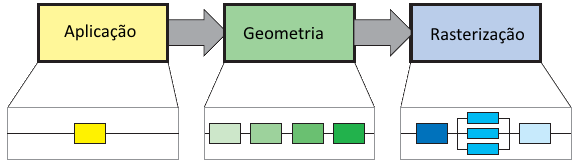

# Pipeline Programável

---
<!--
backdrop: ninokuni
-->

# Nem sempre **_Gouraud/Phong_** respondem tudo...

---
## Roteiro

1. Evolução do _hardware_ gráfico
1. OpenGL Moderno
1. Uma pincelada sobre DirectX

---
## O pipeline gráfico

---
## Evolução do _hardware_ gráfico

- Até 1999, as placas de vídeo 
 