# Projeção

---
# Objetivos

1. Entender a transformação de uma cena em 3D para 2D
1. Conhecer as matrizes de projeção ortogonal e perspectiva
1. Entender o funcionamento da projeção em OpenGL

---
## Projeção

- Transformações de projeção são aquelas capazes de representar pontos
  ou objetos a partir de um espaço tridimensional (uma cena) em um plano
  bidimensional (uma imagem).

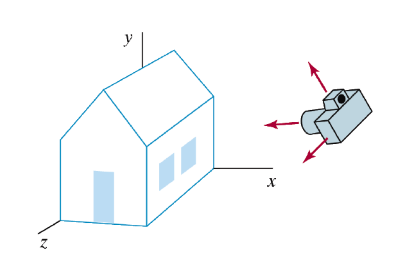

---
## Projeção

- De forma geral, trata-se de representar objetos de <span class="math">R^n</span> em
  <span class="math">R^{n-1}</span>

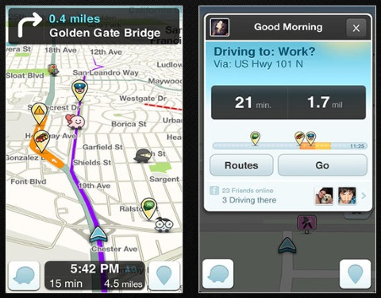

---
## Relembrando o pipeline gráfico


---
## O problema da projeção **em Computação Gráfica**

- Trata-se de (i) transformar o volume de visualização no volume
  de visualização canônico (cubo com raio 1) e (ii) guardar as coordenadas
  <span class="math">z</span> dos vértices no _z-buffer_

  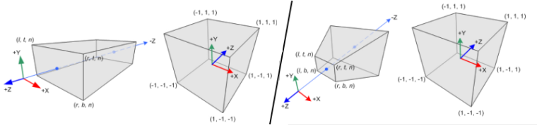
- Essa transformação é feita por meio de **uma matriz que vai multiplicar as
  coordenadas dos vértices**, assim como as outras transformações que vimos


---
## Elementos da projeção

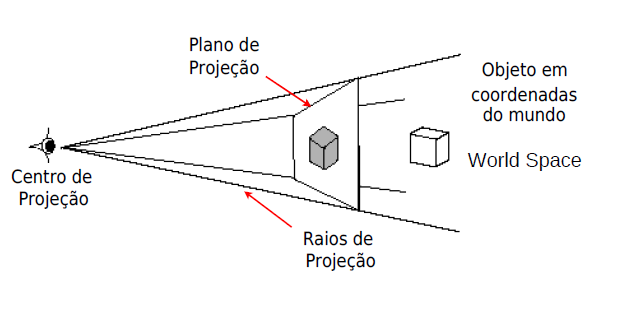

---
## Elementos da projeção

1. **Plano de projeção**:
   - Definido pelo sistema de coordenadas da câmera (ou do olho)
1. **Raios de projeção**:
   - Raios que ligam um ponto no espaço tridimensional à imagem 2D
     representada no plano de projeção
1. **Centro de projeção**:
   - Ponto fixo na cena de onde todos os raios de projeção surgem

---
## Tipos de projeção

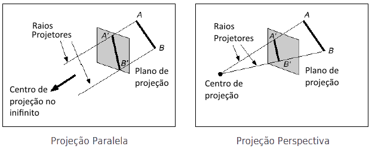

---
## Outros tipos de projeção

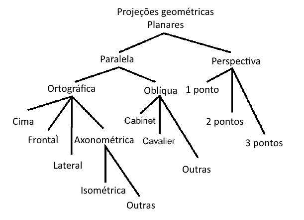

---
# Projeção Paralela

---
## Projeção Paralela

- 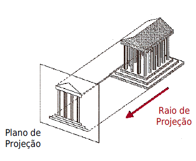
  Centro de projeção se encontra no infinito
- Raios de projeção são paralelos entre si
- Tamanho relativo em cada eixo é preservado
- Linhas paralelas permanecem paralelas
- Existem subtipos de projeção paralela em que o ângulo de incidência dos raios
  de projeção varia

---
## Projeção Paralela, Ortogonal

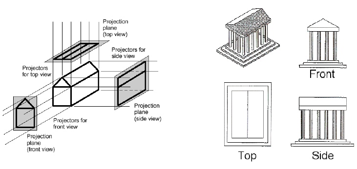

- Projeção ortogonal
  - Ângulo dos raios no plano de projeção = 90º

---
## Projeção **Ortogonal em OpenGL**

- Queridíssimo `glOrtho` ([referência](http://earth.uni-muenster.de/~joergs/opengl/glOrtho.html))
- <div>Assinatura da função:</div>
  <div class="math" style="float: right; font-size: 20px;">\begin{bmatrix} \frac{2}{r-l} & 0 & 0 & -\frac{r+l}{r-l}\\\0 & \frac{2}{t-b} & 0 & -\frac{t+b}{t-b}\\\0 & 0 & \frac{-2}{f-n} & -\frac{f+n}{f-n}\\\0 & 0 & 0 & 1 \end{bmatrix}</div>
  ```c
  void glOrtho(double left,  //l
               double right, //r
               double bottom,//b
               double top,   //t
               double near,  //n
               double far);  //f
  ```
- A função multiplica a matriz corrente por uma matriz da forma acima (direita)
  - Devemos multiplicar a matriz **de projeção (`GL_PROJECTION`)**

---
## Projeção "Padrão"

- Se você **não definir uma projeção**, existe a matriz identidade
  previamente carregada
- Isso é equivalente a `glOrtho(-1, 1, -1, 1, -1, 1)` (_exceto pelo -1_):
  <div class="math" style="float: left;">\begin{bmatrix} \frac{2}{r-l} & 0 & 0 & -\frac{r+l}{r-l}\\\0 & \frac{2}{t-b} & 0 & -\frac{t+b}{t-b}\\\0 & 0 & \frac{-2}{f-n} & -\frac{f+n}{f-n}\\\0 & 0 & 0 & 1 \end{bmatrix}</div>
  <div class="math" style="float: right;">\begin{bmatrix} \frac{2}{2} & 0 & 0 & -\frac{0}{2}\\\0 & \frac{2}{2} & 0 &  -\frac{0}{2}\\\0 & 0 & -\frac{2}{2} & -\frac{0}{2}\\\0 & 0 & 0 & 1 \end{bmatrix}</div>


---
## Projeção Paralela, Isométrica


- A cena é orientada em 45º relativo ao plano de projeção
- Também podemos usar `glOrtho`, mas vamos precisar "movimentar a câmera"
  usando `gluLookAt` (veremos logo mais)

---
# Projeção Perspectiva

---
## Projeção Perspectiva


- A projeção perspectiva mapeia os pontos no plano de projeção **ao longo dos
  raios de projeção que emanam de um centro de projeção**

---
## Características da Projeção Perspectiva

1. Objetos **mais próximos** ao plano de projeção **são maiores**
1. **Linhas paralelas** se encontram em **pontos de fuga**
1. Aparência semelhante ao modelo do nosso olho

---
## Mesmo objeto, projeções diferentes

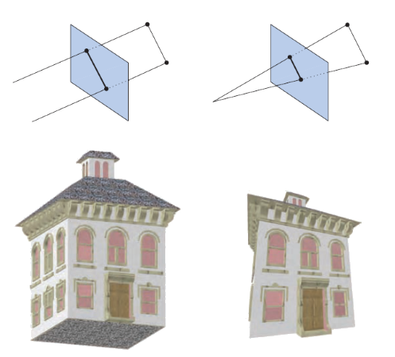

---
# Objetos 3D

- Façamos uma breve digressão...

---
## O pulo ~~do gato~~ da raposa

- Um objeto tridimensional é formado por várias faces (polígonos) adjacentes
  que podem estar no mesmo plano ou não

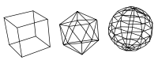
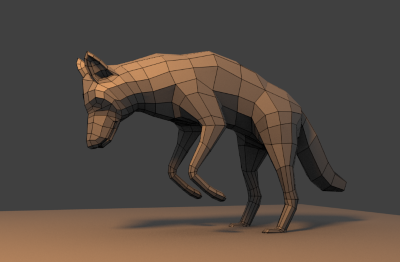

---
## Exemplo de objetos 3D

- 
  Para desenhar um cubo em vez de um quadrado, precisamos desenhar 6 faces em
  vez de 1:
  ```c
  glBegin(GL_QUADS);
    // Cima (y = +1)
    glColor3f(0, 0, 0);
    glVertex3f( 1, 1, -1); glVertex3f(-1, 1, -1);
    glVertex3f(-1, 1,  1); glVertex3f( 1, 1,  1);
    // Baixo (y = -1)
    glColor3f(1, .5, 0);
    glVertex3f( 1, -1,  1); glVertex3f(-1, -1,  1);
    glVertex3f(-1, -1, -1); glVertex3f( 1, -1, -1);
    // ...
  ```

---
## Roubando com o FreeGLUT

- O FreeGLUT possui algumas funções para desenho de objetos tridimensionais:
  1. `glutSolidTeapot, glutWireTeapot`

     
- [Referência das funções](https://www.opengl.org/resources/libraries/glut/spec3/node80.html)

---
## Formas 3D do GLUT

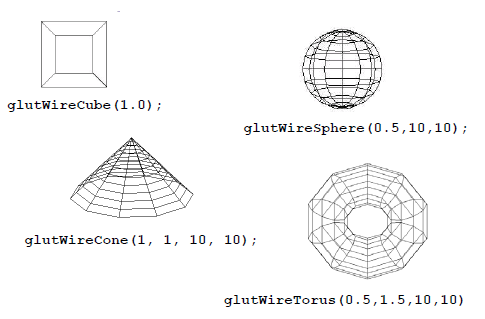

---
## Formas 3D do GLUT (cont.)


---
# Projeção Perspectiva

- Voltando ao tema de hoje...

---
## glFrustum ([referência](http://earth.uni-muenster.de/~joergs/opengl/glFrustum.html))


- Assinatura da função:
  ```c
  void glFrustum(double left,   double right,
                 double bottom, double top,
                 double near,   double far);
  ```
  - **`near` e `far`** devem ser **positivos** e `near` &lt; `far`

---
## glFrustum (cont.)

- <div class="math" style="float: right; font-size: 20px;">\begin{bmatrix} \frac{2n}{r-l} & 0 & \frac{r+l}{r-l} & 0\\\0 & \frac{2n}{t-b} & \frac{t+b}{t-b} & 0\\\0 & 0 & \frac{f+n}{f-n} & \frac{2fn}{f-n}\\\0 & 0 & -1 & 0 \end{bmatrix}</div>
  A função multiplica a matriz corrente por uma matriz da forma à direita
  ```c
  glFrustum(left, right,  // l, r
            bottom, top,  // b, t
            near, far);   // n, f
  ```
- **Lembre-se**: a matriz de projeção (`glOrtho` ou `glFrustum`) deve ser
  colocada na **pilha de matrizes de projeção do OpenGL**:
  ```c
  glMatrixMode(GL_PROJECTION);
  glLoadIdentity();
  glFrustum(-1, 1, -1, 1, 1, 20);

  ```

---
## Exemplo

- [Projeção Ortogonal _vs_ Perpsectiva](codeblocks:ortho-vs-perspective2/CodeBlocks/ortho-vs-perspective2.cbp)
  - Pressionar <key>barra de espaço</key> para alternar de
    projeção perspectiva para ortogonal

    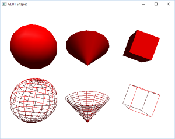

---
## **gluPerspective** ([referência](http://earth.uni-muenster.de/~joergs/opengl/gluPerspective.html))


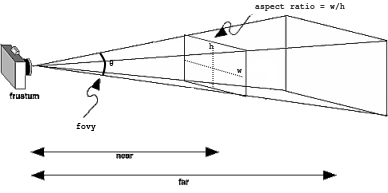

- Não é muito intuitivo configurar a perspectiva usando `glFrustum`
- Uma forma mais comum para configurar perspectiva é usando dois parâmetros:
  1. Um ângulo para o **campo de visão**
  1. **Razão de aspecto** (largura / altura)

---
## gluPerspective (cont.)

- A biblioteca GLU (OpenGL Utilities) contém uma função para isso, o
  `gluPerspective`:
  ```c
  glMatrixMode(GL_PROJECTION);
  glLoadIdentity();

  // fovy, aspectRatio, nearZ, farZ
  gluPerspective(45.0f, 4.0f/3.0f, 1, 20);
  ```
- O <u>`gluPerspective` substitui o uso de `glFrustum`</u>, já que ele gera
  uma matriz de transformação perspectiva da mesma forma, porém usando
  outros tipos de parâmetros

---
## gluPerspective (cont.)

- Campo de visão (_fov_, ou _field of view_)
  - Determina o quanto queremos enxergar da cena
  - **Valores maiores** acarretam em um **campo de visão maior** - espelho convexo
  - Para aplicações interativas, tipicamente algo entre 45º e 60º

---
## Diminuindo o **FoV** <kbd>&rarr;</kbd><kbd>&darr;</kbd>


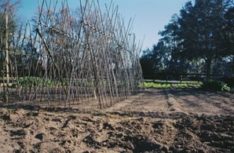


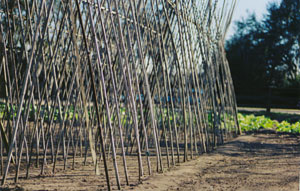
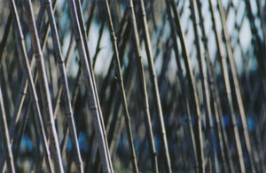

---
## Razão de aspecto

- Calculada pela divisão da **largura pela altura**
- Deve ser a **mesma razão de aspecto da janela/tela** em que estamos desenhando
  para que não haja distorção

---
## gluLookAt

- Além de configurar a projeção que queremos (via `glOrtho, glFrustum, gluPerspective`),
  queremos também poder **posicionar** e **mirar** nossa câmera virtual

  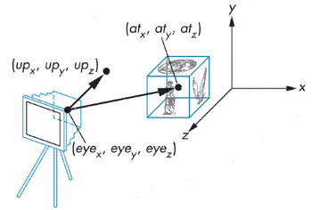
- É uma **transformação de visualização** - ou seja, usamos a pilha de matrizes
  **`GL_MODELVIEW`**

---
## gluLookAt (cont.)

```c
void gluLookAt(double eyeX,     // posição do olho
               double eyeY,
               double eyeZ,
               double centerX,  // para onde olhamos
               double centerY,
               double centerZ,
               double upX,      // onde fica "para cima"
               double upY,
               double upZ);
```


<!-- # Trabalho Prático 2 \o/

_A wild TP2 appears..._


## TP2: Masmorras e Dragões


  -- _"**Guilherme (mestre):** Igor, você acabou de entrar em uma sala e nela tem
  uma cama e um criado mudo. O que vai fazer?"_<br>
  -- _"**Igor (jogador):** vou bater no criado mudo até ele me falar aonde
  tenho que ir"_<br>
  _"Rimos muito e encerramos a sessão de jogo naquele dia..."_

- Enunciado **QUASE** no Moodle (ou [na página do curso](https://github.com/fegemo/cefet-cg/blob/master/assignments/tp2-dandd/README.md)). -->

---
# Referências

- [FAQ sobre visualização em OpenGL](https://www.opengl.org/archives/resources/faq/technical/viewing.htm#view0030) (excelente leitura)
- Capítulo 3 do livro Real-Time Rendering
- Lições 5 e 8 das anotações do prof. David Mount
