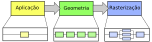
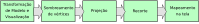
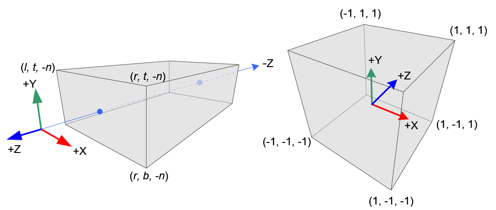
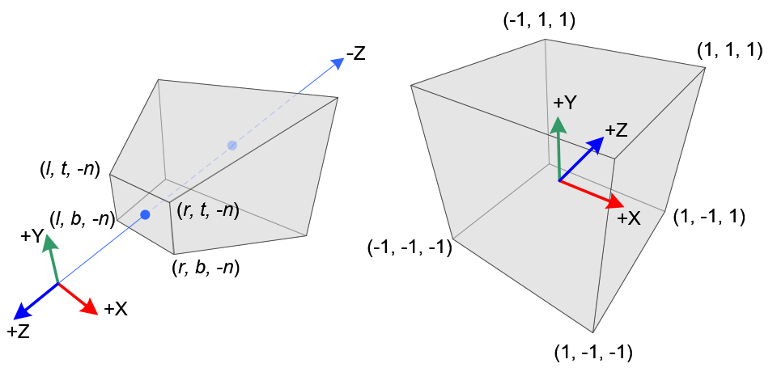
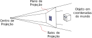
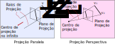
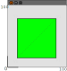
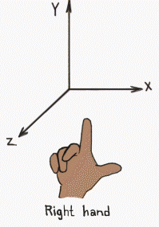
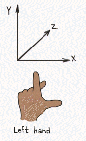
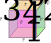

<!-- {"layout": "title"} -->
# Projeção

---
<!-- {"layout": "centered"} -->
# Objetivos

1. Entender a transformação de uma cena em 3D para 2D
1. Conhecer as matrizes de projeção ortogonal e perspectiva
1. Entender o funcionamento da projeção em OpenGL

---
<!-- {"layout": "regular", "embedSVG": "img[src$='.svg']", "embeddedStyles": ".pipeline-fases .aplicacao, .pipeline-fases .rasterizacao { fill: #ddd !important; stroke: #333 !important;} .geometria .etapa1, .geometria .etapa2, .geometria .etapa4, .geometria .etapa5 {fill: #ddd !important; stroke: #333 !important;}"} -->
# Relembrando o pipeline gráfico

 <!-- {p:.centered} --> <!-- {.pipeline-fases} -->

 <!-- {p:.centered} --> <!-- {.geometria} -->

---
<!-- {"layout": "regular"} -->
## Projeção **em Computação Gráfica**

- Transformações de projeção são aquelas capazes de representar pontos
  ou objetos a partir de um espaço tridimensional (uma cena) em um plano
  bidimensional (uma imagem).
- Trata-se de (i) transformar o volume de visualização no volume
  de visualização canônico (cubo com raio 1) e (ii) guardar as coordenadas
  <span class="math">z</span> dos vértices no _z-buffer_
  ::: figure .layout-split-2.no-margin
   <!-- {style="max-height: 150px"} -->
   <!-- {style="max-height: 150px"} -->
  :::
- Essa transformação é feita por meio de **uma matriz que vai multiplicar as
  coordenadas dos vértices**, assim como as outras transformações que vimos

---
<!-- {"layout": "regular"} -->
## Elementos da projeção

1.  <!-- {.push-right style="max-height: 130px"} -->
   **Plano de projeção**: <!-- {ol:.full-width.no-margin} -->
   - Definido pelo sistema de coordenadas da câmera
1. **Raios de projeção**:
   - Ligam um ponto no espaço 3D à imagem 2D representada no plano de projeção
1. **Centro de projeção**:
   - Ponto fixo na cena de onde todos os raios de projeção surgem

 <!-- {style="max-height: 200px;"} --> <!-- {p:.centered} -->

---
# Projeção Paralela

---
## Projeção Paralela

- 
  Centro de projeção se encontra no infinito
- Raios de projeção são paralelos entre si
- Tamanho relativo em cada eixo é preservado
- Linhas paralelas permanecem paralelas
- Existem subtipos de projeção paralela em que o ângulo de incidência dos raios
  de projeção varia

---
## Projeção Paralela, Ortogonal


- Projeção ortogonal
  - Ângulo dos raios no plano de projeção = 90º

---
<!-- {"layout": "regular"} -->
# Projeção **Ortogonal em OpenGL**

::: figure .layout-split-2.no-margin
```c
void glOrtho(double left,  //l
             double right, //r
             double bottom,//b
             double top,   //t
             double near,  //n
             double far);  //f
```

<div class="math" style="flex: 1; margin-top: 1.5em;">\begin{bmatrix} \frac{2}{r-l} & 0 & 0 & -\frac{r+l}{r-l} \\ 0 & \frac{2}{t-b} & 0 & -\frac{t+b}{t-b} \\ 0 & 0 & \frac{-2}{f-n} & -\frac{f+n}{f-n} \\ 0 & 0 & 0 & 1 \end{bmatrix}</div>
:::
- Queridíssimo `glOrtho` ([referência](http://earth.uni-muenster.de/~joergs/opengl/glOrtho.html))
- A função multiplica a matriz corrente por uma matriz da forma acima ⤴️
  - Devemos multiplicar a matriz **de projeção (`GL_PROJECTION`)**

---
<!-- {"layout": "regular", "embeddedStyles": ".hello-world-code pre { margin-top: 0;}"} -->
## Exemplo: projeção no _hello world_

::: figure .layout-split-3.hello-world-code.compact-code
```c
// define a projeção
glOrtho(0, 100, 0, 100, -1, 1);
// ...
// desenha
glBegin(GL_TRIANGLE_STRIP);
    glVertex3f(20, 20, 0);//v0
    glVertex3f(80, 20, 0);//v1
    glVertex3f(80, 80, 0);//v2
    glVertex3f(20, 80, 0);//v3
glEnd();
```
 <!-- {style="margin: 0 1em;"} -->

::: figure .no-margin flex: 1; display: flex; flex-direction: column; justify-content: flex-start; font-size: 15px;
<div class="math bullet">\begin{bmatrix} \frac{2}{r-l} & 0 & 0 & -\frac{r+l}{r-l} \\ 0 & \frac{2}{t-b} & 0 & -\frac{t+b}{t-b} \\ 0 & 0 & \frac{-2}{f-n} & -\frac{f+n}{f-n} \\ 0 & 0 & 0 & 1 \end{bmatrix}=</div>
<div class="math bullet">\begin{bmatrix} \frac{2}{100} & 0 & 0 & -\frac{100}{100} \\ 0 & \frac{2}{100} & 0 & -\frac{100}{100} \\ 0 & 0 & \frac{-2}{2} & -\frac{0}{2} \\ 0 & 0 & 0 & 1 \end{bmatrix}=</div>
<div class="math bullet">\begin{bmatrix} 0.02 & 0 & 0 & -1 \\ 0 & 0.02 & 0 & -1 \\ 0 & 0 & -1 & 0 \\ 0 & 0 & 0 & 1 \end{bmatrix}</div>
:::

---
<!-- {"layout": "centered", "state": "show-active-slide-and-previous"} -->

::: figure .picture-steps.clean.opacity-only padding: 0; align-self: center; font-size: 18px;
<div class="math figure-step bullet">v^\prime = M \times v</div>
<div class="math figure-step bullet">\begin{bmatrix} v^\prime_x \\ v^\prime_y \\ v^\prime_z \\ 1 \end{bmatrix} = \begin{bmatrix} 0.02 & 0 & 0 & -1 \\ 0 & 0.02 & 0 & -1 \\ 0 & 0 & -1 & 0 \\ 0 & 0 & 0 & 1 \end{bmatrix} \times \begin{bmatrix} v_x \\ v_y \\ v_z \\ 1 \end{bmatrix}</div>
<div class="math figure-step bullet">\begin{bmatrix} v^\prime_x \\ v^\prime_y \\ v^\prime_z \\ 1 \end{bmatrix} = \begin{bmatrix} 0.02 & 0 & 0 & -1 \\ 0 & 0.02 & 0 & -1 \\ 0 & 0 & -1 & 0 \\ 0 & 0 & 0 & 1 \end{bmatrix} \times \begin{bmatrix} 20 \\ 20 \\ 0 \\ 1 \end{bmatrix}</div>
<div class="math figure-step bullet">\begin{bmatrix} -0.6 \\ -0.6 \\ 0 \\ 1 \end{bmatrix} = \begin{bmatrix} 0.02 & 0 & 0 & -1 \\ 0 & 0.02 & 0 & -1 \\ 0 & 0 & -1 & 0 \\ 0 & 0 & 0 & 1 \end{bmatrix} \times \begin{bmatrix} 20 \\ 20 \\ 0 \\ 1 \end{bmatrix}</div>
:::

::: figure . align-self: center; font-size: 18px; margin: 3em 0 0 16em
<div class="math bullet push-left">v^\prime_0 = \begin{bmatrix} -0.6 \\ -0.6 \\ 0 \\ 1 \end{bmatrix}</div>
<div class="math bullet push-left">v^\prime_1 = \begin{bmatrix}  0.6 \\ -0.6 \\ 0 \\ 1 \end{bmatrix}</div>
<div class="math bullet push-left">v^\prime_2 = \begin{bmatrix}  0.6 \\  0.6 \\ 0 \\ 1 \end{bmatrix}</div>
<div class="math bullet push-left">v^\prime_3 = \begin{bmatrix} -0.6 \\  0.6 \\ 0 \\ 1 \end{bmatrix}</div>
:::


---
<!-- {"layout": "regular"} -->
## Projeção "Padrão"

- Se você **não definir uma projeção**, existe a matriz identidade
  previamente carregada
- Isso é equivalente a `glOrtho(-1, 1, -1, 1, -1, 1)` (_exceto pelo -1_):
  ::: figure .no-margin display: flex; flex-direction: row; justify-content; center
  <div class="math">\begin{bmatrix} \frac{2}{r-l} & 0 & 0 & -\frac{r+l}{r-l} \\ 0 & \frac{2}{t-b} & 0 & -\frac{t+b}{t-b} \\ 0 & 0 & \frac{-2}{f-n} & -\frac{f+n}{f-n} \\ 0 & 0 & 0 & 1 \end{bmatrix}=</div>
  <div class="math">\begin{bmatrix} \frac{2}{1+1} & 0 & 0 & -\frac{1-1}{1+1} \\ 0 & \frac{2}{1+1} & 0 & -\frac{1-1}{1+1} \\ 0 & 0 & \frac{-2}{1+1} & -\frac{1-1}{1+1} \\ 0 & 0 & 0 & 1 \end{bmatrix}=</div>
  <div class="math">\begin{bmatrix} 1 & 0 & 0 & 0 \\ 0 & 1 & 0 & 0 \\ 0 & 0 & -1 & 0 \\ 0 & 0 & 0 & 1 \end{bmatrix}</div>
  :::

---
<!-- {"layout": "regular"} -->
## E esse **z negativo**?

::: figure .full-width display:flex; justify-content: space-around;
 <!-- {.rounded style="max-height: 230px;"} -->
 <!-- {.rounded style="max-height: 230px;"} -->
 <!-- {.rounded style="max-height: 230px;"} -->
:::

O OpenGL nos permite trabalhar _**right**-handed_ ↖️,<br>
mas ele projeta num sistema _**left**-handed_ ↗️

---
## Projeção Paralela, Isométrica


- A cena é orientada em 45º relativo ao plano de projeção
- Também podemos usar `glOrtho`, mas vamos precisar "movimentar a câmera"
  usando `gluLookAt` (veremos logo mais)

---
# Projeção Perspectiva

---
<!-- {"layout": "regular"} -->
## Projeção Perspectiva

-  <!-- {.push-right} -->
  A projeção perspectiva mapeia os pontos no plano de projeção **ao longo dos
  raios de projeção que emanam de um centro de projeção**
- Características:
  1. Objetos **mais próximos** ao plano de projeção **são maiores**
  1. **Linhas paralelas** se encontram em **pontos de fuga**
  1. Aparência semelhante ao modelo do nosso olho

---
<!-- {"layout": "centered-horizontal"} -->
## Mesmo objeto, projeções diferentes


---
# Objetos 3D

Façamos uma breve digressão...

---
<!-- {"layout": "regular"} -->
## O pulo ~~do gato~~ da raposa

- Um objeto tridimensional é formado por várias faces (polígonos) adjacentes
  que podem estar no mesmo plano ou não

 <!-- {style="max-height: 220px;"} -->
 <!-- {style="max-height: 220px;"} -->

---
<!-- {"layout": "regular"} -->
## Exemplo de objetos 3D

Para desenhar um cubo em vez de um quadrado, basta desenhar 6 faces em
vez de 1

::: figure .layout-split-2


```c
glBegin(GL_QUADS);
  // Cima (y = +1)
  glVertex3f( 1, 1, -1); glVertex3f(-1, 1, -1);
  glVertex3f(-1, 1,  1); glVertex3f( 1, 1,  1);
  // Baixo (y = -1)
  glVertex3f( 1, -1,  1); glVertex3f(-1, -1,  1);
  glVertex3f(-1, -1, -1); glVertex3f( 1, -1, -1);
  // Direita (x = +1)
  // ...
```
:::

---
<!-- {"layout": "regular"} -->
## Roubando com o FreeGLUT

- O FreeGLUT possui algumas funções para desenho de objetos tridimensionais: <!-- {ul:.full-width} -->
  1. `glutSolidTeapot, glutWireTeapot`

     `Solid` <!-- {dl:.dl-6.push-right.no-margin} -->
       ~ desenha polígonos preenchidos

     `Wire`
       ~ desenha apenas contornos

      <!-- {.push-left} -->

- [Referência das funções](https://www.opengl.org/resources/libraries/glut/spec3/node80.html) <!-- {li:style="clear: both"} -->

---
<!-- {"layout": "regular"} -->
## Formas 3D do GLUT

::: figure .layout-split-2.full-width
 <!-- {.flex-equal} -->
 <!-- {.flex-equal} -->

---
# Projeção Perspectiva

- Voltando ao tema de hoje...

---
<!-- {"layout": "centered-horizontal"} -->
## glFrustum ([referência](http://earth.uni-muenster.de/~joergs/opengl/glFrustum.html))


- Assinatura da função:
  ```c
  void glFrustum(double left,   double right,
                 double bottom, double top,
                 double near,   double far);
  ```
  - **`near` e `far`** devem ser **positivos** e `near` &lt; `far`

---
<!-- {"layout": "regular", "slideClass": "compact-code"} -->
## Projeção perspectiva no OpenGL

- <div class="math push-right" style="font-size: 18px;">\begin{bmatrix} \frac{2n}{r-l} & 0 & \frac{r+l}{r-l} & 0 \\ 0 & \frac{2n}{t-b} & \frac{t+b}{t-b} & 0 \\ 0 & 0 & \frac{f+n}{f-n} & \frac{2fn}{f-n} \\ 0 & 0 & -1 & 0 \end{bmatrix}</div>
  <code>glFrustum</code> multiplica a matriz corrente por uma matriz da forma ➡️

  ```c
  glFrustum(left, right,  // l, r
            bottom, top,  // b, t
            near, far);   // n, f
  ```
- **Lembre-se**: a matriz de projeção (`glOrtho` ou `glFrustum`) deve ser
  colocada na **pilha de matrizes de projeção do OpenGL**:
  ```c
  glMatrixMode(GL_PROJECTION);
  glLoadIdentity();
  glFrustum(-1, 1, -1, 1, 1, 20);
  ```

---
<!-- {"layout": "centered-horizontal"} -->
## Exemplo [Projeção Ortogonal vs Perspectiva](codeblocks:ortho-vs-perspective/CodeBlocks/ortho-vs-perspective.cbp)

- Pressionar <key>barra de espaço</key> para alternar de
  projeção perspectiva para ortogonal


---
<!-- {"layout": "regular"} -->
## `gluPerspective` ([referência](http://earth.uni-muenster.de/~joergs/opengl/gluPerspective.html))


- Não é muito intuitivo configurar a perspectiva usando `glFrustum`
- Uma forma mais comum para configurar perspectiva é usando dois parâmetros:
  1. Um ângulo para o **campo de visão**
  1. **Razão de aspecto** (largura / altura)

---
<!-- {"layout": "regular"} -->
## gluPerspective - exemplo

- A biblioteca GLU (OpenGL Utilities) contém uma função para isso, o
  `gluPerspective`:
  ```c
  glMatrixMode(GL_PROJECTION);
  glLoadIdentity();
  // fovy, aspectRatio, nearZ, farZ
  gluPerspective(45.0f, 4.0f/3.0f, 1, 20);
  ```
- O `gluPerspective` <u>substitui</u> o uso de `glFrustum`, já que ele gera
  uma matriz de transformação perspectiva da mesma forma, porém usando
  outros tipos de parâmetros
- Campo de visão (_fov_, ou _field of view_)
  - Determina o quanto queremos enxergar da cena
  - Para aplicações interativas, tipicamente algo entre 45º e 60º

---
<!-- {"layout": "centered-horizontal"} -->
## Diminuindo o **FoV** <kbd>&rarr;</kbd><kbd>&darr;</kbd>


---
## Razão de aspecto

- Calculada pela divisão da **largura pela altura**
- Deve ser a **mesma razão de aspecto da janela/tela** em que estamos desenhando
  para que não haja distorção

---
<!-- {"layout": "regular"} -->
## `gluLookAt`

- Além de configurar a projeção que queremos (via `glOrtho, glFrustum, gluPerspective`),
  queremos também poder **posicionar** e **mirar** nossa câmera virtual

   <!-- {.centered} -->
- É uma **transformação de visualização** - ou seja, usamos a pilha de matrizes
  **`GL_MODELVIEW`**

---
<!-- {"layout": "regular"} -->
## `gluLookAt` - assinatura

```c
void gluLookAt(double eyeX, eyeY, eyeZ            // posição do olho
               double centerX, centerY, centerZ   // para onde olhamos
               double upX, upY, upZ);             // onde fica "para cima"
```
- A transformação de visualização deve acontecer **ANTES das transformações
  de modelo**
  - Ou seja, `gluLookAt(...)` deve ser chamada na função `desenhaCena` **antes**
    de começarmos a desenhar os objetos da cena <!-- {li^0:.note.info} -->

<!-- # Trabalho Prático 2 \o/

_A wild TP2 appears..._


## TP2: Masmorras e Dragões


  -- _"**Guilherme (mestre):** Igor, você acabou de entrar em uma sala e nela tem
  uma cama e um criado mudo. O que vai fazer?"_<br>
  -- _"**Igor (jogador):** vou bater no criado mudo até ele me falar aonde
  tenho que ir"_<br>
  _"Rimos muito e encerramos a sessão de jogo naquele dia..."_

- Enunciado **QUASE** no Moodle (ou [na página do curso](https://github.com/fegemo/cefet-cg/blob/master/assignments/tp2-dandd/README.md)). -->

---
# Referências

- [FAQ sobre visualização em OpenGL](https://www.opengl.org/archives/resources/faq/technical/viewing.htm#view0030) (excelente leitura)
- Capítulo 3 do livro Real-Time Rendering
- Lições 5 e 8 das anotações do prof. David Mount
