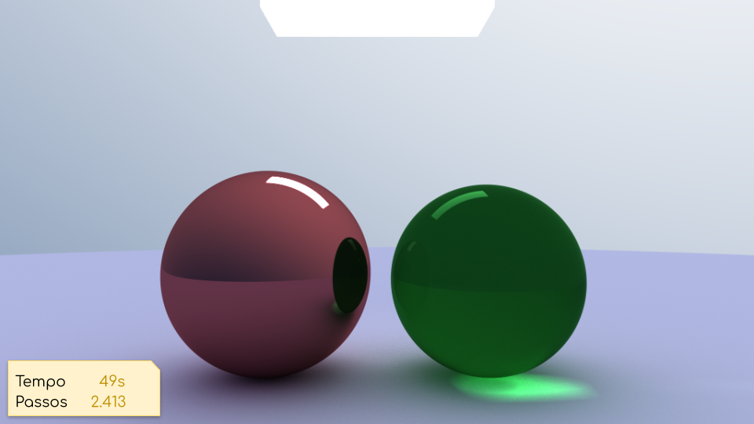
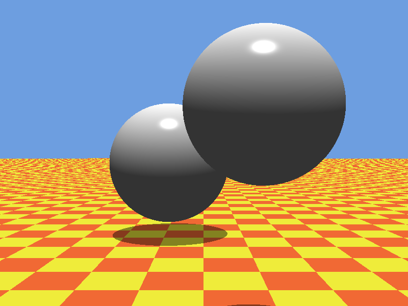
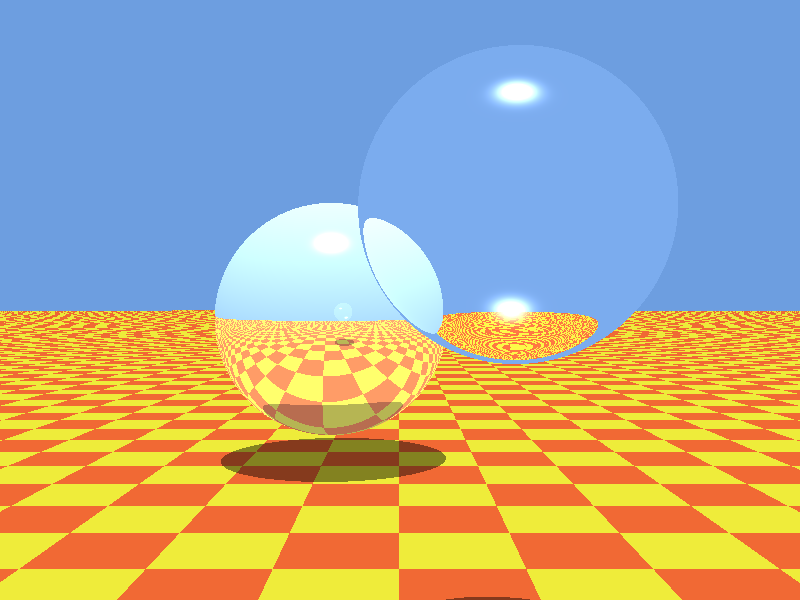
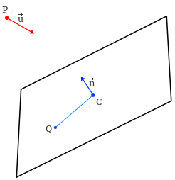

<!-- {"layout": "title"} -->
# _Ray tracing_
## Parte 1: verificando colisões

---
<!-- {"layout": "centered"} -->
# Objetivos

1. Relembrar das **limitações de modelos de iluminação local**
1. Conhecer um modelo de iluminação **global**
1. Entender a mecânica geral da técnica de geração de imagens chamada
   _ray tracing_

---
<!-- { "layout": "section-header", "slideClass": "modelos-de-iluminacao", "slideHash": "modelos-de-iluminacao" } -->
# Modelos de iluminação

- Modelos locais (vimos Phong)
- Modelos globais (veremos hoje)
  - Radiosidade
  - _Ray tracing_
  - _Path tracing_
  - _Photon Mapping_

---
<!-- {"layout": "regular"} -->
# Modelo de iluminação local

- Por ser **mais barato**, é usado para **renderização em tempo real**
  - Exemplos de uso: OpenGL, DirectX
- Apenas caminhos do tipo fonte luminosa → superfície → olho são considerados
  - Interação entre objetos é ignorada, iluminação indireta também
- Como funciona, no _pipeline_ gráfico:
  - No **estágio de geometria**:
    - Para cada vértice de uma cena, a contribuição de cada fonte de luz é
      calculada para se determinar a cor resultante (modelo de iluminação
      de Phong)
  - No **estágio de rasterização**
    - A cor de cada pixel é dada por uma interpolação da cor dos vértices
      (modelo de sombreamento de Gouraud)

---
<!-- {"layout": "regular"} -->
# Efeitos necessários para atingir realismo

-  <!-- {.push-right style="width: 460px"} --> <!-- {ul:.full-width} -->
  Sombras (com penumbra e tudo o mais) ➡️ <!-- {.push-right} -->
- Materiais realísticos (pinturas, vidro) etc.
- Iluminação complexa (natural, luz de área)
-  <!-- {.push-right style="width: 460px; clear: right;"} -->
  Interreflexões ("sangramento" de cor) ↘️
- Reflexão, refração, transparência ⬇️
   <!-- {style="height: 250px;"} -->

---
<!-- {"layout": "centered", "backdrop": "raytraced-realism"} -->
# Modelo de iluminação global

---
<!-- {"layout": "regular"} -->
# Modelo de iluminação global

- Num modelo de iluminação global, consideramos também **a relação
  entre objetos** no cálculo da iluminação
  - Dessa forma, podemos modelar reflexão, refração, sombras e vários dos
    efeitos necessários para a criação de imagens com alto realismo
  - O _pipeline_ gráfico das placas de vídeo não suportam modelos globais
    - Isso porque ele é focado em renderização em tempo real
- Algoritmos para implementar iluminação global:
  1. [1968][ray-tracing] **_Ray tracing_**
  1. [1986][radiosity] Radiosidade <!-- {ol:.layout-split-4.no-bullet style="justify-content: space-around; white-space: nowrap;"} -->
  1. [1986][path-tracing] _Path tracing_
  1. [1996][photon-mapping] _Photon mapping_ 

[radiosity]: https://dl.acm.org/citation.cfm?id=808601
[ray-tracing]: https://dl.acm.org/citation.cfm?id=1468082
[path-tracing]: https://dl.acm.org/citation.cfm?id=15902
[photon-mapping]: https://link.springer.com/chapter/10.1007/978-3-7091-7484-5_3

---
<!-- { "layout": "section-header", "slideClass": "ray-tracing", "slideHash": "ray-tracing" } -->
# _Ray tracing_

- Tipos:
  1. Simples
  1. Recursivo
  1. Distribuído
- Geração "espontânea" de:
  - Sombras (1/2/3)
  - Objetos transparentes (2/3)
  - Refração (2/3)
  - Reflexões (2/3)

---
<!-- {"layout": "regular"} -->
# _Ray tracing_

- É uma técnica de geração de imagens com alto realismo <!-- {ul:style="margin-bottom: 0"} -->
- Funcionamento **basicão**:
  - Raios são lançados do olho para cada pixel da imagem a ser gerada
  - Raios que acertam objetos
    - são coloridos com sua cor, se estiverem iluminados
    - não são coloridos, se estiverem na sombra
  - Raios que não atingem nada, são pintados com a cor do fundo
  ::: figure .center-aligned
   <!-- {.bullet style="height: 200px;"} -->
   <!-- {.bullet style="height: 200px;"} --> <!-- {p:.no-margin} -->
   <!-- {.bullet style="height: 200px;"} -->
  :::

---


---
<!-- {"layout": "regular"} -->
# Algoritmo basicão

- `pixels[] renderScene(scene)`:
  1. Dada uma configuração de câmera, gerar um raio
     <span class="math">R_{ij}</span> que sai do olho, passando pelo centro de cada pixel
     <span class="math">(i, j)</span> da sua janela
  1. Chame `castRay(R)` e assinale a cor do pixel com a cor retornada
- `color castRay(R, scene)`:
  1. Dispara o raio <span class="math">R</span> na cena. Seja <span class="math">X</span> o 1º objeto
    atingido e <span class="math">P</span> o ponto do objeto que foi atingido
  1. Para cada fonte de luz <span class="math">L</span>:
     1. Dispara um raio <span class="math">R_l</span> de <span class="math">P</span> até <span class="math">L</span>
     1. Se <span class="math">R_l</span> não atinge nada até chegar em <span class="math">L</span>, aplique o
        modelo de iluminação para determinar a cor do ponto <span class="math">P</span>
  1. Combine as cores retornadas para cada fonte e retorne a resultante

---
<!-- {"layout": "regular"} -->
# História do _Ray tracing_

-  <!-- {.push-right style="height: 200px"} --> <!-- {ul:.full-width} -->
  Trabalhos seminais:
  - [Appel 68](http://graphics.stanford.edu/courses/Appel.pdf), _ray casting_
  -  <!-- {.push-right style="height: 250px; clear: right;"} -->
    [Whitted 80](http://dl.acm.org/citation.cfm?id=358882), _ray tracing_ recursivo ➡️
- Pesquisa
  - Uso de diferentes primitivas geométricas
  - Técnicas de aceleração
  - Modelos de iluminação mais realistas
  - Interferência do meio (propagação)
- Pesquisas recentes:
  - _Ray tracing_ em tempo real
  - Arquiteturas para _ray tracing_ em _hardware_

---
<!-- {"layout": "regular"} -->
# Algoritmo do _ray tracing_ **recursivo**

- Mantém o método `renderScene(scene)` como está e modifica o
  `castRay(R, scene)` para:
  1. Dispara o raio <span class="math">R</span> na cena. Seja <span class="math">X</span> o 1º objeto atingido e
  <span class="math">P</span> o ponto do objeto que foi atingido
  1. **Se <span class="math">X</span> reflexivo, compute raio de reflexão <span class="math">R_r</span> em
    <span class="math">P</span>. <span class="math">C_r</span> = `castRay(R`<sub>r</sub>`)`**
  1. **Se <span class="math">X</span> transparente, compute raio de refração <span class="math">R_t</span> em
    <span class="math">P</span>. <span class="math">C_t</span> = `castRay(R`<sub>t</sub>`)`**
  1. Para cada fonte de luz <span class="math">L</span>:
     1. Dispara um raio <span class="math">R_l</span> de <span class="math">P</span> até <span class="math">L</span>
     1. Se <span class="math">R_l</span> não atinge nada até chegar em <span class="math">L</span>, aplique o
        modelo de iluminação para determinar a cor do ponto `P`
  1. Combine as cores **<span class="math">C_r</span>, <span class="math">C_t</span>** e das fontes de luz (4) e
    a retorne

---
<!-- { "layout": "regular" } -->
# _Ray tracer_ simples _vs_ recursivo


-  <!-- {.large-width} -->
  Simples (Appel 68)
-  <!-- {.large-width} -->
  Recursivo (Whitted 80) <!-- {ul:.card-list.center-aligned} -->

---
<!-- {"layout": "regular"} -->
# Implementação: perguntas...

- Para implementar um _ray tracer_, precisamos **responder a pelo menos 2
  perguntas**:
  1. Como determinar se um raio atinge um objeto (e em qual)?
     - Semana 1
  1. Dado que um raio atingiu um objeto, como devemos calcular a cor retornada?
     - Semana 2
- Vejamos, primeiro, a representação de raios e sua interseção com objetos

---
<!-- {"layout": "regular"} -->
# Interseção de raio com objeto

- É o coração de um _ray tracer_ (onde ele passa o maior tempo de execução)
  - Foi uma das primeiras áreas de pesquisa
  - Existem rotinas otimizadas para várias primitivas (esferas, toróides, triângulos etc.)
- É necessário calcular diversos tipos de informação:
  - Para **raios primários**: ponto de interseção, material, normal
  - Para _shadow rays_: intercepta/não intercepta
  - Coordenadas de textura
- Mas como **representar um raio**?

---
<!-- {"layout": "regular"} -->
# **Representação** de um **raio**

 <!-- {style="height: 200px;"} -->
<!-- {p:.centered} -->
- **Raio** é como uma **reta** em forma **paramétrica**:
  <span class="math">R(t) = P_0 + t(P_1 - P_0)</span>, ou seja
  <div class="math">R(t) = P_0 + t\vec{u}</div>
- Computa-se para quais valores do parâmetro <span class="math">t</span> a
  reta intercepta o objeto


---
<!-- {"layout": "regular"} -->
# **Estrutura de dados** para representar raio

- Em C:
  ```c
  struct Ray {
    Vector3 P;
    Vector3 u;
  };

  ```
- Em C++:
  ```cpp
  class Ray {
    public:
    Vector3 P;
    Vector3 u;
  };
  ```
- Em Java:
  ```java
  public class Ray {
    Vector3 P;
    Vector3 u;
  }

  ```
  <!-- {ul:.layout-split-3.no-bullet style="justify-content: space-around"} -->

E os objetos, como podemos representá-los?

---
<!-- {"layout": "regular"} -->
# Objetos implícitos

- Um **objeto implícito** é dado por uma 
  **equação da forma <span class="math">f(x, y, z) = 0</span>**
- Várias superfícies podem ser modeladas como objetos implícitos:
  - Planos, círculos, triângulos (grau 1)
    - _i.e._, <span class="math">ax + by + cz + d = 0</span>
  - Quádricas (grau 2)
    - Elipsóide: <span class="math">\frac{x^2}{a^2}+\frac{y^2}{b^2}+\frac{z^2}{c^2} = 1</span>
    - Cones, Parabolóides, Hiperbolóides...
  - Quárticas (grau 4)
    - Toróides (_dunkin donuts_)

Na vida real: triângulos 👍 <!-- {p:.note.info.centered} -->


---
<!-- {"layout": "regular"} -->
# Interseção de raio _vs_ objeto implícito

1. Modelamos o **raio** <span class="math">R(t)</span> de forma paramétrica:
   - <span class="math">R(t) = [R_x(t) R_y(t) R_z(t)]</span>
1. Se <span class="math">f(x,y,z)</span> é uma função que representa **um objeto**,
   os pontos de interseção entre o raio e o objeto satisfazem:
   - <span class="math">f(R_x(t),R_y(t),R_z(t)) = 0</span>
   - Repare que substituímos as coordenadas do objeto pelas do raio
1. Com a equação resultante, achamos suas raízes para determinar
   o(s) valor(es) de <span class="math">t</span> que a satisfazem
   - Veja um exemplo com **<span class="math">f(x,y,z)</span> de uma esfera**
     no próximo slide...

---
<!-- {"layout": "regular"} -->
# Exemplo: interseção com esfera

- Primeiramente, vamos **simplificar** o problema e assumir que a **esfera é
  unitária e está centrada na origem**: <!-- {ul:style="max-width: 70%"} -->
  <div class="math">x^2+y^2+z^2 - 1 = 0</div>
- Raio parametrizado como:
  <div class="math">[P_x+t\vec{u}_x \;\;\; P_y+t\vec{u}_y \;\;\; P_z+t\vec{u}_z]</div>

**Atenção**: você NÃO vai usar esta fórmula no trabalho, porque ela serve apenas para
esferas unitárias na origem. <!-- {p:.note.warning style="max-width: 70%; align-self: flex-start;"} -->

---
<!-- {"layout": "regular", "state": "show-active-slide-and-previous"} -->

- Substituindo, <!-- {ul:.bulleted style="max-width: 86%; align-self: center;"} -->
  <div class="math bullet">(P_x+t\vec{u}_x)^2 + (P_y+t\vec{u}_y)^2 + (P_z+t\vec{u}_z)^2-1=0</div>
  <div class="math bullet" style="font-size: 80%;">(P_x^2+2P_xt\vec{u}_x+t^2\vec{u}_x^2) + (P_y^2+2P_yt\vec{u}_y+t^2\vec{u}_y^2) + (P_z^2+2P_zt\vec{u}_z+t^2\vec{u}_z^2)-1=0</div>
  <div class="math bullet" style="font-size: 80%;">(\vec{u}_x^2+\vec{u}_y^2+\vec{u}_z^2)t^2 + 2(\vec{u}_xP_x+\vec{u}_yP_y+\vec{u}_zP_z)t + (P_x^2+P_y^2+P_z^2-1)=0</div>

  - ou
    - <span class="math">at^2+bt+c=0</span>
  - ::: result .note.push-right width: 250px;
    - <span class="math bullet">\vec{u}</span> é conhecido
    - <span class="math bullet">P</span> é conhecido
    - <span class="math bullet">t</span> é a variável
    :::
    onde
    - <span class="math bullet">a = \vec{u}_x^2 + \vec{u}_y^2 + \vec{u}_z^2</span>
    - <span class="math bullet">b = 2(\vec{u}_xP_x + \vec{u}_yP_y + \vec{u}_zP_z)</span>
    - <span class="math bullet">c = P_x^2 + P_y^2 + P_z^2 - 1</span>
- Com os **coeficientes da equação de 2º grau** (<span class="math">a, b, c</span>),
  podemos encontrar o **<span class="math">\Delta</span>** e **as raízes** (valores 
  de <span class="math">t</span>) <!-- {li:.bullet} -->

---
<!-- {"layout": "centered"} -->
# Interpretando a interseção com esfera

- Seja <span class="math">\Delta = b^2 - 4ac</span>
  - Então:<br><span class="math">t = \frac{-b \pm \sqrt(\Delta)}{2a}</span> <!-- {ul^1:.no-margin.no-padding.full-width.layout-split-2 style="justify-content: space-around; align-items: center;"} -->
-  <!-- {li:.no-bullet} -->

Ou seja, para descobrir se o raio interceptou a esfera, **basta resolver
  uma equação de 2º grau** ;)

---
<!-- {"layout": "regular"} -->
# Para **esferas genéricas** (1/3)

- Dada uma esfera com centro <span class="math">C</span> e raio <span class="math">r</span>
  - Nosso raio: <span class="math">P+t\vec{u}</span>
- Um ponto <span class="math">Q</span> está superfície da esfera se sua distância até o centro é igual a <span class="math">r</span>. Ou seja, <span class="math">\left| Q-C \right|=r</span>. Substituindo, temos:
  <div class="math">\left| (P+t\vec{u})-C \right|=r</div>
- ::: result .note.info width: 320px; position: absolute; right: 0;
  Se elevarmos a equação ao quadrado:
  <div class="math">\left| \vec{v} \right|^2=\vec{v}\cdot\vec{v}</div>
  ::: 
  Para facilitar a álgebra criamos <span class="math">\vec{p}=C-P</span>:
  <div class="math">\left| t\vec{u}-(C-P)\right|=r</div>
  <div class="math">\left| t\vec{u}-\vec{p} \right|=r</div>

---
<!-- {"layout": "regular"} -->
# Para **esferas genéricas** (2/3)

- Conhecemos <span class="math">\vec{u}, \vec{p}</span> e <span class="math">r</span> e queremos encontrar <span class="math">t</span>. Pelo produto interno: <!-- {ul:.bulleted} -->
  <div class="math">(t\vec{u}-\vec{p})\cdot(t\vec{u}-\vec{p})=r^2</div>
- Sabendo que o lado esquerdo resulta em um escalar, podemos:
  <div class="math">t^2(\vec{u}\cdot\vec{u})-2t(\vec{u}\cdot\vec{p})+(\vec{p}\cdot\vec{p})-r^2=0</div>
- ...que é uma equação do 2º grau e podemos resolver para <span class="math">t</span>, afinal:
  - <span class="math">\vec{u}</span> é conhecido
  - <span class="math">\vec{p} = C-P</span> é conhecido
  - <span class="math">r</span> é conhecido
  - <span class="math">t</span> é a variável

---
<!-- {"layout": "regular", "state": "show-active-slide-and-previous"} -->
(3/3) <!-- {.centered} -->

- Da equação quadrática, temos que: <!-- {ul:.bullet style="width: 62%; margin-left: 25%; clear: right;"} -->
  <ul>
    <li><span class="math">a = (\vec{u}.\vec{u})=1</span> (já que <span class="math">\vec{u}</span> está normalizado)</li>
    <li><span class="math">b = -2(\vec{u}.\vec{p})</span></li>
    <li><span class="math">c = (\vec{p}.\vec{p})-r^2</span></li>
  </ul>
- Disto, podemos **estudar o sinal do <span class="math">\Delta</span>** para
  saber se há interseção(ões) (raiz(es)) e, caso exista(m), com o
  valor encontrado para <span class="math">t</span> podemos **determinar
  o ponto de interseção <span class="math">Q</span>** na esfera

Esta é a fórmula que deve ser usada, porque serve para esferas posicionadas em qualquer lugar e com qualquer tamanho. <!-- {p:.note.info.bullet style="max-width: 75%;margin-left:17%;"} -->
---
<!-- {"layout": "regular"} -->
# Outras informações da colisão

- Além de determinar se houve colisão ou não, também é necessário descobrir:
  - O ponto de interseção (basta substituir <span class="math">t</span> com o valor encontrado)
  - O vetor normal do objeto nesse ponto
-  <!-- {.push-right style="max-width: 450px"} -->
  A normal no ponto de interseção <span class="math">P</span> é
  dada pelo gradiente no ponto de interseção:
- No caso da esfera, **podemos simplesmente** fazer o vetor<br><div class="math">\vec{n} = \frac{P - C}{\left|P-C\right|},</div>
  onde <span class="math">C</span> é o centro da esfera.

---
<!-- {"layout": "regular"} -->
# Implementando um _ray tracer_

- Precisamos de
  1. Uma classe **Vetor**
  1. Uma classe **ObjetoDaCena**
  1. Uma estrutura/classe **FonteDeLuz**
  1. Uma estrutura/classe **Raio**
  1. E mais algumas coisinhas...
- **Não precisamos** de:
  - Do **OpenGL ou do DirectX**, já que não conseguimos usar a placa de vídeo para estes cálculos
    - Na verdade essa é uma área de pesquisa recente

---
## Um programa _raytracer_


---
## Entrada

- Descrição da cena


---
## Saída

- Arquivo da imagem renderizada (formato .ppm)


---
<!-- {"backdrop": "cpp-vs-java"} -->

# _Choose your side_ <!-- {style="margin-bottom: 4em; font-weight: bold;"} -->

---
# Para a próxima aula

- Ler as aulas 18 e 19 do prof. David Mount (link no Moodle)
  - Fazer isto = certeza de sucesso, TP resolvido durante a aula
  - Não fazer = TPs incompletos, trabalho no final de semana :/

---
<!-- { "layout": "regular" } -->
# Colisão com plano

-  <!-- {.push-right style="max-width: 240px"} --> <!-- {ul:.bulleted style="max-width: 80%"} -->
  Seja <span class="math">C</span> um ponto qualquer no plano e <span class="math">\vec{n}</span> a normal do plano
- Um ponto <span class="math">Q</span> está no plano se o vetor <span class="math">Q-C</span> for perpendicular a <span class="math">\vec{n}</span>. Ou seja:
  <div class="math">(Q-C)\cdot\vec{n}=0</div>
- Substituindo <span class="math">Q</span> pela equação do raio:
  <div class="full-width" style="display: grid; grid-template-rows: auto auto auto auto; grid-template-columns: auto 1fr; grid-column-gap: 1em;">
    <div style="display: flex; justify-content: flex-start; grid-row: 1/2; grid-column: 1/2">
      <span class="math bullet">(P+t\vec{u}-C)\cdot\vec{n}=0</span>
      <span class="math bullet">\textrm{,} \quad \vec{p}=C-P</span>
    </div>
    <small class="bullet" style="color: gray; grid-row: 1/2; grid-column: 2/3">⬅️ fazendo um truque algébrico</small>
    <span class="math bullet" style="grid-row: 2/3; grid-column: 1/2">(t\vec{u}-\vec{p})\cdot\vec{n}=0</span>
    <small class="bullet" style="color: gray; grid-row: 2/3; grid-column: 2/3">⬅️ distribuindo o produto escalar</small>
    <span class="math bullet" style="grid-row: 3/4; grid-column: 1/2">t(\vec{u}\cdot\vec{n})-\vec{p}\cdot\vec{n}=0</span>
    <small class="bullet" style="color: gray; grid-row: 3/4; grid-column: 2/3">⬅️ isolando <span class="math">t</span></small>
    <div class="math bullet no-margin left-aligned" style="grid-row: 4/5; grid-column: 1/2;">t=\frac{\vec{p}\cdot\vec{n}}{\vec{u}\cdot\vec{n}}</div>
  </div>

---
<!-- { "layout": "centered", "state": "show-active-slide-and-previous" } -->

- Se: <!-- {ul:.bulleted} -->
  - <span class="math">\vec{u}\cdot\vec{n}\neq0</span>, há 1 interseção
  - <span class="math">\vec{u}\cdot\vec{n}=0</span>,
    - Se <span class="math">\vec{p}\cdot\vec{n}\neq0</span>, sem interseção
    - Se <span class="math">\vec{p}\cdot\vec{n}=0</span>, infinitas interseções

**Atenção**: só interessa o valor de <span class="math">t</span> que seja <span class="math">t>0</span>. <!-- {p:.note.warning.bullet} -->

---
# Colisão com círculo
1. Acha se colide com plano do círculo
1. Verifica se está dentro do raio

# [Colisão com triângulo](https://www.scratchapixel.com/lessons/3d-basic-rendering/ray-tracing-rendering-a-triangle/ray-triangle-intersection-geometric-solution)
# [Colisão com cilindro](http://illusioncatalyst.com/notes_files/mathematics/line_cylinder_intersection.php)
---
# Referências

- Aulas 18 e 19 do prof. David Mount (link na página do curso)
- Capítulo 10 do livro **Computer Graphics with OpenGL** de _Hearn and Baker_
- [Disciplina _Ray Tracing for Graphics_](http://www.cemyuksel.com/courses/utah/cs6620/) da _University of Utah_
  - Uma matéria inteira sobre a criação de _ray tracers_
