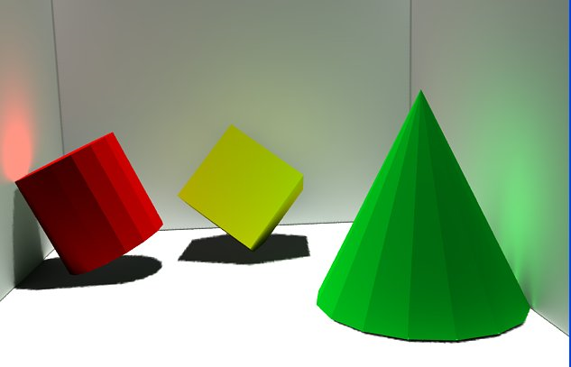
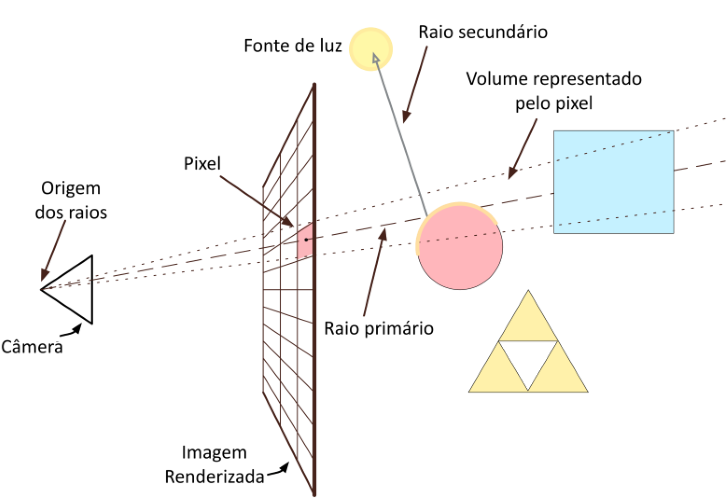
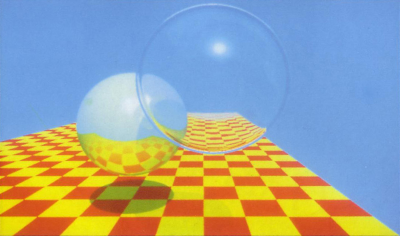
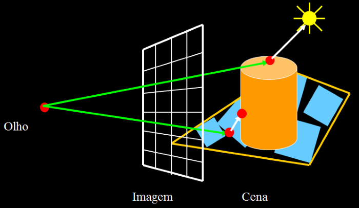
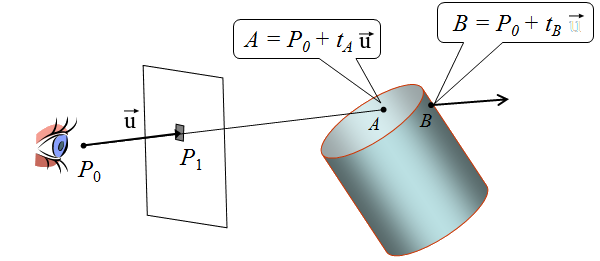
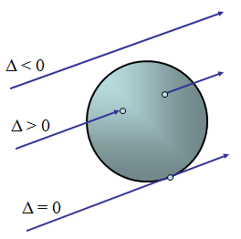
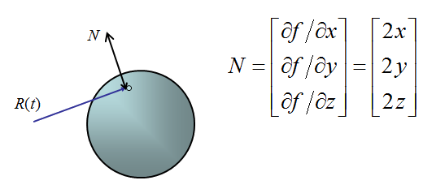
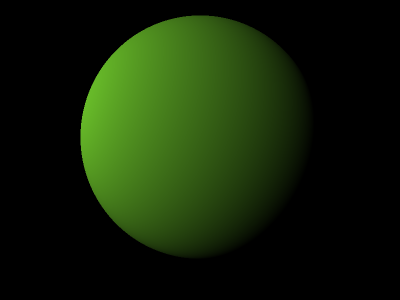

<!--
backdrop: raytraced-teapot
-->

# _Ray tracing_

---
# Objetivos

1. Relembrar das **limitações de modelos de iluminação local**
1. Conhecer um modelo de iluminação **global**
1. Entender a mecânica geral da técnica de geração de imagens chamada
   _ray tracing_

---
## Modelo de iluminação local

- Por ser **mais barato**, é usado para **renderização em tempo real**
  - Exemplos de uso: OpenGL, DirectX
- Apenas caminhos do tipo fonte luminosa → superfície → olho são considerados
- Como funciona, no _pipeline_ gráfico:
  - No **estágio de geometria**:
    - Para cada vértice de uma cena, a contribuição de cada fonte de luz é
      calculada para se determinar a cor resultante (modelo de iluminação
      de Phong)
  - No **estágio de rasterização**
    - A cor de cada pixel é dada por uma interpolação da cor dos vértices
      (modelo de sombreamento de Gouraud)

---
## Efeitos necessários para atingir realismo

- Sombras (com penumbra e tudo o mais)
- Reflexões (espelhos e superfícies brilhantes)
- Transparência (água, vidro)
- Interreflexões ("sangramento" de cor)
- Iluminação complexa (natural, luz de área)
- Materiais realísticos (pinturas, vidro) etc.

---
## _Soft shadows_ (sombras com penumbra)

---
## _Color bleeding_ ("sangramento" de cor)

---
# Modelo de iluminação global

---

---
## Modelo de iluminação global

- Num modelo de iluminação global, consideramos também **a relação
  entre objetos** no cálculo da iluminação
  - Dessa forma, podemos modelar reflexão, refração, sombras e vários dos
    efeitos necessários para a criação de imagens com alto realismo
  - O _pipeline_ gráfico das placas de vídeo não suportam modelos globais
    - Isso porque ele é focado em renderização em tempo real

---
# _Ray tracing_
---
## _Ray tracing_

- É uma técnica de geração de imagens com alto realismo
  - Usa um modelo de iluminação global
  - Geração "espontânea" de:
    - Objetos transparentes
    - Reflexões
    - Sombras
    - Refração
- Funcionamento **basicão**:
  - Raios são lançados do olho para cada pixel da imagem a ser gerada
  - Raios que acertam objetos, são coloridos com sua cor
  - Raios que não atingem nada, são pintados com a cor do fundo

---
## Lançamento de raios

---
## Algoritmo basicão

- `pixels[] renderScene(scene)`:
  1. Dada uma configuração de câmera, gerar um raio
     R_{ij} que sai do olho, passando pelo centro de cada pixel
     (i, j) da sua janela
  1. Chame `castRay(R)` e assinale a cor do pixel com a cor retornada
- `color castRay(R, scene)`:
  1. Dispara o raio R na cena. Seja X o 1º objeto
    atingido e P o ponto do objeto que foi atingido
  1. Para cada fonte de luz L:
     1. Dispara um raio R_l de P até L
     1. Se R_l não atinge nada até chegar em L, aplique o
        modelo de iluminação para determinar a cor do ponto P
  1. Combine as cores retornadas para cada fonte e retorne a resultante

---
## História do _Ray tracing_

- 
  Trabalhos Seminais
  - [Appel 68](http://graphics.stanford.edu/courses/Appel.pdf), _ray casting_
  - [Whitted 80](http://dl.acm.org/citation.cfm?id=358882), _ray tracing_ recursivo
- Pesquisa
  - Uso de diferentes primitivas geométricas
  - Técnicas de aceleração
- Pesquisas recentes:
  - _Ray tracing_ em tempo real
  - Arquiteturas para _Ray tracing_ em _hardware_

---
## Verificação de sombras

---
## Reflexão

---
## Algoritmo do _ray tracing_ recursivo

- Mantém o método `renderScene(scene)` como está e modifica o
  `castRay(R, scene)` para:
  1. Dispara o raio R na cena. Seja X o 1º objeto atingido e
  P o ponto do objeto que foi atingido
  1. **Se X reflexivo, compute raio de reflexão R_r em
    P. C_r = `castRay(R`r`)`**
  1. **Se X transparente, compute raio de refração R_t em
    P. C_t = `castRay(R`t`)`**
  1. Para cada fonte de luz L:
     1. Dispara um raio R_l de P até L
     1. Se R_l não atinge nada até chegar em L, aplique o
        modelo de iluminação para determinar a cor do ponto `P`
  1. Combine as cores **C_r, C_t** e das fontes de luz (4) e
    a retorne

---
## Implementação

- Para implementar um _ray tracing_, precisamos **responder a pelo menos 2
  perguntas**:
  1. Como determinar se um raio atinge um objeto (e em qual)?
  1. Dado que um raio atingiu um objeto, como devemos calcular a cor retornada?
- Vejamos, primeiro, a representação de raios e sua interseção com objetos

---
## Interseção Raio / Objeto

- É o coração de um _ray tracer_ (onde ele passa o maior tempo de execução)
  - Foi uma das primeiras áreas de pesquisa
  - Existem rotinas otimizadas para vários tipos de primitivas (esferas, toróides, triângulos etc.)
- Devem calcular diversos tipos de informação:
  - Para _shadow rays_: intercepta/não intercepta
  - Para raios primários: ponto de interseção, material, normal
  - Coordenadas de textura

---
## Como **representar um raio**?

- **Raio é modelado** como uma **reta** em forma **paramétrica**:
  R(t) = P_0 + t(P_1 - P_0), ou seja
  
R(t) = P_0 + tV

- Computa-se para quais valores do parâmetro t a reta o intercepta

---
## Como representar um raio **em C/C++ ou Java**?

  <section style="border-right: 4px dotted silver; background: cornflowerblue;">
    <h3>Em C:</h3>
    <pre style="text-align: left; ">
      <code class="hljs">struct ray {
  Vector3 p0
  Vector3 v;
}</code>
    </pre>
  </section>
  <section style="border-right: 4px dotted silver; background: aliceblue;">
    <h3>Em C++:</h3>
    <pre style="text-align: left; ">
      <code class="hljs">class ray {
public:      
  Vector3 p0
  Vector3 v;
}</code>
    </pre>
  </section>
  <section style="background: darkseagreen;">
    <h3>Em Java:</h3>
    <pre style="text-align: left;">
      <code class="hljs">public class Ray {
  public Vector3 p0
  public Vector3 v;
}</code>
    </pre>
  </section>

---
## Objetos Implícitos

- Um **objeto implícito** é dado por uma **equação da forma f(x, y, z) = 0**
- Muitas superfícies importantes podem ser modeladas como objetos implícitos,
  principalmente os dados por equações polinomiais:
  - Planos (grau 1)
    - _i.e._, ax + by + cz + d = 0
  - Quádricas (grau 2)
    - Elipsóide: \frac{x^2}{a^2}+\frac{y^2}{b^2}+\frac{z^2}{c^2} = 1
    - Cones, Parabolóides, Hiperbolóides...
  - Quárticas (grau 4)
    - Toróides (_dunkin donuts_)

---
## Interseção Raio / Objeto Implícito

- Raio é modelado em forma paramétrica:
  - R(t) = [R_x(t) R_y(t) R_z(t)]
- Logo, os pontos de interseção satisfazem
  - f(R_x(t),R_y(t),R_z(t)) = 0
- Basta resolver a equação para determinar o(s) valor(es) de t que a satisfazem
  - Veja como fazer para uma esfera no próximo slide...

---
## Exemplo: Interseção com Esfera

- Primeiramente, vamos **simplificar** o problema e assumir que a **esfera é
  unitária e está centrada na origem**:
  
x^2+y^2+z^2 - 1 = 0

- Raio parametrizado como:
  
[P_x+V_xt \;\;\; P_y+V_yt \;\;\; P_z+V_zt]^T

- (continua...)

---
## Exemplo: Interseção com Esfera (2)

- Logo,
  
(P_x+V_xt)^2 + (P_y+V_yt)^2 + (P_z+V_zt])^2-1=0

  <ul>
    <li>ou<ul><li>
      at^2+bt+c=0</li></ul>
    </li>
    <li>onde<ul>
      <li>a = V_x^2 + V_y^2 + V_z^2</li>
      <li>b = 2(V_xP_x + V_yP_y + V_zP_z)</li>
      <li>c = P_x^2 + P_y^2 + P_z^2 - 1</li></ul>
    </li>
  </ul>

---
## Interpretando a interseção com esfera

- Seja \Delta = b^2 - 4ac, então t = \frac{-b \pm \sqrt(\Delta)}{2a}

Ou seja, para descobrir se o raio interceptou a esfera, **basta resolver
  uma equação de 2º grau** ;)

---
## Para **esferas genéricas**

- Dada uma esfera com centro C e raio r
  - Nosso raio: P+t\vec{u}
- Um ponto Q está superfície da esfera se sua distância ao seu centro é igual a r. Ou seja, \left| Q-C \right|=r
  
\left| (P+t\vec{u})-C \right|=r

- Se chamarmos \vec{p}=C-P, podemos:
  
\left| t\vec{u}-(C-P)\right|=r

  
\left| t\vec{u}-\vec{p} \right|=r

---
## Para **esferas genéricas** (2)

- Conhecemos \vec{u}, \vec{p} e r e queremos encontrar t. Pelo produto interno:
  
(t\vec{u}-\vec{p}).(t\vec{u}-\vec{p})=r^2

- Sabendo que o lado esquerdo resulta em um escalar, podemos:
  
t^2(\vec{u}.\vec{u})-2t(\vec{u}.\vec{p})+(\vec{p}.\vec{p})-r^2=0

- ...que é uma equação do 2º grau e podemos resolver para t

---
## Para **esferas genéricas** (3)

- Da equação quadrática, temos que:
  <ul>
    <li>a = (\vec{u}.\vec{u})=1 (já que \vec{u} está normalizado)</li>
    <li>b = -2(\vec{u}.\vec{p})</li>
    <li>c = (\vec{p}.\vec{p})-r^2</li>
  </ul>
- Disto, podemos estudar o sinal do \Delta para saber se há interseção(ões) (raiz(es)) e, caso exista(m), com o valor encontrado para t podemos determinar o ponto de interseção Q na esfera

---
## Exemplo: Normal do ponto P

- A normal no ponto de interseção P é dada pelo gradiente no ponto de
  interseção:

- No caso da esfera, podemos simplesmente fazer o vetor N = P - C,
  onde C é o centro da esfera

---
## Implementando um _ray tracer_

- Precisamos de
  1. Uma classe **Vetor**
  1. Uma classe **ObjetoDaCena**
  1. Uma estrutura/classe **FonteDeLuz**
  1. Uma estrutura/classe **Raio**
  1. E mais algumas coisinhas...
- **Não precisamos** de:
  - Do **OpenGL ou do DirectX**, já que não conseguimos usar a placa de vídeo para estes cálculos
    - Na verdade essa é uma área de pesquisa recente

---
## Um programa _raytracer_

---
## Entrada

- Descrição da cena

---
## Saída

- Arquivo da imagem renderizada (png, ppm, bmp)

---
<!--
backdrop: cpp-vs-java
-->

<h1 style="margin-bottom: 4em; font-weight: bold;">_Choose your side_</h1>

---
# Para a próxima aula

- Ler as aulas 18 e 19 do prof. David Mount (link no Moodle)
  - Fazer isto = certeza de sucesso, TP resolvido durante a aula
  - Não fazer = TPs incompletos, trabalho no final de semana :/

---
# Referências

- Aulas 18 e 19 do prof. David Mount (link na página do curso)
- Capítulo 10 do livro **Computer Graphics with OpenGL** de _Hearn and Baker_
- [Disciplina _Ray Tracing for Graphics_](http://www.cemyuksel.com/courses/utah/cs6620/) da _University of Utah_
  - Uma matéria inteira sobre a criação de _ray tracers_
