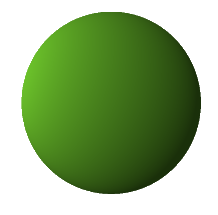
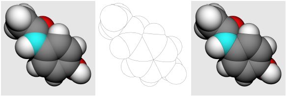
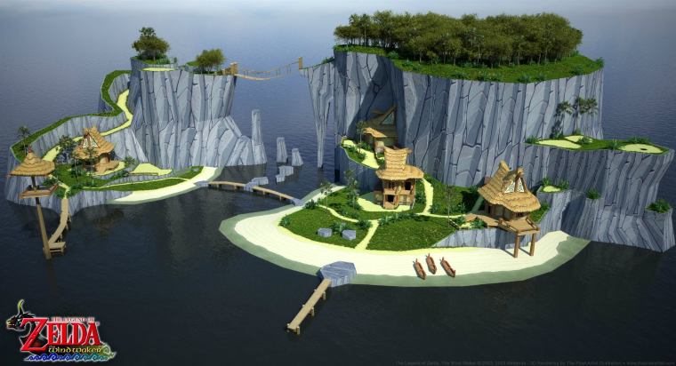
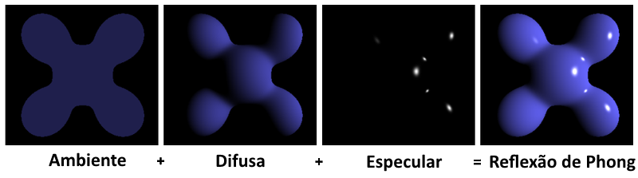
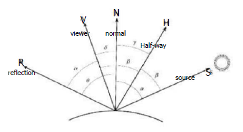
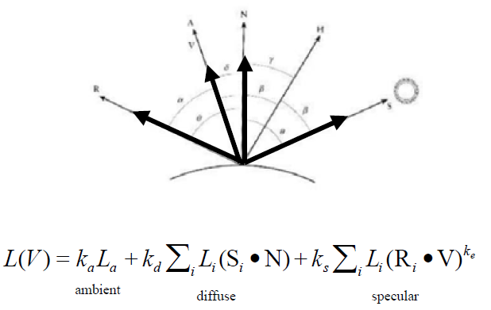
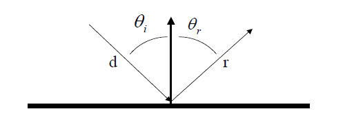
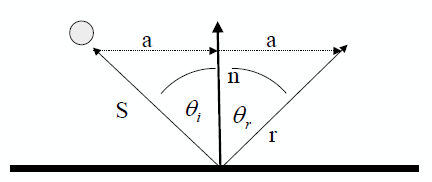

# _Ray tracing_ parte 2

---
# Objetivos

1. Relembrar as duas grandes perguntas fundamentais para ~~a vida, o universo e tudo o mais~~ se criar um _ray tracer_
1. Entender **como retornar uma cor do polígono atingido** pelo raio
1. Revistar o modelo de iluminação local **phong**
1. Mais efeitos com **_ray tracing_ distribuído**

---
# Perguntas fundamentais

---
## Perguntas fundamentais

- Para implementar um _ray tracing_, precisamos responder a pelo menos 2
perguntas:
  1. Como determinar qual objeto (se) um raio intercepta?
  1. Dado que um raio atingiu um objeto, como devemos calcular a cor retornada?
- Na última aula, vimos/implementamos a verificação de interseção entre raio e
  esfera
  - Criamos um sistema linear entre a equação da reta (raio) e a equação
    implícita da esfera
    - Isso dá uma equação de 2º grau em relação ao parâmetro `t` e suas raízes
      equivalem ao(s) ponto(s) `t` da reta em que há interseção

---
## Perguntas fundamentais

- Hoje veremos como calcular a cor que deve ser retornada por um raio quando
  ele atinge um objeto
- Vamos considerar que cada objeto tem uma cor com que ele foi pintado. Assim,
  vejamos algumas opções:
  1. Se raio atingiu objeto, retorne a cor do objeto
  1. Se raio atingiu objeto, considerar as fontes de luz e a cor do objeto:

    

---
# Como colorir um pixel?

---
## Como colorir um pixel?

- Assim como temos diferentes modelos de iluminação local, também podemos
  ter formas diferentes para se colorir um pixel usando um _ray tracer_
- Se o objetivo for realismo, podemos pegar emprestado **os modelos
  de iluminação e de sombreamento de Phong**
  - Imagem do slide anterior
- Se o objetivo for não-realista, podemos, por exemplo, desenhar apenas as
  silhuetas dos objetos (`&delta; = 0` na equação de interseção)

---
## Objetivo não-realista

- Chamado de NPR: _non-photorrealistic rendering_
- Exemplo: Choudhury e Parker, 08

  

---
## Objetivo não-realista (Zelda Wind Waker)

---
## Objetivo não-realista (Zelda Wind Waker)''

---
## Objetivo realista

- Voltando à renderização com objetivo realista, podemos usar o modelo de
  **Phong** (iluminação e sombreamento) para colorir um pixel
  - O modelo de sombreamento de Phong é o da interpolação de normais, com o
    cálculo da função de iluminação (contribuição de cada fonte de luz) sendo
    chamado para cada ponto do objeto
  - Ele é mais caro do que o sombreamento de Gouraud, porém estamos
    interessados mais na **qualidade da imagem** do que na velocidade de
    geração

---
# Modelo de Phong

---
## Modelo de Phong

- A cor é dividida em três componentes:
  1. Cor ambiente (cor do objeto não iluminado)
  1. Cor difusa (cor do objeto iluminado)
  1. Cor e coeficiente especular (cor e tamanho da aparência brilhosa)

---
## Geometria

---
## Geometria

- Vetores envolvidos:
  - `N` - normal do objeto no ponto de interseção
  - `S` - incidência da luz
  - `R` - vetor de reflexão
  - `V` - vetor de visualização (olho até ponto de interseção)
  - `H` - vetor "meio-caminho" entre o da incidência de luz e direção
    de visualização

---
## Parâmetros do (material do) objeto

- O objeto possui:
  1. Uma cor `C`
  1. Três coeficientes ([0,1]) que respondem a:
    1. Luz ambiente (`k`a)
    1. Difuso - reflexão lambertiana (`k`d)
    1. Especular - reflexão brilhosa (`k`s)

---
## Parâmetros de cada fonte de luz

- Cada fonte de luz (onidirecional) possui:
  1. Posição no mundo
  1. Uma cor `C`l
  1. 3 coeficientes de atenuação (constante, linear e quadrático)
    - `a`, `b` e `c`

---
## Equação de iluminação

---
## Calculando os vetores

- Ponto de interseção
  - Vem do cálculo da interseção (`ray.intersectionT`)
- Vetor normal
  - Idem (`ray.intersectionNormal`)
- Vetor incidência de luz
  - Posição da luz - ponto de interseção (normalizar)
- Vetor reflexão
  - Próximo slide
- Vetor de visualização
  - Posição da câmera - ponto de interseção (normalizar)

---
## Reflexão lambertiana

- Reflexão:
  - O ângulo de incidência do raio é igual ao ângulo de reflexão

---
## Calculando vetor de reflexão

- `S` é o vetor que sai do ponto de interseção até a fonte de luz
- `r` é o raio refletido (que queremos encontrar)
- &theta;r e &theta;i são iguais

---
## Calculando vetor de reflexão (cont.)

- Podemos usar produto interno para calcular a projeção de um vetor no outro
- Assim, encontramos `a` e o somamos duas vezes
- Equação:
  - `r = S + 2a`

---
# Referências

- Aulas 18 e 19 do prof. David Mount (link na página do curso)
- Capítulo 10 do livro **Computer Graphics with OpenGL** de _Hearn and Baker_
