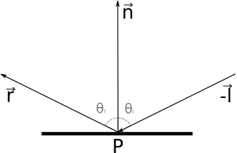
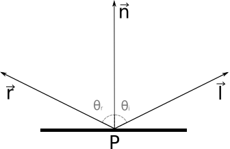
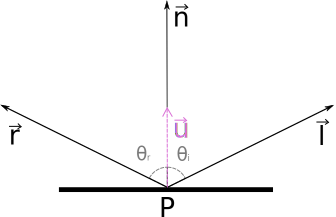
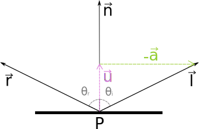
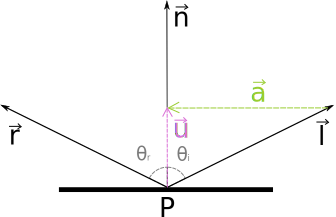
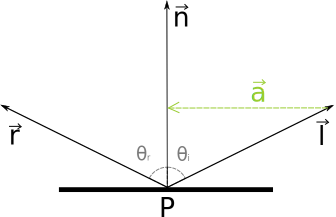
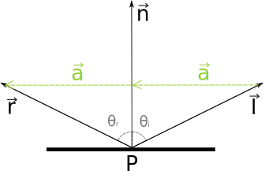
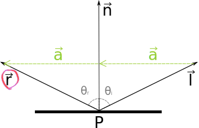

<!-- {"layout": "title"} -->
# _Ray tracing_ parte 2

---
<!-- {"layout": "regular"} -->
# Objetivos

-  <!-- {.appear-right.bullet} --> <!-- {ul:.bulleted} -->
  Relembrar as duas grandes perguntas fundamentais para ~~a vida, o universo e tudo o mais~~ se criar um _ray tracer_
  - Entender **como retornar uma cor do polígono atingido** pelo raio
  - Revisitar o modelo de iluminação local de **phong**
  - Mais efeitos com **_ray tracing_ distribuído**

---
<!-- {"layout": "regular"} -->
# Perguntas fundamentais (1/2)

- Para implementar um _ray tracing_, precisamos responder a pelo menos 2
perguntas:
  1. Como determinar qual objeto (se) um raio intercepta?
  1. Dado que **um raio atingiu um objeto**, como devemos **calcular a cor retornada**?
- Na última aula, vimos/implementamos a verificação de interseção entre raio e
  esfera
  - Criamos um sistema entre a equação da reta (raio) e a equação
    implícita da esfera
    - Isso dá uma equação de 2º grau em relação ao parâmetro t e suas raízes
      equivalem ao(s) ponto(s) t da reta em que há interseção

---
<!-- {"layout": "regular"} -->
# Perguntas fundamentais (2/2)

- Hoje veremos como podemos calcular a cor que deve ser retornada por um raio quando
  ele atinge um objeto
- Vamos considerar que cada objeto tem uma cor com que ele foi pintado. Assim,
  vejamos **algumas opções**:
  1. Se raio atingiu objeto, retorne **sempre a mesma cor do objeto** (o que foi feito na parte 1)
  1. Se raio atingiu objeto, **considerar as fontes de luz** e a cor do objeto
    - Mas como devemos/podemos/queremos considerar as fontes de luz?

---
<!-- {"layout": "regular"} -->
# Como colorir um pixel?

- Assim como temos diferentes modelos de iluminação local, também podemos
  **ter formas diferentes para se colorir um pixel** usando um _ray tracer_
- 
  Se o objetivo for realismo, podemos pegar emprestado **os modelos
  de iluminação e de sombreamento de Phong**
- Se o objetivo for não-realista, podemos, por exemplo, desenhar apenas as
  silhuetas dos objetos (\Delta = 0 na equação de interseção)

<!-- # Objetivo não-realista

- Chamado de NPR: _non-photorrealistic rendering_
- Exemplo: [Choudhury e Parker, 08](http://www.sci.utah.edu/~roni/research/projects/NPR-lines-poster/)

  
 -->
---
<!-- {"layout": "regular"} -->
# Objetivo não-realista (Zelda Wind Waker)

 <!-- {p:.centered} -->

- Renderização em **tempo real** (no jogo mesmo, de GameCube)

---
<!-- {"backdrop": "wind-waker-raytraced"} -->
# Renderização [via ray tracing](http://www.reddit.com/r/gaming/comments/idmkd/wind_waker_rendered_photoreal/)

---
<!-- {"backdrop": "wind-waker-raytraced-2"} -->

---
<!-- {"layout": "regular"} -->
# Objetivo realista

- Voltando à renderização com objetivo realista, podemos usar o modelo de
  **Phong** (iluminação e sombreamento) para colorir um pixel
  - O modelo de sombreamento de Phong é o da interpolação de normais, com o
    cálculo da função de **iluminação** (contribuição de cada fonte de luz) sendo
    chamado **para cada ponto do objeto**
  - Ele é mais caro do que o sombreamento de Gouraud, porém estamos
    interessados mais na **qualidade da imagem** do que na velocidade de
    geração da imagem

---
<!-- {"layout": "regular"} -->
# Modelo de Phong

 <!-- {p:.centered} -->

- A cor é dividida em três componentes: <!-- {p:.no-margin} --> <!-- {ul:.full-width} -->
  - Legenda: <!-- {li:.push-right.no-bullet.no-padding.no-margin} -->
    -  Prop. do material 
    -  Prop. do pigmento

  **Ambiente** <!-- {dl:.no-margin} -->
    ~ \color{ForestGreen}{\rho_a} e \color{RoyalBlue}{C} (coef. e cor do objeto na sombra)

  **Difusa**
    ~ \color{ForestGreen}{\rho_d} e \color{RoyalBlue}{C} (coef. e cor do objeto iluminado)
    
  **Especular**
    ~ \color{ForestGreen}{\rho_s}, \color{RoyalBlue}{C} e \color{ForestGreen}{\alpha} (coef., cor do objeto e expoente)

---
<!-- {"layout": "regular", "embedSVG": "img[src$='.svg']"} -->
# Equação de iluminação de _Phong_

Cor(P)=\color{ForestGreen}\rho_a\color{gray}L_a\color{RoyalBlue}C\color{black} + \sum_{\color{Goldenrod}i\color{black}}Vis(P,\color{Goldenrod}i\color{black})\frac{\color{Goldenrod}L_i\color{black}}{\color{Goldenrod}a\color{black}+\color{Goldenrod}b\color{black}d_{\color{Goldenrod}i\color{black}}+\color{Goldenrod}c\color{black}d_{\color{Goldenrod}i\color{black}}^2}[\color{ForestGreen}\rho_d\color{black}\color{RoyalBlue}C\color{black}max(0,\vec{n}\cdot\vec{l}_{\color{Goldenrod}i\color{black}}) + \color{ForestGreen}\rho_s\color{black}max(0,\vec{r}_{\color{Goldenrod}i\color{black}}\cdot\vec{v})^{\color{ForestGreen}\alpha\color{black}}]

-  <!-- {#phong-vectors-1.push-right} --> <!-- {ul:.full-width.no-bullet} -->
- \vec{n} <!-- {dl:.dl-3.no-margin} -->
    ~ normal do objeto no ponto de interseção

  \vec{l}
    ~  incidência da luz
  
  \vec{v}
    ~ vetor de visualização

  \vec{r}
    ~ vetor de reflexão da luz

  
    ~ propriedades do material
  
  
    ~ propriedades do pigmento
  
  
    ~ propriedades da fonte de luz

---
<!-- { "layout": "regular", "state": "show-active-slide-and-previous", "slideClass": "one-third-half-width-slide" } -->

P
  ~ Ponto tendo cor determinada

\vec{n}
  ~ já encontrado <!-- {dl:.dl-6} -->

\vec{l}
  ~ =\frac{(P_{luz_i}-P)}{\left|(P_{luz_i}-P)\right|}

\vec{v}
  ~ =\frac{(P_{cam}-P)}{\left|(P_{cam}-P)\right|}

\vec{r}
  ~ próximos slides

\color{Goldenrod}L_i
  ~ Cor da luz

\color{gray}L_a
  ~ Cor da luz ambiente global
  ~ _Obs: considerar branca_

d
  ~ Distância da luz \color{Goldenrod}i até o ponto P

Vis(P,\color{Goldenrod}i\color{black})
  ~ 0 ou 1 indicando se a luz está chegando em P diretamente

max(a,b)
  ~ Retorna o maior dentre 2 valores

---
<!-- {"layout": "regular", "embedSVG": "img[src$='.svg']", "scripts": ["../../scripts/classes/phong-vectors.js"]} -->
# Calculando os vetores

P <!-- {dl:.dl-6.full-width} --> 
  ~  <!-- {#phong-vectors-2.phong-vectors.push-right} --> Vem do cálculo da interseção (`response.P`)

\vec{n}
  ~ Idem (`response.normal`)

\vec{l}
  ~ Calcular: \vec{l}=\frac{P_{luz}-P}{\left|P_{luz}-P\right|}

\vec{v}
  ~ Calcular: \vec{v}=\frac{P_{cam}-P}{\left|P_{cam}-P\right|}

\vec{r}
  ~ Calcular: próximo slide

Adaptação do modelo (_Blinn-Phong_): em vez de usar \vec{r}\cdot\vec{v}, 
podemos usar o vetor _half-way_ e a normal (\vec{h}\cdot\vec{n}) para
a componente especular, sendo que \vec{h}=\frac{\vec{l}+\vec{v}}{2}
<!-- {p:.note.info} -->

---
<!-- {"layout": "2-column-content"} -->
# Reflexão perfeita

::: figure .picture-steps.clean.opacity-only padding: 0; align-self: center;
 <!-- {.bullet.figure-step.full-width} -->
 <!-- {.bullet.figure-step.full-width} -->
 <!-- {.bullet.figure-step.full-width} -->
 <!-- {.bullet.figure-step.full-width} -->
 <!-- {.bullet.figure-step.full-width} -->
 <!-- {.bullet.figure-step.full-width} -->
 <!-- {.bullet.figure-step.full-width} -->
 <!-- {.bullet.figure-step.full-width} -->
:::

\color{orchid}\vec{u} <!-- {dl:.dl-3} -->
  ~ projeção de \vec{l} em \vec{n}
  ~ \color{orchid}\vec{u}\color{black}=(\hat{l}\cdot\hat{n})\hat{n}

\color{yellowgreen}\vec{a}
  ~ negação da rejeição da proj. de \vec{l} em \vec{n}
  ~ \color{yellowgreen}\vec{a}\color{black}=-(\vec{l}-\color{orchid}\vec{u}\color{black})
  ~ \color{yellowgreen}\vec{a}\color{black}=\color{orchid}\vec{u}\color{black}-\vec{l}
  ~ \color{yellowgreen}\vec{a}\color{black}=(\hat{l}\cdot\hat{n})\hat{n}-\vec{l}

\vec{r}
  ~ direção da reflexão perfeita
  ~ \vec{r}=\vec{l}+\color{yellowgreen}\vec{a}\color{black}+\color{yellowgreen}\vec{a}
  ~ \vec{r}=\vec{l}+2[(\hat{l}\cdot\hat{n})\hat{n}-\vec{l}]
  ~ \vec{r}=2(\hat{l}\cdot\hat{n})\hat{n}-\vec{l}

---
<!-- {"layout": "regular"} -->
# _Ray tracer_ recursivo

Para o _ray tracer_ recursivo, a equação de Phong para materiais reflexivos ou transparentes também lança os raios de reflexão (\vec{r_r}) e o de refração (\vec{r_t}):

Cor(P)=\color{ForestGreen}\rho_a\color{gray}L_a\color{RoyalBlue}C\color{black} + \sum_{\color{Goldenrod}i\color{black}}Vis(P,\color{Goldenrod}i\color{black})\frac{\color{Goldenrod}L_i\color{black}}{\color{Goldenrod}a\color{black}+\color{Goldenrod}b\color{black}d_{\color{Goldenrod}i\color{black}}+\color{Goldenrod}c\color{black}d_{\color{Goldenrod}i\color{black}}^2}[\color{ForestGreen}\rho_d\color{black}\color{RoyalBlue}C\color{black}max(0,\vec{n}\cdot\vec{l}_{\color{Goldenrod}i\color{black}}) + \color{ForestGreen}\rho_s\color{black}max(0,\vec{r}_{\color{Goldenrod}i\color{black}}\cdot\vec{v})^{\color{ForestGreen}\alpha\color{black}}]\\+\color{ForestGreen}\rho_r\color{black}castRay(P,\vec{r}_r)+\color{ForestGreen}\rho_t\color{black}castRay(P,\vec{r}_t)

**Atenção:**
  ~ a. o raio de reflexão não é da luz, mas do raio primário.
  ~ b. para o raio de refração, veja David Mount páginas 81 e 82. <!-- {dl:.note.info} -->
  ~ c. criar raios primários com um tempo de vida (eg, 10).

---
<!-- { "layout": "regular" } -->
Mostrar imagens geradas

---
<!-- { "layout": "regular" } -->
Mostrar problemas e explicar baixa amostragem

---
<!-- { "layout": "regular" } -->
Mostrar formas de distribuir: cone, beam, jitter

---
<!-- { "layout": "regular" } -->
Mostrar problemas do distribuído

---
<!-- { "layout": "regular" } -->
Mostrar path tracer

---
<!-- { "layout": "regular" } -->
Mostrar photton mapping

---
# Referências

- Aulas 18 e 19 do prof. David Mount (link na página do curso)
- Capítulo 10 do livro **Computer Graphics with OpenGL** de _Hearn and Baker_
