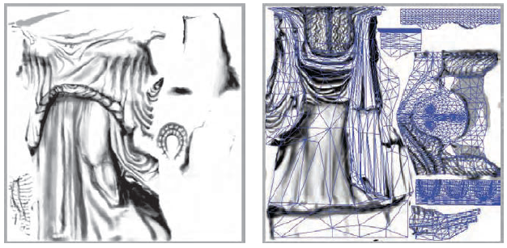

# Texturas

---
# Objetivos

1. Ampliar bastante o realismo das imagens geradas com um custo muito baixo
1. Usar imagens para parametrizar a cor dos pixels, mas também outras
   propriedades

---
# Roteiro

1. Mapeando cores
1. Outras proprieadades mapeáveis

---
# O que temos até agora

---
## Motivação

- Modelos de iluminação não são apropriados para descrever todas as
  diferenças de cor observáveis em uma superfície
  - Superfícies pintadas com padrões ou imagens
    - A capa ou uma página de um livro
  - Superfícies com padrões de rugosidade
    - Tecidos ou uma parede de tijolos
- Em princípio, é possível modelar esses detalhes com geometria e usando
  materiais de propriedades óticas distintas
- Na prática, esses efeitos são modelados usando uma técnica chamada
  mapeamento de textura

---
# Mapeamento de cores

---
## Texturas


- Tipicamente definida por uma imagem carregada de um arquivo
- Podemos "colar" uma imagem em um objeto
- Cada vértice do objeto é mapeado para um ponto da textura e a cor dos
  pixels do objeto é interpolada (da mesma forma como é feito o Gouraud
  _shading_)

---
## Textura em 1D

- O que é uma textura em 1 dimensão?
  - Apenas uma escala de cor
  - Exemplos:
    1. Um degradê horizontal
       
    1. Um código de barras
       
- Pode ser representado como um array de valores RGB
- Contudo, é mais elegante considerar que uma textura é uma função que mapeia
  um ponto `t` no espaço da textura a um valor RGB
  - Dessa forma, dado um valor 0 &le; t &le; 1, a função T(t) retorna um valor RGB

---
## Textura em 1D - Exemplo sem textura


---
## Textura em 1D - Exemplo usando textura 1D


---
## Textura 1D no OpenGL

- Primeiramente, você deve ativar o processamento de texturas de 1D:
  ```c
  glEnable(GL_TEXTURE_1D);
  ```
- Em segundo lugar, você deve ter disponibilizado um _array_ que contém valores de cor.

---
## Textura 1D no OpenGL (cont.)

- Depois, você deve especificar a textura para o OpenGL:
  ```c
  glTexImage1D(GL_TEXTURE_1D, // sempre este valor
    0,                // índice do MipMap (veremos adiante)
    GL_RGBA,          // especificando nosso array como RGBA
    largura,          // "largura" da imagem (potência de 2)
    0,                // sem borda
    GL_RGBA,          // ordem dos bytes no array
    GL_UNSIGNED_BYTE, // tipo de dado do array
    arrayCores);      // array com as cores
  ```
- [Referência](https://www.opengl.org/sdk/docs/man2/xhtml/glTexImage1D.xml)

---
## Textura 1D no OpenGL (cont.)

- Por fim, você deve atribuir, para cada vértice do seu objeto, um valor `t`
  que representa qual o ponto da textura será mapeado a ele:
  ```c
  glBegin(GL_TRIANGLES);
    glTexCoord1f(0.2); // t = 0.2
    glVertex3fv(p1);
    glTexCoord1f(0.8);
    glVertex3fv(p2);
    // ...
  glEnd();
  ```

---
## Textura **2D**


- Exatamente como 1D, porém o espaço da textura é T(s,t) em vez de T(t)

---
## Textura 2D (cont.)


- Tipicamente, representamos qualquer textura 2D no espaço bidimensional com
  0 &le; s, t &le; 1

---
## Parametrização de superfície

- Quando mapeamos uma textura 2D em um objeto 3D, precisamos, primeiro,
  parametrizar o objeto 3D em 2D, para então fazer o mapeamento

  
- Devemos associar cada ponto da superfície do objeto com duas coordenadas
  `(u,v)` no **espaço da superfície**

---
## Função de mapeamento

- Retorna o ponto do objeto correspondente a cada ponto do espaço de textura
  (x, y, z) = F (s, t)
- Corresponde à forma com que a textura é usada para "embrulhar" (_wrap_)
  o objeto
  - Na verdade, na maioria dos casos, precisamos de uma função que nos
    permita "desembrulhar" (_unwrap_) a textura do objeto, isto é, a
    inversa da função de mapeamento
- Se a superfície do objeto pode ser descrita em forma paramétrica esta pode
  servir como base para função de mapeamento

---
## Parametrização da Esfera


---
## Parametrização do Cilindro


---
## Parametrização de Objetos Genéricos

- 
  O que fazer quando o objeto não comporta uma parametrização natural?
- Fazemos o mapeamento em 2 estágios:
  1. Mapear textura sobre uma superfície simples como cilindro, esfera, etc
     aproximadamente englobando o objeto
  1. Mapear superfície simples sobre a superfície do objeto. Pode ser feito de
     diversas maneiras:
     - Raios passando pelo centróide do objeto
     - Raios normais à superfície do objeto
     - Raios normais à superfície simples

---
## Exemplos de parametrização **cúbica**


---
## Exemplos de parametrização **cilíndrica**


---
## Exemplos de parametrização **esférica**


---
## Exemplo na vida real


- Tipicamente, o mapeamento da textura é feito durante a modelagem dos objetos
  (e.g., no blender) e armazenado no arquivo do objeto

---
## Exemplo na vida real (cont.)



- Um programa de modelagem tipicamente "desembrulha" a malha do objeto para
  auxiliar o artista a criar a imagem da textura

---
## Texturas 2D em OpenGL

- Tipicamente, feito em 4 passos

- (1) Ligar o mapeamento de texturas 2D
  ```c
  glEnable(GL_TEXTURE_2D);
  ```

- (2) Assinatura da função para definir uma textura:
  ```c
  void glTexImage2D(GLenum target, GLint level, GLint internalFormat,
    GLsizei width, GLsizei height, GLint border,
    GLenum format, GLenum type,
    const GLvoid* pixels);
  ```

---
## Texturas 2D em OpenGL (cont.)

- (2) Exemplo de definição da textura:
  ```c
  glTexImage2D(GL_TEXTURE_2D,   // sempre este valor
    0,                  // nível do mipmap
    GL_RGBA,            // especificando nosso array como RGBA  
    256,                // largura (potência de 2!! mínimo: 64)
    128,                // altura  (potência de 2!! mínimo: 64)
    0,                  // sem borda
    GL_RGBA,            // ordem dos bytes do array
    GL_UNSIGNED_BYTE,   // tipo de dados de cada posição do array
    arrayCores);        // array com as cores
  ```

---
## Texturas 2D em OpenGL (cont.)

- (3) Configurar diversos parâmetros
  - Modos de filtragem
    - Magnificação ou minificação
    - Filtros _mipmap_ de minificação
  - Modos de repetição de padrões
    - Cortar ou repetir
  - Funções de aplicação de textura
    - Como misturar a cor do objeto com a da textura
      - Misturar, modular ou substituir texels
- Os detalhes de cada tópico serão mostrados mais adiante

---
## Texturas 2D em OpenGL (cont.)

- (4) Por fim, devemos mapear cada vértice a um valor (s,t) da textura usando
  `glTextCoord*` para cada vértice
  ```c
  glBegin(GL_POLYGON);
    glTexCoord2f(0.0, 0.0); glVertex3f(-10.0, -10.0, 0.0);
    glTexCoord2f(1.0, 0.0); glVertex3f( 10.0, -10.0, 0.0);
    glTexCoord2f(1.0, 1.0); glVertex3f( 10.0,  10.0, 0.0);
    glTexCoord2f(0.0, 1.0); glVertex3f(-10.0,  10.0, 0.0);
  glEnd();
  ```

---
## Filtragem


---
## _Mipmaps_


---
## _Mipmaps_

- Possibilita o uso de texturas de diferentes níveis de resolução aplicadas
  de forma adaptativa
  - Reduz _aliasing_ devido a problemas de interpolação
  - Reduz o consumo de memória para objetos distantes
  - O nível da textura na hierarquia _mipmap_ é especificada durante a
    definição da textura:
    ```c
    glTexImage2D(GL_TEXTURE_2D, nivel_mipmap /*... */ );
    ```

---
## Modos de Repetição

- Exemplo:
  ```c
  glTexParameteri( GL_TEXTURE_2D, GL_TEXTURE_WRAP_S, GL_CLAMP );
  glTexParameteri( GL_TEXTURE_2D, GL_TEXTURE_WRAP_T, GL_REPEAT );
  ```

  

---
## Modos de Aplicação de Textura

- Controla como a cor da textura afeta a cor do pixel
  ```c
  glTexEnv{fi}[v](GL_TEXTURE_ENV, prop, param );
  ```
- Modos (`prop = TEXTURE_ENV_MODE`)
  - `GL_MODULATE`
  - `GL_BLEND`
  - `GL_REPLACE`
- Cor a ser misturada (`GL_BLEND`)
  - Especificada com `prop = GL_TEXTURE_ENV_COLOR`

---
# Texturas Procedurais

---
## Texturas Procedurais

- O OpenGL recebe uma matriz de cores, não um arquivo de imagem
- Podemos criar uma função que escreva uma matriz de cores
  - Chamamos isso de **textura procedural**
- Exemplo:

  

---
## Exemplo de textura procedural (livro vermelho)

```c
// Cria uma textura de xadrez
#define checkImageWidth 64
#define checkImageHeight 64
GLubyte checkImage[checkImageHeight][checkImageWidth][4];
void makeCheckImage()
{
  for (int i = 0; i < checkImageHeight; i++) {
    for (int j = 0; j < checkImageWidth; j++) {
      int color = ((((i & 0x8)==0)^((j & 0x8))==0))*255;
      checkImage[i][j][0] = (GLubyte) color;
      checkImage[i][j][1] = (GLubyte) color;
      checkImage[i][j][2] = (GLubyte) color;
      checkImage[i][j][3] = (GLubyte) 255;
    }
  }
}
```

---
# Outras propriedades mapeáveis

---
## Outras propriedades mapeáveis

- 
  Quais parâmetros ou propriedades pode-se reproduzir a partir de texturas:
  - Cor (coeficientes de reflexão difusa)
  - Coeficientes de reflexão especular e difusa
    - Mapeamento de ambiente
  - Perturbação do vetor normal
    - _Bump Mapping_
  - Perturbação da superfície na direção da normal
    - _Displacement Mapping_
  - Transparência / opacidade

---
## Exemplo de normal mapping


- [Código fonte](http://coryg89.github.io/technical/2013/06/01/photorealistic-3d-moon-demo-in-webgl-and-javascript/)
- [Exemplo](http://coryg89.github.io/MoonDemo/)

---
# Referências

- Capítulo 6 do livro Real-Time Rendering
- [Capítulo 9 do OpenGL RedBook](http://www.glprogramming.com/red/chapter09.html)
