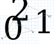
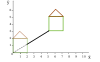
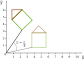
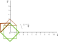
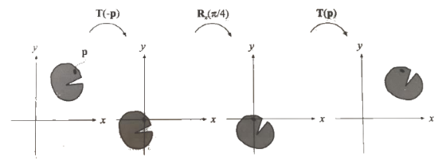
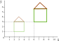
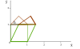

<!-- {"layout": "title"} -->
# Transformações Geométricas
## Translação, Escala, Rotação e mais

---
# Roteiro

1. Introdução a transformações
1. Translação
1. Rotação
1. Escala
1. Inclinação
1. Composição
1. Push, Pop

---
<!-- {"layout": "section-header", "slideClass": "intro-transformacoes"} -->
# Introdução a transformações

---
<!-- {"layout": "regular"} -->
## Teoria geométrica das transformações

- Transformação é uma função que **mapeia pontos de um espaço Euclidiano em
  outros pontos** do mesmo espaço.
- Se uma transformação é linear, então:
  - Se um conjunto de pontos está contido em uma reta, depois de
    transformados eles também estarão contidos sobre uma reta.
  - Se um ponto <span class="math">P</span> guarda uma relação de distância
    com dois outros pontos <span class="math">Q</span> e
    <span class="math">R</span>, então essa relação de distância é mantida.

---
<!-- {"layout": "regular"} -->
## Transformações na prática (em OpenGL)

- Desenhamos quaisquer objetos em OpenGL **descrevendo seus vértices**:
  ```c
  glVertex3f(x, y, z);
  ```
- Podemos alterar as coordenadas dos vértices sem alterar o valor de
  <span class="math">x, y</span> e <span class="math">z</span> de forma a:
  -  <!-- {.push-right style="width: 320px"} -->
    Rotacioná-los (`glRotate`)
  - **Movimentá-los** (`glTranslate`)
  - Alterarmos seu tamanho (`glScale`)
  - Outras transformações
    - Espelhamento ou reflexão
    - Inclinação (_shearing_)

---
<!-- {"layout": "regular"} -->
## **Forma geral** de ponto ou vetor

- Na geometria afim, vimos que podemos representar um ponto ou um vetor na
  forma:
  <div class="math">R = \alpha_0 F.\vec{e_0} + \alpha_1 F.\vec{e_1} + \alpha_2 F.\vec{e_2} + \alpha_3 F.O</div>

  - Em que <u><span class="math">R</span> é um ponto ou um vetor</u>
    representado em termos do sistema de coordenadas <span class="math">F</span>, **<span class="math">\alpha_3</span>** é <span class="math">0</span>
      para vetores ou <span class="math">1</span> para pontos (é a **coordenada
      homogênea**)
  - No sistema de coordenadas cartesiano, escrevemos
    <span class="math">R</span> como:
    <div class="math">R = \alpha_x \vec{x} + \alpha_y \vec{y} + \alpha_z \vec{z} + \alpha_w</div>
- <div class="math" style="float:right;">R = \begin{bmatrix}\alpha_x & \alpha_y & \alpha_z & \alpha_w\end{bmatrix}^T</div>
  Mais sucintamente, dizemos que:

---
<!-- {"layout": "regular"} -->
## Forma matricial de ponto ou vetor

- Podemos representar um ponto ou vetor <span class="math">R</span> na
  forma matricial:
  <div class="math">R = \alpha_0 F.\vec{e_0} + \alpha_1 F.\vec{e_1} + \alpha_2 F.\vec{e_2} + \alpha_3 F.O</div>
  <figure class="picture-steps clean">
    <div class="bullet full-width">
    <div class="math" style="padding-top: 1px;">R = \begin{bmatrix} F.\vec{e_0} & F.\vec{e_1} & F.\vec{e_2} & F.O \end{bmatrix} \times \begin{bmatrix} \alpha_0 \\ \alpha_1 \\ \alpha_2 \\ \alpha_3 \end{bmatrix}</div>
    Cada linha da matriz é um vetor (as 3 primeiras) ou a origem de uma base (a última)
    </div>
    <div class="bullet full-width">
    <div class="math">R = \begin{bmatrix} F.\vec{e_0}[0] & F.\vec{e_1}[0] & F.\vec{e_2}[0] & F.O[0] \\ F.\vec{e_0}[1] & F.\vec{e_1}[1] & F.\vec{e_2}[1] & F.O[1] \\ F.\vec{e_0}[2] & F.\vec{e_1}[2] & F.\vec{e_2}[2] & F.O[2] \\ 0 & 0 & 0 & 1 \end{bmatrix} \times
    \begin{bmatrix} \alpha_0 \\ \alpha_1 \\ \alpha_2 \\ \alpha_3 \end{bmatrix}</div>
    ...expandindo a matriz, mostrando as coordenadas de cada vetor da base/ponto de origem...
    </div>
    <div class="bullet full-width">
    <div class="math">R = \begin{bmatrix} 1 & 0 & 0 & 0 \\ 0 & 1 & 0 & 0 \\ 0 & 0 & 1 & 0 \\ 0 & 0 & 0 & 1 \end{bmatrix} \times
    \begin{bmatrix} \alpha_0 \\ \alpha_1 \\ \alpha_2 \\ \alpha_3 \end{bmatrix}</div>
    Exemplo: a base cartesiana, com origem em (0,0,0)
    </div>
  </figure>

---
<!-- {"layout": "regular"} -->
## Uma função de <span class="math">T</span>ransformação

- Das propriedades da geometria afim, podemos propor **uma função
  <span class="math">T</span>** que, se aplicada a cada componente da
  equação anterior, **se mantém uma equação afim**:

  <div class="math">R = \alpha_0 F.\vec{e_0} + \alpha_1 F.\vec{e_1} + \alpha_2 F.\vec{e_2} + \alpha_3 F.O</div>
  <div class="math">\color{blue}{T(}R\color{blue}{)} = \alpha_0 \color{blue}{T(}F.\vec{e_0}\color{blue}{)} + \alpha_1 \color{blue}{T(}F.\vec{e_1}\color{blue}{)} + \alpha_2 \color{blue}{T(}F.\vec{e_2}\color{blue}{)} + \alpha_3 \color{blue}{T(}F.O\color{blue}{)}</div>
- Podemos chamar essa função <span class="math">T</span> de **transformação**

---
<!-- {"layout": "regular"} -->
## Forma matricial da transformação

- Podemos representar a equação anterior na forma matricial:
  <figure class="picture-steps clean" style="margin-left: 0;">
    <div class="bullet math">T(R) = \begin{bmatrix} T(F.\vec{e_0}) & T(F.\vec{e_1}) & T(F.\vec{e_2}) & T(F.O) \end{bmatrix}
  \begin{bmatrix} \alpha_0 \\ \alpha_1 \\ \alpha_2 \\ \alpha_3 \end{bmatrix}</div>
    <div class="bullet math">T(R) = \begin{bmatrix} T(F.\vec{e_0}[0]) & T(F.\vec{e_1}[0]) & T(F.\vec{e_2}[0]) & T(F.O[0]) \\ T(F.\vec{e_0}[1]) & T(F.\vec{e_1}[1]) & T(F.\vec{e_2}[1]) & T(F.O[1]) \\ T(F.\vec{e_0}[2]) & T(F.\vec{e_1}[2]) & T(F.\vec{e_2}[2]) & T(F.O[2]) \\ 0 & 0 & 0 & 1 \end{bmatrix} \times
    \begin{bmatrix} \alpha_0 \\ \alpha_1 \\ \alpha_2 \\ \alpha_3 \end{bmatrix}</div>
  </figure>
- As linhas representam as imagens dos elementos do sistema <span class="math">F</span> transformado
  por <span class="math">T</span>
- Disso temos que **aplicar uma <u>transformação afim é equivalente a
  multiplicar as coordenadas</u> (de um ponto ou vetor) <u>por uma matriz</u>**
  - Em <span class="math">n</span> dimensões, isso equivale a uma matriz <span class="math">(n + 1)(n + 1)</span> por causa da coordenada homogênea

---
<!-- {"layout": "regular"} -->
## Exemplo: transformação nula

- <div class="math" style="float: right;">T=\begin{bmatrix} 1&0&0&0 \\ 0&1&0&0 \\ 0&0&1&0 \\ 0&0&0&1 \end{bmatrix}</div>
  <strong>A transformação nula</strong> é aquela que mantém as coordenadas dos pontos e vetores inalterada - ou seja, dada pela <strong>matriz identidade</strong>:
    <div style="clear: right;"></div>

- No sistema de coordenadas cartesiano, um ponto <span class="math">P=\begin{bmatrix} \alpha_x&\alpha_y&\alpha_z&1 \end{bmatrix}^{T}</span>, temos que:

  <figure class="picture-steps clean">
    <div class="bullet math">T(P)=\begin{bmatrix} 1&0&0&0 \\ 0&1&0&0 \\ 0&0&1&0 \\ 0&0&0&1 \end{bmatrix} \begin{bmatrix} \alpha_x \\ \alpha_y \\ \alpha_z \\ 1 \end{bmatrix}=?</div>
    <div class="bullet math" style="width: 100%;">T(P)=\begin{bmatrix} 1&0&0&0 \\ 0&1&0&0 \\ 0&0&1&0 \\ 0&0&0&1 \end{bmatrix} \begin{bmatrix} \alpha_x \\ \alpha_y \\ \alpha_z \\ 1 \end{bmatrix}=\begin{bmatrix} \alpha_x \\ \alpha_y \\ \alpha_z \\ 1 \end{bmatrix}</div>
  </figure>

---
<!-- {"layout": "centered-horizontal"} -->
# A [Magnífica Matriz 2D](http://ncase.me/matrix/)

<iframe src="http://ncase.me/matrix/" width="100%" height="537" frameborder="0"></iframe>

---
<!-- {"layout": "section-header", "slideClass": "tipos-comuns"} -->
# Tipos comuns de transformações

- Translação
- Rotação
- Escala
- Inclinação

---
<!-- {"layout": "regular"} -->
# Translação

- A transformação de translação move um objeto de uma posição para outra.

  1.  <!-- {ol:.layout-split-2.no-bullet} -->
  1.
     - <div class="math">x' = x + t_x \\ y' = y + t_y</div>
     - <div class="math">\begin{bmatrix} x' \\ y' \\ 1 \end{bmatrix} = \begin{bmatrix}1 & 0 & t_x \\ 0 & 1 & t_y \\ 0 & 0 & 1 \end{bmatrix} \times \begin{bmatrix} x \\ y \\ 1\end{bmatrix}</div>
- Mantém os ângulos e comprimentos
---
<!-- {"layout": "regular"} -->
## Translação em 3D

- Pode ser representada por uma matriz <span class="math">T(\vec{t})</span>, em que <span class="math">\vec{t}</span> é o vetor de deslocamento:

  <div class="math">\begin{bmatrix} 1 & 0 & 0 & t_x \\ 0 & 1 & 0 & t_y \\ 0 & 0 & 1 & t_z \\ 0 & 0 & 0 & 1\end{bmatrix} \begin{bmatrix}p_x \\ p_y \\ p_z \\ 1 \end{bmatrix} = \begin{bmatrix}p_x + t_x \\ p_y+t_y \\ p_z+t_z \\ 1 \end{bmatrix}</div>

---
<!-- {"layout": "regular"} -->
## Translação em OpenGL

- Em OpenGL, usamos o método `glTranslate` para multiplicar a matriz atual pela
  matriz de translação gerada pelo `glTranslate`
- Assinatura da função ([referência](https://www.opengl.org/sdk/docs/man2/xhtml/glTranslate.xml)).
  ```c
  void glTranslated(double x, double y, double z);
  void glTranslatef(float x, float y, float z);
  ```

---
<!-- {"layout": "regular"} -->
## Translação em OpenGL (cont.)

- Dentro de uma função de desenho:
  ```c
  glTranslatef(player.x, player.y, 0);
  glBegin(GL_TRIANGLE_FAN);   // define o objeto na origem
      glVertex3f(-10, -10, 0);    glVertex3f( 10, -10, 0);
      glVertex3f( 10,  10, 0);    glVertex3f(-10,  10, 0);
  glEnd();
  glTranslatef(-player.x, -player.y, 0); // desfaz translação... ou a descarta
  ```
- Benefícios
  - Podemos definir objetos (vértices) em um **sistemas de coordenadas local**
    a ele
  - Podemos guardar objetos em _display lists_ já que
    estão definidos em um sistema local e transladá-los em qualquer posição

---
<!-- {"layout": "regular"} -->
## Matriz inversa da translação

- Pode-se usar a matriz inversa de uma transformação para **se desfazer a
  operação** efetuada por ela
- A matriz inversa de uma translação <span class="math">T(\vec{t})</span> é dada por <span class="math">T^{-1}(\vec{t})</span> tal que:
  - <span class="math">T^{-1}(\vec{t})=T(-\vec{t})</span>
  - Ou seja, basta multiplicar o vetor <span class="math">\vec{t}</span> de deslocamento por <span class="math">-1</span> para se obter a
    matriz inversa


---
<!-- {"layout": "regular"} -->
# Rotação

- A rotação de um objeto é especificada por:
  - um **ângulo** de rotação e <!-- {ul^0:.multi-column-list-2} -->
  - um **eixo** de rotação.
- Todos os vértices do objeto são transformados para novas posições por meio
da rotação dos pontos em um ângulo especificado com **relação à origem**:
  1.  <!-- {ol:.layout-split-2.no-bullet} -->
  1.
     - <div class="math">x' = x\cos{\alpha} - y\sin{\alpha} \\ y' = x\sin{\alpha} + y\cos{\alpha}</div>
     - <div class="math">\begin{bmatrix} x' \\ y' \\ 1 \end{bmatrix} = \begin{bmatrix}\cos{\alpha} & -\sin{\alpha} & 0 \\ \sin{\alpha} & \cos{\alpha} & 0 \\ 0 & 0 & 1 \end{bmatrix} \times \begin{bmatrix} x \\ y \\ 1\end{bmatrix}</div>

---
<!-- {"layout": "regular"} -->
## Rotação: eixo

- Podemos rotacionar objetos **ao longo dos três eixos** da base do
  nosso sistema de coordenadas: <span class="math">(x,y,z)</span>
  - Exemplo: nossa cabeça olha para cima ou baixo, esquerda ou direita e
    deita-se para a direita ou esquerda
  - Se rotacionarmos vértices em <span class="math">x</span>, suas coordenadas
    <span class="math">y</span> e <span class="math">z</span> alteram, mas
    <span class="math">x</span> se mantêm
    
    - Portanto, em 2D, para rotacionar um objeto provavelmente queremos usar o
      eixo Z

---
<!-- {"layout": "regular"} -->
## Rotação em **cada eixo** em 3D

- Pode ser representada por uma matriz <span class="math">R_{z}(\alpha)</span>, em que <span class="math">\alpha</span> é o ângulo de
  rotação.

  <div class="math">R_{z}(\alpha)=\begin{bmatrix} \cos\alpha&- \sin\alpha&0&0 \\ \sin\alpha&\cos\alpha&0&0 \\ 0&0&1&0 \\ 0&0&0&1 \end{bmatrix}</div>

  <div class="math" style="float:left;">R_x(\alpha)=\begin{bmatrix} 1&0&0&0 \\ 0&\cos\alpha&-\sin\alpha&0 \\ 0&\sin\alpha&\cos\alpha&0 \\ 0&0&0&1\end{bmatrix}</div>

  <div class="math" style="float:right;">R_y(\alpha)=\begin{bmatrix} \cos\alpha&0&\sin\alpha&0 \\ 0&1&0&0 \\ -\sin\alpha&0&\cos\alpha&0 \\ 0&0&0&1\end{bmatrix}</div>

---
<!-- {"layout": "regular"} -->
## Rotação em OpenGL

- Em OpenGL, usamos o método `glRotate` para multiplicar a matriz atual pela
  matriz de rotação gerada pelo `glRotate`
- Assinatura da função ([referência](https://www.opengl.org/sdk/docs/man2/xhtml/glRotate.xml)):
  ```c
  void glRotated(double angle, double x, double y, double z);
  void glRotatef(float angle, float x, float y, float z);
  ```
- Exemplos de rotação em cada eixo:
  ```c
  glRotatef(30, 0, 0, 1); // 30º no eixo z
  glRotatef(30, 0, 1, 0); // 30º no eixo y
  glRotatef(30, 1, 0, 0); // 30º no eixo x
  ```

---
<!-- {"layout": "regular"} -->
## Rotação em OpenGL: exemplo

- Dentro de uma função de desenho:
  ```c
  glRotatef(player.angle, 0, 0, 1);   // eixo z
  glBegin(GL_TRIANGLE_FAN);
      glVertex3f(-10, -10, 0);    glVertex3f( 10, -10, 0);
      glVertex3f( 10,  10, 0);    glVertex3f(-10,  10, 0);
  glEnd();
  glRotatef(-player.angle, 0, 0, 1);  // desfaz rotação ou descarta
  ```

---
<!-- {"layout": "2-column-content-zigzag"} -->
## Rotação: desenho na origem ou não

- ```c
  glRotatef(45, 0, 0, 1);
  glBegin(GL_POLYGON);
    glVertex2f(4, 1);  // não está
    glVertex2f(6, 1);  // na origem
    // ...
  glEnd();
  ```
  <!-- {ul:.no-bullet.compact-code} -->
 <!-- {.centered style="max-height: 180px;"} -->

- ```c
  glRotatef(45, 0, 0, 1);
  glBegin(GL_POLYGON);
    glVertex2f(0, 0);  // está na
    glVertex2f(2, 0);  // origem 👍
    // ...
  glEnd();
  ```
  <!-- {ul:.no-bullet.compact-code} -->

 <!-- {.centered style="max-height: 180px;"} -->


---
<!-- {"layout": "regular"} -->
## Matriz inversa da rotação

- A matriz de rotação é ortogonal, ou seja, **sua inversa é sua
  transposta**
- Dada uma matriz de rotação <span class="math">R(\alpha)</span>, sua matriz inversa <span class="math">R^{-1}(\alpha)</span>
  é dada por:
  - <span class="math">R^{-1}(\alpha)</span> = <span class="math">R^T(\alpha)</span>
- Também é possível obter a inversa da matriz de rotação usando **a negação do
  ângulo de rotação**:
  - <span class="math">R^{-1}(\alpha)=R(-\alpha)</span>

---
<!-- {"layout": "regular"} -->
## Rotação em torno de um ponto: **fora da** origem

- Para rotacionar **um objeto que não está na origem em torno de si mesmo**,
  precisamos, primeiro  (1) movê-lo até a origem, (2) rotacionar e (3) movê-lo
  de volta

  
- Assim, fazemos uma **transformação composta** dada pela matriz obtida pela multiplicação:
  - <span class="math">M = T(\vec{p})R_z(45)T(-\vec{p})</span>

---
<!-- {"layout": "regular"} -->
## Rotações em geral (quaisquer eixos)

- Uma rotação em **eixos arbitrários** pode ser definida pela multiplicação das
  matrizes de rotação em cada eixo

  <div class="math">E(h, p, r) = R_z(r)R_x(p)R_y(h)</div>
- Chamada de transformação de Euler
- É a matriz gerada pelo `glRotate`

---
<!-- {"layout": "regular"} -->
# Escala

- A transformação de escala altera o tamanho do objeto
  - Além de alterar o tamanho do objeto, a operação também os move

    1.  <!-- {ol:.layout-split-2.no-bullet} -->
    1.
       - <div class="math">x' = s_xx \\ y' = s_yy</div>
       - <div class="math">\begin{bmatrix} x' \\ y' \\ 1 \end{bmatrix} = \begin{bmatrix} s_x & 0 & 0 \\ 0 & s_y & 0 \\ 0 & 0 & 1 \end{bmatrix} \times \begin{bmatrix} x \\ y \\ 1\end{bmatrix}</div>

---
<!-- {"layout": "regular"} -->
## Escala (cont.)

- Uma transformação de escala simples é realizada pela multiplicação das
  posições <span class="math">(x,y,z)</span> de um objeto por fatores escalares <span class="math">s_x, s_y, s_z</span>
- A transformação de escala pode ser representada por uma matriz <span class="math">S</span> tal que:

  <div class="math" style="float: right;">S(\vec{s})=\begin{bmatrix} s_x&0&0&0 \\ 0&s_y&0&0 \\ 0&0&s_z&0 \\ 0&0&0&1 \end{bmatrix}</div>

---
<!-- {"layout": "regular"} -->
## Escala em OpenGL

- Em OpenGL, usamos o método `glScale` para multiplicar a matriz atual pela
  matriz de escala gerada por ele
- Assinatura da função ([referência](https://www.opengl.org/sdk/docs/man2/xhtml/glScale.xml)):
  ```c
  void glScaled(double x, double y, double z);
  void glScalef(float x, float y, float z);
  ```

---
<!-- {"layout": "regular"} -->
## Escala em OpenGL (cont.)

- Dentro de uma função de desenho:
  ```c
  if (player.isSmall) {
    glScalef(0.5, 0.5, 0.5);      // uniforme, 50%
  }
  glBegin(GL_TRIANGLE_FAN);
    glVertex3f(-10, -10, 0);      glVertex3f( 10, -10, 0);
    glVertex3f( 10,  10, 0);      glVertex3f(-10,  10, 0);
  glEnd();
  if (player.isSmall) {
    glScalef(1/.5, 1/.5, 1/.5);   // desfaz ou descarta
  }
  ```

---
<!-- {"layout": "regular"} -->
# Inclinação

- Equivale a "entortar" um objeto (seus vértices) em um plano

  1.  <!-- {ol:.layout-split-2.no-bullet} -->
  1.
     - <div class="math">x' = x + hy \\ y' = y</div>
     - <div class="math">\begin{bmatrix} x' \\ y' \\ 1 \end{bmatrix} = \begin{bmatrix} 1 & h & 0 \\ 0 & 1 & 0 \\ 0 & 0 & 1 \end{bmatrix} \times \begin{bmatrix} x \\ y \\ 1\end{bmatrix}</div>

---
<!-- {"layout": "regular"} -->
## Inclinação (cont.)

- Em 3D, pode ocorrer em 1 de 6 combinações de planos de coordenadas
- <div class="math" style="float: right;">H_{xy}(\vec{sh})=\begin{bmatrix} 1 & 0 & sh_x & 0 \\ 0 & 1 & sh_y & 0 \\ 0 & 0 & 1 & 0 \\ 0 & 0 & 0 & 1 \end{bmatrix}</div>
  Matriz da transformação no plano <span class="math">xy</span>

---
<!-- {"layout": "regular"} -->
## Inclinação em OpenGL

- **<u>Não existe um `glShear`</u>**, portanto precisamos implementar a matriz nós mesmos
- O OpenGL possui o **`glMultMatrix`** que nos permite definir todas as coordenadas
  de uma matriz
  - `glRotate`, `glTranslate` e `glScale` chamam essa função
  - Referência do [glMultMatrix](https://www.opengl.org/sdk/docs/man2/xhtml/glMultMatrix.xml)

---
<!-- {"layout": "section-header", "slideClass": "push-pop"} -->
# Push, Pop

---
<!-- {"layout": "regular"} -->
## Push, Pop

- Quando chamamos uma **função de multiplicação de matriz**, estamos **alterando o
  estado** do OpenGL (máquina de estados)
- Assim, consecutivas chamadas a `glTranslatef(10, 0, 0)` irão mover os objetos
  da cena a `10u` em cada chamada

1. Em vez de usar assim: <!-- {ol:.no-bullet.layout-split-2.compact-code-more} -->
   ```c
   glTranslatef(nave.x, nave.y, 0);
   desenhaPlayer();
   glTranslatef(-nave.x, -nave.y, 0);


   glTranslatef(inimigo.x, inimigo.y, 0);
   desenhaInimigo();
   glTranslatef(-inimigo.x, -inimigo.y, 0);
   ```
1. Faça assim: <!-- {li:style="margin-left: 1em;"} -->
   ```c
   glPushMatrix();  // salva o estado atual
      glTranslatef(nave.x, nave.y, 0);
      desenhaPlayer();
   glPopMatrix();   // retorna estado

   glPushMatrix();
      glTranslatef(inimgo.x, inimigo.y, 0);
      desenhaInimigo();
   glPopMatrix();
   ```

---
<!-- {"layout": "centered-horizontal"} -->
# O [Tutorial de Matrizes OpenGL](https://fegemo.github.io/push-pop/) 🌟

<iframe src="https://fegemo.github.io/push-pop/" width="100%" height="537"></iframe>

---
<!-- {"layout": "regular"} -->
# As 4 pilhas de matrizes

- Em particular, existem 4 variáveis de estado que são pilhas de matrizes

  `GL_MODELVIEW`
    ~ transformação de **modelo** e de **visualização**

  `GL_PROJECTION`
    ~ transformação de **projeção**

  `GL_TEXTURE`
    ~ transformação de **coordenada de textura**

  ~~`GL_COLOR`~~
    ~ ~~transformação no **espaço RGB**~~

Usamos **`glMatrixMode(GL_...)`** para escolher em qual pilha de matrizes
  queremos aplicar transformações <!-- {style="clear:both"} -->

---
<!-- {"layout": "regular", "slideClass": "two-column-code compact-code"} -->
### Uso típico das pilhas `GL_MODELVIEW` e `GL_PROJECTION`

```c
void redimensiona(int w, int h) {
    glViewport(0, 0, w, h);

    // configura a projeção
    glMatrixMode(GL_PROJECTION);
    glLoadIdentity();
    glOrtho(-50, 50, -50, 50, -1, 1);

    // "limpa" a matriz de modelo e
    // visualização
    glMatrixMode(GL_MODELVIEW);
    glLoadIdentity();
}
void desenhaMinhaCena() {
    glClear(GL_COLOR_BUFFER_BIT);

    // todas as funções de transformação
    // aqui vão operar sobre a pilha
    // GL_MODELVIEW
    // ...

    glFlush();
}


```

A função `glOrtho` é também uma transformação e opera sobre
a pilha de matrizes atual.
<!-- {p:.note.info.large-width} -->

---
<!-- {"layout": "regular"} -->
## Operações sobre a matriz atual

`glPushMatrix`
  ~ empilha a matriz corrente e a duplica no topo da pilha.
  ~ ou seja, assim que `glPushMatrix` é chamada, as duas primeiras matrizes da
    pilha são idênticas

`glPopMatrix`
  ~ desempilha a matriz corrente

`glLoadIdentity`
  ~ define a matriz do topo como uma identidade

`glLoadMatrix`
  ~ define a matriz do topo como a matriz (16 floats) passada com argumento

`glRotate, glTranslate, glScale`
  ~ multiplica a matriz do topo pela matriz de transformação correspondente

`glMultMatrix`
  ~ multiplica a matriz do topo pela matriz (16 floats) passada com argumento

---
<!-- {"layout": "regular"} -->
# Exemplo de Rotação com Animação

Veja este exemplo de [quadrado girando](codeblocks:transformacao-rotacao/CodeBlocks/transformacao-rotacao.cbp)
ao longo do tempo - ou seja, uma rotação no eixo Z de pequenos ângulos a cada
quadro.

- Usar `glPushMatrix()`/`glPopMatrix()` é preferível porque eles tornam
  desnecessários desfazer as transformações - que, tipicamente, se faz
  aplicando a transformação inversa

---
# Referências

- Capítulo 3 do livro Real-Time Rendering
- Lições 5 e 8 das anotações do prof. David Mount
