# Transformações Geométricas

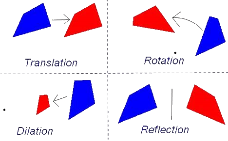

---
# Roteiro

1. Introdução a transformações
1. Translação
1. Rotação
1. Escala
1. Inclinação
1. Composição
1. Push, Pop

---
# Introdução a transformações

---
## Teoria geométrica das transformações

- Transformação é uma função que **mapeia pontos de um espaço Euclidiano em
  outros pontos** do mesmo espaço.
- Se uma transformação é linear, então
  - Se um conjunto de pontos está contido em uma reta, depois de
    transformados eles também estarão contidos sobre uma reta.
  - Se um ponto P guarda uma relação de distância com dois outros pontos Q e R,
    então essa relação de distância é mantida pela transformação.

---
## Prática das transformações (em OpenGL)

- Desenhamos quaisquer objetos em OpenGL **descrevendo seus vértices**
  - `glVertex3f(x, y, z)`
- Podemos alterar as coordenadas dos vértices sem alterar o valor de x, y e z
  de forma a
  - Rotacioná-los (`glRotate`)
  - Movimentá-los (`glTranslate`)
  - Alterarmos seu tamanho (`glScale`)
  - Outras transformações
    - Espelhamento ou reflexão
    - Inclinação (_shearing_)

---
## **Forma geral** de ponto ou vetor

- Na geometria afim, vimos que podemos representar um ponto ou um vetor na
  forma:

  R = &alpha;<sub>0</sub>F.e<sub>0</sub> + &alpha;<sub>1</sub>F.e<sub>1</sub> + &alpha;<sub>2</sub>F.e<sub>2</sub> + &alpha;<sub>3</sub>O

  - Em que **&alpha;<sub>3</sub>** é 0 para vetores ou 1 para pontos
    (é a **coordenada homogênea**), R é um ponto ou um vetor representado
    em termos do sistema de coordenadas F

---
## Forma geral (cont.)

- Das propriedades da geometria afim, podemos propor **uma função T** que, se
  aplicada a cada componente da equação anterior, **se mantém uma equação afim**:

  T(R) = &alpha;<sub>0</sub>T(F.e<sub>0</sub>) + &alpha;<sub>1</sub>T(F.e<sub>1</sub>) + &alpha;<sub>2</sub>T(F.e<sub>2</sub>) + &alpha;<sub>3</sub>T(O)

  - Podemos chamar essa função T de **transformação**

---
## Forma matricial

- Podemos representar a equação anterior na forma matricial:

  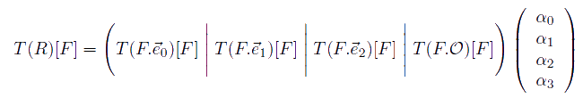

  - As colunas representam as imagens dos elementos do sistema F transformado
    por T
  - Disso temos que **aplicar uma transformação afim é equivalente a
    multiplicar as coordenadas (de um ponto ou vetor) por uma matriz**
    - Em <span class="math">n</span> dimensões, isso equivale a uma matriz <span class="math">(n + 1)(n + 1)</span>

---
# Tipos comuns de transformações

---
## **Translação**

- A transformação de translação move um objeto de uma posição para outra.

  

---
## Translação (cont.)

- Mantém os ângulos e comprimentos
- Pode ser representada por uma matriz T(t), em que t é o vetor de deslocamento

  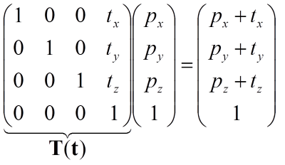

---
## Translação em OpenGL

- Em OpenGL, usamos o método `glTranslate` para multiplicar a matriz atual pela
  matriz de translação gerada pelo `glTranslate`
- Assinatura da função ([referência](https://www.opengl.org/sdk/docs/man2/xhtml/glTranslate.xml)).
  ```c
  void glTranslated(double x, double y, double z);
  void glTranslatef(float x, float y, float z);
  ```

---
## Translação em OpenGL (cont.)

- Dentro de uma função de desenho:
  ```c
  glTranslatef(player.x, player.y, 0);
  glBegin(GL_POLYGON);
    glVertex3f(-10, -10, 0);    glVertex3f(10, -10, 0);
    glVertex3f(10, 10, 0);      glVertex3f(-10, 10, 0);
  glEnd();
  glTranslatef(-player.x, -player.y, 0); // desfaz translação
  ```
- Benefícios
  - Podemos definir objetos (vértices) em um **sistemas de coordenadas local**
    a ele
  - Podemos guardar objetos em listas de visualização (_display lists_) já que
    eles estão definidos em um sistema local e transladá-los em qualquer posição

---
## Matriz inversa da translação

- Pode-se usar a matriz inversa de uma transformação para **se desfazer a
  operação** efetuada por ela
- A matriz inversa de uma translação T(t) é dada por T<sup>-1</sup>(t) tal que:
  - T<sup>-1</sup>(t) = T(-t)
  - Ou seja, basta multiplicar o vetor t de deslocamento por -1 para se obter a
    matriz inversa

---
## **Rotação**

- A rotação de um objeto é especificada por um ângulo de rotação e um eixo
de rotação.
  - Todos os vértices do objeto são transformados para novas posições por meio
    da rotação dos pontos em um ângulo especificado com **relação à origem**.

---
## Rotação (cont.)

- Equações para a rotação de um ponto (x, y) através de um ângulo Θ com relação
  à origem:

  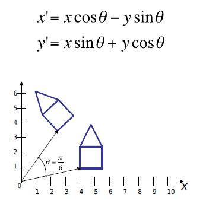

---
## Rotação (cont.)

- Podemos rotacionar objetos ao longo dos três eixos da base do nosso sistema
  de coordenadas: (x, y, z)
  - Exemplo: nossa cabeça olha para cima ou baixo, esquerda ou direita e
    deita-se para a direita ou esquerda
  - Se rotacionar-mos vértices em `x`, suas coordenadas `y` e `z` alteram, mas
    `x` se mantêm
    
    - Portanto, em 2D, para rotacionar um objeto provavelmente queremos usar o
      eixo Z

---
## Rotação no **eixo Z**

- Pode ser representada por uma matriz <span class="math">R_{z}(\alpha)</span>, em que &alpha; é o ângulo de
  rotação.

  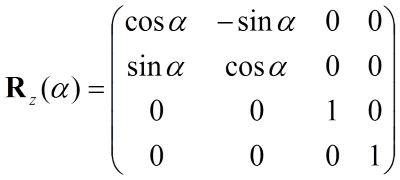

---
## Rotação nos **eixos X e Y**

- Similarmente, as matrizes de rotação nos eixos `x` e `y`

  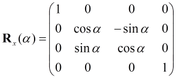
  

---
## Rotação em OpenGL

- Em OpenGL, usamos o método `glRotate` para multiplicar a matriz atual pela
  matriz de rotação gerada pelo `glRotate`
- Assinatura da função ([referência](https://www.opengl.org/sdk/docs/man2/xhtml/glRotate.xml)):
  ```c
  void glRotated(double angle, double x, double y, double z);
  void glRotatef(float angle, float x, float y, float z);
  ```

---
## Rotação em OpenGL (cont.)

- Dentro de uma função de desenho:
  ```c
  glRotatef(player.angle, 0, 0, 1);   // eixo z
  glBegin(GL_POLYGON);
    glVertex3f(-10, -10, 0);    glVertex3f(10, -10, 0);
    glVertex3f(10, 10, 0);      glVertex3f(-10, 10, 0);
  glEnd();
  glRotatef(-player.angle, 0, 0, 1);  // desfaz
  ```

---
## Matriz inversa da rotação

- A matriz de rotação é ortogonal, o que implica que **sua inversa é sua
  transposta**
- Dada uma matriz de rotação R(&alpha;), sua matriz inversa R<sup>-1</sup>(&alpha;)
  é dada por:
  - R<sup>-1</sup>(&alpha;) = R<sup>t</sup>(&alpha;)
- Também é possível obter a inversa da matriz de rotação usando **a negação do
  ângulo de rotação**:
  - R<sup>-1</sup>(&alpha;) = R(-&alpha;)

---
## Rotação em torno de um ponto

- Quando rotacionamos um objeto, o fazemos em relação à origem


---
## Rotação em torno de um ponto (cont.)

- Para rotacionar **um objeto que não está na origem em torno de si mesmo**,
  precisamos, primeiro  (1) movê-lo até a origem, (2) rotacionar e (3) movê-lo
  de volta à sua posição original

  
- Assim, fazemos uma transformação composta dada pela matriz obtida pela multiplicação:
  <span class="math">Resultante = T(p)R_z(45)T(-p)</span>

---
## Rotações em geral (quaisquer eixos)

- Uma rotação em eixos arbitrários pode ser definida pela multiplicação das
  matrizes de rotação em cada eixo

  <div class="math">E(h, p, r) = R_z(r)R_x(p)R_y(h)</div>
- Chamada de transformação de Euler
- É a matriz gerada pelo `glRotate`

---
# Escala

---
## Escala

- A transformação de escala altera o tamanho do objeto
  - Além de alterar o tamanho do objeto (espaço entre vértices), a operação
    também os move

    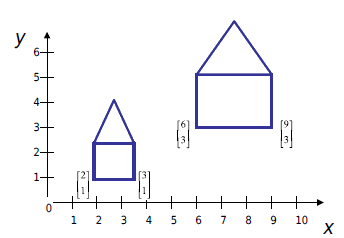

---
## Escala (cont.)

- Uma transformação de escala simples é realizada pela multiplicação das
  posições (x, y, z) de um objeto por fatores escalares s<sub>x</sub>, s<sub>y</sub>, s<sub>z</sub>
- A transformação de escala pode ser representada por uma matriz S tal que:

  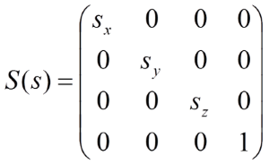

---
## Escala em OpenGL

- Em OpenGL, usamos o método `glScale` para multiplicar a matriz atual pela
  matriz de escala gerada por ele
- Assinatura da função ([referência](https://www.opengl.org/sdk/docs/man2/xhtml/glScale.xml)):
  ```c
  void glScaled(double x, double y, double z);
  void glScalef(float x, float y, float z);
  ```

---
## Escala em OpenGL (cont.)

- Dentro de uma função de desenho:
  ```c
  if (player.isSmall) {
    glScalef(0.5, 0.5, 0.5);      // uniforme, 50%
  }
  glBegin(GL_POLYGON);
    glVertex3f(-10, -10, 0);    glVertex3f(10, -10, 0);
    glVertex3f(10, 10, 0);      glVertex3f(-10, 10, 0);
  glEnd();
  if (player.isSmall) {
    glScalef(1/.5, 1/.5, 1/.5);   // desfaz
  }
  ```

---
# Inclinação

- Equivale a "entortar" um objeto (seus vértices) em certo eixo

  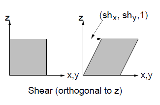

---
## Inclinação (cont.)

- Pode ocorrer em 1 de 6 combinações de planos de coordenadas
- Matriz da transformação no plano `xy`

  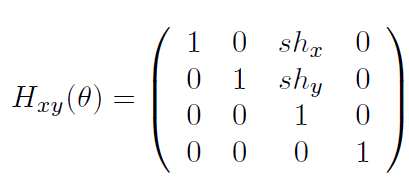

---
## Inclinação em OpenGL

- Não existe um `glShear`, portanto precisamos implementar a matriz nós mesmos
- O OpenGL possui o `glMultMatrix` que nos permite definir todas as coordenadas
  de uma matriz
  - `glRotate`, `glTranslate` e `glScale` chamam essa função
  - Referência do [glMultMatrix](https://www.opengl.org/sdk/docs/man2/xhtml/glMultMatrix.xml)

---
# Composição

---
## Composição

- Uma sequência de transformações podem ser combinadas em uma única
  matriz facilitando as operações.
- Exemplo, rotacionar um polígono ao redor de um pivô que não seja a origem:
  1. transladar o pivô para para a origem
  2. aplicar a rotação ao redor da origem
  3. transladar de volta ao ponto original

---
## Composição - Exemplo em 2D

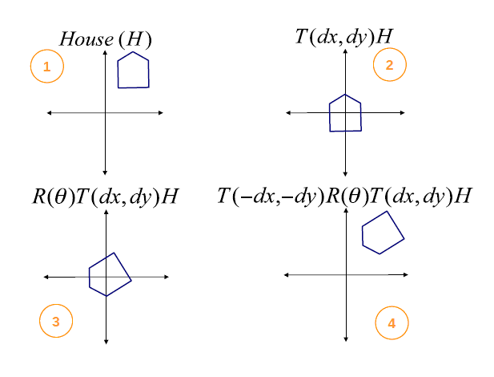

---
## Composição (cont.)

- As três matrizes de transformação são combinadas como a seguir

  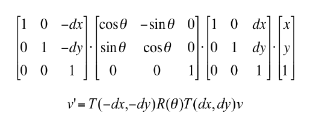

- Lembre-se: multiplicação de matrizes não é comutativa - a ordem importa.
  - Além disso, o OpenGL **pré-multiplica** as matrizes

---
# Push, Pop

---
## Push, Pop

- Quando chamamos uma função de multiplicação de matriz, estamos alterando o
  estado do OpenGL (máquina de estados)
- Assim, consecutivas chamadas a `glTranslatef(10, 0, 0)` irão mover os objetos
  da cena a 10u em cada chamada

---
## Push, Pop (cont.)

- Em particular, existem 4 variáveis de estado que são matrizes
  - GL_MODELVIEW
  - GL_PROJECTION
  - GL_TEXTURE
  - GL_COLOR
- Na realidade, cada variável dessas são **pilhas de matrizes**
- Para evitar esse efeito, podemos empilhar a matriz atual para **preservá-la**
  e então trabalhar na nova matriz que está no topo

---
## Push, Pop (cont.)

- `glPushMatrix` empilha a matriz corrente e a duplica no topo da pilha.
  - Ou seja, assim que `glPushMatrix` é chamada, as duas primeiras matrizes da
  pilha são idênticas
- `glPopMatrix` desempilha a matriz corrente
- `glLoadIdentity` define a matriz do topo como uma identidade
- `glRotate, glTranslate` etc., multiplicam a matriz do topo pela matriz de
  transformação correspondente

---
# Exemplo de Rotação com Animação

Veja este exemplo de [quadrado girando](codeblocks:tranformacao-rotacao/CodeBlocks/tranformacao-rotacao.cbp)
ao longo do tempo - ou seja, uma rotação no eixo Z de pequenos ângulos a cada
quadro.

- Usar `glPushMatrix()`/`glPopMatrix()` é preferível porque eles tornam
  desnecessários desfazer as transformações - que, tipicamente, se faz
  aplicando a transformação inversa
  
---
# Referências

- Capítulo 3 do livro Real-Time Rendering
- Lições 5 e 8 das anotações do prof. David Mount
